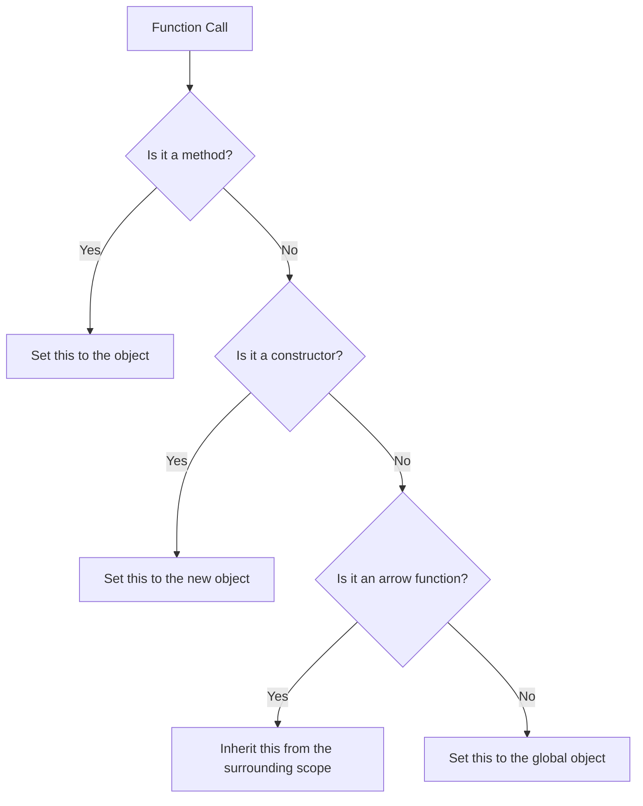

## 13.2 Method Invocation and `this`

In JavaScript, understanding how the `this` keyword works is crucial for mastering object-oriented programming. The `this` keyword is a dynamic reference to the object that is currently executing a piece of code. It is especially important when dealing with methods, as it allows methods to access and manipulate the properties of the object they belong to. In this section, we will explore how `this` behaves during method invocation, provide examples, discuss edge cases, and highlight exceptions.

### Understanding `this` in Method Invocation

When a method is called on an object, `this` refers to the object that owns the method. This is a fundamental concept in JavaScript that allows methods to interact with the properties and other methods of the object. Let's start with a simple example to illustrate this concept:

```javascript
// Define an object with a method
const person = {
  name: 'Alice',
  greet: function() {
    console.log(`Hello, my name is ${this.name}`);
  }
};

// Invoke the method
person.greet(); // Output: Hello, my name is Alice
```

In this example, the `greet` method is a function defined within the `person` object. When we call `person.greet()`, `this` inside the `greet` method refers to the `person` object. As a result, `this.name` evaluates to `'Alice'`.

### How `this` Works in Different Contexts

The value of `this` is determined by the context in which a function is invoked. Here are some common scenarios:

1. **Method Invocation**: When a function is called as a method of an object, `this` refers to the object itself.

   ```javascript
   const car = {
     brand: 'Toyota',
     start: function() {
       console.log(`Starting the ${this.brand}`);
     }
   };

   car.start(); // Output: Starting the Toyota
   ```

2. **Global Context**: When a function is called in the global context, `this` refers to the global object. In browsers, this is the `window` object.

   ```javascript
   function showGlobalThis() {
     console.log(this);
   }

   showGlobalThis(); // Output: Window {...} (in a browser)
   ```

3. **Constructor Invocation**: When a function is used as a constructor with the `new` keyword, `this` refers to the newly created object.

   ```javascript
   function Animal(type) {
     this.type = type;
   }

   const dog = new Animal('Dog');
   console.log(dog.type); // Output: Dog
   ```

4. **Arrow Functions**: Arrow functions do not have their own `this` context. Instead, they inherit `this` from the surrounding lexical scope.

   ```javascript
   const group = {
     title: 'Developers',
     members: ['Alice', 'Bob'],
     listMembers: function() {
       this.members.forEach(member => {
         console.log(`${member} is part of ${this.title}`);
       });
     }
   };

   group.listMembers();
   // Output:
   // Alice is part of Developers
   // Bob is part of Developers
   ```

### Edge Cases and Exceptions

While the rules for `this` are straightforward in many cases, there are some edge cases and exceptions to be aware of:

#### 1. Losing `this` in Callbacks

When passing a method as a callback, `this` can lose its intended reference:

```javascript
const user = {
  name: 'Bob',
  getName: function() {
    console.log(this.name);
  }
};

setTimeout(user.getName, 1000); // Output: undefined (in strict mode)
```

In the example above, `this` inside `getName` becomes `undefined` because the method is called as a standalone function, not as a method of `user`.

**Solution**: Use `bind`, `call`, or `apply` to explicitly set `this`:

```javascript
setTimeout(user.getName.bind(user), 1000); // Output: Bob
```

#### 2. Method Borrowing

JavaScript allows borrowing methods from one object to use in another. When borrowing, `this` refers to the object that calls the method:

```javascript
const person1 = {
  name: 'Charlie',
  introduce: function() {
    console.log(`Hi, I'm ${this.name}`);
  }
};

const person2 = {
  name: 'Dana'
};

person1.introduce.call(person2); // Output: Hi, I'm Dana
```

#### 3. Event Handlers

In event handlers, `this` refers to the element that received the event:

```html
<button id="myButton">Click me</button>

<script>
  document.getElementById('myButton').addEventListener('click', function() {
    console.log(this); // Output: <button id="myButton">Click me</button>
  });
</script>
```

### Visualizing `this` in Method Invocation

To better understand how `this` works in different contexts, let's visualize it using a flowchart:



This flowchart summarizes how `this` is determined based on the context of the function call.

### Try It Yourself

Experiment with the following code to see how `this` behaves in different scenarios. Try modifying the code to observe changes in behavior:

```javascript
// Define an object with a method
const book = {
  title: 'JavaScript Mastery',
  describe: function() {
    console.log(`This book is titled "${this.title}"`);
  }
};

// Call the method
book.describe(); // Output: This book is titled "JavaScript Mastery"

// Assign the method to a variable
const describeBook = book.describe;
describeBook(); // Output: undefined (in strict mode)

// Use bind to fix `this`
const boundDescribe = book.describe.bind(book);
boundDescribe(); // Output: This book is titled "JavaScript Mastery"
```

### References and Further Reading

- [MDN Web Docs on `this`](https://developer.mozilla.org/en-US/docs/Web/JavaScript/Reference/Operators/this)
- [W3Schools JavaScript `this` Keyword](https://www.w3schools.com/js/js_this.asp)

### Knowledge Check

1. What does `this` refer to in a method invocation?
2. How can you ensure `this` retains its intended reference when passing a method as a callback?
3. What happens to `this` in an arrow function?

### Key Takeaways

- `this` refers to the object that owns the method in a method invocation.
- Arrow functions inherit `this` from their surrounding lexical scope.
- Use `bind`, `call`, or `apply` to explicitly set `this` when necessary.

### Embrace the Journey

Remember, understanding `this` is a journey. As you continue to explore JavaScript, you'll encounter more complex scenarios where `this` plays a crucial role. Keep experimenting, stay curious, and enjoy the process of mastering JavaScript!

## Quiz Time!



### What does `this` refer to in a method invocation?

- [x] The object that owns the method
- [ ] The global object
- [ ] The function itself
- [ ] The window object

> **Explanation:** In a method invocation, `this` refers to the object that owns the method, allowing the method to access the object's properties and other methods.

### How can you ensure `this` retains its intended reference when passing a method as a callback?

- [x] Use `bind` to set `this`
- [ ] Use `apply` to set `this`
- [ ] Use `call` to set `this`
- [ ] Use `new` to set `this`

> **Explanation:** The `bind` method creates a new function with `this` set to the specified object, ensuring `this` retains its intended reference.

### What happens to `this` in an arrow function?

- [x] It inherits `this` from the surrounding lexical scope
- [ ] It refers to the global object
- [ ] It refers to the function itself
- [ ] It is always `undefined`

> **Explanation:** Arrow functions do not have their own `this` context. Instead, they inherit `this` from the surrounding lexical scope.

### In the global context, what does `this` refer to?

- [x] The global object
- [ ] The window object
- [ ] The function itself
- [ ] The object that owns the method

> **Explanation:** In the global context, `this` refers to the global object, which is `window` in browsers.

### Which method allows borrowing methods from one object to use in another?

- [x] `call`
- [ ] `bind`
- [ ] `apply`
- [ ] `new`

> **Explanation:** The `call` method allows borrowing methods from one object to use in another by setting `this` to the desired object.

### What does `this` refer to in an event handler?

- [x] The element that received the event
- [ ] The global object
- [ ] The function itself
- [ ] The object that owns the method

> **Explanation:** In event handlers, `this` refers to the element that received the event, allowing access to the element's properties.

### How can you fix `this` when assigning a method to a variable?

- [x] Use `bind` to set `this`
- [ ] Use `apply` to set `this`
- [ ] Use `call` to set `this`
- [ ] Use `new` to set `this`

> **Explanation:** The `bind` method creates a new function with `this` set to the specified object, ensuring `this` retains its intended reference.

### What is the value of `this` in a constructor function?

- [x] The newly created object
- [ ] The global object
- [ ] The function itself
- [ ] The object that owns the method

> **Explanation:** In a constructor function, `this` refers to the newly created object, allowing the function to initialize its properties.

### What does `this` refer to when a function is called as a standalone function?

- [x] The global object
- [ ] The window object
- [ ] The function itself
- [ ] The object that owns the method

> **Explanation:** When a function is called as a standalone function, `this` refers to the global object, which is `window` in browsers.

### True or False: Arrow functions have their own `this` context.

- [ ] True
- [x] False

> **Explanation:** False. Arrow functions do not have their own `this` context. They inherit `this` from the surrounding lexical scope.


