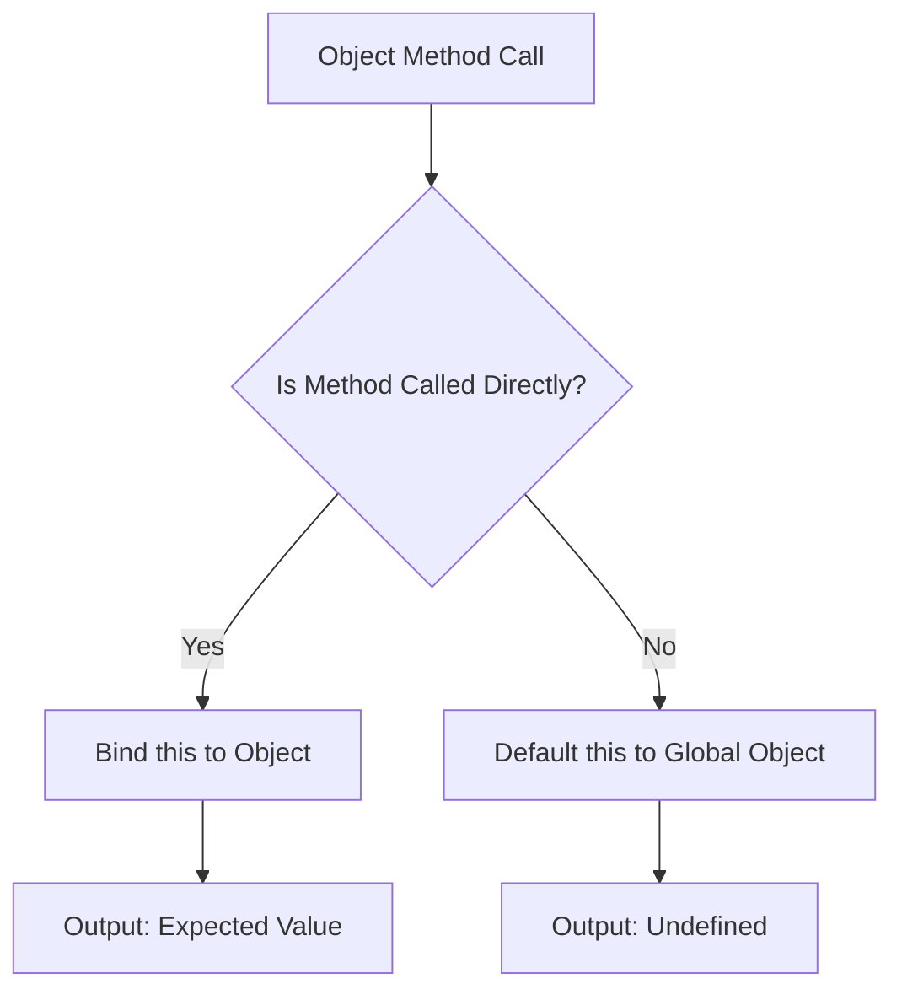

## 13.3 Issues with Method Context

In JavaScript, understanding how the `this` keyword works is crucial for writing effective and bug-free code. One of the common issues developers face is the loss of method context, especially when dealing with object methods. In this section, we'll explore how method context can be lost, why it happens, and how to handle these situations effectively.

### Understanding `this` in JavaScript

Before diving into the issues, let's briefly recap what `this` is in JavaScript. The `this` keyword refers to the object from which a function is called. However, its value can change depending on how and where the function is invoked. This dynamic nature of `this` can lead to unexpected behavior, especially when methods are assigned to variables or used as callbacks.

### Assigning Methods to Variables

One common scenario where method context is lost is when a method is assigned to a variable. Let's look at an example:

```javascript
const person = {
  name: 'Alice',
  greet: function() {
    console.log('Hello, my name is ' + this.name);
  }
};

// Assign the method to a variable
const greet = person.greet;

// Call the function
greet(); // Output: Hello, my name is undefined
```

In this example, we have an object `person` with a method `greet`. When `greet` is called as `person.greet()`, `this` refers to the `person` object, and the output is as expected. However, when we assign `person.greet` to a variable `greet` and call it, `this` no longer refers to `person`. Instead, it defaults to the global object (or `undefined` in strict mode), resulting in `undefined` for `this.name`.

### Why Does This Happen?

The reason for this behavior lies in how JavaScript binds `this`. In JavaScript, `this` is determined by the call site, not the declaration site. When a function is called as a method of an object, `this` is bound to that object. However, when the method is detached from its object and called as a standalone function, `this` loses its original context.

### Loss of Context in Callbacks

Another common scenario where method context is lost is when methods are used as callbacks. Consider the following example:

```javascript
const button = {
  label: 'Click Me',
  click: function() {
    console.log('Button clicked: ' + this.label);
  }
};

// Simulating an event listener
function simulateClick(callback) {
  callback();
}

// Pass the method as a callback
simulateClick(button.click); // Output: Button clicked: undefined
```

Here, we have a `button` object with a `click` method. When `button.click` is passed as a callback to `simulateClick`, the context of `this` is lost, and the output is `undefined`.

### Why Does This Happen?

When a method is passed as a callback, it's essentially being called as a standalone function. As a result, `this` is not bound to the object it belongs to, leading to the loss of context.

### Solutions to Method Context Issues

Fortunately, JavaScript provides several ways to address these context issues. Let's explore some of the most common solutions:

#### 1. Using `bind()`

The `bind()` method creates a new function that, when called, has its `this` keyword set to the provided value. Here's how you can use it:

```javascript
const boundGreet = person.greet.bind(person);
boundGreet(); // Output: Hello, my name is Alice
```

By using `bind()`, we ensure that `this` is always bound to the `person` object, regardless of how the function is called.

#### 2. Using Arrow Functions

Arrow functions do not have their own `this` context; they inherit `this` from the surrounding lexical scope. This makes them a great choice for preserving context in callbacks:

```javascript
const button = {
  label: 'Click Me',
  click: function() {
    setTimeout(() => {
      console.log('Button clicked: ' + this.label);
    }, 1000);
  }
};

button.click(); // Output: Button clicked: Click Me
```

In this example, the arrow function inside `setTimeout` inherits `this` from the `click` method, preserving the context.

#### 3. Using `call()` and `apply()`

The `call()` and `apply()` methods allow you to call a function with a specified `this` value. While `call()` accepts a list of arguments, `apply()` accepts an array of arguments:

```javascript
person.greet.call(person); // Output: Hello, my name is Alice
person.greet.apply(person); // Output: Hello, my name is Alice
```

These methods are useful when you need to invoke a function with a specific `this` value immediately.

### Visualizing Method Context

To better understand how method context works, let's visualize the process using a diagram:



**Diagram Explanation:** This flowchart illustrates the decision-making process when a method is called. If the method is called directly on an object, `this` is bound to that object. Otherwise, `this` defaults to the global object, leading to potential issues.

### Try It Yourself

Experiment with the following code examples to reinforce your understanding:

1. **Modify the `greet` function** to use `bind()` and observe the changes in output.
2. **Convert the `click` method** to use an arrow function and see how it affects the context.
3. **Use `call()` and `apply()`** to invoke the `greet` method with different `this` values.

### References and Further Reading

- [MDN Web Docs: `this`](https://developer.mozilla.org/en-US/docs/Web/JavaScript/Reference/Operators/this)
- [MDN Web Docs: `bind()`](https://developer.mozilla.org/en-US/docs/Web/JavaScript/Reference/Global_objects/Function/bind)
- [MDN Web Docs: Arrow Functions](https://developer.mozilla.org/en-US/docs/Web/JavaScript/Reference/Functions/Arrow_functions)

### Knowledge Check

- What happens to `this` when a method is assigned to a variable?
- How can `bind()` help in preserving method context?
- Why do arrow functions not have their own `this`?

### Exercises

1. **Create an object** with a method that uses `this`. Assign the method to a variable and observe the output. Use `bind()` to fix the context.
2. **Write a function** that accepts a callback and calls it. Pass an object method as the callback and use an arrow function to preserve context.

### Key Takeaways

- `this` in JavaScript is determined by the call site, not the declaration site.
- Assigning methods to variables or using them as callbacks can lead to loss of context.
- Use `bind()`, arrow functions, or `call()`/`apply()` to manage method context effectively.

### Embrace the Journey

Remember, mastering JavaScript's `this` keyword takes practice and patience. As you continue to explore and experiment, you'll gain a deeper understanding of how context works. Keep experimenting, stay curious, and enjoy the journey!

## Quiz Time!



### What happens to `this` when a method is assigned to a variable?

- [x] It loses its original context
- [ ] It remains bound to the original object
- [ ] It becomes a global variable
- [ ] It becomes undefined

> **Explanation:** When a method is assigned to a variable, it loses its original context, and `this` defaults to the global object or `undefined` in strict mode.

### How can `bind()` help in preserving method context?

- [x] By creating a new function with a bound `this` value
- [ ] By changing the function's name
- [ ] By modifying the original object
- [ ] By using a different keyword

> **Explanation:** The `bind()` method creates a new function that has its `this` keyword set to the provided value, preserving the method context.

### Why do arrow functions not have their own `this`?

- [x] They inherit `this` from the surrounding lexical scope
- [ ] They are not functions
- [ ] They are always bound to the global object
- [ ] They are not used in JavaScript

> **Explanation:** Arrow functions do not have their own `this` context; they inherit `this` from the surrounding lexical scope, making them useful for preserving context.

### What is the output of the following code?

```javascript
const obj = {
  value: 42,
  getValue: function() {
    return this.value;
  }
};

const getValue = obj.getValue;
console.log(getValue());
```

- [ ] 42
- [ ] 0
- [x] undefined
- [ ] null

> **Explanation:** The `getValue` function is called as a standalone function, so `this` is not bound to `obj`, resulting in `undefined`.

### Which method allows you to call a function with a specified `this` value?

- [x] `call()`
- [ ] `bind()`
- [ ] `apply()`
- [ ] `setTimeout()`

> **Explanation:** The `call()` method allows you to call a function with a specified `this` value and individual arguments.

### What is the primary reason for method context loss in callbacks?

- [x] The method is called as a standalone function
- [ ] The method is renamed
- [ ] The method is deleted
- [ ] The method is not defined

> **Explanation:** When a method is used as a callback, it is called as a standalone function, leading to the loss of its original context.

### How can you preserve method context when using `setTimeout()`?

- [x] Use an arrow function
- [ ] Use a global variable
- [ ] Use `setInterval()`
- [ ] Use a different method

> **Explanation:** Arrow functions inherit `this` from the surrounding lexical scope, making them useful for preserving context in `setTimeout()`.

### Which of the following is NOT a way to handle method context issues?

- [ ] Using `bind()`
- [ ] Using arrow functions
- [ ] Using `call()`
- [x] Using `delete()`

> **Explanation:** The `delete()` operator is used to remove properties from objects and is not related to handling method context issues.

### What is the output of the following code?

```javascript
const car = {
  brand: 'Toyota',
  getBrand: function() {
    return this.brand;
  }
};

console.log(car.getBrand.call({ brand: 'Honda' }));
```

- [x] Honda
- [ ] Toyota
- [ ] undefined
- [ ] null

> **Explanation:** The `call()` method is used to invoke `getBrand` with `this` set to the provided object `{ brand: 'Honda' }`, resulting in 'Honda'.

### True or False: Arrow functions can be used to change the `this` value.

- [ ] True
- [x] False

> **Explanation:** False. Arrow functions inherit `this` from the surrounding lexical scope and cannot change it.


