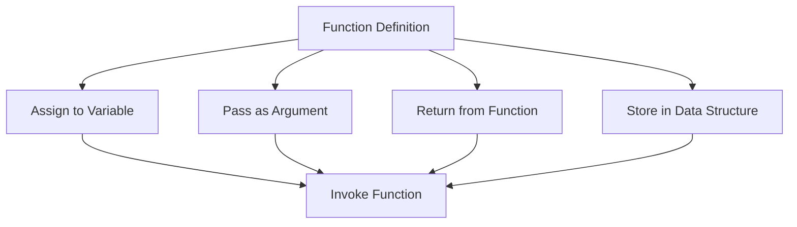

## 14.1 Functions as Values

In JavaScript, functions are not just blocks of code that execute tasks; they are also first-class citizens. This means that functions can be treated like any other value in the language. You can assign them to variables, pass them as arguments to other functions, and even return them from functions. This flexibility opens up a world of possibilities in programming, allowing for more dynamic and reusable code structures.

### Understanding First-Class Functions

First-class functions are a fundamental concept in JavaScript and many other programming languages. When we say that functions are first-class citizens, we mean that they can be manipulated and used just like any other data type, such as numbers, strings, or objects. This characteristic is a cornerstone of functional programming, a paradigm that emphasizes the use of functions to build software.

#### Key Characteristics of First-Class Functions

1. **Assignment to Variables**: Functions can be assigned to variables, allowing them to be stored and referenced by name.
2. **Passing as Arguments**: Functions can be passed as arguments to other functions, enabling higher-order functions.
3. **Returning from Functions**: Functions can be returned from other functions, allowing for the creation of function factories and closures.
4. **Storing in Data Structures**: Functions can be stored in arrays, objects, or any other data structures.

These characteristics provide a high degree of flexibility and power in how we can structure and organize our code.

### Assigning Functions to Variables

One of the simplest ways to demonstrate the concept of functions as first-class citizens is by assigning a function to a variable. This allows us to reference and invoke the function using the variable name.

#### Example: Assigning a Function to a Variable

```javascript
// Define a simple function
function greet() {
    console.log("Hello, world!");
}

// Assign the function to a variable
let sayHello = greet;

// Invoke the function using the variable
sayHello(); // Output: Hello, world!
```

In this example, we define a function `greet` that logs a message to the console. We then assign this function to a variable `sayHello`. By calling `sayHello()`, we invoke the original `greet` function. This demonstrates how functions can be treated as values and assigned to variables.

#### Implications for Programming Flexibility

Assigning functions to variables allows for greater flexibility in how we use and organize our code. It enables us to:

- **Create Aliases**: We can create multiple references to the same function, allowing for more readable and intuitive code.
- **Dynamic Function Assignment**: We can change the function assigned to a variable at runtime, enabling dynamic behavior in our programs.

### Passing Functions as Arguments

Another powerful aspect of first-class functions is the ability to pass them as arguments to other functions. This capability is the foundation of higher-order functions, which are functions that operate on other functions.

#### Example: Passing a Function as an Argument

```javascript
// Define a function that accepts another function as an argument
function executeFunction(fn) {
    fn();
}

// Define a simple function
function sayGoodbye() {
    console.log("Goodbye, world!");
}

// Pass the function as an argument
executeFunction(sayGoodbye); // Output: Goodbye, world!
```

In this example, we define a function `executeFunction` that takes another function `fn` as an argument and invokes it. We then pass the `sayGoodbye` function to `executeFunction`, demonstrating how functions can be passed around and executed dynamically.

#### Implications for Programming Flexibility

Passing functions as arguments allows us to:

- **Implement Callbacks**: We can pass functions to be executed at a later time, enabling asynchronous programming patterns.
- **Create Reusable Code**: We can write generic functions that operate on a variety of functions, increasing code reusability and modularity.

### Returning Functions from Functions

In addition to passing functions as arguments, we can also return functions from other functions. This capability is essential for creating closures and function factories.

#### Example: Returning a Function from a Function

```javascript
// Define a function that returns another function
function createMultiplier(multiplier) {
    return function(number) {
        return number * multiplier;
    };
}

// Create a multiplier function
let double = createMultiplier(2);

// Use the multiplier function
console.log(double(5)); // Output: 10
```

In this example, we define a function `createMultiplier` that returns a new function. The returned function takes a number and multiplies it by the `multiplier` value provided to `createMultiplier`. This demonstrates how functions can be returned from other functions, allowing us to create customized behavior.

#### Implications for Programming Flexibility

Returning functions from functions enables us to:

- **Create Closures**: We can capture and maintain state within a function, even after the outer function has executed.
- **Build Function Factories**: We can generate specialized functions based on input parameters, enhancing code reusability and customization.

### Storing Functions in Data Structures

Functions can also be stored in data structures such as arrays and objects. This allows us to organize and manage collections of functions efficiently.

#### Example: Storing Functions in an Array

```javascript
// Define an array of functions
let operations = [
    function(a, b) { return a + b; },
    function(a, b) { return a - b; },
    function(a, b) { return a * b; },
    function(a, b) { return a / b; }
];

// Use the functions in the array
console.log(operations[0](10, 5)); // Output: 15 (addition)
console.log(operations[1](10, 5)); // Output: 5 (subtraction)
```

In this example, we define an array `operations` that contains several functions for basic arithmetic operations. We can access and invoke these functions using array indexing, demonstrating how functions can be stored and managed within data structures.

#### Implications for Programming Flexibility

Storing functions in data structures allows us to:

- **Organize Code**: We can group related functions together, making our code more organized and easier to maintain.
- **Implement Dynamic Behavior**: We can iterate over collections of functions, applying them to data dynamically.

### Visualizing Functions as Values

To better understand how functions can be treated as values, let's visualize the concept using a simple diagram.



**Caption**: This diagram illustrates how functions can be assigned to variables, passed as arguments, returned from functions, and stored in data structures, ultimately leading to their invocation.

### Try It Yourself

To solidify your understanding of functions as values, try modifying the code examples provided:

- **Create a New Function**: Define a new function and assign it to a variable. Experiment with invoking it using the variable name.
- **Pass a Function as an Argument**: Write a function that accepts another function as an argument and invokes it. Try passing different functions to see the results.
- **Return a Function from a Function**: Create a function that returns another function. Use the returned function to perform a task.
- **Store Functions in an Object**: Define an object with functions as properties. Access and invoke these functions using the object properties.

### References and Links

For further reading on functions as first-class citizens and related concepts, consider exploring the following resources:

- [MDN Web Docs: Functions](https://developer.mozilla.org/en-US/docs/Web/JavaScript/Guide/Functions)
- [W3Schools: JavaScript Functions](https://www.w3schools.com/js/js_functions.asp)
- [Eloquent JavaScript: Functions](https://eloquentjavascript.net/03_functions.html)

### Knowledge Check

Before moving on, let's review some key takeaways:

- Functions in JavaScript are first-class citizens, meaning they can be treated like any other value.
- You can assign functions to variables, pass them as arguments, return them from functions, and store them in data structures.
- These capabilities provide flexibility and power in how we structure and organize our code.

### Embrace the Journey

Remember, understanding functions as first-class citizens is just the beginning. As you continue your journey in JavaScript, you'll discover even more powerful ways to use functions to build dynamic and interactive applications. Keep experimenting, stay curious, and enjoy the journey!

## Quiz Time!



### What does it mean for functions to be first-class citizens in JavaScript?

- [x] Functions can be assigned to variables, passed as arguments, and returned from other functions.
- [ ] Functions can only be used as part of objects.
- [ ] Functions must be declared before they are used.
- [ ] Functions cannot be stored in arrays.

> **Explanation:** First-class functions can be treated like any other value, meaning they can be assigned to variables, passed as arguments, and returned from other functions.

### Which of the following is an example of assigning a function to a variable?

- [x] `let myFunction = function() { console.log("Hello!"); };`
- [ ] `function myFunction() { console.log("Hello!"); }`
- [ ] `console.log("Hello!");`
- [ ] `let myFunction = "Hello!";`

> **Explanation:** The correct example assigns an anonymous function to a variable `myFunction`.

### How can functions be passed as arguments in JavaScript?

- [x] By passing the function name without parentheses.
- [ ] By passing the function name with parentheses.
- [ ] By passing the function as a string.
- [ ] By passing the function as an object.

> **Explanation:** Functions are passed as arguments by using their name without parentheses, allowing them to be invoked later.

### What is a higher-order function?

- [x] A function that takes another function as an argument or returns a function.
- [ ] A function that performs arithmetic operations.
- [ ] A function that is defined within another function.
- [ ] A function that is only used in recursion.

> **Explanation:** Higher-order functions operate on other functions, either by taking them as arguments or returning them.

### Which of the following demonstrates returning a function from another function?

- [x] `function outer() { return function inner() { return "Hello"; }; }`
- [ ] `function outer() { console.log("Hello"); }`
- [ ] `let inner = function() { return "Hello"; };`
- [ ] `function outer(inner) { inner(); }`

> **Explanation:** The correct example shows a function `outer` returning another function `inner`.

### What is the benefit of storing functions in data structures?

- [x] It allows for organized code and dynamic behavior.
- [ ] It prevents functions from being executed.
- [ ] It makes functions immutable.
- [ ] It restricts function usage to specific contexts.

> **Explanation:** Storing functions in data structures helps organize code and enables dynamic behavior by iterating over and invoking functions.

### How can functions be used to implement callbacks?

- [x] By passing them as arguments to be executed later.
- [ ] By storing them in global variables.
- [ ] By declaring them as constants.
- [ ] By using them only in synchronous code.

> **Explanation:** Callbacks are implemented by passing functions as arguments to be executed at a later time.

### What is a closure in JavaScript?

- [x] A function that retains access to its lexical scope even after the outer function has executed.
- [ ] A function that is immediately invoked.
- [ ] A function that does not return a value.
- [ ] A function that is used only in loops.

> **Explanation:** Closures allow functions to retain access to their lexical scope, enabling them to maintain state.

### What does it mean to create a function factory?

- [x] To generate specialized functions based on input parameters.
- [ ] To store functions in a database.
- [ ] To create functions that cannot be modified.
- [ ] To use functions only for arithmetic operations.

> **Explanation:** Function factories generate specialized functions based on input parameters, enhancing reusability and customization.

### True or False: Functions in JavaScript can only be used as part of objects.

- [ ] True
- [x] False

> **Explanation:** Functions in JavaScript are first-class citizens and can be used independently, assigned to variables, passed as arguments, and more.




