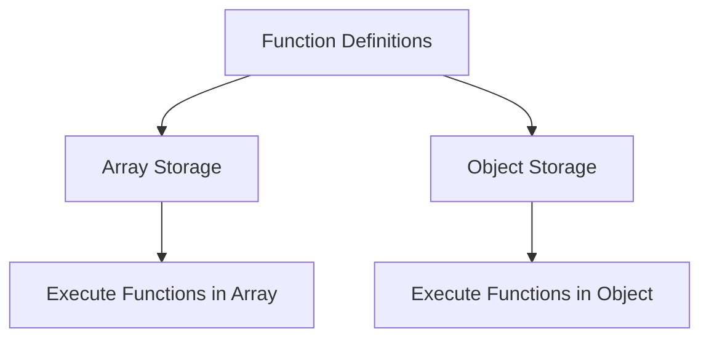

## 14.2 Storing Functions in Data Structures

In JavaScript, functions are first-class citizens, meaning they can be treated like any other data type. This allows us to store functions in data structures such as arrays and objects. By doing so, we can create powerful and flexible code patterns that are essential in modern JavaScript development. In this section, we'll explore how to store functions in arrays and objects, provide practical examples, and discuss use cases in event handling and plugin systems.

### Understanding Functions as First-Class Citizens

Before diving into storing functions in data structures, let's briefly review what it means for functions to be first-class citizens in JavaScript:

- **Functions can be assigned to variables**: Just like numbers or strings, functions can be stored in variables.
- **Functions can be passed as arguments**: Functions can be passed to other functions as arguments.
- **Functions can be returned from other functions**: Functions can be the return value of other functions.

These properties enable us to use functions in dynamic and flexible ways, including storing them in arrays and objects.

### Storing Functions in Arrays

Arrays in JavaScript are versatile data structures that can hold multiple values, including functions. Let's explore how we can store functions in arrays and why this might be useful.

#### Basic Example: Functions in an Array

Consider an array that holds a series of functions:

```javascript
// Define some simple functions
function greet() {
  console.log("Hello!");
}

function farewell() {
  console.log("Goodbye!");
}

function thank() {
  console.log("Thank you!");
}

// Store functions in an array
const functionArray = [greet, farewell, thank];

// Iterate over the array and execute each function
functionArray.forEach(func => func());
```

**Explanation**: In this example, we define three simple functions: `greet`, `farewell`, and `thank`. We store these functions in an array called `functionArray`. By using the `forEach` method, we iterate over the array and execute each function. This pattern is useful when you want to execute a series of functions in a specific order.

#### Practical Example: Function Queues

A common use case for storing functions in arrays is to create a function queue. This is particularly useful in scenarios where you need to execute a series of tasks in sequence.

```javascript
// Define a queue to hold functions
const taskQueue = [];

// Add tasks to the queue
taskQueue.push(() => console.log("Task 1: Initialize"));
taskQueue.push(() => console.log("Task 2: Process Data"));
taskQueue.push(() => console.log("Task 3: Finalize"));

// Execute each task in the queue
while (taskQueue.length > 0) {
  const task = taskQueue.shift();
  task(); // Execute the task
}
```

**Explanation**: In this example, we create a `taskQueue` array to hold our functions. We add three tasks to the queue, each represented by an anonymous function. We then use a `while` loop to execute each task in the order they were added. This pattern is useful for managing tasks that need to be executed sequentially, such as in a build process or a series of animations.

### Storing Functions in Objects

Objects in JavaScript are collections of key-value pairs, where the keys are strings (or Symbols) and the values can be any data type, including functions. Let's explore how we can store functions in objects and the benefits of doing so.

#### Basic Example: Functions as Object Properties

Consider an object that holds a series of functions as its properties:

```javascript
// Define an object with functions as properties
const actions = {
  greet: function() {
    console.log("Hello!");
  },
  farewell: function() {
    console.log("Goodbye!");
  },
  thank: function() {
    console.log("Thank you!");
  }
};

// Execute a function from the object
actions.greet();
actions.farewell();
actions.thank();
```

**Explanation**: In this example, we define an `actions` object with three properties, each of which is a function. We can execute these functions by accessing them through the object's properties. This pattern is useful for organizing related functions and accessing them by name.

#### Practical Example: Dispatch Tables

A dispatch table is a common pattern where an object is used to map strings to functions. This is useful for handling different actions based on a command or event name.

```javascript
// Define a dispatch table
const commandTable = {
  start: () => console.log("Starting..."),
  stop: () => console.log("Stopping..."),
  pause: () => console.log("Pausing...")
};

// Execute a command based on user input
const userCommand = "start";
if (commandTable[userCommand]) {
  commandTable[userCommand](); // Execute the corresponding function
} else {
  console.log("Unknown command");
}
```

**Explanation**: In this example, we define a `commandTable` object that maps command names to functions. We then execute a command based on user input by accessing the corresponding function in the object. This pattern is useful for implementing command-line interfaces or handling events in a web application.

### Use Cases in Event Handling

Storing functions in data structures is particularly useful in event handling, where you may need to manage multiple event listeners or callbacks.

#### Example: Event Listeners in Arrays

Consider a scenario where you need to manage multiple event listeners for a single event:

```javascript
// Define an array to hold event listeners
const eventListeners = [];

// Add event listeners to the array
eventListeners.push(() => console.log("Listener 1: Event triggered"));
eventListeners.push(() => console.log("Listener 2: Event triggered"));

// Simulate an event and execute all listeners
function triggerEvent() {
  eventListeners.forEach(listener => listener());
}

// Trigger the event
triggerEvent();
```

**Explanation**: In this example, we define an `eventListeners` array to hold our event listener functions. We add two listeners to the array and then simulate an event by executing all listeners in the array. This pattern is useful for managing multiple callbacks for a single event, such as in a custom event system.

### Use Cases in Plugin Systems

In plugin systems, you often need to store and manage a collection of plugin functions. Storing these functions in data structures allows you to dynamically load and execute plugins.

#### Example: Plugin Functions in Objects

Consider a simple plugin system where plugins are stored in an object:

```javascript
// Define a plugins object
const plugins = {};

// Add plugins to the object
plugins.pluginA = () => console.log("Executing Plugin A");
plugins.pluginB = () => console.log("Executing Plugin B");

// Execute all plugins
Object.values(plugins).forEach(plugin => plugin());
```

**Explanation**: In this example, we define a `plugins` object to hold our plugin functions. We add two plugins to the object and then execute all plugins by iterating over the object's values. This pattern is useful for implementing plugin systems where plugins can be dynamically added and executed.

### Visualizing Function Storage

To better understand how functions are stored in data structures, let's visualize the process using a diagram.



**Diagram Explanation**: This diagram illustrates the process of storing functions in arrays and objects. Functions are first defined and then stored in either an array or an object. From there, the functions can be executed by iterating over the array or accessing the object's properties.

### Try It Yourself

Now that we've explored storing functions in data structures, try modifying the examples to deepen your understanding:

- Add more functions to the `functionArray` and `taskQueue` examples and see how they behave.
- Create a new dispatch table with additional commands and test different user inputs.
- Implement a custom event system using the `eventListeners` pattern.
- Experiment with adding and removing plugins from the `plugins` object.

### References and Further Reading

For more information on functions and data structures in JavaScript, check out the following resources:

- [MDN Web Docs: Functions](https://developer.mozilla.org/en-US/docs/Web/JavaScript/Guide/Functions)
- [MDN Web Docs: Arrays](https://developer.mozilla.org/en-US/docs/Web/JavaScript/Reference/Global_Objects/Array)
- [MDN Web Docs: Objects](https://developer.mozilla.org/en-US/docs/Web/JavaScript/Reference/Global_Objects/Object)

### Key Takeaways

- Functions in JavaScript can be stored in arrays and objects, allowing for flexible and dynamic code patterns.
- Storing functions in arrays enables patterns like function queues and event listener management.
- Storing functions in objects allows for patterns like dispatch tables and plugin systems.
- Understanding how to store and manage functions in data structures is essential for modern JavaScript development.

### Embrace the Journey

Remember, this is just the beginning. As you progress, you'll build more complex and interactive web applications. Keep experimenting, stay curious, and enjoy the journey!

## Quiz Time!



### What does it mean for functions to be first-class citizens in JavaScript?

- [x] Functions can be assigned to variables, passed as arguments, and returned from other functions.
- [ ] Functions can only be used within objects.
- [ ] Functions cannot be stored in arrays.
- [ ] Functions are limited to specific data types.

> **Explanation:** Functions being first-class citizens means they can be treated like any other data type, allowing them to be assigned to variables, passed as arguments, and returned from other functions.

### How can you store functions in an array?

- [x] By assigning functions as elements in the array.
- [ ] By using the `function` keyword inside the array.
- [ ] By converting functions to strings and storing them.
- [ ] By using a special function array type.

> **Explanation:** Functions can be stored in arrays by assigning them as elements, just like any other data type.

### What is a common use case for storing functions in arrays?

- [x] Creating a function queue to execute tasks sequentially.
- [ ] Storing user data for a web application.
- [ ] Managing CSS styles for a webpage.
- [ ] Handling database connections.

> **Explanation:** A common use case for storing functions in arrays is creating a function queue to execute tasks in a specific order.

### How can you execute all functions stored in an array?

- [x] By iterating over the array and calling each function.
- [ ] By using the `executeAll` method on the array.
- [ ] By converting the array to a string and executing it.
- [ ] By using the `run` keyword.

> **Explanation:** You can execute all functions stored in an array by iterating over the array and calling each function.

### What is a dispatch table?

- [x] An object that maps strings to functions for handling commands or events.
- [ ] A table that stores user data in a database.
- [ ] A method for sorting arrays in JavaScript.
- [ ] A way to convert functions to strings.

> **Explanation:** A dispatch table is an object that maps strings to functions, allowing for dynamic handling of commands or events.

### How can you execute a function stored in an object?

- [x] By accessing the function through the object's property and calling it.
- [ ] By using the `execute` keyword on the object.
- [ ] By converting the object to a string and executing it.
- [ ] By using a special function object type.

> **Explanation:** You can execute a function stored in an object by accessing it through the object's property and calling it.

### What is a practical use case for storing functions in objects?

- [x] Implementing a plugin system where plugins are dynamically loaded and executed.
- [ ] Storing CSS styles for a webpage.
- [ ] Managing user sessions in a web application.
- [ ] Handling database connections.

> **Explanation:** A practical use case for storing functions in objects is implementing a plugin system where plugins can be dynamically added and executed.

### How can you manage multiple event listeners for a single event?

- [x] By storing the event listeners in an array and executing them when the event occurs.
- [ ] By using a single function to handle all events.
- [ ] By converting event listeners to strings and storing them.
- [ ] By using a special event listener object type.

> **Explanation:** You can manage multiple event listeners for a single event by storing them in an array and executing them when the event occurs.

### What is the benefit of storing functions in data structures?

- [x] It allows for flexible and dynamic code patterns, such as function queues and dispatch tables.
- [ ] It limits the use of functions to specific scenarios.
- [ ] It makes functions immutable and unchangeable.
- [ ] It restricts functions to only be used in arrays.

> **Explanation:** Storing functions in data structures allows for flexible and dynamic code patterns, enabling powerful programming techniques.

### True or False: Functions can only be stored in arrays, not objects.

- [ ] True
- [x] False

> **Explanation:** False. Functions can be stored in both arrays and objects, allowing for versatile and dynamic code patterns.


