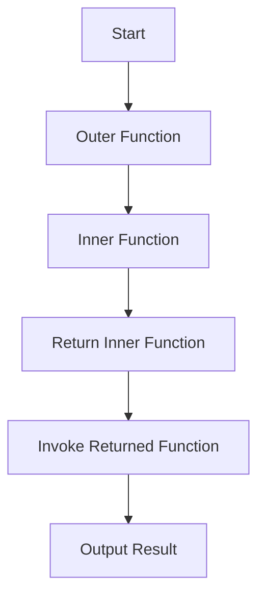

## 14.3 Functions Returning Functions

In JavaScript, functions are first-class citizens, meaning they can be treated like any other data type. This characteristic allows functions to be passed as arguments, stored in variables, and even returned from other functions. In this section, we will delve into the fascinating concept of functions returning functions, exploring how this can lead to more reusable, modular, and maintainable code.

### Understanding Functions Returning Functions

At its core, a function returning another function is a function that, when called, produces and returns a new function. This concept is not only powerful but also foundational in many advanced programming techniques, such as closures, currying, and decorators.

#### Basic Example

Let's start with a simple example to illustrate the concept:

```javascript
function createGreeting(greeting) {
  return function(name) {
    return `${greeting}, ${name}!`;
  };
}

const sayHello = createGreeting('Hello');
console.log(sayHello('Alice')); // Output: Hello, Alice!
console.log(sayHello('Bob'));   // Output: Hello, Bob!
```

In this example, `createGreeting` is a function that returns another function. The returned function takes a `name` as an argument and uses the `greeting` provided to `createGreeting` to form a complete greeting message. This demonstrates how functions can be dynamically generated based on the input they receive.

### Closures: Capturing Lexical Scope

One of the most important concepts related to functions returning functions is closures. A closure is a feature in JavaScript where an inner function has access to the outer (enclosing) function's variables. This is possible because the inner function retains its lexical scope even after the outer function has finished executing.

#### Closure Example

```javascript
function makeCounter() {
  let count = 0;
  return function() {
    count += 1;
    return count;
  };
}

const counter = makeCounter();
console.log(counter()); // Output: 1
console.log(counter()); // Output: 2
console.log(counter()); // Output: 3
```

In the example above, the inner function returned by `makeCounter` forms a closure. It captures the `count` variable from its surrounding scope, allowing it to maintain and update the count across multiple invocations.

### Currying: Transforming Functions

Currying is a technique where a function is transformed into a sequence of functions, each taking a single argument. This can be particularly useful for creating partially applied functions or for scenarios where you want to delay execution until all necessary arguments are provided.

#### Currying Example

```javascript
function multiply(a) {
  return function(b) {
    return a * b;
  };
}

const double = multiply(2);
console.log(double(5)); // Output: 10
console.log(double(10)); // Output: 20
```

Here, `multiply` is a curried function. The first call to `multiply(2)` returns a new function that takes `b` as an argument. This allows us to create specialized functions like `double` that multiply any given number by 2.

### Decorators: Enhancing Functionality

Decorators are a pattern where a function is used to wrap another function, adding new behavior or modifying its output. This is often used to add logging, validation, or other cross-cutting concerns to functions without modifying their core logic.

#### Decorator Example

```javascript
function logger(func) {
  return function(...args) {
    console.log(`Calling ${func.name} with arguments: ${args}`);
    const result = func(...args);
    console.log(`Result: ${result}`);
    return result;
  };
}

function add(a, b) {
  return a + b;
}

const loggedAdd = logger(add);
loggedAdd(2, 3); // Output: Calling add with arguments: 2,3
                 //         Result: 5
```

In this example, `logger` is a decorator function that wraps the `add` function. It logs the function's name, its arguments, and the result of the function call, enhancing the original function with additional behavior.

### Advantages of Functions Returning Functions

Functions that return functions offer several advantages:

1. **Code Reuse**: By generating functions dynamically, you can create reusable components that adapt to different contexts without duplicating code.

2. **Modularity**: Breaking down complex logic into smaller, composable functions makes your code more modular and easier to maintain.

3. **Encapsulation**: Closures allow you to encapsulate state and behavior, keeping related logic together and reducing the risk of unintended interference.

4. **Flexibility**: Currying and decorators provide flexible ways to build and extend functionality, enabling you to create more expressive and adaptable code.

### Visualizing Function Composition

To better understand how functions returning functions work, let's visualize the process using a flowchart. This will help you see how data flows through these functions and how they interact with each other.



**Caption**: This flowchart illustrates the process of a function returning another function. The outer function creates and returns an inner function, which can then be invoked to produce a result.

### Try It Yourself

Now that we've covered the basics, it's time to experiment with functions returning functions. Try modifying the examples above or create your own:

1. **Create a function that returns a function to calculate the area of different shapes.**
2. **Implement a decorator that measures the execution time of a function.**
3. **Experiment with currying to create functions for different mathematical operations.**

### References and Further Reading

- [MDN Web Docs: Closures](https://developer.mozilla.org/en-US/docs/Web/JavaScript/Closures)
- [MDN Web Docs: Currying](https://developer.mozilla.org/en-US/docs/Glossary/Currying)
- [MDN Web Docs: Decorators](https://developer.mozilla.org/en-US/docs/Web/JavaScript/Reference/Functions/Method_definitions#Method_decorators)

### Knowledge Check

To reinforce your understanding, consider these questions:

- What is a closure, and how does it relate to functions returning functions?
- How can currying be used to create partially applied functions?
- What are the benefits of using decorators in your code?

### Summary

In this section, we've explored the concept of functions returning functions, a powerful feature of JavaScript that enables code reuse, modularity, and flexibility. By understanding closures, currying, and decorators, you can write more expressive and maintainable code. Remember, this is just the beginning. As you progress, you'll discover even more ways to leverage functions in JavaScript. Keep experimenting, stay curious, and enjoy the journey!

## Quiz Time!



### What is a closure in JavaScript?

- [x] A function that retains access to its lexical scope even after the outer function has finished executing.
- [ ] A function that is immediately invoked after it is defined.
- [ ] A function that only takes one argument.
- [ ] A function that returns a promise.

> **Explanation:** A closure is a feature in JavaScript where an inner function retains access to the variables of its outer function even after the outer function has completed execution.

### What is currying in JavaScript?

- [x] A technique where a function is transformed into a sequence of functions, each taking a single argument.
- [ ] A method of optimizing recursive functions.
- [ ] A way to handle asynchronous operations.
- [ ] A pattern for creating private variables.

> **Explanation:** Currying is the process of transforming a function with multiple arguments into a series of functions that each take a single argument.

### What is the primary benefit of using decorators?

- [x] They enhance or modify the behavior of functions without changing their core logic.
- [ ] They make functions run faster.
- [ ] They convert synchronous functions into asynchronous ones.
- [ ] They automatically handle errors in functions.

> **Explanation:** Decorators are used to add new behavior or modify the output of functions without altering their core logic, making them useful for cross-cutting concerns like logging or validation.

### How does a function returning another function contribute to code modularity?

- [x] By allowing complex logic to be broken down into smaller, composable functions.
- [ ] By making functions run in parallel.
- [ ] By automatically optimizing memory usage.
- [ ] By converting functions into classes.

> **Explanation:** Functions returning functions enable complex logic to be divided into smaller, composable units, enhancing code modularity and maintainability.

### Which of the following is an example of a function returning a function?

- [x] `function outer() { return function inner() {}; }`
- [ ] `function add(a, b) { return a + b; }`
- [ ] `function greet() { console.log('Hello'); }`
- [ ] `function multiply(a, b) { return a * b; }`

> **Explanation:** The example `function outer() { return function inner() {}; }` shows a function (`outer`) that returns another function (`inner`).

### What is the result of calling a curried function with all its arguments?

- [x] It returns the final result of the function computation.
- [ ] It returns another function.
- [ ] It throws an error.
- [ ] It returns undefined.

> **Explanation:** When a curried function is called with all its required arguments, it computes and returns the final result.

### What does the `logger` decorator do in the provided example?

- [x] Logs the function's name, its arguments, and the result of the function call.
- [ ] Converts the function into an asynchronous function.
- [ ] Automatically retries the function on failure.
- [ ] Optimizes the function for performance.

> **Explanation:** The `logger` decorator wraps a function to log its name, arguments, and result, adding additional behavior without altering the original function.

### How can closures help in encapsulating state?

- [x] By capturing variables from their surrounding scope, allowing state to be maintained across function calls.
- [ ] By converting variables into constants.
- [ ] By making variables globally accessible.
- [ ] By automatically cleaning up unused variables.

> **Explanation:** Closures capture variables from their surrounding scope, enabling them to maintain state across multiple function calls.

### What is a potential use case for currying?

- [x] Creating specialized functions by partially applying arguments.
- [ ] Automatically handling errors in asynchronous functions.
- [ ] Converting functions into promises.
- [ ] Optimizing recursive functions for performance.

> **Explanation:** Currying allows for the creation of specialized functions by partially applying arguments, making it useful for scenarios where you want to delay execution or create reusable components.

### True or False: Functions returning functions can only be used in synchronous code.

- [ ] True
- [x] False

> **Explanation:** Functions returning functions can be used in both synchronous and asynchronous code, providing flexibility and modularity in various contexts.




