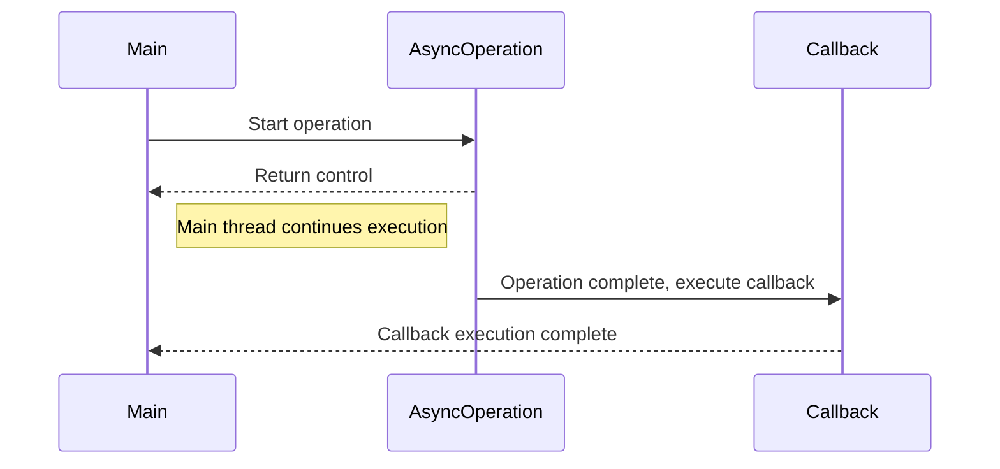

## 14.4 Callback Functions

In the world of JavaScript, functions are more than just blocks of code that perform tasks. They are first-class citizens, meaning they can be treated like any other variable. This unique feature allows us to pass functions as arguments to other functions, return them from functions, and assign them to variables. One of the most powerful applications of this capability is the use of **callback functions**.

### What are Callback Functions?

A **callback function** is a function that is passed into another function as an argument and is executed after some operation has been completed. Callbacks are fundamental to JavaScript's asynchronous programming model, allowing us to perform operations like reading files, making HTTP requests, or waiting for user input without blocking the execution of other code.

#### Key Characteristics of Callback Functions

- **Asynchronous Execution**: Callback functions are often used in operations that take time to complete, such as network requests or file I/O. They allow the main program to continue executing while waiting for the operation to finish.
- **Flexibility**: Since callbacks are functions passed as arguments, they provide a flexible way to execute code after a certain task is completed.
- **Control Flow**: Callbacks help manage the flow of a program, especially when dealing with asynchronous tasks.

### Understanding Asynchronous Programming

JavaScript is single-threaded, meaning it executes one piece of code at a time. However, many operations, like fetching data from a server, are time-consuming. If JavaScript were to wait for these operations to complete before moving on, it would be inefficient. This is where asynchronous programming comes in, allowing JavaScript to perform other tasks while waiting for the long-running operations to finish.

#### How Callbacks Facilitate Asynchronous Programming

Callbacks are integral to asynchronous programming in JavaScript. They provide a way to handle operations that take an unknown amount of time to complete. When the operation is done, the callback function is executed, allowing us to handle the result.

### Implementing Callback Functions

Let's dive into some practical examples to see how callback functions are implemented in JavaScript.

#### Example 1: Event Listeners

Event listeners are a common use case for callback functions. They allow us to execute code in response to user interactions, such as clicks or key presses.

```javascript
// Selecting a button element from the DOM
const button = document.querySelector('button');

// Adding a click event listener with a callback function
button.addEventListener('click', function() {
    console.log('Button was clicked!');
});
```

In this example, the `addEventListener` method takes two arguments: the event type (`'click'`) and the callback function. When the button is clicked, the callback function is executed, logging a message to the console.

#### Example 2: Timers

JavaScript provides functions like `setTimeout` and `setInterval` that use callbacks to execute code after a specified delay.

```javascript
// Using setTimeout to execute a callback function after 2 seconds
setTimeout(function() {
    console.log('This message is displayed after 2 seconds');
}, 2000);
```

Here, the `setTimeout` function takes a callback function and a delay in milliseconds. After 2 seconds, the callback function is executed, displaying a message in the console.

#### Example 3: API Calls

When making HTTP requests, callbacks are used to handle the response once it arrives.

```javascript
// Simulating an API call with a callback function
function fetchData(callback) {
    setTimeout(function() {
        const data = { name: 'John', age: 30 };
        callback(data);
    }, 3000);
}

// Calling fetchData with a callback function
fetchData(function(response) {
    console.log('Data received:', response);
});
```

In this example, `fetchData` simulates an API call that takes 3 seconds to complete. The callback function is executed once the data is "received," logging it to the console.

### Error-First Callbacks in Node.js

In Node.js, a common pattern is the **error-first callback**, where the first argument of the callback is reserved for an error object. This pattern allows us to handle errors gracefully.

#### Example of Error-First Callback

```javascript
const fs = require('fs');

// Reading a file using an error-first callback
fs.readFile('example.txt', 'utf8', function(err, data) {
    if (err) {
        console.error('Error reading file:', err);
        return;
    }
    console.log('File contents:', data);
});
```

In this example, the `fs.readFile` function reads a file and uses an error-first callback. If an error occurs, it is passed as the first argument (`err`). If no error occurs, `err` is `null`, and the file data is passed as the second argument (`data`).

### Visualizing Callback Execution

To better understand how callbacks work, let's visualize the process of a callback function being executed after an asynchronous operation.



**Diagram Description**: This sequence diagram illustrates the flow of control in an asynchronous operation using a callback. The main thread initiates the operation, which returns control immediately. Once the operation is complete, the callback function is executed, and control returns to the main thread.

### Try It Yourself

Experiment with the following code example by modifying the callback function to perform different tasks or by changing the delay in `setTimeout`.

```javascript
// Experiment with different callback functions
setTimeout(function() {
    console.log('Experiment with this message!');
}, 1000);
```

### Best Practices for Using Callback Functions

1. **Error Handling**: Always handle errors in your callbacks, especially in Node.js, where the error-first pattern is common.
2. **Avoid Callback Hell**: Nesting multiple callbacks can lead to complex and hard-to-read code. Consider using Promises or async/await for better readability.
3. **Keep Callbacks Simple**: Keep your callback functions focused on a single task to maintain clarity and simplicity.
4. **Use Named Functions**: Instead of anonymous functions, use named functions for callbacks to improve readability and debugging.

### Conclusion

Callback functions are a powerful feature of JavaScript, enabling asynchronous programming and enhancing the flexibility of your code. By understanding how to implement and use callbacks effectively, you can write more efficient and responsive applications.

Remember, this is just the beginning. As you progress, you'll encounter more complex scenarios where callbacks play a crucial role. Keep experimenting, stay curious, and enjoy the journey!

## Quiz Time!



### What is a callback function?

- [x] A function passed as an argument to another function
- [ ] A function that returns another function
- [ ] A function that is immediately invoked
- [ ] A function that is only used in synchronous code

> **Explanation:** A callback function is a function that is passed as an argument to another function and is executed after some operation has been completed.

### Which of the following is a common use case for callback functions?

- [x] Event listeners
- [x] Timers
- [x] API calls
- [ ] Variable declarations

> **Explanation:** Callback functions are commonly used in event listeners, timers, and API calls to handle asynchronous operations.

### What is the purpose of the error-first pattern in Node.js callbacks?

- [x] To handle errors gracefully
- [ ] To improve performance
- [ ] To simplify syntax
- [ ] To make code synchronous

> **Explanation:** The error-first pattern in Node.js callbacks allows us to handle errors gracefully by passing an error object as the first argument.

### How can you avoid callback hell?

- [x] Use Promises or async/await
- [ ] Use more callbacks
- [ ] Avoid using callbacks altogether
- [ ] Use synchronous code instead

> **Explanation:** To avoid callback hell, you can use Promises or async/await, which provide a more readable and manageable way to handle asynchronous operations.

### In the context of callbacks, what does "asynchronous" mean?

- [x] Operations that do not block the execution of other code
- [ ] Operations that are executed immediately
- [ ] Operations that are executed in a loop
- [ ] Operations that are only used in Node.js

> **Explanation:** Asynchronous operations do not block the execution of other code, allowing the program to continue running while waiting for the operation to complete.

### Which method is used to add an event listener to a DOM element?

- [x] addEventListener
- [ ] setTimeout
- [ ] fetch
- [ ] querySelector

> **Explanation:** The `addEventListener` method is used to add an event listener to a DOM element, allowing us to execute a callback function in response to events.

### What is the role of a callback function in `setTimeout`?

- [x] To execute code after a specified delay
- [ ] To execute code immediately
- [ ] To execute code in a loop
- [ ] To execute code only once

> **Explanation:** In `setTimeout`, the callback function is executed after a specified delay, allowing us to perform actions after a certain amount of time.

### How does JavaScript handle asynchronous operations?

- [x] By using callback functions
- [ ] By using synchronous loops
- [ ] By using global variables
- [ ] By using only one thread

> **Explanation:** JavaScript handles asynchronous operations by using callback functions, which allow the program to continue executing while waiting for an operation to complete.

### What is a key benefit of using named functions for callbacks?

- [x] Improved readability and debugging
- [ ] Faster execution
- [ ] Less memory usage
- [ ] More complex code

> **Explanation:** Using named functions for callbacks improves readability and debugging by providing clear function names and stack traces.

### True or False: Callback functions can only be used in Node.js.

- [ ] True
- [x] False

> **Explanation:** False. Callback functions can be used in both client-side JavaScript (in the browser) and server-side JavaScript (in Node.js).




