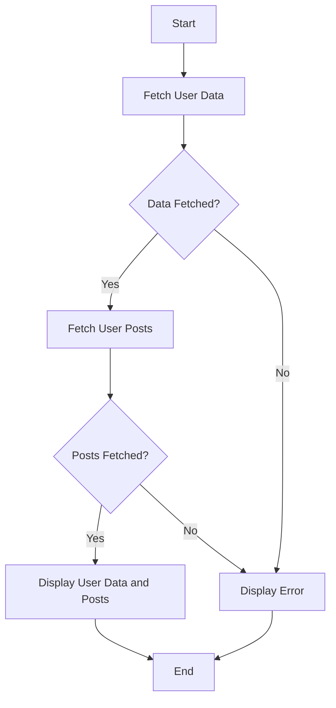

## 14.5 Practical Examples of First-Class Functions in JavaScript

In this section, we will delve into the practical applications of first-class functions in JavaScript, particularly focusing on event handling and asynchronous code. By the end of this section, you'll have a solid understanding of how to leverage first-class functions to create dynamic and responsive web applications.

### Understanding First-Class Functions

Before we dive into practical examples, let's briefly recap what it means for functions to be first-class citizens in JavaScript. In programming languages where functions are first-class citizens, functions can be treated like any other variable. This means you can:

- Assign functions to variables.
- Pass functions as arguments to other functions.
- Return functions from other functions.
- Store functions in data structures like arrays and objects.

This flexibility allows for powerful programming paradigms such as functional programming and event-driven programming.

### Practical Example 1: Event Handling with First-Class Functions

Event handling is a fundamental concept in web development. It allows your application to respond to user interactions such as clicks, mouse movements, and keyboard inputs. Let's explore how first-class functions can be used to handle events efficiently.

#### Example: Click Event Listener

Suppose we want to change the background color of a button when it is clicked. We can achieve this using an event listener and a first-class function.

```html
<!DOCTYPE html>
<html lang="en">
<head>
    <meta charset="UTF-8">
    <meta name="viewport" content="width=device-width, initial-scale=1.0">
    <title>Event Handling Example</title>
    <style>
        #myButton {
            padding: 10px 20px;
            font-size: 16px;
            cursor: pointer;
        }
    </style>
</head>
<body>
    <button id="myButton">Click Me!</button>
    <script>
        // Define a function to change the button's background color
        function changeBackgroundColor() {
            const button = document.getElementById('myButton');
            button.style.backgroundColor = button.style.backgroundColor === 'blue' ? 'green' : 'blue';
        }

        // Assign the function to the button's click event
        const button = document.getElementById('myButton');
        button.addEventListener('click', changeBackgroundColor);
    </script>
</body>
</html>
```

In this example, we define a function `changeBackgroundColor` that toggles the button's background color between blue and green. We then use `addEventListener` to attach this function to the button's click event. Notice how we pass the function `changeBackgroundColor` directly as an argument to `addEventListener`. This is possible because functions are first-class citizens in JavaScript.

#### Try It Yourself

Experiment with the code by adding more event listeners, such as `mouseover` or `mouseout`, to change the button's color when the mouse hovers over it.

### Practical Example 2: Asynchronous Code with First-Class Functions

Asynchronous programming is crucial for creating responsive web applications. JavaScript provides several mechanisms for handling asynchronous operations, such as callbacks, promises, and async/await. Let's explore how first-class functions play a role in asynchronous code.

#### Example: Fetching Data with Callbacks

Suppose we want to fetch data from an API and display it on a webpage. We can use the `fetch` API and a callback function to handle the asynchronous operation.

```html
<!DOCTYPE html>
<html lang="en">
<head>
    <meta charset="UTF-8">
    <meta name="viewport" content="width=device-width, initial-scale=1.0">
    <title>Asynchronous Fetch Example</title>
</head>
<body>
    <div id="dataDisplay"></div>
    <script>
        // Define a function to fetch data from an API
        function fetchData(callback) {
            fetch('https://jsonplaceholder.typicode.com/posts/1')
                .then(response => response.json())
                .then(data => callback(data))
                .catch(error => console.error('Error fetching data:', error));
        }

        // Define a callback function to display the fetched data
        function displayData(data) {
            const displayDiv = document.getElementById('dataDisplay');
            displayDiv.innerHTML = `<h2>${data.title}</h2><p>${data.body}</p>`;
        }

        // Fetch data and display it using the callback function
        fetchData(displayData);
    </script>
</body>
</html>
```

In this example, `fetchData` is an asynchronous function that fetches data from an API. It takes a callback function `displayData` as an argument, which is called once the data is successfully fetched. The `displayData` function then updates the webpage with the fetched data. This pattern demonstrates how first-class functions can be used to handle asynchronous operations.

#### Try It Yourself

Modify the code to fetch and display a list of posts instead of a single post. You can use the endpoint `https://jsonplaceholder.typicode.com/posts` to fetch multiple posts.

### Practical Example 3: Promises and First-Class Functions

Promises provide a more elegant way to handle asynchronous operations compared to callbacks. Let's see how first-class functions are used with promises.

#### Example: Chaining Promises

Suppose we want to perform a series of asynchronous operations, such as fetching user data and then fetching posts by that user. We can use promises to chain these operations.

```html
<!DOCTYPE html>
<html lang="en">
<head>
    <meta charset="UTF-8">
    <meta name="viewport" content="width=device-width, initial-scale=1.0">
    <title>Promise Chaining Example</title>
</head>
<body>
    <div id="userData"></div>
    <script>
        // Function to fetch user data
        function fetchUserData(userId) {
            return fetch(`https://jsonplaceholder.typicode.com/users/${userId}`)
                .then(response => response.json());
        }

        // Function to fetch posts by a user
        function fetchUserPosts(userId) {
            return fetch(`https://jsonplaceholder.typicode.com/posts?userId=${userId}`)
                .then(response => response.json());
        }

        // Function to display user data and posts
        function displayUserDataAndPosts(user, posts) {
            const userDataDiv = document.getElementById('userData');
            userDataDiv.innerHTML = `<h2>${user.name}</h2><p>${user.email}</p><h3>Posts:</h3>`;
            posts.forEach(post => {
                userDataDiv.innerHTML += `<h4>${post.title}</h4><p>${post.body}</p>`;
            });
        }

        // Fetch user data and posts using promise chaining
        fetchUserData(1)
            .then(user => {
                return fetchUserPosts(user.id).then(posts => ({ user, posts }));
            })
            .then(({ user, posts }) => displayUserDataAndPosts(user, posts))
            .catch(error => console.error('Error:', error));
    </script>
</body>
</html>
```

In this example, we define two functions, `fetchUserData` and `fetchUserPosts`, that return promises. We use promise chaining to first fetch the user data and then fetch the user's posts. The `displayUserDataAndPosts` function is used to display the fetched data on the webpage. This example demonstrates how first-class functions can be used to create clean and readable asynchronous code with promises.

#### Try It Yourself

Experiment by adding additional asynchronous operations, such as fetching comments for each post, and display them on the webpage.

### Practical Example 4: Async/Await and First-Class Functions

The `async` and `await` keywords provide a more synchronous-looking syntax for handling asynchronous operations. Let's explore how first-class functions are used with async/await.

#### Example: Fetching Data with Async/Await

Suppose we want to fetch user data and posts using async/await. We can refactor the previous example to use this syntax.

```html
<!DOCTYPE html>
<html lang="en">
<head>
    <meta charset="UTF-8">
    <meta name="viewport" content="width=device-width, initial-scale=1.0">
    <title>Async/Await Example</title>
</head>
<body>
    <div id="userData"></div>
    <script>
        // Function to fetch user data
        async function fetchUserData(userId) {
            const response = await fetch(`https://jsonplaceholder.typicode.com/users/${userId}`);
            return response.json();
        }

        // Function to fetch posts by a user
        async function fetchUserPosts(userId) {
            const response = await fetch(`https://jsonplaceholder.typicode.com/posts?userId=${userId}`);
            return response.json();
        }

        // Function to display user data and posts
        function displayUserDataAndPosts(user, posts) {
            const userDataDiv = document.getElementById('userData');
            userDataDiv.innerHTML = `<h2>${user.name}</h2><p>${user.email}</p><h3>Posts:</h3>`;
            posts.forEach(post => {
                userDataDiv.innerHTML += `<h4>${post.title}</h4><p>${post.body}</p>`;
            });
        }

        // Async function to fetch and display data
        async function fetchAndDisplayData() {
            try {
                const user = await fetchUserData(1);
                const posts = await fetchUserPosts(user.id);
                displayUserDataAndPosts(user, posts);
            } catch (error) {
                console.error('Error:', error);
            }
        }

        // Call the async function
        fetchAndDisplayData();
    </script>
</body>
</html>
```

In this example, we define `fetchUserData` and `fetchUserPosts` as `async` functions, which allows us to use the `await` keyword to wait for the asynchronous operations to complete. The `fetchAndDisplayData` function orchestrates the fetching and displaying of data. This example shows how first-class functions can be used to create concise and readable asynchronous code with async/await.

#### Try It Yourself

Modify the code to handle errors more gracefully, such as displaying an error message on the webpage if the data fetching fails.

### Visualizing Asynchronous Code Flow

To better understand the flow of asynchronous code, let's visualize the process using a flowchart. This will help us see how data is fetched and displayed in our examples.



**Caption:** This flowchart illustrates the asynchronous process of fetching user data and posts, and displaying them on a webpage. It shows the decision points for handling errors and the sequential flow of operations.

### Exercises to Reinforce Learning

To solidify your understanding of first-class functions in JavaScript, try solving the following exercises:

1. **Exercise 1: Event Delegation**

   Create a list of items on a webpage. Use event delegation to handle click events on the list items and change their background color when clicked.

2. **Exercise 2: Chaining Promises**

   Fetch data from two different APIs and display the combined results on a webpage. Use promise chaining to handle the asynchronous operations.

3. **Exercise 3: Async/Await with Error Handling**

   Refactor an existing callback-based asynchronous code to use async/await. Implement error handling to display error messages on the webpage.

4. **Exercise 4: Dynamic Event Listeners**

   Create a form with multiple input fields. Use first-class functions to dynamically add event listeners that validate the input values and display error messages if the input is invalid.

5. **Exercise 5: Modularize Asynchronous Code**

   Break down a complex asynchronous operation into smaller, reusable functions. Use first-class functions to compose these functions into a complete workflow.

### Key Takeaways

- **First-Class Functions:** JavaScript treats functions as first-class citizens, allowing them to be assigned to variables, passed as arguments, and returned from other functions.
- **Event Handling:** First-class functions enable efficient event handling by allowing functions to be attached as event listeners.
- **Asynchronous Code:** First-class functions play a crucial role in handling asynchronous operations using callbacks, promises, and async/await.
- **Code Readability:** Using first-class functions can lead to cleaner, more readable, and maintainable code.

### Embrace the Journey

Remember, this is just the beginning. As you progress, you'll build more complex and interactive web pages. Keep experimenting, stay curious, and enjoy the journey!

## Quiz Time!



### What does it mean for functions to be first-class citizens in JavaScript?

- [x] Functions can be assigned to variables, passed as arguments, and returned from other functions.
- [ ] Functions cannot be passed as arguments to other functions.
- [ ] Functions cannot be stored in arrays or objects.
- [ ] Functions cannot be returned from other functions.

> **Explanation:** In JavaScript, functions are first-class citizens, meaning they can be treated like any other variable. They can be assigned to variables, passed as arguments, and returned from other functions.

### How do you attach a function as an event listener to a DOM element?

- [x] Use the `addEventListener` method on the DOM element.
- [ ] Use the `attachEvent` method on the DOM element.
- [ ] Use the `bindEvent` method on the DOM element.
- [ ] Use the `setEventListener` method on the DOM element.

> **Explanation:** The `addEventListener` method is used to attach a function as an event listener to a DOM element.

### What is the purpose of the `fetch` function in JavaScript?

- [x] To perform asynchronous HTTP requests.
- [ ] To fetch data from local storage.
- [ ] To fetch data from a database.
- [ ] To fetch data from a file system.

> **Explanation:** The `fetch` function is used to perform asynchronous HTTP requests to retrieve resources from a server.

### In the context of promises, what does "chaining" refer to?

- [x] Linking multiple promise-based operations in a sequence.
- [ ] Creating a chain of event listeners.
- [ ] Combining multiple functions into a single function.
- [ ] Linking multiple variables together.

> **Explanation:** Promise chaining refers to linking multiple promise-based operations in a sequence, where each operation is performed after the previous one completes.

### What is the benefit of using async/await over traditional callbacks?

- [x] It provides a more readable and synchronous-looking syntax for asynchronous code.
- [ ] It eliminates the need for error handling.
- [x] It simplifies error handling with try/catch blocks.
- [ ] It makes asynchronous code run faster.

> **Explanation:** Async/await provides a more readable and synchronous-looking syntax for asynchronous code, and it simplifies error handling with try/catch blocks.

### How can you handle errors in asynchronous code using promises?

- [x] Use the `catch` method to handle errors.
- [ ] Use the `finally` method to handle errors.
- [ ] Use the `error` method to handle errors.
- [ ] Use the `reject` method to handle errors.

> **Explanation:** The `catch` method is used to handle errors in asynchronous code when using promises.

### What is the role of a callback function in asynchronous programming?

- [x] To execute code after an asynchronous operation completes.
- [ ] To execute code before an asynchronous operation starts.
- [x] To handle the result of an asynchronous operation.
- [ ] To perform synchronous operations.

> **Explanation:** A callback function is used to execute code after an asynchronous operation completes and to handle the result of the operation.

### Which of the following is a benefit of using first-class functions in JavaScript?

- [x] They enable functional programming paradigms.
- [ ] They make code harder to read and maintain.
- [ ] They limit the flexibility of code.
- [ ] They prevent the use of event-driven programming.

> **Explanation:** First-class functions enable functional programming paradigms, allowing for more flexible and reusable code.

### What is the purpose of the `await` keyword in JavaScript?

- [x] To pause the execution of an async function until a promise is resolved.
- [ ] To pause the execution of a synchronous function.
- [ ] To create a new promise.
- [ ] To reject a promise.

> **Explanation:** The `await` keyword is used to pause the execution of an async function until a promise is resolved, allowing for more readable asynchronous code.

### True or False: Functions in JavaScript can be stored in arrays and objects.

- [x] True
- [ ] False

> **Explanation:** Functions in JavaScript can be stored in arrays and objects because they are first-class citizens, just like any other data type.


