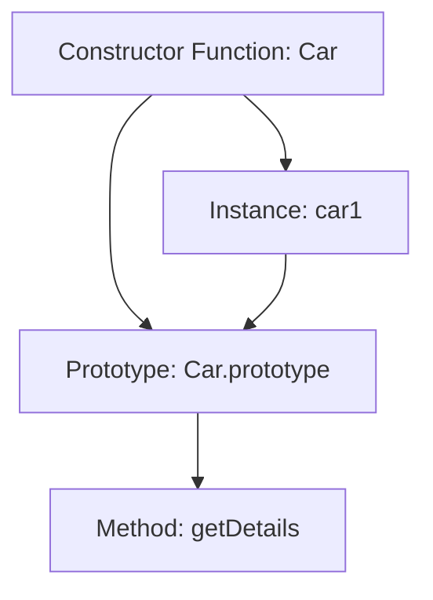

## 15.1 Function Constructors

In the world of JavaScript, understanding how to create and manage objects is a fundamental skill. One of the traditional ways to create objects is through function constructors. This section will guide you through the concept of function constructors, their syntax, usage, and the role of the `this` keyword within them. By the end of this section, you'll be able to create your own objects using constructor functions and understand how they fit into the broader JavaScript ecosystem.

### What are Function Constructors?

Function constructors are special functions in JavaScript that are used to create and initialize objects. They serve as blueprints for creating multiple instances of objects with similar properties and methods. When you use a constructor function, you can create a new object with its own unique properties, while sharing methods defined in the constructor's prototype.

#### Naming Conventions

When defining a constructor function, it's a common convention to start the function name with an uppercase letter. This helps distinguish constructor functions from regular functions. For example, if you're creating a constructor for a `Car` object, you would name it `Car` rather than `car`.

### Defining a Constructor Function

Let's start by defining a simple constructor function for a `Car` object. This function will initialize a car with a make, model, and year.

```javascript
function Car(make, model, year) {
  this.make = make;
  this.model = model;
  this.year = year;
}
```

In this example, the `Car` function is a constructor function. It takes three parameters: `make`, `model`, and `year`. Inside the function, the `this` keyword is used to assign these parameters to the properties of the object being created.

### Instantiating Constructor Functions

To create a new object using a constructor function, you use the `new` keyword. This keyword creates a new instance of the object and sets the context of `this` to the new object.

```javascript
let myCar = new Car('Toyota', 'Corolla', 2020);
console.log(myCar.make); // Output: Toyota
console.log(myCar.model); // Output: Corolla
console.log(myCar.year); // Output: 2020
```

In this example, `myCar` is a new instance of the `Car` object. The `new` keyword is crucial here, as it ensures that `this` inside the constructor function refers to the new object being created.

### The Role of `this` in Constructor Functions

The `this` keyword is a fundamental part of constructor functions. It refers to the object that is being created by the constructor. When you use the `new` keyword, `this` is automatically bound to the new object.

#### Understanding `this` with an Example

Let's explore how `this` works within a constructor function with a more detailed example:

```javascript
function Book(title, author, year) {
  this.title = title;
  this.author = author;
  this.year = year;

  this.getSummary = function() {
    return `${this.title} was written by ${this.author} in ${this.year}.`;
  };
}

let book1 = new Book('1984', 'George Orwell', 1949);
console.log(book1.getSummary()); // Output: 1984 was written by George Orwell in 1949.
```

In this example, `this.title`, `this.author`, and `this.year` are properties of the `Book` object. The `getSummary` method uses `this` to access these properties, ensuring that it returns the correct information for each instance of a `Book`.

### Try It Yourself

Experiment with the `Book` constructor function by adding a new method that calculates the age of the book based on the current year. Here's a hint to get you started:

```javascript
this.getAge = function() {
  const currentYear = new Date().getFullYear();
  return currentYear - this.year;
};
```

### Constructor Functions and Prototypes

Constructor functions work hand-in-hand with prototypes. By adding methods to a constructor's prototype, you can ensure that all instances of the object share the same methods, saving memory and improving performance.

#### Adding Methods to the Prototype

Let's modify our `Car` example to include a method in the prototype:

```javascript
Car.prototype.getDetails = function() {
  return `${this.make} ${this.model} (${this.year})`;
};

let car1 = new Car('Honda', 'Civic', 2018);
console.log(car1.getDetails()); // Output: Honda Civic (2018)
```

By adding `getDetails` to `Car.prototype`, all instances of `Car` can use this method, but it only exists once in memory.

### Visualizing Constructor Functions

To better understand how constructor functions and prototypes work together, let's visualize the process:



**Diagram Description:** This diagram shows the relationship between the `Car` constructor function, an instance `car1`, and the shared prototype `Car.prototype` containing the `getDetails` method.

### Common Pitfalls with Constructor Functions

While constructor functions are powerful, there are some common pitfalls to be aware of:

1. **Forgetting the `new` Keyword:** If you forget to use the `new` keyword, `this` will not refer to the new object, leading to unexpected behavior.

   ```javascript
   let car2 = Car('Ford', 'Mustang', 2021); // Incorrect, missing 'new'
   console.log(car2); // Output: undefined
   ```

2. **Shared Properties:** If you define properties that are objects or arrays within the constructor, they will be shared across instances. Use prototypes for methods and shared logic.

3. **Performance Considerations:** Defining methods inside the constructor can lead to performance issues, as each instance gets its own copy of the method. Use prototypes to define methods once.

### Constructor Functions vs. ES6 Classes

With the introduction of ES6, JavaScript introduced a new syntax for creating objects: classes. While classes provide a cleaner and more intuitive syntax, they are essentially syntactic sugar over constructor functions.

#### Comparing Syntax

Here's how our `Car` example would look using an ES6 class:

```javascript
class Car {
  constructor(make, model, year) {
    this.make = make;
    this.model = model;
    this.year = year;
  }

  getDetails() {
    return `${this.make} ${this.model} (${this.year})`;
  }
}

let car3 = new Car('Tesla', 'Model 3', 2021);
console.log(car3.getDetails()); // Output: Tesla Model 3 (2021)
```

As you can see, the class syntax is more concise and easier to read, but it functions similarly to constructor functions.

### References and Further Reading

- [MDN Web Docs: Constructor](https://developer.mozilla.org/en-US/docs/Web/JavaScript/Reference/Global_Objects/Object/constructor)
- [W3Schools: JavaScript Objects](https://www.w3schools.com/js/js_objects.asp)

### Knowledge Check

Before we wrap up, let's reinforce what we've learned with a few questions:

1. What is the purpose of a constructor function in JavaScript?
2. Why is it important to use the `new` keyword when creating an object with a constructor function?
3. How does the `this` keyword behave inside a constructor function?
4. What are the benefits of using prototypes with constructor functions?

### Practice Problems

1. Create a constructor function for a `Person` object with properties `firstName`, `lastName`, and `age`. Add a method to the prototype that returns the full name of the person.
2. Modify the `Book` constructor function to include a method in the prototype that returns whether the book is a classic (published more than 50 years ago).

### Embrace the Journey

Remember, mastering constructor functions is just one step in your JavaScript journey. As you continue to learn, you'll discover more powerful ways to create and manage objects. Keep experimenting, stay curious, and enjoy the process of becoming a JavaScript expert!

## Quiz Time!



### What is a function constructor in JavaScript?

- [x] A function used to create and initialize objects
- [ ] A function that returns a random number
- [ ] A function that manipulates the DOM
- [ ] A function that handles events

> **Explanation:** A function constructor is a special type of function in JavaScript used to create and initialize objects.

### What is the naming convention for constructor functions?

- [x] Start with an uppercase letter
- [ ] Use all lowercase letters
- [ ] Use underscores between words
- [ ] Start with a number

> **Explanation:** Constructor functions typically start with an uppercase letter to distinguish them from regular functions.

### How do you create a new object using a constructor function?

- [x] Use the `new` keyword
- [ ] Use the `create` keyword
- [ ] Use the `object` keyword
- [ ] Use the `this` keyword

> **Explanation:** The `new` keyword is used to create a new object using a constructor function.

### What does the `this` keyword refer to inside a constructor function?

- [x] The new object being created
- [ ] The global object
- [ ] The prototype of the object
- [ ] The previous object created

> **Explanation:** Inside a constructor function, `this` refers to the new object being created.

### What happens if you forget to use the `new` keyword with a constructor function?

- [x] `this` will not refer to the new object
- [ ] The function will not execute
- [ ] The function will throw an error
- [ ] The function will return `null`

> **Explanation:** If you forget to use the `new` keyword, `this` will not refer to the new object, leading to unexpected behavior.

### How can you add methods to all instances of a constructor function?

- [x] Add methods to the constructor's prototype
- [ ] Define methods inside the constructor
- [ ] Use the `this` keyword
- [ ] Use the `new` keyword

> **Explanation:** Adding methods to the constructor's prototype ensures all instances share the same methods.

### What is the advantage of using prototypes with constructor functions?

- [x] Methods are shared across instances
- [ ] Methods are unique to each instance
- [ ] Methods are faster to execute
- [ ] Methods are easier to write

> **Explanation:** Using prototypes allows methods to be shared across instances, saving memory and improving performance.

### How does the ES6 class syntax relate to constructor functions?

- [x] It is syntactic sugar over constructor functions
- [ ] It replaces constructor functions entirely
- [ ] It is unrelated to constructor functions
- [ ] It is only used for inheritance

> **Explanation:** The ES6 class syntax is syntactic sugar over constructor functions, providing a cleaner and more intuitive syntax.

### True or False: Constructor functions can only create one instance of an object.

- [ ] True
- [x] False

> **Explanation:** Constructor functions can create multiple instances of an object, each with its own properties.

### What is a common pitfall when defining properties inside a constructor function?

- [x] Shared properties across instances
- [ ] Properties are not accessible
- [ ] Properties are immutable
- [ ] Properties are undefined

> **Explanation:** Defining properties that are objects or arrays inside a constructor can lead to them being shared across instances.


