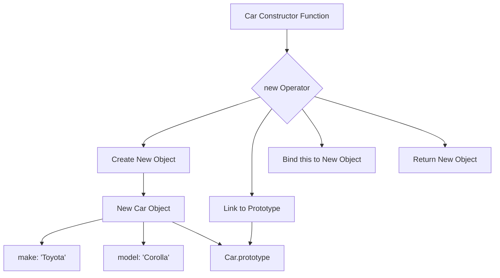

## 15.2 The `new` Operator

In JavaScript, the `new` operator is a powerful tool that allows us to create instances of objects based on constructor functions. It's a fundamental concept in object-oriented programming within JavaScript, enabling developers to create multiple objects with similar properties and methods. In this section, we'll explore the `new` operator in detail, breaking down the steps it performs, understanding how it links objects to constructors' prototypes, and discussing the implications of return statements in constructors.

### What is the `new` Operator?

The `new` operator in JavaScript is used to create an instance of an object that has a prototype linked to a constructor function. When you use `new` with a function, it performs several actions behind the scenes to construct a new object. Let's break down these steps to understand what happens when you use `new`.

### Steps Performed by the `new` Operator

When you invoke a function with the `new` operator, JavaScript performs the following steps:

1. **Create a New Object**: A new, empty object is created. This object will eventually be returned by the constructor function.

2. **Link the Object to a Prototype**: The new object is linked to the prototype of the constructor function. This means the new object inherits properties and methods from the constructor's prototype.

3. **Bind `this` to the New Object**: The constructor function is called with `this` bound to the new object. This allows the constructor to initialize properties on the new object.

4. **Return the New Object**: By default, the new object is returned from the constructor function. However, if the constructor explicitly returns an object, that object is returned instead.

Let's illustrate these steps with a code example:

```javascript
// Define a constructor function
function Car(make, model) {
  // Step 3: `this` refers to the new object
  this.make = make;
  this.model = model;
}

// Step 1: Create a new object
// Step 2: Link the new object to Car.prototype
const myCar = new Car('Toyota', 'Corolla');

// Step 4: Return the new object
console.log(myCar); // Output: Car { make: 'Toyota', model: 'Corolla' }
```

In this example, `myCar` is an instance of `Car`, with `make` and `model` properties initialized by the constructor function.

### Visualizing the `new` Operator

To better understand how the `new` operator works, let's visualize the process using a diagram. This will help us see how the new object is linked to the constructor's prototype.



**Diagram Description**: This diagram illustrates the steps performed by the `new` operator. It shows how a new object is created, linked to the `Car.prototype`, and initialized with properties `make` and `model`.

### Linking to the Constructor's Prototype

One of the key steps performed by the `new` operator is linking the new object to the constructor's prototype. This linkage is what enables objects created with a constructor to share methods and properties defined on the prototype.

When a new object is created using a constructor, it has access to all the properties and methods defined on the constructor's prototype. This is because the new object's internal `[[Prototype]]` property is set to the constructor's `prototype` object.

Let's see this in action:

```javascript
// Define a method on the Car prototype
Car.prototype.getDetails = function() {
  return `${this.make} ${this.model}`;
};

// Create a new Car instance
const anotherCar = new Car('Honda', 'Civic');

// Access the method defined on the prototype
console.log(anotherCar.getDetails()); // Output: Honda Civic
```

In this example, `anotherCar` has access to the `getDetails` method defined on `Car.prototype`. This demonstrates how the prototype linkage allows objects to share functionality.

### The Role of `return` Statements in Constructors

In JavaScript, constructors can include `return` statements, but they behave differently than in regular functions. By default, constructors return the new object created by the `new` operator. However, if a constructor explicitly returns an object, that object is returned instead of the newly created one.

Let's explore this behavior with an example:

```javascript
function Gadget(name) {
  this.name = name;
  // Explicitly return an object
  return { type: 'Electronic Device' };
}

const myGadget = new Gadget('Smartphone');
console.log(myGadget); // Output: { type: 'Electronic Device' }
```

In this case, the constructor returns an object with a `type` property, overriding the default behavior of returning the new object. It's important to note that if a constructor returns a non-object value (e.g., a string or number), the default behavior of returning the new object is preserved.

### Try It Yourself

To solidify your understanding of the `new` operator, try modifying the examples provided. Here are some suggestions:

- Add more properties to the `Car` constructor and see how they are initialized on new instances.
- Define additional methods on `Car.prototype` and access them from different car instances.
- Experiment with returning different types of values from a constructor and observe the behavior.

### Knowledge Check

Let's review some key concepts covered in this section:

- The `new` operator creates a new object, links it to the constructor's prototype, binds `this` to the new object, and returns the new object.
- The new object inherits properties and methods from the constructor's prototype.
- Constructors can include `return` statements, but they only affect the returned value if an object is explicitly returned.

### Further Reading

For more information on the `new` operator and constructor functions, check out these resources:

- [MDN Web Docs: new Operator](https://developer.mozilla.org/en-US/docs/Web/JavaScript/Reference/Operators/new)
- [MDN Web Docs: Constructor Functions](https://developer.mozilla.org/en-US/docs/Web/JavaScript/Guide/Working_with_Objects#using_a_constructor_function)

### Embrace the Journey

Remember, understanding the `new` operator is a crucial step in mastering JavaScript's object-oriented programming capabilities. As you continue your journey, you'll encounter more advanced topics that build on this foundation. Keep experimenting, stay curious, and enjoy the process of learning!

## Quiz Time!



### What does the `new` operator do in JavaScript?

- [x] Creates a new object and links it to the constructor's prototype
- [ ] Deletes an existing object
- [ ] Copies an object
- [ ] Modifies the prototype of an existing object

> **Explanation:** The `new` operator creates a new object, links it to the constructor's prototype, binds `this` to the new object, and returns the new object.

### What happens if a constructor function explicitly returns an object?

- [x] The returned object is used instead of the newly created object
- [ ] The constructor throws an error
- [ ] The returned object is ignored
- [ ] The constructor returns `undefined`

> **Explanation:** If a constructor explicitly returns an object, that object is returned instead of the newly created one.

### What is the default behavior of a constructor function if no return statement is present?

- [x] It returns the new object created by the `new` operator
- [ ] It returns `null`
- [ ] It returns `undefined`
- [ ] It returns the constructor's prototype

> **Explanation:** By default, a constructor returns the new object created by the `new` operator if no return statement is present.

### How does the `new` operator link a new object to the constructor's prototype?

- [x] By setting the new object's internal `[[Prototype]]` property to the constructor's `prototype` object
- [ ] By copying all properties from the prototype to the new object
- [ ] By modifying the constructor's prototype
- [ ] By creating a new prototype for the object

> **Explanation:** The `new` operator links the new object to the constructor's prototype by setting the new object's internal `[[Prototype]]` property to the constructor's `prototype` object.

### Can a constructor return a primitive value and affect the returned object?

- [x] No, the new object is returned regardless of the primitive value returned
- [ ] Yes, the primitive value is returned instead of the new object
- [ ] Yes, but only if the primitive is a number
- [ ] No, the constructor throws an error

> **Explanation:** If a constructor returns a primitive value, the new object is returned regardless of the primitive value returned.

### What is the purpose of binding `this` to the new object in a constructor?

- [x] To initialize properties on the new object
- [ ] To modify the constructor's prototype
- [ ] To delete properties from the new object
- [ ] To return a different object

> **Explanation:** Binding `this` to the new object allows the constructor to initialize properties on the new object.

### What is the result of using `new` with a function that has no `return` statement?

- [x] A new object is created and returned
- [ ] `undefined` is returned
- [ ] An error is thrown
- [ ] The function's prototype is returned

> **Explanation:** When using `new` with a function that has no `return` statement, a new object is created and returned.

### What does the `new` operator do if a constructor returns a non-object value?

- [x] It ignores the returned value and returns the new object
- [ ] It returns the non-object value
- [ ] It throws an error
- [ ] It returns `null`

> **Explanation:** If a constructor returns a non-object value, the `new` operator ignores the returned value and returns the new object.

### How can you define methods that are shared across all instances of a constructor?

- [x] By adding them to the constructor's prototype
- [ ] By defining them inside the constructor function
- [ ] By using the `new` operator
- [ ] By returning them from the constructor

> **Explanation:** Methods that are shared across all instances of a constructor can be defined on the constructor's prototype.

### True or False: The `new` operator can be used with any function to create objects.

- [x] True
- [ ] False

> **Explanation:** True. The `new` operator can be used with any function to create objects, although it's typically used with constructor functions.


