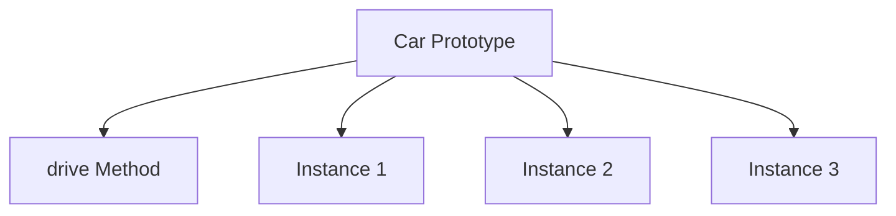

## 15.3 Adding Properties and Methods

In this section, we'll delve into the fascinating world of adding properties and methods to constructor functions in JavaScript. This is a crucial concept in object-oriented programming (OOP) within JavaScript, allowing us to create objects with shared characteristics and behaviors. By the end of this guide, you'll have a solid understanding of how to define instance properties and methods, the differences between adding methods directly on `this` versus on the prototype, and the implications for memory efficiency and method sharing.

### Understanding Constructor Functions

Before we dive into adding properties and methods, let's briefly revisit what constructor functions are. In JavaScript, a constructor function is a special type of function used to create and initialize objects. It acts as a blueprint for creating multiple instances of an object with similar properties and methods.

Here's a simple example of a constructor function:

```javascript
function Car(make, model, year) {
  this.make = make;
  this.model = model;
  this.year = year;
}
```

In this example, `Car` is a constructor function that initializes a new car object with `make`, `model`, and `year` properties.

### Defining Instance Properties

Instance properties are unique to each instance of an object created using a constructor function. These properties are defined within the constructor function using the `this` keyword.

Let's expand on our `Car` example by adding some instance properties:

```javascript
function Car(make, model, year) {
  this.make = make;
  this.model = model;
  this.year = year;
  this.mileage = 0; // Instance property
  this.color = 'unknown'; // Instance property
}

const myCar = new Car('Toyota', 'Corolla', 2020);
console.log(myCar.mileage); // Output: 0
console.log(myCar.color); // Output: unknown
```

In this code, `mileage` and `color` are instance properties, meaning each car object can have different values for these properties.

### Adding Methods to Constructor Functions

Methods are functions associated with an object that define its behavior. In JavaScript, we can add methods to constructor functions in two main ways: directly on the instance or on the prototype.

#### Adding Methods Directly on `this`

When you add methods directly on `this`, each instance of the object gets its own copy of the method. This approach is straightforward but can be memory inefficient if you create many instances.

Here's how you can add a method directly on `this`:

```javascript
function Car(make, model, year) {
  this.make = make;
  this.model = model;
  this.year = year;
  this.mileage = 0;
  this.color = 'unknown';

  this.drive = function(distance) {
    this.mileage += distance;
    console.log(`Driven ${distance} miles. Total mileage: ${this.mileage}`);
  };
}

const myCar = new Car('Toyota', 'Corolla', 2020);
myCar.drive(50); // Output: Driven 50 miles. Total mileage: 50
```

In this example, the `drive` method is defined directly on `this`, making it an instance method.

#### Adding Methods to the Prototype

A more memory-efficient way to add methods is to define them on the constructor's prototype. Methods on the prototype are shared among all instances of the object, reducing memory usage.

Here's how you can add a method to the prototype:

```javascript
function Car(make, model, year) {
  this.make = make;
  this.model = model;
  this.year = year;
  this.mileage = 0;
  this.color = 'unknown';
}

Car.prototype.drive = function(distance) {
  this.mileage += distance;
  console.log(`Driven ${distance} miles. Total mileage: ${this.mileage}`);
};

const myCar = new Car('Toyota', 'Corolla', 2020);
myCar.drive(50); // Output: Driven 50 miles. Total mileage: 50
```

In this example, the `drive` method is added to the `Car` prototype, making it a prototype method shared by all car instances.

### Memory Efficiency and Method Sharing

When deciding whether to add methods directly on `this` or on the prototype, consider memory efficiency and method sharing:

- **Memory Efficiency**: Adding methods to the prototype is more memory-efficient because all instances share the same method. This reduces the overall memory footprint, especially when creating many instances.

- **Method Sharing**: Prototype methods are shared among instances, which means changes to the method affect all instances. This can be beneficial for maintaining consistent behavior across instances.

### Visualizing Prototype Method Sharing

To better understand how prototype method sharing works, let's visualize it using a diagram.



In this diagram, the `drive` method is part of the `Car` prototype, and all instances (Instance 1, Instance 2, Instance 3) share this method.

### Try It Yourself

Now that we've covered the basics, it's time to experiment! Try modifying the code examples to add more properties and methods. For instance, you could add a `paint` method to change the car's color or a `service` method to reset the mileage.

### References and Links

For further reading on constructor functions and prototypes, check out these resources:

- [MDN Web Docs: Working with Objects](https://developer.mozilla.org/en-US/docs/Web/JavaScript/Guide/Working_with_Objects)
- [W3Schools: JavaScript Objects](https://www.w3schools.com/js/js_objects.asp)

### Knowledge Check

Let's reinforce what we've learned with a few questions:

- What is the difference between instance properties and prototype methods?
- Why is adding methods to the prototype more memory-efficient?
- How can you modify a prototype method to affect all instances?

### Embrace the Journey

Remember, this is just the beginning. As you progress, you'll build more complex and interactive web pages. Keep experimenting, stay curious, and enjoy the journey!

## Quiz Time!



### What is a constructor function in JavaScript?

- [x] A function used to create and initialize objects
- [ ] A function that only adds properties to objects
- [ ] A function that cannot have methods
- [ ] A function that is used to delete objects

> **Explanation:** A constructor function is a special type of function in JavaScript used to create and initialize objects with specific properties and methods.

### How are instance properties defined in a constructor function?

- [x] Using the `this` keyword within the constructor function
- [ ] Using the `prototype` property of the constructor
- [ ] Using the `new` keyword outside the constructor
- [ ] Using the `class` keyword

> **Explanation:** Instance properties are defined within the constructor function using the `this` keyword, making them unique to each instance.

### What is the advantage of adding methods to the prototype?

- [x] It is more memory-efficient
- [ ] It makes methods private to each instance
- [ ] It prevents methods from being modified
- [ ] It allows methods to be deleted easily

> **Explanation:** Adding methods to the prototype is more memory-efficient because all instances share the same method, reducing the overall memory footprint.

### How do you add a method to a constructor's prototype?

- [x] By assigning a function to the constructor's `prototype` property
- [ ] By defining the method inside the constructor function
- [ ] By using the `this` keyword within the method
- [ ] By using the `new` keyword

> **Explanation:** You add a method to a constructor's prototype by assigning a function to the constructor's `prototype` property, making it shared among all instances.

### What happens when you modify a prototype method?

- [x] All instances of the object are affected
- [ ] Only the instance that called the method is affected
- [ ] The method becomes an instance property
- [ ] The method is deleted from the prototype

> **Explanation:** Modifying a prototype method affects all instances of the object because they all share the same method.

### Why might you choose to add methods directly on `this`?

- [x] To make each instance have its own copy of the method
- [ ] To make the method inaccessible to other instances
- [ ] To prevent the method from being modified
- [ ] To increase memory efficiency

> **Explanation:** Adding methods directly on `this` makes each instance have its own copy of the method, which can be useful if the method needs to be unique for each instance.

### What is a potential downside of adding methods directly on `this`?

- [x] It can be memory inefficient
- [ ] It prevents method sharing
- [ ] It makes methods private
- [ ] It increases execution time

> **Explanation:** Adding methods directly on `this` can be memory inefficient because each instance has its own copy of the method, increasing memory usage.

### How can you ensure consistent behavior across all instances?

- [x] By adding methods to the prototype
- [ ] By adding methods directly on `this`
- [ ] By using the `new` keyword
- [ ] By defining methods as private

> **Explanation:** Adding methods to the prototype ensures consistent behavior across all instances because they all share the same method.

### What is the purpose of the `this` keyword in a constructor function?

- [x] To refer to the instance being created
- [ ] To refer to the constructor function itself
- [ ] To refer to the global object
- [ ] To refer to the prototype

> **Explanation:** In a constructor function, the `this` keyword refers to the instance being created, allowing you to define properties and methods for that instance.

### True or False: Prototype methods are unique to each instance.

- [ ] True
- [x] False

> **Explanation:** False. Prototype methods are shared among all instances, making them not unique to each instance.


