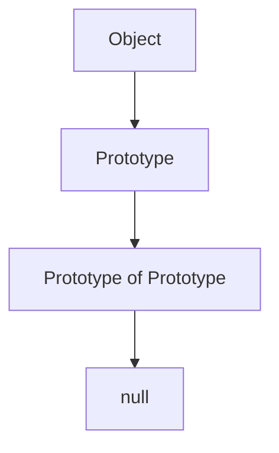
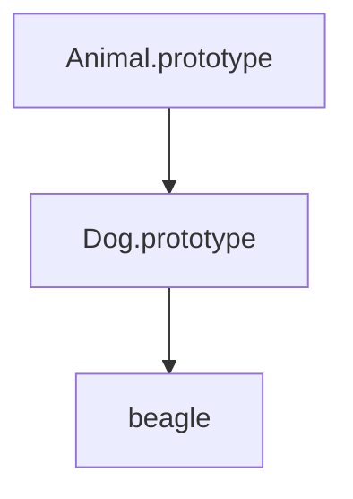

## 15.4 Prototypal Inheritance with Constructors

In JavaScript, understanding how objects inherit properties and methods is crucial for building scalable and maintainable applications. Prototypal inheritance is a core concept that allows objects to inherit features from other objects. This section will guide you through the intricacies of prototypal inheritance, especially focusing on how it works with constructors. We will explore setting up inheritance hierarchies and using `Object.create` to manage prototypes effectively.

### Understanding Prototypal Inheritance

**Prototypal inheritance** is a feature in JavaScript that allows objects to inherit properties and methods from other objects. Unlike classical inheritance, where classes inherit from other classes, prototypal inheritance is based on objects inheriting directly from other objects.

#### How Prototypal Inheritance Works

Every JavaScript object has a prototype, which is another object from which it inherits properties. When you try to access a property on an object, JavaScript will first look for the property on the object itself. If it doesn't find it, it will look for the property on the object's prototype, and so on, until it reaches the end of the prototype chain.

Here's a simple diagram to visualize the prototype chain:



**Caption:** The prototype chain in JavaScript, where each object has a prototype, leading up to `null`.

### Constructors and Prototypes

In JavaScript, constructors are functions used to create objects. When you use the `new` keyword with a constructor function, JavaScript does several things:

1. It creates a new object.
2. It sets the prototype of the new object to the constructor's `prototype` property.
3. It calls the constructor function with `this` set to the new object.
4. It returns the new object.

#### Example of a Constructor Function

Let's create a simple constructor function and see how it works with prototypes:

```javascript
function Animal(name) {
  this.name = name;
}

Animal.prototype.speak = function() {
  console.log(`${this.name} makes a noise.`);
};

const dog = new Animal('Dog');
dog.speak(); // Output: Dog makes a noise.
```

**Explanation:**

- We define a constructor function `Animal` that takes a `name` parameter.
- We add a method `speak` to `Animal.prototype`. This method will be available to all instances created by the `Animal` constructor.
- We create a new `Animal` instance `dog` using `new Animal('Dog')`.
- The `speak` method is called on `dog`, demonstrating that `dog` has access to the `speak` method through its prototype.

### Setting Up Inheritance Hierarchies

To create an inheritance hierarchy, you can set the prototype of one constructor to be an instance of another constructor. This allows objects created by the first constructor to inherit properties and methods from the second constructor.

#### Example: Setting Up an Inheritance Hierarchy

Let's extend our `Animal` example to create a `Dog` constructor that inherits from `Animal`:

```javascript
function Dog(name, breed) {
  Animal.call(this, name); // Call the parent constructor
  this.breed = breed;
}

// Set the prototype of Dog to be an instance of Animal
Dog.prototype = Object.create(Animal.prototype);
Dog.prototype.constructor = Dog; // Reset the constructor property

Dog.prototype.bark = function() {
  console.log(`${this.name} barks.`);
};

const beagle = new Dog('Beagle', 'Hound');
beagle.speak(); // Output: Beagle makes a noise.
beagle.bark();  // Output: Beagle barks.
```

**Explanation:**

- We define a `Dog` constructor that calls the `Animal` constructor using `Animal.call(this, name)`. This ensures that properties from `Animal` are initialized for `Dog`.
- We set `Dog.prototype` to be an instance of `Animal.prototype` using `Object.create(Animal.prototype)`. This establishes the inheritance chain.
- We reset the `constructor` property of `Dog.prototype` to `Dog` to ensure it points to the correct constructor.
- We add a `bark` method to `Dog.prototype`.
- We create a new `Dog` instance `beagle` and demonstrate that it can access both `speak` and `bark` methods.

### Using `Object.create` for Prototypal Inheritance

`Object.create` is a powerful method that allows you to create a new object with a specified prototype. This is particularly useful for setting up inheritance hierarchies.

#### Example: Using `Object.create`

Let's see how `Object.create` can be used to create objects with a specific prototype:

```javascript
const animalMethods = {
  speak: function() {
    console.log(`${this.name} makes a noise.`);
  }
};

const dog = Object.create(animalMethods);
dog.name = 'Dog';
dog.speak(); // Output: Dog makes a noise.
```

**Explanation:**

- We define an object `animalMethods` with a `speak` method.
- We create a new object `dog` with `animalMethods` as its prototype using `Object.create(animalMethods)`.
- We assign a `name` property to `dog`.
- We call the `speak` method on `dog`, demonstrating that it inherits the method from `animalMethods`.

### Advantages of Prototypal Inheritance

1. **Memory Efficiency:** Methods are shared across instances, reducing memory usage.
2. **Dynamic Inheritance:** You can change the prototype of an object at runtime.
3. **Flexibility:** Prototypal inheritance is more flexible than classical inheritance, allowing for more dynamic behavior.

### Try It Yourself

Experiment with the examples provided by modifying the constructors and prototypes. Try adding new methods to the prototypes or creating new constructors that inherit from existing ones. This hands-on practice will help solidify your understanding of prototypal inheritance.

### Visualizing Inheritance Hierarchies

To better understand how inheritance hierarchies work, let's visualize the relationship between `Animal` and `Dog`:



**Caption:** Inheritance hierarchy showing `Animal.prototype` as the prototype of `Dog.prototype`, which is the prototype of `beagle`.

### References and Links

- [MDN Web Docs: Inheritance and the prototype chain](https://developer.mozilla.org/en-US/docs/Web/JavaScript/Inheritance_and_the_prototype_chain)
- [W3Schools: JavaScript Object Prototypes](https://www.w3schools.com/js/js_object_prototypes.asp)

### Knowledge Check

- What is the difference between prototypal inheritance and classical inheritance?
- How does the `new` keyword affect the creation of objects in JavaScript?
- What role does `Object.create` play in setting up prototypes?

### Embrace the Journey

Remember, mastering prototypal inheritance is a journey. As you continue to explore JavaScript, you'll discover more ways to leverage this powerful feature. Keep experimenting, stay curious, and enjoy the process of learning and building with JavaScript!

## Quiz Time!



### What is prototypal inheritance in JavaScript?

- [x] A feature that allows objects to inherit properties from other objects.
- [ ] A feature that allows classes to inherit from other classes.
- [ ] A method to copy properties from one object to another.
- [ ] A way to create new objects without constructors.

> **Explanation:** Prototypal inheritance allows objects to inherit properties and methods directly from other objects, rather than through class-based inheritance.

### What does the `new` keyword do in JavaScript?

- [x] Creates a new object and sets its prototype.
- [ ] Copies properties from one object to another.
- [ ] Deletes an object from memory.
- [ ] Changes the prototype of an existing object.

> **Explanation:** The `new` keyword creates a new object, sets its prototype to the constructor's prototype, and calls the constructor function.

### How do you set up an inheritance hierarchy using constructors?

- [x] By setting the prototype of one constructor to an instance of another constructor.
- [ ] By copying properties from one constructor to another.
- [ ] By using the `extends` keyword.
- [ ] By creating a new object with `Object.create`.

> **Explanation:** Inheritance hierarchies are set up by setting the prototype of one constructor to be an instance of another, allowing for property and method inheritance.

### What is the purpose of `Object.create`?

- [x] To create a new object with a specified prototype.
- [ ] To delete an object.
- [ ] To copy properties from one object to another.
- [ ] To change the prototype of an existing object.

> **Explanation:** `Object.create` is used to create a new object with a specified prototype, enabling the setup of inheritance hierarchies.

### Which method is used to call a parent constructor in a child constructor?

- [x] `call`
- [ ] `apply`
- [ ] `bind`
- [ ] `inherit`

> **Explanation:** The `call` method is used to invoke a parent constructor within a child constructor, allowing the child to inherit properties from the parent.

### What is a prototype chain?

- [x] A series of objects linked together by their prototypes.
- [ ] A series of functions linked together by their return values.
- [ ] A series of classes linked together by inheritance.
- [ ] A series of arrays linked together by their elements.

> **Explanation:** A prototype chain is a series of objects linked together, where each object inherits properties from its prototype.

### How can you reset the constructor property after setting up inheritance?

- [x] By explicitly setting the constructor property on the prototype.
- [ ] By using the `new` keyword.
- [ ] By deleting the prototype.
- [ ] By using `Object.create`.

> **Explanation:** After setting up inheritance, you can reset the constructor property by explicitly setting it on the prototype to point to the correct constructor function.

### What is the benefit of using prototypal inheritance?

- [x] Memory efficiency and dynamic inheritance.
- [ ] Faster execution of code.
- [ ] Easier debugging of code.
- [ ] Simplified syntax for creating objects.

> **Explanation:** Prototypal inheritance provides memory efficiency by sharing methods across instances and allows for dynamic inheritance.

### What is the output of `beagle.speak()` in the provided example?

- [x] "Beagle makes a noise."
- [ ] "Dog makes a noise."
- [ ] "Beagle barks."
- [ ] "Dog barks."

> **Explanation:** The `speak` method is inherited from `Animal.prototype`, and when called on `beagle`, it outputs "Beagle makes a noise."

### True or False: `Object.create` can be used to create objects without constructors.

- [x] True
- [ ] False

> **Explanation:** `Object.create` allows you to create objects with a specified prototype without needing a constructor function.


