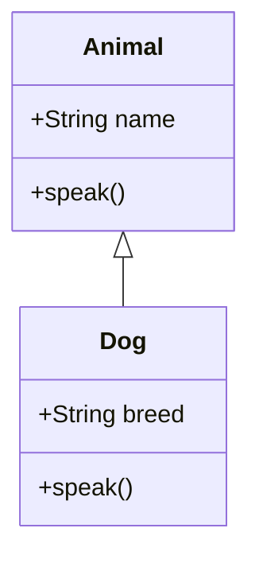

## 15.5 ES6 Classes as Syntactic Sugar

In the world of JavaScript, the introduction of ES6 (ECMAScript 2015) brought a plethora of new features that made the language more powerful and expressive. One of the most significant additions was the `class` syntax. While JavaScript has always been a prototype-based language, the `class` syntax provides a more familiar and straightforward way to create objects and handle inheritance, especially for those coming from class-based languages like Java or C++. However, it's crucial to understand that ES6 classes are essentially syntactic sugar over JavaScript's existing prototype-based inheritance model. Let's dive into how ES6 classes simplify constructor functions and explore class inheritance using `extends` and the `super` keyword.

### Understanding Constructor Functions

Before ES6, creating objects and handling inheritance in JavaScript was primarily done using constructor functions and prototypes. Let's start by reviewing how this worked:

```javascript
// Constructor function
function Animal(name, sound) {
    this.name = name;
    this.sound = sound;
}

// Adding a method to the prototype
Animal.prototype.makeSound = function() {
    console.log(`${this.name} says ${this.sound}`);
};

// Creating an instance
const dog = new Animal('Dog', 'Woof');
dog.makeSound(); // Output: Dog says Woof
```

In this example, we define a constructor function `Animal` to initialize properties `name` and `sound`. We then add a method `makeSound` to `Animal`'s prototype, allowing all instances to share this method.

### Introducing ES6 Classes

With ES6, JavaScript introduced a new way to define classes, making the syntax more intuitive and concise:

```javascript
// ES6 Class
class Animal {
    constructor(name, sound) {
        this.name = name;
        this.sound = sound;
    }

    makeSound() {
        console.log(`${this.name} says ${this.sound}`);
    }
}

// Creating an instance
const dog = new Animal('Dog', 'Woof');
dog.makeSound(); // Output: Dog says Woof
```

#### Key Features of ES6 Classes:

1. **Constructor Method**: The `constructor` method is a special method for creating and initializing an object created with a class. In the ES6 class, the `constructor` method replaces the need for a separate function to initialize properties.

2. **Method Definitions**: Methods are defined directly within the class body, making the code cleaner and more organized.

3. **No Commas**: Unlike object literals, method definitions in classes do not require commas between them.

### Converting Constructor Functions to Classes

Let's convert a more complex example from constructor functions to ES6 classes:

```javascript
// Constructor function
function Vehicle(type, wheels) {
    this.type = type;
    this.wheels = wheels;
}

Vehicle.prototype.describe = function() {
    console.log(`This is a ${this.type} with ${this.wheels} wheels.`);
};

// ES6 Class
class Vehicle {
    constructor(type, wheels) {
        this.type = type;
        this.wheels = wheels;
    }

    describe() {
        console.log(`This is a ${this.type} with ${this.wheels} wheels.`);
    }
}

const car = new Vehicle('Car', 4);
car.describe(); // Output: This is a Car with 4 wheels.
```

### Class Inheritance with `extends` and `super`

One of the powerful features of ES6 classes is the ability to easily create subclasses using the `extends` keyword. This allows a class to inherit properties and methods from another class.

#### Example of Class Inheritance:

```javascript
// Base class
class Animal {
    constructor(name) {
        this.name = name;
    }

    speak() {
        console.log(`${this.name} makes a noise.`);
    }
}

// Subclass
class Dog extends Animal {
    constructor(name, breed) {
        super(name); // Call the parent class constructor
        this.breed = breed;
    }

    speak() {
        console.log(`${this.name} barks.`);
    }
}

const dog = new Dog('Rex', 'German Shepherd');
dog.speak(); // Output: Rex barks.
```

#### Key Points:

- **`extends` Keyword**: Used to create a subclass that inherits from a parent class.
- **`super` Keyword**: Used to call the constructor of the parent class. This is necessary when you need to initialize properties defined in the parent class.

### Understanding Syntactic Sugar

The term "syntactic sugar" refers to syntax within a programming language that is designed to make things easier to read or express. It makes the language "sweeter" for human use. In the case of ES6 classes, they provide a more familiar and concise way to work with objects and inheritance, but under the hood, they still use JavaScript's prototype-based inheritance.

#### Visualizing Class and Prototype Relationship

To better understand how classes work as syntactic sugar, let's visualize the relationship between classes and prototypes:



In this diagram, `Dog` inherits from `Animal`, and both classes have their methods defined within them. However, under the hood, JavaScript still uses prototypes to manage inheritance.

### Try It Yourself

Now that we've covered the basics of ES6 classes and inheritance, try modifying the examples:

1. **Add More Methods**: Extend the `Animal` and `Dog` classes with additional methods, such as `eat` or `sleep`.
2. **Create More Subclasses**: Create a new subclass, `Cat`, that extends `Animal` and overrides the `speak` method.
3. **Experiment with `super`**: Use the `super` keyword to call methods from the parent class within the subclass.

### Further Reading

To deepen your understanding of ES6 classes and their role in JavaScript, consider exploring the following resources:

- [MDN Web Docs: Classes](https://developer.mozilla.org/en-US/docs/Web/JavaScript/Reference/Classes)
- [W3Schools: JavaScript Classes](https://www.w3schools.com/js/js_classes.asp)

### Knowledge Check

Before we wrap up, let's reinforce what we've learned:

- **What are ES6 classes?**: A syntactic enhancement over JavaScript's prototype-based inheritance, providing a more intuitive way to define objects and handle inheritance.
- **How do you create a subclass?**: Use the `extends` keyword to inherit from a parent class and the `super` keyword to call the parent class constructor.

### Conclusion

ES6 classes have transformed the way we write JavaScript, making it more accessible and easier to understand, especially for those familiar with class-based languages. Remember, while the syntax is more straightforward, the underlying mechanics of prototype-based inheritance remain unchanged. Embrace the journey of mastering JavaScript, and keep experimenting with classes to build more complex and interactive web applications. Stay curious and enjoy the process!

## Quiz Time!



### What is the primary purpose of ES6 classes in JavaScript?

- [x] To provide a more intuitive syntax for object creation and inheritance
- [ ] To replace JavaScript's prototype-based inheritance model
- [ ] To eliminate the need for functions in JavaScript
- [ ] To introduce new data types

> **Explanation:** ES6 classes provide a more intuitive syntax for defining objects and handling inheritance, but they do not replace the underlying prototype-based model.

### How do you define a constructor in an ES6 class?

- [x] Using the `constructor` method inside the class
- [ ] Using a separate function outside the class
- [ ] By defining a method named `init`
- [ ] By using the `initialize` keyword

> **Explanation:** The `constructor` method is a special method in ES6 classes used to initialize objects.

### Which keyword is used to create a subclass in ES6?

- [x] `extends`
- [ ] `inherits`
- [ ] `subclass`
- [ ] `derive`

> **Explanation:** The `extends` keyword is used to create a subclass that inherits from a parent class in ES6.

### What does the `super` keyword do in a subclass?

- [x] Calls the constructor of the parent class
- [ ] Defines a new method in the subclass
- [ ] Overrides a method in the parent class
- [ ] Initializes a new property

> **Explanation:** The `super` keyword is used to call the constructor of the parent class, allowing the subclass to inherit properties.

### True or False: ES6 classes eliminate the need for prototypes in JavaScript.

- [ ] True
- [x] False

> **Explanation:** False. ES6 classes are syntactic sugar over JavaScript's prototype-based inheritance and do not eliminate the need for prototypes.

### Which method is automatically called when a new instance of a class is created?

- [x] `constructor`
- [ ] `init`
- [ ] `setup`
- [ ] `initialize`

> **Explanation:** The `constructor` method is automatically called when a new instance of a class is created.

### How can you call a method from the parent class in a subclass?

- [x] Using the `super` keyword followed by the method name
- [ ] Directly using the method name
- [ ] Using the `parent` keyword
- [ ] By redefining the method in the subclass

> **Explanation:** You can call a method from the parent class in a subclass using the `super` keyword followed by the method name.

### What is the output of the following code?

```javascript
class Animal {
    constructor(name) {
        this.name = name;
    }
    speak() {
        console.log(`${this.name} makes a noise.`);
    }
}

class Dog extends Animal {
    speak() {
        console.log(`${this.name} barks.`);
    }
}

const dog = new Dog('Rex');
dog.speak();
```

- [x] Rex barks.
- [ ] Rex makes a noise.
- [ ] Error: speak is not defined
- [ ] Rex barks. Rex makes a noise.

> **Explanation:** The `speak` method in the `Dog` class overrides the `speak` method in the `Animal` class, so "Rex barks." is printed.

### Which of the following is true about ES6 classes?

- [x] They are syntactic sugar over prototypes.
- [ ] They replace the need for functions in JavaScript.
- [ ] They introduce new data types.
- [ ] They eliminate the need for inheritance.

> **Explanation:** ES6 classes are syntactic sugar over JavaScript's existing prototype-based inheritance model.

### What is the correct way to define a method in an ES6 class?

- [x] Directly within the class body without commas
- [ ] Inside the `constructor` method
- [ ] Using the `function` keyword
- [ ] Using the `method` keyword

> **Explanation:** Methods in ES6 classes are defined directly within the class body without using commas or the `function` keyword.


