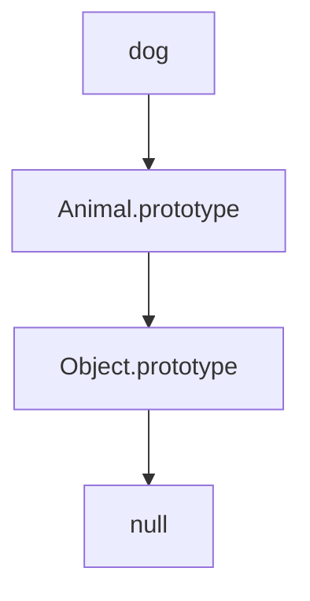

## 16.1 The Prototype Chain

Welcome to the exciting world of JavaScript prototypes! In this section, we will delve into the concept of prototypes and how they form prototype chains, a fundamental aspect of JavaScript's inheritance model. Understanding prototypes is crucial for mastering JavaScript, as they play a key role in how objects inherit properties and methods. Let's embark on this journey to demystify prototypes and the prototype chain.

### What are Prototypes?

In JavaScript, every object has a prototype, which is another object from which it inherits properties and methods. Think of a prototype as a blueprint or a template that provides default properties and behaviors for objects. When you create an object, it automatically links to a prototype, allowing it to share common functionality.

#### The Prototype Property

Every JavaScript function has a special property called `prototype`. This property is an object that is used to build the prototype chain. When you create an object using a constructor function, the object's prototype is set to the constructor's `prototype` property.

```javascript
function Animal(name) {
  this.name = name;
}

Animal.prototype.speak = function() {
  console.log(`${this.name} makes a noise.`);
};

const dog = new Animal('Dog');
dog.speak(); // Output: Dog makes a noise.
```

In the example above, the `Animal` function has a `prototype` property that includes the `speak` method. When we create a new `dog` object using the `Animal` constructor, the `dog` object inherits the `speak` method from `Animal.prototype`.

### The Prototype Chain

The prototype chain is a mechanism by which JavaScript objects inherit properties and methods from other objects. When you try to access a property or method on an object, JavaScript first looks for it on the object itself. If it doesn't find it, JavaScript then looks at the object's prototype. This process continues up the chain until the property is found or the end of the chain is reached.

#### Visualizing the Prototype Chain

Let's visualize the prototype chain with a simple diagram:



In this diagram, the `dog` object is linked to `Animal.prototype`, which is linked to `Object.prototype`, and finally to `null`. This chain represents the path JavaScript follows when looking for properties or methods.

### Property Lookup in the Prototype Chain

When you access a property or method on an object, JavaScript performs a property lookup. Here's how it works:

1. **Check the Object Itself**: JavaScript first checks if the property exists on the object itself.
2. **Traverse the Prototype Chain**: If the property is not found, JavaScript looks at the object's prototype.
3. **Continue Up the Chain**: This process continues up the prototype chain until the property is found or the end of the chain is reached.
4. **Return `undefined` if Not Found**: If the property is not found anywhere in the chain, JavaScript returns `undefined`.

#### Example of Property Lookup

Consider the following example:

```javascript
function Vehicle(type) {
  this.type = type;
}

Vehicle.prototype.move = function() {
  console.log(`${this.type} is moving.`);
};

const car = new Vehicle('Car');
car.move(); // Output: Car is moving.
console.log(car.toString()); // Output: [object Object]
```

In this example, when we call `car.move()`, JavaScript finds the `move` method on `Vehicle.prototype`. When we call `car.toString()`, JavaScript doesn't find `toString` on `car` or `Vehicle.prototype`, so it continues up the chain to `Object.prototype`, where it finds the `toString` method.

### Modifying Prototypes

You can modify an object's prototype to add new properties or methods. This is a powerful feature, but it should be used with caution, as it can lead to unexpected behavior if not managed properly.

#### Adding Methods to a Prototype

You can add methods to a prototype after an object has been created:

```javascript
Vehicle.prototype.stop = function() {
  console.log(`${this.type} has stopped.`);
};

car.stop(); // Output: Car has stopped.
```

In this example, we added a `stop` method to `Vehicle.prototype`, and now all `Vehicle` objects, including `car`, have access to this method.

### Prototype Inheritance

Prototypes enable inheritance in JavaScript, allowing objects to inherit properties and methods from other objects. This is a key feature that enables code reuse and the creation of complex hierarchies.

#### Creating a Subclass

You can create a subclass by setting the prototype of one constructor function to an instance of another constructor function:

```javascript
function Car(make, model) {
  Vehicle.call(this, 'Car');
  this.make = make;
  this.model = model;
}

Car.prototype = Object.create(Vehicle.prototype);
Car.prototype.constructor = Car;

Car.prototype.displayInfo = function() {
  console.log(`${this.make} ${this.model} is a ${this.type}.`);
};

const myCar = new Car('Toyota', 'Corolla');
myCar.move(); // Output: Car is moving.
myCar.displayInfo(); // Output: Toyota Corolla is a Car.
```

In this example, `Car` is a subclass of `Vehicle`. We use `Object.create` to set `Car.prototype` to a new object that inherits from `Vehicle.prototype`. This allows `Car` objects to inherit methods from `Vehicle`.

### Understanding `Object.prototype`

At the top of every prototype chain is `Object.prototype`. This is the root of all objects in JavaScript, providing common methods like `toString`, `valueOf`, and `hasOwnProperty`.

#### Example of `Object.prototype`

```javascript
console.log(Object.prototype.toString.call(myCar)); // Output: [object Object]
```

In this example, we use `Object.prototype.toString` to get a string representation of `myCar`. This method is available to all objects because they inherit from `Object.prototype`.

### The Role of `null` in the Prototype Chain

The end of every prototype chain is `null`. This signifies the absence of a prototype and indicates that JavaScript has reached the end of the chain during a property lookup.

#### Example of Reaching `null`

```javascript
console.log(Object.getPrototypeOf(Object.prototype)); // Output: null
```

In this example, we use `Object.getPrototypeOf` to find the prototype of `Object.prototype`, which is `null`.

### Try It Yourself

Now that we've covered the basics of prototypes and the prototype chain, it's time to experiment! Try modifying the code examples to see how changes affect the prototype chain. Here are some suggestions:

- Add new methods to `Vehicle.prototype` and see how they affect `Car` objects.
- Create a new subclass of `Vehicle` and explore how it inherits properties and methods.
- Experiment with property lookups to see how JavaScript traverses the prototype chain.

### Key Takeaways

- **Prototypes** are objects from which other objects inherit properties and methods.
- **Prototype chains** allow JavaScript to perform inheritance by linking objects together.
- **Property lookups** traverse the prototype chain until the property is found or the end of the chain is reached.
- **Modifying prototypes** can add new functionality to all objects that inherit from the prototype.
- **Inheritance** in JavaScript is achieved through prototypes, enabling code reuse and complex hierarchies.

### Further Reading

For more information on prototypes and inheritance in JavaScript, check out the following resources:

- [MDN Web Docs: Inheritance and the prototype chain](https://developer.mozilla.org/en-US/docs/Web/JavaScript/Inheritance_and_the_prototype_chain)
- [JavaScript.info: Prototypes, inheritance](https://javascript.info/prototype-inheritance)
- [W3Schools: JavaScript Prototypes](https://www.w3schools.com/js/js_object_prototypes.asp)

Remember, this is just the beginning. As you progress, you'll build more complex and interactive web pages. Keep experimenting, stay curious, and enjoy the journey!

## Quiz Time!



### What is a prototype in JavaScript?

- [x] An object from which other objects inherit properties and methods.
- [ ] A function that creates new objects.
- [ ] A variable that stores object data.
- [ ] A method that manipulates object properties.

> **Explanation:** A prototype is an object from which other objects inherit properties and methods, forming the basis of JavaScript's inheritance model.

### How does JavaScript perform a property lookup?

- [x] By checking the object itself and then traversing the prototype chain.
- [ ] By only checking the object itself.
- [ ] By checking all objects in memory.
- [ ] By using a predefined list of properties.

> **Explanation:** JavaScript first checks the object itself for the property and then traverses the prototype chain if the property is not found.

### What is the role of `Object.prototype` in the prototype chain?

- [x] It is the root of all objects, providing common methods like `toString`.
- [ ] It is the end of the prototype chain.
- [ ] It is a special method for creating objects.
- [ ] It is used to delete object properties.

> **Explanation:** `Object.prototype` is the root of all objects in JavaScript, providing common methods that all objects inherit.

### What happens when a property is not found in the prototype chain?

- [x] JavaScript returns `undefined`.
- [ ] JavaScript throws an error.
- [ ] JavaScript creates the property automatically.
- [ ] JavaScript stops execution.

> **Explanation:** If a property is not found anywhere in the prototype chain, JavaScript returns `undefined`.

### How can you add a new method to a prototype?

- [x] By assigning a function to the prototype property of a constructor.
- [ ] By creating a new object with the method.
- [ ] By using the `new` keyword.
- [ ] By modifying the `Object.prototype`.

> **Explanation:** You can add a new method to a prototype by assigning a function to the prototype property of a constructor function.

### What is the end of every prototype chain?

- [x] `null`
- [ ] `undefined`
- [ ] `Object.prototype`
- [ ] The constructor function

> **Explanation:** The end of every prototype chain is `null`, indicating the absence of a prototype.

### How do you create a subclass in JavaScript?

- [x] By setting the prototype of one constructor function to an instance of another constructor function.
- [ ] By using the `extends` keyword.
- [ ] By copying properties from one object to another.
- [ ] By using the `super` keyword.

> **Explanation:** You create a subclass by setting the prototype of one constructor function to an instance of another constructor function, allowing inheritance.

### What does `Object.create` do?

- [x] It creates a new object with a specified prototype.
- [ ] It deletes an object.
- [ ] It modifies an existing object's properties.
- [ ] It creates a new function.

> **Explanation:** `Object.create` creates a new object with a specified prototype, enabling inheritance.

### Why should you be cautious when modifying prototypes?

- [x] It can lead to unexpected behavior if not managed properly.
- [ ] It is not allowed in JavaScript.
- [ ] It will delete existing properties.
- [ ] It is a deprecated feature.

> **Explanation:** Modifying prototypes can lead to unexpected behavior if not managed properly, as it affects all objects that inherit from the prototype.

### True or False: All objects in JavaScript inherit from `Object.prototype`.

- [x] True
- [ ] False

> **Explanation:** True. All objects in JavaScript inherit from `Object.prototype`, which is the root of all objects.




