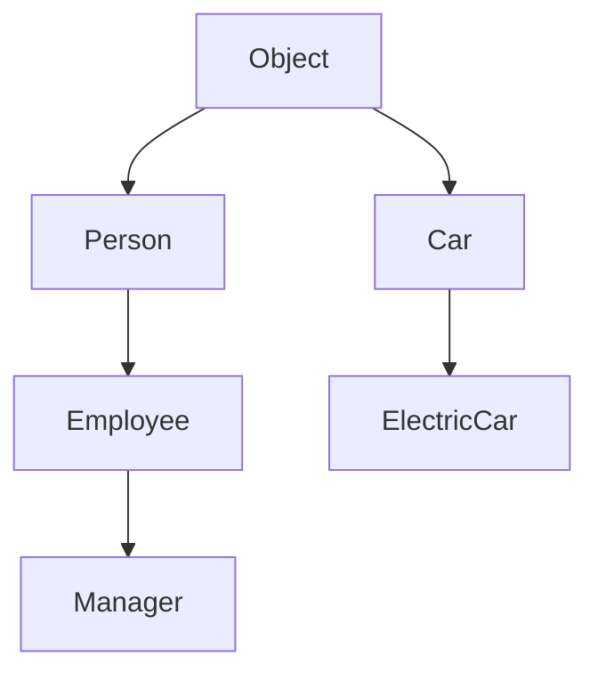

## 16.2 Accessing and Modifying Prototypes

In JavaScript, understanding prototypes is crucial for mastering object-oriented programming. Prototypes allow objects to inherit properties and methods from other objects, forming the backbone of JavaScript's inheritance model. In this section, we'll explore how to access and modify prototypes, the methods involved, and the potential implications of these actions.

### Understanding Prototypes

Before diving into accessing and modifying prototypes, let's briefly revisit what prototypes are. In JavaScript, every object has a prototype, which is another object from which it inherits properties and methods. This prototype chain continues until it reaches an object with a null prototype, typically `Object.prototype`.

### Accessing Prototypes

To work with prototypes, we first need to know how to access them. JavaScript provides several ways to access an object's prototype:

#### Using `Object.getPrototypeOf`

The `Object.getPrototypeOf` method is the standard way to retrieve the prototype of an object. It is a part of ECMAScript 5 and is widely supported across modern browsers.

```javascript
// Create an object
const person = {
  name: "Alice",
  greet() {
    console.log("Hello, " + this.name);
  }
};

// Access the prototype of the person object
const proto = Object.getPrototypeOf(person);
console.log(proto); // Outputs: {}
```

In this example, `Object.getPrototypeOf(person)` returns the prototype of the `person` object, which is `Object.prototype` by default.

#### Using the `__proto__` Property

The `__proto__` property is another way to access an object's prototype. However, it's considered deprecated and should be avoided in favor of `Object.getPrototypeOf`.

```javascript
// Access the prototype using __proto__
console.log(person.__proto__); // Outputs: {}
```

While `__proto__` is still widely used in practice, it's better to rely on `Object.getPrototypeOf` for accessing prototypes to ensure compatibility and adhere to best practices.

### Modifying Prototypes

Modifying an object's prototype can change its behavior and the behavior of all objects that inherit from it. This can be powerful but also risky if not done carefully.

#### Using `Object.setPrototypeOf`

The `Object.setPrototypeOf` method allows you to set the prototype of an object. This method is part of ECMAScript 6 and is the recommended way to change an object's prototype.

```javascript
// Create a new prototype object
const newProto = {
  farewell() {
    console.log("Goodbye, " + this.name);
  }
};

// Set the new prototype for the person object
Object.setPrototypeOf(person, newProto);

// Now person has access to the farewell method
person.farewell(); // Outputs: Goodbye, Alice
```

In this example, we create a new prototype object `newProto` with a `farewell` method and set it as the prototype of `person`. Now, `person` can access the `farewell` method.

#### Using the `__proto__` Property

Similar to accessing prototypes, you can also modify an object's prototype using the `__proto__` property. However, this approach is discouraged due to its deprecated status.

```javascript
// Set the new prototype using __proto__
person.__proto__ = newProto;

// Access the farewell method
person.farewell(); // Outputs: Goodbye, Alice
```

### Implications of Modifying Prototypes

While modifying prototypes can be useful, it comes with several implications and potential issues:

#### Performance Concerns

Changing an object's prototype can negatively impact performance. JavaScript engines optimize objects based on their initial structure, and altering the prototype can force the engine to de-optimize and re-evaluate the object's structure.

#### Inheritance Chain

Modifying prototypes affects the entire inheritance chain. If you change the prototype of an object, all objects inheriting from it will also be affected, which can lead to unexpected behavior if not managed carefully.

#### Compatibility Issues

Using deprecated methods like `__proto__` can lead to compatibility issues across different environments. It's best to stick with standardized methods like `Object.getPrototypeOf` and `Object.setPrototypeOf`.

### Practical Examples

Let's explore some practical examples to solidify our understanding of accessing and modifying prototypes.

#### Example 1: Extending Functionality

Suppose we have a basic `Car` object, and we want to extend its functionality by adding a new method.

```javascript
// Define a Car object
const car = {
  make: "Toyota",
  model: "Camry",
  start() {
    console.log("Starting the car...");
  }
};

// Create a new prototype with additional functionality
const carProto = {
  drive() {
    console.log("Driving the car...");
  }
};

// Set the new prototype for the car object
Object.setPrototypeOf(car, carProto);

// Now car can use the drive method
car.drive(); // Outputs: Driving the car...
```

In this example, we extend the `Car` object by adding a `drive` method through a new prototype.

#### Example 2: Dynamic Prototype Modification

Consider a scenario where we want to dynamically change an object's behavior based on certain conditions.

```javascript
// Define a User object
const user = {
  name: "Bob",
  role: "guest"
};

// Define different prototypes for different roles
const guestProto = {
  accessLevel: "limited"
};

const adminProto = {
  accessLevel: "full",
  manageUsers() {
    console.log("Managing users...");
  }
};

// Dynamically change the prototype based on role
if (user.role === "admin") {
  Object.setPrototypeOf(user, adminProto);
} else {
  Object.setPrototypeOf(user, guestProto);
}

// Check the access level
console.log(user.accessLevel); // Outputs: limited

// Attempt to use admin functionality
if (user.manageUsers) {
  user.manageUsers(); // This won't execute for a guest
}
```

In this example, we dynamically change the prototype of a `User` object based on their role, allowing for flexible behavior modifications.

### Visualizing Prototype Chains

To better understand how prototypes work, let's visualize a prototype chain using a diagram.



**Diagram Description:** This diagram illustrates a prototype chain where `Person` inherits from `Object`, `Employee` inherits from `Person`, and `Manager` inherits from `Employee`. Similarly, `Car` inherits from `Object`, and `ElectricCar` inherits from `Car`.

### Try It Yourself

To deepen your understanding, try modifying the code examples provided:

- Add new methods to the prototypes and observe how they affect the objects.
- Experiment with different conditions for dynamic prototype modification.
- Create your own objects and prototype chains to explore inheritance.

### References and Further Reading

For more information on prototypes and inheritance in JavaScript, consider the following resources:

- [MDN Web Docs: Prototypes](https://developer.mozilla.org/en-US/docs/Web/JavaScript/Inheritance_and_the_prototype_chain)
- [W3Schools: JavaScript Prototypes](https://www.w3schools.com/js/js_object_prototypes.asp)

### Knowledge Check

Let's summarize the key takeaways from this section:

- Prototypes allow objects to inherit properties and methods from other objects.
- Use `Object.getPrototypeOf` to access an object's prototype.
- Use `Object.setPrototypeOf` to modify an object's prototype.
- Be cautious when modifying prototypes due to potential performance and compatibility issues.

### Embrace the Journey

Remember, mastering prototypes is a significant step in your JavaScript journey. As you progress, you'll gain a deeper understanding of how objects and inheritance work. Keep experimenting, stay curious, and enjoy the journey!

## Quiz Time!



### What is the standard method to access an object's prototype in JavaScript?

- [x] `Object.getPrototypeOf`
- [ ] `Object.prototype`
- [ ] `Object.setPrototypeOf`
- [ ] `__proto__`

> **Explanation:** `Object.getPrototypeOf` is the standard method to access an object's prototype in JavaScript.

### Which method is recommended for setting an object's prototype?

- [x] `Object.setPrototypeOf`
- [ ] `__proto__`
- [ ] `Object.getPrototypeOf`
- [ ] `Object.prototype`

> **Explanation:** `Object.setPrototypeOf` is the recommended method for setting an object's prototype.

### What is a potential issue when modifying an object's prototype?

- [x] Performance degradation
- [ ] Increased security
- [ ] Improved readability
- [ ] Enhanced compatibility

> **Explanation:** Modifying an object's prototype can lead to performance degradation due to de-optimization by JavaScript engines.

### What is the deprecated property for accessing an object's prototype?

- [x] `__proto__`
- [ ] `Object.setPrototypeOf`
- [ ] `Object.getPrototypeOf`
- [ ] `Object.prototype`

> **Explanation:** The `__proto__` property is deprecated for accessing an object's prototype.

### How does modifying a prototype affect the inheritance chain?

- [x] It affects all objects inheriting from it.
- [ ] It only affects the modified object.
- [ ] It enhances performance.
- [ ] It has no effect on other objects.

> **Explanation:** Modifying a prototype affects all objects inheriting from it, potentially leading to unexpected behavior.

### What is the default prototype of a newly created object?

- [x] `Object.prototype`
- [ ] `null`
- [ ] `Array.prototype`
- [ ] `Function.prototype`

> **Explanation:** The default prototype of a newly created object is `Object.prototype`.

### Which method should be avoided due to compatibility issues?

- [x] `__proto__`
- [ ] `Object.setPrototypeOf`
- [ ] `Object.getPrototypeOf`
- [ ] `Object.prototype`

> **Explanation:** The `__proto__` method should be avoided due to compatibility issues.

### What does the `Object.setPrototypeOf` method do?

- [x] Sets the prototype of an object
- [ ] Retrieves the prototype of an object
- [ ] Deletes the prototype of an object
- [ ] Copies the prototype of an object

> **Explanation:** The `Object.setPrototypeOf` method sets the prototype of an object.

### True or False: Modifying an object's prototype can lead to unexpected behavior.

- [x] True
- [ ] False

> **Explanation:** Modifying an object's prototype can indeed lead to unexpected behavior, especially if not managed carefully.

### What is the purpose of a prototype chain?

- [x] To allow objects to inherit properties and methods
- [ ] To enhance security
- [ ] To improve performance
- [ ] To simplify syntax

> **Explanation:** The purpose of a prototype chain is to allow objects to inherit properties and methods from other objects.


