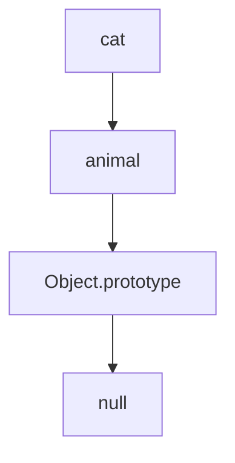
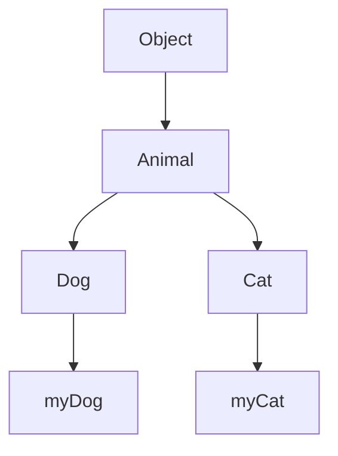

## 16.3 Inheriting Properties and Methods

In JavaScript, inheritance is a powerful concept that allows objects to share properties and methods. This is achieved through a mechanism known as prototypal inheritance. In this section, we will explore how objects can inherit properties and methods from their prototypes, provide examples of prototypal inheritance, and discuss best practices for setting up inheritance.

### Understanding Prototypal Inheritance

JavaScript is a prototype-based language, which means that inheritance is achieved through prototypes rather than classical classes. Every object in JavaScript has a prototype, which is another object from which it can inherit properties and methods. This prototype chain allows for the delegation of property and method access from one object to another.

#### What is a Prototype?

A prototype is an object from which other objects inherit properties and methods. When you create a new object, it automatically gets a prototype. This prototype can be accessed using the `__proto__` property, although it is recommended to use `Object.getPrototypeOf()` for accessing an object's prototype.

```javascript
// Creating an object with a prototype
const animal = {
  type: 'mammal',
  sound: function() {
    console.log('Some generic sound');
  }
};

// Creating a new object that inherits from animal
const dog = Object.create(animal);
dog.bark = function() {
  console.log('Woof! Woof!');
};

console.log(dog.type); // Output: mammal
dog.sound(); // Output: Some generic sound
dog.bark(); // Output: Woof! Woof!
```

In this example, `dog` is an object that inherits from `animal`. It can access the `type` property and `sound` method from its prototype, `animal`, and also has its own method, `bark`.

### How Inheritance Works in JavaScript

When you try to access a property or method on an object, JavaScript first checks if the property or method exists on the object itself. If it doesn't, JavaScript looks up the prototype chain to find it. This chain continues until it reaches the end, which is `null`.

#### The Prototype Chain

The prototype chain is a series of links between objects. Each object has a prototype, and this chain of prototypes forms the basis of inheritance in JavaScript.

```javascript
// Visualizing the prototype chain
const cat = Object.create(animal);
cat.meow = function() {
  console.log('Meow!');
};

console.log(cat.type); // Output: mammal
cat.sound(); // Output: Some generic sound
cat.meow(); // Output: Meow!
```

In the above example, `cat` inherits from `animal`, and the prototype chain allows `cat` to access properties and methods defined on `animal`.



**Caption:** *The prototype chain for the `cat` object, showing inheritance from `animal` and ultimately from `Object.prototype`.*

### Setting Up Inheritance

To set up inheritance in JavaScript, you can use the `Object.create()` method, which creates a new object with the specified prototype.

#### Using `Object.create()`

`Object.create()` is a powerful method that allows you to create a new object with a specified prototype. This method is preferred for setting up inheritance because it provides a clear and concise way to establish the prototype chain.

```javascript
// Using Object.create() to set up inheritance
const bird = {
  fly: function() {
    console.log('Flying high!');
  }
};

const eagle = Object.create(bird);
eagle.hunt = function() {
  console.log('Hunting for prey');
};

eagle.fly(); // Output: Flying high!
eagle.hunt(); // Output: Hunting for prey
```

In this example, `eagle` inherits from `bird`, allowing it to use the `fly` method defined on `bird`.

#### Constructor Functions

Another way to set up inheritance is by using constructor functions. Constructor functions are functions that create objects and set up their prototypes.

```javascript
// Constructor function for creating animals
function Animal(type) {
  this.type = type;
}

Animal.prototype.sound = function() {
  console.log('Some generic sound');
};

// Creating a new object using the constructor function
const lion = new Animal('mammal');
lion.sound(); // Output: Some generic sound
```

In this example, `Animal` is a constructor function that creates objects with a `type` property and a `sound` method. The `sound` method is added to `Animal.prototype`, allowing all instances of `Animal` to inherit it.

#### ES6 Classes

With the introduction of ES6, JavaScript introduced the `class` syntax, which provides a more familiar way to set up inheritance. However, under the hood, it still uses prototypes.

```javascript
// Using ES6 classes to set up inheritance
class Vehicle {
  constructor(type) {
    this.type = type;
  }

  drive() {
    console.log('Driving...');
  }
}

class Car extends Vehicle {
  honk() {
    console.log('Beep! Beep!');
  }
}

const myCar = new Car('sedan');
myCar.drive(); // Output: Driving...
myCar.honk(); // Output: Beep! Beep!
```

In this example, `Car` is a class that extends `Vehicle`, inheriting the `drive` method and adding its own `honk` method.

### Best Practices for Inheritance

When setting up inheritance in JavaScript, it's important to follow best practices to ensure that your code is maintainable and efficient.

#### Use `Object.create()` for Simple Inheritance

For simple inheritance scenarios, use `Object.create()` as it provides a clear and straightforward way to set up the prototype chain.

#### Prefer ES6 Classes for Complex Inheritance

For more complex inheritance scenarios, prefer using ES6 classes. The `class` syntax is more intuitive and provides a clearer structure for defining and extending classes.

#### Avoid Modifying Built-in Prototypes

Avoid modifying built-in prototypes like `Array.prototype` or `Object.prototype`. Doing so can lead to unexpected behavior and conflicts with other code.

#### Use `hasOwnProperty()` to Check for Inherited Properties

When iterating over an object's properties, use `hasOwnProperty()` to check if a property is an own property or inherited from the prototype.

```javascript
const obj = { a: 1, b: 2 };

for (let key in obj) {
  if (obj.hasOwnProperty(key)) {
    console.log(key, obj[key]);
  }
}
```

This ensures that you only access properties that belong to the object itself, not those inherited from the prototype.

### Try It Yourself

Let's put your knowledge to the test! Try modifying the code examples provided to create your own objects and inheritance structures. Experiment with different prototypes and methods to see how inheritance works in practice.

### Visualizing Prototypal Inheritance

To better understand how prototypal inheritance works, let's visualize the process using a diagram.



**Caption:** *A diagram showing the prototypal inheritance chain from `Object` to `Animal`, and then to `Dog` and `Cat`, with instances `myDog` and `myCat`.*

### Further Reading

For more information on prototypal inheritance in JavaScript, check out the following resources:

- [MDN Web Docs: Inheritance and the prototype chain](https://developer.mozilla.org/en-US/docs/Web/JavaScript/Inheritance_and_the_prototype_chain)
- [JavaScript.info: Prototypal inheritance](https://javascript.info/prototype-inheritance)
- [W3Schools: JavaScript Prototypes](https://www.w3schools.com/js/js_object_prototypes.asp)

### Knowledge Check

Let's review what we've learned about inheriting properties and methods in JavaScript.

- **What is a prototype?** A prototype is an object from which other objects inherit properties and methods.
- **How does the prototype chain work?** The prototype chain is a series of links between objects that allows for the delegation of property and method access.
- **What is the `Object.create()` method used for?** `Object.create()` is used to create a new object with a specified prototype.
- **What are ES6 classes?** ES6 classes provide a more familiar syntax for setting up inheritance in JavaScript, although they still use prototypes under the hood.

### Embrace the Journey

Remember, this is just the beginning of your journey into JavaScript inheritance. As you progress, you'll build more complex and interactive applications. Keep experimenting, stay curious, and enjoy the journey!

## Quiz Time!



### What is a prototype in JavaScript?

- [x] An object from which other objects inherit properties and methods.
- [ ] A function that creates new objects.
- [ ] A built-in JavaScript method.
- [ ] A type of variable in JavaScript.

> **Explanation:** A prototype is an object from which other objects inherit properties and methods, forming the basis of prototypal inheritance in JavaScript.

### How do you create a new object with a specified prototype?

- [x] Using the `Object.create()` method.
- [ ] By modifying the `__proto__` property directly.
- [ ] Using the `new` keyword.
- [ ] By assigning a new object to the prototype property.

> **Explanation:** The `Object.create()` method is used to create a new object with a specified prototype, providing a clear and concise way to establish inheritance.

### What is the purpose of the `hasOwnProperty()` method?

- [x] To check if a property is an own property of an object.
- [ ] To add a new property to an object.
- [ ] To delete a property from an object.
- [ ] To modify a property's value.

> **Explanation:** The `hasOwnProperty()` method checks if a property is an own property of an object, not inherited from the prototype.

### Which of the following is a best practice when setting up inheritance?

- [x] Avoid modifying built-in prototypes.
- [ ] Always use the `__proto__` property.
- [ ] Modify the `Object.prototype` for custom methods.
- [ ] Use global variables for inheritance.

> **Explanation:** Modifying built-in prototypes can lead to unexpected behavior and conflicts, so it's best to avoid it.

### What is the prototype chain?

- [x] A series of links between objects that allows for property and method delegation.
- [ ] A method for creating new objects.
- [ ] A type of loop in JavaScript.
- [ ] A function that modifies object properties.

> **Explanation:** The prototype chain is a series of links between objects that allows for the delegation of property and method access from one object to another.

### What is the `class` syntax in JavaScript?

- [x] A syntax introduced in ES6 that provides a more familiar way to set up inheritance.
- [ ] A method for creating new functions.
- [ ] A type of variable in JavaScript.
- [ ] A built-in JavaScript object.

> **Explanation:** The `class` syntax, introduced in ES6, provides a more familiar way to set up inheritance, although it still uses prototypes under the hood.

### How can you check if a property is inherited or an own property?

- [x] Using the `hasOwnProperty()` method.
- [ ] By checking the `__proto__` property.
- [ ] By using the `Object.create()` method.
- [ ] By modifying the prototype chain.

> **Explanation:** The `hasOwnProperty()` method is used to check if a property is an own property of an object, not inherited from the prototype.

### What is the benefit of using `Object.create()` for inheritance?

- [x] It provides a clear and concise way to establish the prototype chain.
- [ ] It modifies the built-in prototypes.
- [ ] It creates global variables for inheritance.
- [ ] It uses the `__proto__` property directly.

> **Explanation:** `Object.create()` provides a clear and concise way to establish the prototype chain, making it a preferred method for setting up inheritance.

### Why should you avoid modifying built-in prototypes?

- [x] It can lead to unexpected behavior and conflicts with other code.
- [ ] It is a recommended practice for setting up inheritance.
- [ ] It enhances the performance of JavaScript applications.
- [ ] It simplifies the inheritance process.

> **Explanation:** Modifying built-in prototypes can lead to unexpected behavior and conflicts with other code, so it's best to avoid it.

### True or False: ES6 classes do not use prototypes for inheritance.

- [ ] True
- [x] False

> **Explanation:** False. ES6 classes provide a more familiar syntax for setting up inheritance, but they still use prototypes under the hood.




