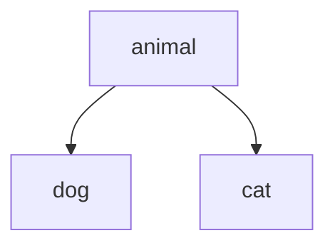

## 16.4 `Object.create` Method

In this section, we will explore the `Object.create` method in JavaScript, a powerful tool for creating objects with specified prototypes. Understanding how to use `Object.create` effectively can enhance your ability to work with objects and inheritance in JavaScript. We will discuss what `Object.create` is, how it works, and why it can be a preferable choice over constructor functions.

### What is `Object.create`?

The `Object.create` method is a built-in JavaScript function that allows you to create a new object, using an existing object as the prototype for the newly created object. This method provides a way to establish inheritance between objects without the need for constructor functions.

#### How `Object.create` Works

When you use `Object.create`, you specify an object that will serve as the prototype for the new object. This means that the new object will inherit properties and methods from the prototype object. The syntax for `Object.create` is as follows:

```javascript
let newObject = Object.create(proto, [propertiesObject])
```

- `proto`: The object that should be the prototype of the newly created object.
- `propertiesObject` (optional): An object whose properties define the new object's properties.

### Creating Objects with Specific Prototypes

Let's look at some examples to understand how `Object.create` can be used to create objects with specific prototypes.

#### Example 1: Basic Usage of `Object.create`

Suppose we have an object `animal` that represents a generic animal with a method `speak`.

```javascript
const animal = {
    speak: function() {
        console.log("The animal makes a sound.");
    }
};

// Create a new object with animal as its prototype
const dog = Object.create(animal);

// Use the inherited method
dog.speak(); // Output: The animal makes a sound.
```

In this example, `dog` is created with `animal` as its prototype. As a result, `dog` inherits the `speak` method from `animal`.

#### Example 2: Adding Properties to the New Object

You can also add properties to the new object at the time of creation by passing a second argument to `Object.create`.

```javascript
const cat = Object.create(animal, {
    name: {
        value: 'Whiskers',
        writable: true,
        enumerable: true,
        configurable: true
    },
    speak: {
        value: function() {
            console.log("Meow!");
        }
    }
});

console.log(cat.name); // Output: Whiskers
cat.speak(); // Output: Meow!
```

In this example, `cat` is created with `animal` as its prototype, but it also has its own `name` property and a `speak` method that overrides the inherited one.

### Advantages of Using `Object.create`

Using `Object.create` offers several advantages over traditional constructor functions:

1. **Simpler Syntax**: `Object.create` provides a straightforward way to create objects with a specific prototype without the need for defining constructor functions.

2. **More Control Over Inheritance**: You can easily set up inheritance chains and override properties or methods as needed.

3. **Avoids Constructor Pitfalls**: By not relying on constructor functions, you avoid issues related to `this` binding and the need to use the `new` keyword.

4. **Flexible Object Creation**: You can create objects with complex inheritance structures by chaining `Object.create` calls.

### Visualizing Prototype Chains

To better understand how `Object.create` works, let's visualize the prototype chain created using this method.



In this diagram, `animal` is the prototype for both `dog` and `cat`. Each object can access the properties and methods defined in `animal`, unless they are overridden.

### Practical Use Cases

#### Use Case 1: Creating a Hierarchy of Objects

Imagine you are building a simple game with different types of characters. You can use `Object.create` to establish a hierarchy of character types.

```javascript
const character = {
    health: 100,
    attack: function() {
        console.log("The character attacks!");
    }
};

const warrior = Object.create(character, {
    weapon: {
        value: 'sword',
        writable: true,
        enumerable: true,
        configurable: true
    },
    attack: {
        value: function() {
            console.log("The warrior swings their sword!");
        }
    }
});

const mage = Object.create(character, {
    spell: {
        value: 'fireball',
        writable: true,
        enumerable: true,
        configurable: true
    },
    attack: {
        value: function() {
            console.log("The mage casts a fireball!");
        }
    }
});

warrior.attack(); // Output: The warrior swings their sword!
mage.attack(); // Output: The mage casts a fireball!
```

In this example, `warrior` and `mage` are created with `character` as their prototype, allowing them to share common properties and methods while also having their own unique features.

#### Use Case 2: Creating Immutable Objects

`Object.create` can be used to create immutable objects by setting properties as non-writable and non-configurable.

```javascript
const immutableObject = Object.create(null, {
    constantValue: {
        value: 42,
        writable: false,
        enumerable: true,
        configurable: false
    }
});

console.log(immutableObject.constantValue); // Output: 42
immutableObject.constantValue = 100; // This will not change the value
console.log(immutableObject.constantValue); // Output: 42
```

In this example, `immutableObject` has a property `constantValue` that cannot be changed, demonstrating how `Object.create` can be used to enforce immutability.

### Try It Yourself

Experiment with the following code examples to deepen your understanding of `Object.create`. Try modifying the prototypes and adding new properties or methods.

```javascript
// Define a base object
const vehicle = {
    type: 'vehicle',
    start: function() {
        console.log("The vehicle starts.");
    }
};

// Create a car object with vehicle as its prototype
const car = Object.create(vehicle, {
    wheels: {
        value: 4,
        writable: true,
        enumerable: true,
        configurable: true
    },
    start: {
        value: function() {
            console.log("The car starts with a roar!");
        }
    }
});

console.log(car.type); // Output: vehicle
console.log(car.wheels); // Output: 4
car.start(); // Output: The car starts with a roar!
```

### Knowledge Check

Before moving on, consider the following questions to test your understanding:

- What is the purpose of the `Object.create` method?
- How does `Object.create` differ from using constructor functions?
- What are some advantages of using `Object.create`?
- How can you override properties or methods in objects created with `Object.create`?

### Further Reading

For more information on `Object.create` and prototypes in JavaScript, consider visiting the following resources:

- [MDN Web Docs: Object.create](https://developer.mozilla.org/en-US/docs/Web/JavaScript/Reference/Global_Objects/Object/create)
- [JavaScript.info: Prototypal Inheritance](https://javascript.info/prototype-inheritance)

### Embrace the Journey

Remember, mastering JavaScript's object model is a journey. As you continue to explore and experiment with `Object.create`, you'll gain a deeper understanding of how inheritance works in JavaScript. Keep practicing, stay curious, and enjoy the process of learning!

## Quiz Time!



### What is the primary purpose of the `Object.create` method?

- [x] To create a new object with a specified prototype
- [ ] To define a new constructor function
- [ ] To modify an existing object's prototype
- [ ] To delete properties from an object

> **Explanation:** The `Object.create` method is used to create a new object with a specified prototype, allowing for inheritance of properties and methods.

### Which of the following is an advantage of using `Object.create` over constructor functions?

- [x] Simpler syntax for creating objects with prototypes
- [ ] Requires the use of the `new` keyword
- [ ] Automatically binds `this` to the new object
- [ ] Prevents the creation of prototype chains

> **Explanation:** `Object.create` offers a simpler syntax for creating objects with specific prototypes, without the need for constructor functions or the `new` keyword.

### How can you add properties to an object created with `Object.create`?

- [x] By passing a second argument with property descriptors
- [ ] By using the `new` keyword
- [ ] By modifying the prototype directly
- [ ] By using the `delete` operator

> **Explanation:** You can add properties to an object created with `Object.create` by passing a second argument that contains property descriptors.

### What happens if you try to modify a non-writable property in an object created with `Object.create`?

- [x] The property value remains unchanged
- [ ] The property value changes
- [ ] An error is thrown
- [ ] The object is deleted

> **Explanation:** If a property is defined as non-writable, attempting to modify it will not change its value.

### Can `Object.create` be used to create immutable objects?

- [x] Yes, by setting properties as non-writable and non-configurable
- [ ] No, `Object.create` cannot create immutable objects
- [ ] Yes, but only for primitive values
- [ ] No, immutability is not related to `Object.create`

> **Explanation:** `Object.create` can be used to create immutable objects by setting properties as non-writable and non-configurable.

### What is the output of the following code?

```javascript
const base = { greet: function() { return "Hello"; } };
const derived = Object.create(base);
console.log(derived.greet());
```

- [x] "Hello"
- [ ] undefined
- [ ] An error is thrown
- [ ] "greet"

> **Explanation:** The `derived` object inherits the `greet` method from the `base` object, so calling `derived.greet()` returns "Hello".

### Which method allows you to create a new object with a specified prototype?

- [x] `Object.create`
- [ ] `Object.assign`
- [ ] `Object.defineProperty`
- [ ] `Object.freeze`

> **Explanation:** `Object.create` is the method used to create a new object with a specified prototype.

### What is the role of the second argument in `Object.create`?

- [x] To define properties for the new object
- [ ] To specify the prototype chain
- [ ] To bind methods to the new object
- [ ] To delete properties from the prototype

> **Explanation:** The second argument in `Object.create` is used to define properties for the new object using property descriptors.

### How does `Object.create` handle prototype chains?

- [x] It allows the creation of prototype chains by specifying a prototype object
- [ ] It prevents the creation of prototype chains
- [ ] It automatically creates a prototype chain with the global object
- [ ] It removes existing prototype chains

> **Explanation:** `Object.create` allows the creation of prototype chains by specifying a prototype object for the new object.

### True or False: `Object.create` can be used to override inherited properties.

- [x] True
- [ ] False

> **Explanation:** `Object.create` can be used to override inherited properties by defining new properties or methods in the new object.


