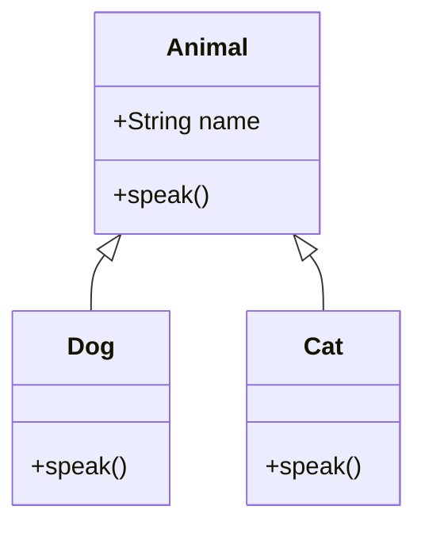

## 16.5 ES6 Class Inheritance

Welcome to the world of ES6 class inheritance in JavaScript! In this section, we will delve into the concept of inheritance, a cornerstone of object-oriented programming (OOP). We'll explore how ES6 classes allow us to create subclasses using the `extends` keyword and how the `super` keyword facilitates interaction between parent and child classes. By the end of this chapter, you'll have a solid understanding of how to leverage inheritance to create more organized and reusable code.

### Understanding Inheritance in JavaScript

Inheritance is a fundamental concept in object-oriented programming that allows one class to inherit properties and methods from another. This enables code reuse and a hierarchical class structure, where more specific classes (subclasses) extend more general ones (superclasses).

#### Why Use Inheritance?

- **Code Reusability**: Inheritance allows you to reuse existing code, reducing duplication and improving maintainability.
- **Logical Hierarchy**: It helps in organizing code into a logical hierarchy, making it easier to understand and manage.
- **Extensibility**: You can extend existing classes to add new features or modify behavior without altering the original class.

### Creating Subclasses with `extends`

In ES6, the `class` keyword provides a more intuitive syntax for creating classes and implementing inheritance. To create a subclass, we use the `extends` keyword, which establishes a prototype chain between the subclass and its superclass.

#### Basic Syntax

```javascript
class ParentClass {
  constructor(name) {
    this.name = name;
  }

  greet() {
    console.log(`Hello, my name is ${this.name}`);
  }
}

class ChildClass extends ParentClass {
  constructor(name, age) {
    super(name); // Call the parent class constructor
    this.age = age;
  }

  displayAge() {
    console.log(`I am ${this.age} years old`);
  }
}

const child = new ChildClass('Alice', 10);
child.greet(); // Output: Hello, my name is Alice
child.displayAge(); // Output: I am 10 years old
```

In this example, `ChildClass` extends `ParentClass`, inheriting its properties and methods. The `super` keyword is used to call the constructor of the parent class, ensuring that the `name` property is initialized correctly.

### The Role of `super`

The `super` keyword plays a crucial role in class inheritance. It allows us to call functions on an object's parent class. In constructors, `super` is used to call the parent class's constructor, and in methods, it can be used to access parent class methods.

#### Using `super` in Constructors

When a subclass has its own constructor, it must call `super()` before using `this`. This is because the parent class's constructor needs to be executed to initialize the inherited properties.

```javascript
class Animal {
  constructor(species) {
    this.species = species;
  }
}

class Dog extends Animal {
  constructor(name, breed) {
    super('Dog'); // Call the parent class constructor
    this.name = name;
    this.breed = breed;
  }

  describe() {
    console.log(`${this.name} is a ${this.breed} ${this.species}`);
  }
}

const myDog = new Dog('Buddy', 'Golden Retriever');
myDog.describe(); // Output: Buddy is a Golden Retriever Dog
```

In this example, `Dog` extends `Animal`, and `super('Dog')` ensures that the `species` property is set correctly.

#### Using `super` in Methods

Besides constructors, `super` can also be used to call methods from the parent class within overridden methods in the subclass.

```javascript
class Vehicle {
  start() {
    console.log('Vehicle started');
  }
}

class Car extends Vehicle {
  start() {
    super.start(); // Call the parent class method
    console.log('Car engine started');
  }
}

const myCar = new Car();
myCar.start();
// Output:
// Vehicle started
// Car engine started
```

Here, the `Car` class overrides the `start` method of the `Vehicle` class but still calls the parent class's `start` method using `super.start()`.

### Practical Examples of Class Inheritance

Let's explore some practical examples to solidify our understanding of ES6 class inheritance.

#### Example 1: A Simple Animal Hierarchy

```javascript
class Animal {
  constructor(name) {
    this.name = name;
  }

  speak() {
    console.log(`${this.name} makes a noise.`);
  }
}

class Dog extends Animal {
  speak() {
    console.log(`${this.name} barks.`);
  }
}

class Cat extends Animal {
  speak() {
    console.log(`${this.name} meows.`);
  }
}

const dog = new Dog('Rex');
const cat = new Cat('Whiskers');

dog.speak(); // Output: Rex barks.
cat.speak(); // Output: Whiskers meows.
```

In this example, `Dog` and `Cat` are subclasses of `Animal`, each overriding the `speak` method to provide specific behavior.

#### Example 2: A Shape Hierarchy

```javascript
class Shape {
  constructor(color) {
    this.color = color;
  }

  describe() {
    console.log(`A shape with color ${this.color}`);
  }
}

class Circle extends Shape {
  constructor(color, radius) {
    super(color);
    this.radius = radius;
  }

  area() {
    return Math.PI * this.radius ** 2;
  }

  describe() {
    super.describe();
    console.log(`It's a circle with radius ${this.radius}`);
  }
}

const circle = new Circle('red', 5);
circle.describe();
// Output:
// A shape with color red
// It's a circle with radius 5
console.log(`Area: ${circle.area()}`); // Output: Area: 78.53981633974483
```

Here, `Circle` extends `Shape`, adding a `radius` property and an `area` method. It also overrides the `describe` method to include additional information.

### Visualizing Class Inheritance

To better understand how class inheritance works, let's visualize the relationship between classes using a diagram.



**Diagram Explanation**: This diagram represents the inheritance hierarchy of the `Animal`, `Dog`, and `Cat` classes. `Dog` and `Cat` inherit from `Animal`, each providing their own implementation of the `speak` method.

### Try It Yourself

To reinforce your understanding, try modifying the examples above:

1. **Add a New Subclass**: Create a new subclass of `Animal`, such as `Bird`, and implement a unique `speak` method.
2. **Enhance the Shape Hierarchy**: Add a `Rectangle` class that extends `Shape`, including properties for `width` and `height`, and methods to calculate the area and perimeter.

### Common Pitfalls and Best Practices

While working with ES6 class inheritance, it's important to be aware of common pitfalls and follow best practices:

- **Always Call `super()`**: In a subclass constructor, always call `super()` before accessing `this`. Failing to do so will result in a runtime error.
- **Understand Method Overriding**: When overriding methods, ensure you understand the behavior of the parent class method. Use `super.methodName()` to call the parent method if needed.
- **Avoid Deep Inheritance Chains**: Deep inheritance chains can make code difficult to understand and maintain. Aim for a shallow hierarchy and use composition where appropriate.

### Further Reading

For more information on ES6 class inheritance, consider exploring the following resources:

- [MDN Web Docs: Classes](https://developer.mozilla.org/en-US/docs/Web/JavaScript/Reference/Classes)
- [JavaScript.info: Class Inheritance](https://javascript.info/class-inheritance)
- [W3Schools: JavaScript Classes](https://www.w3schools.com/js/js_classes.asp)

### Knowledge Check

Before we wrap up, let's review some key concepts:

- **What is the purpose of the `extends` keyword?**
- **How does the `super` keyword function in constructors and methods?**
- **What are the benefits of using class inheritance in JavaScript?**

### Conclusion

Congratulations! You've now learned how to use ES6 class inheritance to create more organized and reusable code. By leveraging the power of `extends` and `super`, you can build complex class hierarchies that enhance code maintainability and readability. Remember, this is just the beginning of your journey into object-oriented programming in JavaScript. Keep experimenting, stay curious, and enjoy the process of mastering JavaScript classes!

## Quiz Time!



### What keyword is used to create a subclass in ES6?

- [x] extends
- [ ] subclass
- [ ] inherit
- [ ] derive

> **Explanation:** The `extends` keyword is used to create a subclass in ES6, establishing a prototype chain with the parent class.

### What is the purpose of the `super` keyword in a subclass constructor?

- [x] To call the parent class's constructor
- [ ] To override a method in the parent class
- [ ] To access private properties
- [ ] To define a new method

> **Explanation:** The `super` keyword is used in a subclass constructor to call the parent class's constructor, ensuring inherited properties are initialized.

### In the following code, what will `myCar.start()` output?

```javascript
class Vehicle {
  start() {
    console.log('Vehicle started');
  }
}

class Car extends Vehicle {
  start() {
    super.start();
    console.log('Car engine started');
  }
}

const myCar = new Car();
myCar.start();
```

- [x] Vehicle started
- [x] Car engine started
- [ ] Car engine started
- [ ] Vehicle started

> **Explanation:** The `start` method in `Car` calls `super.start()`, which outputs "Vehicle started", followed by "Car engine started".

### What happens if you try to use `this` before calling `super()` in a subclass constructor?

- [x] A runtime error occurs
- [ ] The code executes normally
- [ ] The parent class constructor is called automatically
- [ ] The subclass constructor is skipped

> **Explanation:** In a subclass constructor, using `this` before calling `super()` results in a runtime error because the parent class constructor must be executed first.

### Which of the following is a benefit of using class inheritance?

- [x] Code reusability
- [x] Logical hierarchy
- [ ] Increased complexity
- [ ] Reduced flexibility

> **Explanation:** Class inheritance promotes code reusability and logical hierarchy, making code easier to manage and understand.

### What method is used to call a parent class method from a subclass?

- [x] super.methodName()
- [ ] this.methodName()
- [ ] parent.methodName()
- [ ] base.methodName()

> **Explanation:** The `super.methodName()` syntax is used to call a parent class method from a subclass.

### Inheritance allows one class to inherit properties and methods from another. True or False?

- [x] True
- [ ] False

> **Explanation:** True. Inheritance enables a class to inherit properties and methods from another class, facilitating code reuse and organization.

### What is a common pitfall when working with deep inheritance chains?

- [x] Code becomes difficult to understand and maintain
- [ ] Increased performance
- [ ] Enhanced readability
- [ ] Simplified debugging

> **Explanation:** Deep inheritance chains can make code difficult to understand and maintain, so it's best to keep hierarchies shallow.

### How can you enhance a subclass method while still retaining the functionality of the parent class method?

- [x] Override the method and use `super.methodName()` to call the parent method
- [ ] Use `this.methodName()` to call the parent method
- [ ] Avoid overriding the method
- [ ] Use a different method name

> **Explanation:** Override the method in the subclass and use `super.methodName()` to call the parent class method, retaining its functionality.

### What does the `extends` keyword do in ES6 classes?

- [x] It establishes a prototype chain between the subclass and its superclass
- [ ] It creates a new method in the class
- [ ] It initializes class properties
- [ ] It defines a private method

> **Explanation:** The `extends` keyword establishes a prototype chain between the subclass and its superclass, enabling inheritance.



Remember, mastering ES6 class inheritance is a significant step in your JavaScript journey. Keep practicing and exploring new concepts to deepen your understanding and enhance your coding skills!
