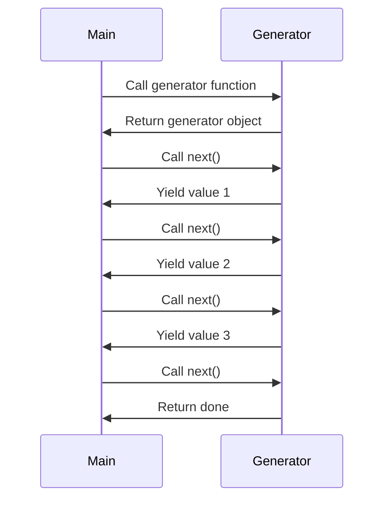

## 17.1 Introduction to Generators

In the world of JavaScript, functions are the building blocks of any application. They allow us to encapsulate code, making it reusable and organized. However, traditional functions have a limitation: they run to completion once invoked. What if we could have functions that pause their execution and resume later? This is where **generators** come into play.

### Understanding Generator Functions

**Generator functions** are a special type of function in JavaScript that can pause their execution and later resume from the same point. This ability to pause and resume makes generators incredibly powerful for handling complex tasks like asynchronous programming, iterating over large datasets, and more.

#### Key Characteristics of Generators

1. **Pause and Resume**: Unlike regular functions, generators can pause their execution at any point and resume later.
2. **Yielding Values**: Generators can yield multiple values over time, making them perfect for creating iterators.
3. **Stateful**: Generators maintain their state between executions, allowing them to remember where they left off.

### The `function*` Syntax

To define a generator function, we use the `function*` syntax. The asterisk (`*`) is placed after the `function` keyword, indicating that this function is a generator.

```javascript
function* myGenerator() {
  yield 1;
  yield 2;
  yield 3;
}
```

In the example above, `myGenerator` is a generator function that yields the values 1, 2, and 3. Notice the use of the `yield` keyword, which is essential in generator functions.

### The `yield` Keyword

The `yield` keyword is used to pause the execution of a generator function and return a value. When the generator is resumed, execution continues from the last `yield` statement.

```javascript
function* countToThree() {
  console.log("Start counting");
  yield 1;
  console.log("Yielded 1");
  yield 2;
  console.log("Yielded 2");
  yield 3;
  console.log("Yielded 3");
}

const counter = countToThree();

console.log(counter.next().value); // Start counting, Yielded 1, 1
console.log(counter.next().value); // Yielded 2, 2
console.log(counter.next().value); // Yielded 3, 3
```

In this example, calling `counter.next()` resumes the generator function until it hits the next `yield` statement. The `value` property of the result object contains the yielded value.

### How Generators Differ from Regular Functions

Generators differ from regular functions in several ways:

1. **Execution Control**: Regular functions run to completion once called, while generators can pause and resume.
2. **Multiple Returns**: Generators can yield multiple values over time, whereas regular functions return a single value.
3. **Statefulness**: Generators maintain their state between executions, allowing them to remember where they left off.

### Visualizing Generator Execution

To better understand how generators work, let's visualize their execution flow.



In this diagram, we see how the main program interacts with the generator. Each call to `next()` resumes the generator, yielding a value until the generator is done.

### Practical Use Cases for Generators

Generators are incredibly versatile and can be used in various scenarios:

1. **Iterating Over Data**: Generators can be used to create custom iterators that yield data on demand.
2. **Asynchronous Programming**: Generators can simplify asynchronous code by pausing execution until a task is complete.
3. **State Machines**: Generators can model state machines, where each state is represented by a `yield` statement.

### Code Example: Creating a Custom Iterator

Let's create a custom iterator using a generator function. This iterator will yield numbers from 1 to 5.

```javascript
function* numberIterator() {
  for (let i = 1; i <= 5; i++) {
    yield i;
  }
}

const numbers = numberIterator();

for (let number of numbers) {
  console.log(number); // 1, 2, 3, 4, 5
}
```

In this example, the `numberIterator` generator function yields numbers from 1 to 5. We can use a `for...of` loop to iterate over the generator's values.

### Try It Yourself

Experiment with the code examples above. Try modifying the generator function to yield different values or add more `yield` statements. Observe how the generator's behavior changes with each modification.

### Further Reading

For more information on generators, check out the following resources:

- [MDN Web Docs: Generator](https://developer.mozilla.org/en-US/docs/Web/JavaScript/Reference/Global_Objects/Generator)
- [JavaScript.info: Generators](https://javascript.info/generators)

### Knowledge Check

- What is the purpose of the `yield` keyword in a generator function?
- How do generators differ from regular functions in terms of execution control?
- Can a generator function return multiple values? If so, how?

### Key Takeaways

- Generators are special functions that can pause and resume execution.
- The `function*` syntax and `yield` keyword are essential for creating generator functions.
- Generators differ from regular functions in their ability to yield multiple values and maintain state.

### Embrace the Journey

Remember, this is just the beginning. As you progress, you'll discover more advanced use cases for generators. Keep experimenting, stay curious, and enjoy the journey!

## Quiz Time!



### What is a key feature of generator functions?

- [x] They can pause and resume execution.
- [ ] They execute only once.
- [ ] They cannot yield multiple values.
- [ ] They do not maintain state.

> **Explanation:** Generator functions can pause and resume execution, making them unique compared to regular functions.

### Which keyword is used to define a generator function?

- [x] function*
- [ ] function
- [ ] yield
- [ ] async

> **Explanation:** The `function*` syntax is used to define a generator function in JavaScript.

### What does the `yield` keyword do in a generator function?

- [x] Pauses execution and returns a value.
- [ ] Ends the function execution.
- [ ] Throws an error.
- [ ] Starts a loop.

> **Explanation:** The `yield` keyword pauses the generator function and returns a value to the caller.

### How do generators differ from regular functions?

- [x] Generators can yield multiple values over time.
- [ ] Generators execute only once.
- [ ] Generators cannot maintain state.
- [ ] Generators do not use the `yield` keyword.

> **Explanation:** Generators can yield multiple values over time and maintain their state between executions.

### What is the result of calling `next()` on a generator?

- [x] It resumes the generator and yields the next value.
- [ ] It restarts the generator from the beginning.
- [ ] It throws an error.
- [ ] It ends the generator.

> **Explanation:** Calling `next()` resumes the generator and yields the next value until the generator is done.

### Can a generator function yield values indefinitely?

- [x] Yes, as long as there are `yield` statements.
- [ ] No, it can only yield a fixed number of values.
- [ ] Yes, but only if it uses the `return` keyword.
- [ ] No, it must end after three yields.

> **Explanation:** A generator function can yield values indefinitely as long as there are `yield` statements.

### What is the purpose of the `function*` syntax?

- [x] To define a generator function.
- [ ] To define a regular function.
- [ ] To declare a variable.
- [ ] To create an object.

> **Explanation:** The `function*` syntax is used to define a generator function in JavaScript.

### How can you iterate over values yielded by a generator?

- [x] Using a `for...of` loop.
- [ ] Using a `while` loop.
- [ ] Using a `switch` statement.
- [ ] Using a `do...while` loop.

> **Explanation:** You can iterate over values yielded by a generator using a `for...of` loop.

### What happens when a generator function is exhausted?

- [x] It returns an object with `done: true`.
- [ ] It throws an error.
- [ ] It restarts from the beginning.
- [ ] It continues yielding values.

> **Explanation:** When a generator function is exhausted, it returns an object with `done: true`.

### True or False: Generators can be used for asynchronous programming.

- [x] True
- [ ] False

> **Explanation:** Generators can be used for asynchronous programming by pausing execution until a task is complete.


