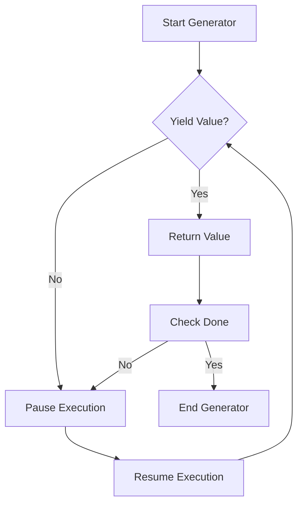

## 17.3 Creating Custom Iterators

In the world of JavaScript, iterators and iterables are powerful concepts that allow us to traverse data structures in a consistent and predictable manner. This section will guide you through creating custom iterators using generators, a feature introduced in ECMAScript 2015 (ES6). By the end of this chapter, you'll have a solid understanding of how to implement the iterator protocol, use `Symbol.iterator`, and leverage generators to create your own iterable objects.

### Understanding the Iterator Protocol

Before we dive into creating custom iterators, it's essential to understand the iterator protocol. This protocol defines a standard way to produce a sequence of values, one at a time. An object is considered an iterator when it implements a `next()` method that returns an object with two properties:

- `value`: The next value in the sequence.
- `done`: A boolean indicating whether the sequence has been completed.

Here's a simple example of an iterator:

```javascript
function createIterator(array) {
  let index = 0;
  return {
    next: function() {
      if (index < array.length) {
        return { value: array[index++], done: false };
      } else {
        return { done: true };
      }
    }
  };
}

const iterator = createIterator(['a', 'b', 'c']);
console.log(iterator.next()); // { value: 'a', done: false }
console.log(iterator.next()); // { value: 'b', done: false }
console.log(iterator.next()); // { value: 'c', done: false }
console.log(iterator.next()); // { done: true }
```

In this example, `createIterator` is a function that returns an iterator object. The `next()` method is called repeatedly to access each element in the array until the sequence is complete.

### Introducing `Symbol.iterator`

The `Symbol.iterator` is a well-known symbol that specifies the default iterator for an object. When an object implements the `Symbol.iterator` method, it becomes iterable, meaning it can be used in constructs like `for...of` loops, the spread operator, and more.

Here's how you can make an object iterable by implementing the `Symbol.iterator` method:

```javascript
const iterableObject = {
  data: ['x', 'y', 'z'],
  [Symbol.iterator]: function() {
    let index = 0;
    const data = this.data;
    return {
      next: function() {
        if (index < data.length) {
          return { value: data[index++], done: false };
        } else {
          return { done: true };
        }
      }
    };
  }
};

for (const value of iterableObject) {
  console.log(value); // 'x', 'y', 'z'
}
```

In this code, we define an object `iterableObject` with a `Symbol.iterator` method. This method returns an iterator object, allowing us to use the `for...of` loop to iterate over the object's data.

### Simplifying Iterables with Generators

Generators provide a more concise and readable way to create iterators. A generator is a special type of function that can pause its execution and resume later, maintaining its context between each pause. Generators are defined using the `function*` syntax and use the `yield` keyword to produce values.

Here's how you can use a generator to create an iterable:

```javascript
function* generatorFunction() {
  yield 'first';
  yield 'second';
  yield 'third';
}

const generator = generatorFunction();

console.log(generator.next()); // { value: 'first', done: false }
console.log(generator.next()); // { value: 'second', done: false }
console.log(generator.next()); // { value: 'third', done: false }
console.log(generator.next()); // { done: true }
```

In this example, `generatorFunction` is a generator that yields three values. Each call to `next()` returns the next value in the sequence until the generator is exhausted.

### Creating Custom Iterators with Generators

Now that we understand the basics of generators, let's create a custom iterator using a generator function. We'll create a sequence generator that produces a series of numbers:

```javascript
function* numberSequence(start = 0, step = 1) {
  let current = start;
  while (true) {
    yield current;
    current += step;
  }
}

const sequence = numberSequence(10, 2);

console.log(sequence.next().value); // 10
console.log(sequence.next().value); // 12
console.log(sequence.next().value); // 14
```

In this example, `numberSequence` is a generator function that produces an infinite sequence of numbers, starting from a given value and incrementing by a specified step. The generator pauses after each `yield`, allowing us to control the iteration process.

### Using Generators to Create Iterable Objects

We can also use generators to make objects iterable by defining a `Symbol.iterator` method that returns a generator. Let's create an iterable range object:

```javascript
const range = {
  start: 1,
  end: 5,
  [Symbol.iterator]: function* () {
    for (let value = this.start; value <= this.end; value++) {
      yield value;
    }
  }
};

for (const value of range) {
  console.log(value); // 1, 2, 3, 4, 5
}
```

In this example, the `range` object is made iterable by implementing a `Symbol.iterator` method that returns a generator. The generator yields each number in the range from `start` to `end`.

### Try It Yourself

Experiment with the examples provided by modifying the start and step values in the `numberSequence` generator. Try creating a generator that produces a sequence of even or odd numbers, or one that generates Fibonacci numbers. This hands-on practice will help reinforce your understanding of generators and iterators.

### Visualizing Iterators and Generators

To better understand how iterators and generators work, let's visualize the process using a flowchart. This diagram represents the flow of execution in a generator function:



**Description:** This flowchart illustrates the execution flow of a generator function. The generator starts, yields a value, pauses execution, and resumes when `next()` is called again. This process repeats until the generator is done.

### References and Further Reading

For more information on iterators and generators, consider exploring the following resources:

- [MDN Web Docs: Iteration protocols](https://developer.mozilla.org/en-US/docs/Web/JavaScript/Reference/Iteration_protocols)
- [MDN Web Docs: Generators](https://developer.mozilla.org/en-US/docs/Web/JavaScript/Reference/Global_Objects/Generator)
- [JavaScript.info: Generators](https://javascript.info/generators)

### Knowledge Check

Let's review what we've learned about creating custom iterators and generators. Consider the following questions:

- What is the iterator protocol, and how does it relate to the `next()` method?
- How does the `Symbol.iterator` method make an object iterable?
- What advantages do generators offer when creating custom iterators?

### Embrace the Journey

Remember, mastering iterators and generators is a journey. As you continue to explore these concepts, you'll discover new ways to leverage them in your JavaScript projects. Keep experimenting, stay curious, and enjoy the process of learning and growing as a developer.

### Quiz Time!



### What is the purpose of the `Symbol.iterator` method?

- [x] To make an object iterable
- [ ] To create a new symbol
- [ ] To define a new method
- [ ] To execute a function

> **Explanation:** The `Symbol.iterator` method is used to make an object iterable by returning an iterator.

### How do generators simplify creating iterators?

- [x] By using the `yield` keyword to produce values
- [ ] By using the `return` keyword
- [ ] By using the `break` keyword
- [ ] By using the `continue` keyword

> **Explanation:** Generators simplify creating iterators by using the `yield` keyword to produce values and pause execution.

### What does the `next()` method return in an iterator?

- [x] An object with `value` and `done` properties
- [ ] A single value
- [ ] A boolean indicating completion
- [ ] An array of values

> **Explanation:** The `next()` method returns an object with `value` and `done` properties, indicating the next value and whether the iteration is complete.

### What is the syntax for defining a generator function?

- [x] `function* generatorName() { ... }`
- [ ] `function generatorName() { ... }`
- [ ] `generator functionName() { ... }`
- [ ] `function generator() { ... }`

> **Explanation:** A generator function is defined using the `function*` syntax, followed by the function name and body.

### Which keyword is used to produce values in a generator?

- [x] `yield`
- [ ] `return`
- [ ] `break`
- [ ] `continue`

> **Explanation:** The `yield` keyword is used in generators to produce values and pause execution.

### Can an object be both an iterator and iterable?

- [x] Yes
- [ ] No

> **Explanation:** An object can be both an iterator and iterable if it implements both the `next()` method and the `Symbol.iterator` method.

### What is the result of calling `next()` on a generator that has finished execution?

- [x] `{ done: true }`
- [ ] `{ value: undefined, done: false }`
- [ ] `{ value: null, done: true }`
- [ ] `{ value: undefined, done: true }`

> **Explanation:** When a generator has finished execution, calling `next()` returns an object with `done: true`.

### How can you make an object iterable using a generator?

- [x] By defining a `Symbol.iterator` method that returns a generator
- [ ] By defining a `next()` method
- [ ] By defining a `forEach()` method
- [ ] By defining a `map()` method

> **Explanation:** You can make an object iterable by defining a `Symbol.iterator` method that returns a generator.

### What is the main advantage of using generators for custom iterators?

- [x] Simplified syntax and control over iteration
- [ ] Faster execution
- [ ] More memory-efficient
- [ ] Better error handling

> **Explanation:** The main advantage of using generators is the simplified syntax and control over the iteration process.

### True or False: Generators can produce an infinite sequence of values.

- [x] True
- [ ] False

> **Explanation:** Generators can produce an infinite sequence of values by using an infinite loop with the `yield` keyword.



By understanding and implementing custom iterators using generators, you can unlock new possibilities in your JavaScript applications. Keep practicing, and soon you'll be creating complex and efficient iterables with ease.
