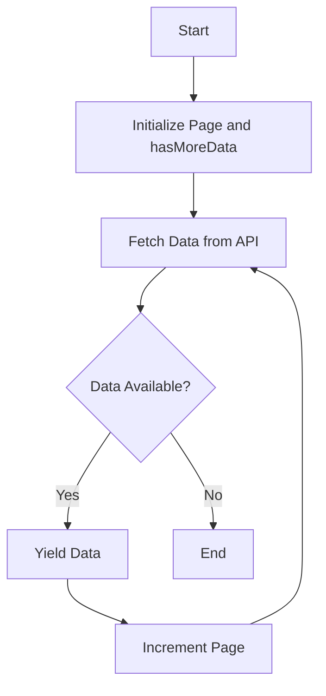

## 17.4 Asynchronous Generators

As we delve deeper into the world of JavaScript, we encounter the need to handle asynchronous operations efficiently. Whether it's fetching data from a server, reading files, or processing streams, asynchronous operations are a cornerstone of modern web development. In this section, we will explore asynchronous generators, a powerful feature in JavaScript that allows us to work with asynchronous data streams seamlessly.

### Understanding Asynchronous Generators

Asynchronous generators combine the capabilities of generators and promises, allowing us to iterate over data that arrives asynchronously. They are defined using the `async function*` syntax, which enables the function to yield promises. This is particularly useful when dealing with streams of data that are fetched or processed asynchronously.

#### The `async function*` Syntax

To create an asynchronous generator, we use the `async function*` declaration. This syntax indicates that the function will yield promises, and it can be paused and resumed just like a regular generator. Here's a simple example:

```javascript
async function* asyncGenerator() {
  yield Promise.resolve(1);
  yield Promise.resolve(2);
  yield Promise.resolve(3);
}

(async () => {
  for await (const value of asyncGenerator()) {
    console.log(value);
  }
})();
```

**Explanation:**

- **`async function* asyncGenerator()`:** This declares an asynchronous generator function.
- **`yield Promise.resolve(value)`:** Each `yield` returns a promise that resolves to a value.
- **`for await...of`:** This loop iterates over the resolved values of the promises yielded by the generator.

### The `for await...of` Loop

The `for await...of` loop is a special kind of loop designed to work with asynchronous iterables. It waits for each promise to resolve before moving to the next iteration, making it ideal for processing asynchronous data streams.

#### How It Works

The `for await...of` loop simplifies the process of handling asynchronous data. Here's how it works:

1. **Iterate Over Async Iterable:** The loop iterates over an asynchronous iterable, such as an async generator.
2. **Await Promise Resolution:** For each iteration, it waits for the promise to resolve.
3. **Process Resolved Value:** Once resolved, it processes the value and moves to the next iteration.

Consider the following example, which simulates fetching data from a server:

```javascript
async function* fetchData() {
  const data = [Promise.resolve('Data 1'), Promise.resolve('Data 2'), Promise.resolve('Data 3')];
  for (const item of data) {
    yield item;
  }
}

(async () => {
  for await (const value of fetchData()) {
    console.log(value); // Outputs: Data 1, Data 2, Data 3
  }
})();
```

**Explanation:**

- **Simulated Data Fetching:** The `fetchData` generator simulates fetching data by yielding promises.
- **Processing Data:** The `for await...of` loop processes each resolved value sequentially.

### Practical Examples with Asynchronous Data Streams

Asynchronous generators are particularly useful when dealing with real-world scenarios, such as reading data from a network or processing files. Let's explore some practical examples.

#### Example 1: Fetching Data from an API

Imagine we need to fetch data from an API that returns paginated results. Asynchronous generators can help us handle this efficiently:

```javascript
async function* fetchPaginatedData(apiUrl) {
  let page = 1;
  let hasMoreData = true;

  while (hasMoreData) {
    const response = await fetch(`${apiUrl}?page=${page}`);
    const data = await response.json();
    yield data;

    hasMoreData = data.length > 0;
    page++;
  }
}

(async () => {
  const apiUrl = 'https://api.example.com/data';
  for await (const pageData of fetchPaginatedData(apiUrl)) {
    console.log(pageData);
  }
})();
```

**Explanation:**

- **Paginated API:** The generator fetches data page by page.
- **Yielding Data:** Each page of data is yielded as a promise.
- **Looping Through Pages:** The loop continues until no more data is available.

#### Example 2: Reading Files Asynchronously

Suppose we want to read a large file in chunks. Asynchronous generators can help us process each chunk without blocking the main thread:

```javascript
const fs = require('fs').promises;

async function* readFileInChunks(filePath, chunkSize) {
  const fileHandle = await fs.open(filePath, 'r');
  const buffer = Buffer.alloc(chunkSize);
  let bytesRead = 0;

  try {
    while ((bytesRead = await fileHandle.read(buffer, 0, chunkSize, null)) !== 0) {
      yield buffer.slice(0, bytesRead);
    }
  } finally {
    await fileHandle.close();
  }
}

(async () => {
  const filePath = './largeFile.txt';
  const chunkSize = 1024; // 1KB
  for await (const chunk of readFileInChunks(filePath, chunkSize)) {
    console.log('Read chunk:', chunk.toString());
  }
})();
```

**Explanation:**

- **Reading in Chunks:** The generator reads the file in specified chunk sizes.
- **Yielding Chunks:** Each chunk is yielded for processing.
- **Resource Management:** The file handle is closed after reading.

### Visualizing Asynchronous Generators

To better understand how asynchronous generators work, let's visualize the process of fetching paginated data using a flowchart.



**Diagram Explanation:**

- **Initialization:** The process starts by initializing the page number and a flag to check for more data.
- **Data Fetching:** Data is fetched from the API.
- **Yielding Data:** If data is available, it is yielded.
- **Looping:** The page number is incremented, and the process repeats until no more data is available.

### Try It Yourself

Now that we've explored the basics of asynchronous generators, it's time to experiment. Try modifying the examples above to:

- Fetch data from a different API.
- Change the chunk size when reading files.
- Add error handling to manage network or file read errors.

### References and Further Reading

- [MDN Web Docs: Asynchronous Iteration](https://developer.mozilla.org/en-US/docs/Web/JavaScript/Reference/Statements/for-await...of)
- [MDN Web Docs: Async Generators](https://developer.mozilla.org/en-US/docs/Web/JavaScript/Reference/Statements/async_function*)

### Knowledge Check

Before we wrap up, let's reinforce what we've learned with a few questions:

- What is the purpose of the `async function*` syntax?
- How does the `for await...of` loop differ from a regular `for...of` loop?
- What are some practical use cases for asynchronous generators?

### Embrace the Journey

Remember, mastering asynchronous generators is a step towards becoming proficient in handling asynchronous operations in JavaScript. Keep experimenting, stay curious, and enjoy the journey!

## Quiz Time!



### What is the primary use of asynchronous generators?

- [x] To handle asynchronous data streams
- [ ] To create synchronous loops
- [ ] To manage synchronous data
- [ ] To replace regular functions

> **Explanation:** Asynchronous generators are used to handle asynchronous data streams by yielding promises.

### Which keyword is used to define an asynchronous generator?

- [x] async function*
- [ ] function*
- [ ] async generator
- [ ] generator function

> **Explanation:** The `async function*` keyword is used to define an asynchronous generator.

### What does the `for await...of` loop do?

- [x] Iterates over asynchronous iterables
- [ ] Iterates over synchronous iterables
- [ ] Creates promises
- [ ] Resolves promises immediately

> **Explanation:** The `for await...of` loop iterates over asynchronous iterables, waiting for each promise to resolve.

### In the context of asynchronous generators, what does `yield` do?

- [x] Returns a promise
- [ ] Returns a value immediately
- [ ] Ends the generator
- [ ] Starts a new iteration

> **Explanation:** In asynchronous generators, `yield` returns a promise that resolves to a value.

### How can asynchronous generators be useful in real-world applications?

- [x] Fetching paginated data from an API
- [x] Reading large files in chunks
- [ ] Sorting arrays
- [ ] Calculating mathematical operations

> **Explanation:** Asynchronous generators are useful for handling asynchronous operations like fetching paginated data and reading large files in chunks.

### What is the purpose of the `async` keyword in `async function*`?

- [x] To indicate that the function will yield promises
- [ ] To make the function synchronous
- [ ] To create a new scope
- [ ] To define a regular function

> **Explanation:** The `async` keyword indicates that the function will yield promises and handle asynchronous operations.

### What happens if you try to use `for await...of` on a non-async iterable?

- [ ] It will work as expected
- [x] It will throw an error
- [ ] It will convert the iterable to async
- [ ] It will ignore the await keyword

> **Explanation:** Using `for await...of` on a non-async iterable will throw an error because it expects promises.

### What is a common use case for asynchronous generators?

- [x] Processing data streams
- [ ] Sorting numbers
- [ ] Calculating averages
- [ ] Creating arrays

> **Explanation:** Asynchronous generators are commonly used for processing data streams that arrive asynchronously.

### Can asynchronous generators be used with synchronous data?

- [ ] Yes, without any issues
- [x] Yes, but it's not efficient
- [ ] No, it's not possible
- [ ] Only with modifications

> **Explanation:** While asynchronous generators can technically be used with synchronous data, it's not efficient as they are designed for asynchronous operations.

### True or False: Asynchronous generators can only yield promises.

- [x] True
- [ ] False

> **Explanation:** Asynchronous generators are designed to yield promises, allowing them to handle asynchronous data streams effectively.


