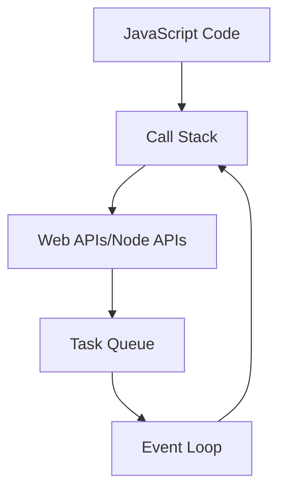
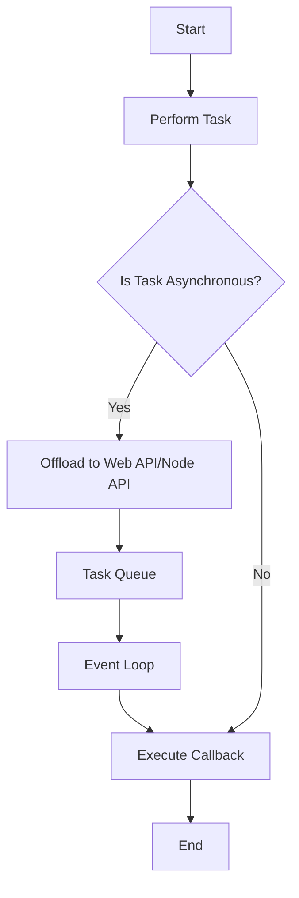

## 18.1 Callbacks Revisited

In this section, we will delve into the world of asynchronous programming in JavaScript, focusing on the concept of callbacks. Asynchronous execution is a fundamental aspect of JavaScript, enabling it to handle tasks like network requests and file operations without blocking the main thread. Understanding callbacks is crucial for writing efficient and responsive JavaScript applications.

### Understanding Asynchronous Execution

JavaScript is a single-threaded language, meaning it executes one piece of code at a time. However, many tasks, such as network requests, file operations, and timers, can take an indeterminate amount of time to complete. To handle these tasks without freezing the user interface or blocking the execution of other code, JavaScript uses asynchronous programming.

#### The Event Loop

The event loop is a core component of JavaScript's asynchronous model. It allows JavaScript to perform non-blocking operations by offloading tasks to the browser or Node.js runtime, which handles them in the background. Once a task is completed, a callback function is placed in the event queue, waiting to be executed.

Here's a simple diagram to illustrate the event loop:



**Caption**: The event loop processes tasks from the task queue, allowing JavaScript to handle asynchronous operations.

### What is a Callback?

A callback is a function passed as an argument to another function, which is then invoked inside the outer function to complete some kind of routine or action. Callbacks are a way to ensure that a function is not executed until a certain task is completed.

#### Synchronous vs. Asynchronous Callbacks

- **Synchronous Callbacks**: These are executed immediately, like any other regular function call. They are used in functions like `Array.prototype.map()`.
- **Asynchronous Callbacks**: These are executed after a certain event or task has been completed, such as reading a file or making an HTTP request.

### Callback Patterns in JavaScript

Callbacks are used extensively in JavaScript, especially in asynchronous programming. Let's explore some common patterns and use cases.

#### Basic Callback Example

Let's start with a simple example of a callback function:

```javascript
function greet(name, callback) {
    console.log('Hello, ' + name + '!');
    callback();
}

function sayGoodbye() {
    console.log('Goodbye!');
}

greet('Alice', sayGoodbye);
```

**Explanation**: In this example, `sayGoodbye` is passed as a callback to the `greet` function. After greeting the user, the callback is executed, printing "Goodbye!".

#### Asynchronous Callbacks

Asynchronous callbacks are often used with operations that take time to complete. Let's look at an example using the `setTimeout` function:

```javascript
console.log('Start');

setTimeout(() => {
    console.log('This message is delayed by 2 seconds');
}, 2000);

console.log('End');
```

**Explanation**: The `setTimeout` function schedules the callback to be executed after 2 seconds, allowing the rest of the code to run without waiting.

### Real-World Examples

Callbacks are commonly used in real-world applications, especially for tasks like reading files or making network requests.

#### Reading Files with Callbacks

In Node.js, the `fs` module provides functions to read files asynchronously. Here's an example:

```javascript
const fs = require('fs');

fs.readFile('example.txt', 'utf8', (err, data) => {
    if (err) {
        console.error('Error reading file:', err);
        return;
    }
    console.log('File content:', data);
});

console.log('Reading file...');
```

**Explanation**: The `readFile` function reads the file asynchronously, and the callback is executed once the file is read. If there's an error, it is handled within the callback.

#### Making Network Requests

Using the `XMLHttpRequest` object in the browser, we can make network requests asynchronously:

```javascript
function fetchData(url, callback) {
    const xhr = new XMLHttpRequest();
    xhr.open('GET', url, true);
    xhr.onreadystatechange = function() {
        if (xhr.readyState === 4 && xhr.status === 200) {
            callback(null, xhr.responseText);
        } else if (xhr.readyState === 4) {
            callback(new Error('Request failed'));
        }
    };
    xhr.send();
}

fetchData('https://api.example.com/data', (err, data) => {
    if (err) {
        console.error(err);
        return;
    }
    console.log('Data received:', data);
});
```

**Explanation**: The `fetchData` function makes an HTTP GET request. The callback is called with the response data once the request is complete.

### Callback Hell

One of the challenges with callbacks is managing complex asynchronous code, which can lead to "callback hell" or "pyramid of doom." This occurs when callbacks are nested within other callbacks, making the code difficult to read and maintain.

#### Example of Callback Hell

```javascript
doSomething(function(result) {
    doSomethingElse(result, function(newResult) {
        doAnotherThing(newResult, function(finalResult) {
            console.log('Final result:', finalResult);
        });
    });
});
```

**Explanation**: The nested structure makes it hard to follow the flow of the program. This is a common issue with callbacks in asynchronous code.

### Avoiding Callback Hell

To avoid callback hell, we can use several strategies:

#### Modularize Code

Break down complex tasks into smaller, reusable functions. This makes the code easier to read and maintain.

```javascript
function doSomething(callback) {
    // Perform task
    callback(result);
}

function doSomethingElse(result, callback) {
    // Perform another task
    callback(newResult);
}

function doAnotherThing(newResult, callback) {
    // Perform final task
    callback(finalResult);
}

doSomething(function(result) {
    doSomethingElse(result, function(newResult) {
        doAnotherThing(newResult, function(finalResult) {
            console.log('Final result:', finalResult);
        });
    });
});
```

#### Use Promises

Promises provide a cleaner way to handle asynchronous operations, avoiding deeply nested callbacks. We'll explore promises in the next section.

### Try It Yourself

Experiment with the examples provided. Try modifying the callback functions to perform different tasks or handle errors differently. This will help solidify your understanding of callbacks and their role in asynchronous programming.

### Visualizing Asynchronous Execution

To better understand how asynchronous execution works, let's visualize the process using a flowchart:



**Caption**: The flowchart illustrates the decision-making process for handling synchronous and asynchronous tasks in JavaScript.

### References and Further Reading

- [MDN Web Docs: Asynchronous JavaScript](https://developer.mozilla.org/en-US/docs/Learn/JavaScript/Asynchronous)
- [Node.js File System Module](https://nodejs.org/api/fs.html)
- [XMLHttpRequest on MDN](https://developer.mozilla.org/en-US/docs/Web/API/XMLHttpRequest)

### Knowledge Check

Let's reinforce what we've learned with some questions and exercises.

1. **What is the role of the event loop in JavaScript?**
   - Explain how the event loop allows JavaScript to handle asynchronous tasks without blocking the main thread.

2. **Describe the difference between synchronous and asynchronous callbacks.**
   - Provide examples of each type of callback.

3. **What is callback hell, and how can it be avoided?**
   - Discuss strategies for managing complex asynchronous code.

4. **Modify the file reading example to handle a different file format.**
   - Experiment with reading a JSON file and parsing its content.

5. **Create a simple web page that uses callbacks to fetch and display data from an API.**
   - Use the `fetchData` function as a starting point.

### Embrace the Journey

Remember, mastering callbacks and asynchronous programming is a crucial step in becoming a proficient JavaScript developer. As you progress, you'll encounter more advanced concepts like promises and async/await, which build upon the foundation of callbacks. Keep experimenting, stay curious, and enjoy the journey!

## Quiz Time!



### What is the main purpose of the event loop in JavaScript?

- [x] To handle asynchronous tasks without blocking the main thread
- [ ] To execute synchronous code faster
- [ ] To manage memory allocation
- [ ] To compile JavaScript code

> **Explanation:** The event loop allows JavaScript to handle asynchronous tasks by offloading them to the browser or Node.js runtime, ensuring the main thread remains unblocked.

### What is a callback function?

- [x] A function passed as an argument to another function
- [ ] A function that returns another function
- [ ] A function that is executed immediately
- [ ] A function that is only used in synchronous programming

> **Explanation:** A callback function is passed as an argument to another function and is invoked to complete a routine or action.

### How can callback hell be avoided?

- [x] By using promises
- [x] By modularizing code
- [ ] By using synchronous code
- [ ] By avoiding callbacks altogether

> **Explanation:** Callback hell can be avoided by using promises for cleaner asynchronous handling and by modularizing code to improve readability.

### What is the difference between synchronous and asynchronous callbacks?

- [x] Synchronous callbacks are executed immediately, while asynchronous callbacks are executed after a task is completed
- [ ] Synchronous callbacks are used in asynchronous programming
- [ ] Asynchronous callbacks are only used in synchronous programming
- [ ] There is no difference

> **Explanation:** Synchronous callbacks are executed immediately, whereas asynchronous callbacks are executed after a specific task is completed.

### Which of the following is an example of an asynchronous callback?

- [x] setTimeout function
- [ ] Array.prototype.map function
- [ ] A regular function call
- [ ] A function returning another function

> **Explanation:** The `setTimeout` function is an example of an asynchronous callback, as it executes the callback after a specified delay.

### What is the role of the `fs.readFile` function in Node.js?

- [x] To read files asynchronously
- [ ] To write files synchronously
- [ ] To delete files
- [ ] To compile JavaScript code

> **Explanation:** The `fs.readFile` function in Node.js is used to read files asynchronously, allowing other code to execute while the file is being read.

### How does the `XMLHttpRequest` object handle asynchronous requests?

- [x] By using a callback function to process the response
- [ ] By blocking the main thread until the response is received
- [ ] By returning a promise
- [ ] By using synchronous code

> **Explanation:** The `XMLHttpRequest` object handles asynchronous requests by using a callback function to process the response once it is received.

### What is the main advantage of using asynchronous programming in JavaScript?

- [x] It allows tasks to be performed without blocking the main thread
- [ ] It makes code execution faster
- [ ] It simplifies code structure
- [ ] It eliminates the need for callbacks

> **Explanation:** Asynchronous programming allows tasks to be performed without blocking the main thread, improving the responsiveness of applications.

### Which method can be used to avoid callback hell?

- [x] Promises
- [ ] Synchronous code
- [ ] Nested callbacks
- [ ] Global variables

> **Explanation:** Promises provide a cleaner way to handle asynchronous operations, avoiding deeply nested callbacks.

### True or False: Asynchronous callbacks are executed immediately after they are defined.

- [ ] True
- [x] False

> **Explanation:** Asynchronous callbacks are executed after a specific task or event has been completed, not immediately after they are defined.


