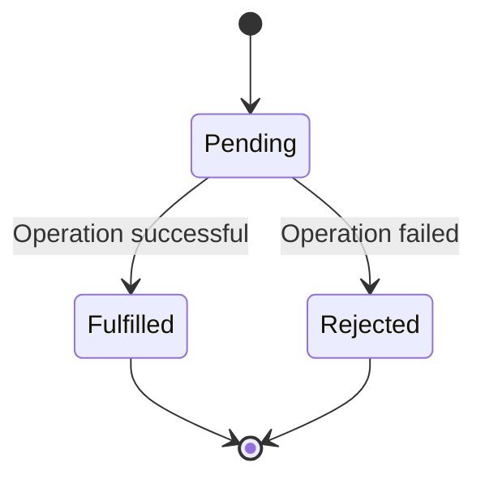

## 18.2 Promises

As we delve deeper into JavaScript, one of the most powerful features we encounter is the ability to handle asynchronous operations. In this section, we'll explore **Promises**, a key concept that simplifies working with asynchronous code. Promises provide a more readable and manageable way to handle asynchronous operations compared to traditional callback functions.

### What are Promises?

A **Promise** in JavaScript is an object that represents the eventual completion (or failure) of an asynchronous operation and its resulting value. Promises are used to handle asynchronous operations such as network requests, file reading, or any operation that takes time to complete.

#### States of a Promise

A promise can be in one of three states:

1. **Pending**: The initial state of a promise. It means the operation has not yet completed, and the promise is neither fulfilled nor rejected.
2. **Fulfilled**: The operation was completed successfully, and the promise has a resulting value.
3. **Rejected**: The operation failed, and the promise has a reason for the failure (an error).

Here's a simple diagram to visualize the states of a promise:



### Creating and Using Promises

To create a promise, we use the `Promise` constructor, which takes a function as an argument. This function is called the **executor function** and has two parameters: `resolve` and `reject`. These parameters are functions that you call to change the state of the promise.

#### Basic Promise Example

Let's create a simple promise that simulates a coin flip:

```javascript
const coinFlip = new Promise((resolve, reject) => {
    const flip = Math.random() > 0.5 ? 'heads' : 'tails';
    if (flip === 'heads') {
        resolve('Heads! You win!');
    } else {
        reject('Tails! You lose!');
    }
});

// Using the promise
coinFlip
    .then(result => {
        console.log(result); // Logs "Heads! You win!" if resolved
    })
    .catch(error => {
        console.error(error); // Logs "Tails! You lose!" if rejected
    });
```

In this example, the promise is either resolved with "Heads! You win!" or rejected with "Tails! You lose!" based on a random coin flip.

### Chaining Promises with `.then()` and `.catch()`

One of the powerful features of promises is the ability to chain them. This allows you to perform a sequence of asynchronous operations in a readable manner.

#### Chaining with `.then()`

The `.then()` method is used to specify what should happen when a promise is fulfilled. It takes two arguments: a callback for the success case and an optional callback for the failure case.

Here's an example of chaining promises:

```javascript
const fetchData = new Promise((resolve, reject) => {
    setTimeout(() => {
        resolve('Data fetched successfully!');
    }, 1000);
});

fetchData
    .then(data => {
        console.log(data); // Logs "Data fetched successfully!"
        return 'Processing data...';
    })
    .then(processedData => {
        console.log(processedData); // Logs "Processing data..."
        return 'Data processed!';
    })
    .then(finalResult => {
        console.log(finalResult); // Logs "Data processed!"
    })
    .catch(error => {
        console.error('Error:', error);
    });
```

In this example, each `.then()` method returns a new promise, allowing us to chain multiple asynchronous operations together.

#### Handling Errors with `.catch()`

The `.catch()` method is used to handle errors in the promise chain. It catches any rejection that occurs in the promise chain, allowing you to handle errors gracefully.

Here's how you can use `.catch()` to handle errors:

```javascript
const riskyOperation = new Promise((resolve, reject) => {
    setTimeout(() => {
        reject('Operation failed!');
    }, 1000);
});

riskyOperation
    .then(result => {
        console.log(result);
    })
    .catch(error => {
        console.error('Caught an error:', error); // Logs "Caught an error: Operation failed!"
    });
```

In this example, the promise is rejected, and the error is caught by the `.catch()` method.

### Visualizing Promise Chaining

To better understand how promise chaining works, let's visualize the flow of a promise chain:

```mermaid
graph TD;
    A[Start] --> B[Promise 1: Fetch Data]
    B --> C[.then(): Process Data]
    C --> D[.then(): Finalize]
    D --> E[End]
    B --> F[.catch(): Handle Error]
    C --> F
    D --> F
```

### Practical Use Cases of Promises

Promises are widely used in web development for handling asynchronous operations like network requests, file reading, and more. Let's explore some practical examples.

#### Example: Fetching Data from an API

One of the most common uses of promises is fetching data from an API using the `fetch` function, which returns a promise.

```javascript
fetch('https://api.example.com/data')
    .then(response => response.json())
    .then(data => {
        console.log('Data:', data);
    })
    .catch(error => {
        console.error('Error fetching data:', error);
    });
```

In this example, we use the `fetch` function to make a network request. The response is then converted to JSON, and the data is logged to the console. If an error occurs, it is caught and logged.

#### Example: Sequential Asynchronous Operations

Promises allow you to perform sequential asynchronous operations in a clean and readable way.

```javascript
function step1() {
    return new Promise((resolve) => {
        setTimeout(() => {
            console.log('Step 1 completed');
            resolve('Step 1 result');
        }, 1000);
    });
}

function step2(resultFromStep1) {
    return new Promise((resolve) => {
        setTimeout(() => {
            console.log('Step 2 completed with:', resultFromStep1);
            resolve('Step 2 result');
        }, 1000);
    });
}

step1()
    .then(result => step2(result))
    .then(finalResult => {
        console.log('All steps completed with:', finalResult);
    })
    .catch(error => {
        console.error('Error in steps:', error);
    });
```

In this example, `step1` and `step2` are executed sequentially, with the result of `step1` being passed to `step2`.

### Try It Yourself

Now that we've covered the basics of promises, it's time to experiment! Try modifying the examples above to see how promises work in different scenarios. Here are some ideas:

- Change the delay times in the `setTimeout` functions to see how it affects the order of operations.
- Introduce an error in one of the promise chains and observe how `.catch()` handles it.
- Create a new promise that simulates a dice roll and resolves or rejects based on the outcome.

### Further Reading

To deepen your understanding of promises, consider exploring these resources:

- [MDN Web Docs on Promises](https://developer.mozilla.org/en-US/docs/Web/JavaScript/Guide/Using_promises)
- [JavaScript.info on Promises](https://javascript.info/promise-basics)
- [W3Schools on JavaScript Promises](https://www.w3schools.com/js/js_promise.asp)

### Key Takeaways

- Promises provide a more readable and manageable way to handle asynchronous operations compared to callbacks.
- A promise can be in one of three states: pending, fulfilled, or rejected.
- Use `.then()` to handle successful promise resolutions and `.catch()` to handle errors.
- Promises can be chained to perform sequential asynchronous operations.

### Embrace the Journey

Remember, mastering promises is a significant step in your JavaScript journey. As you continue to explore and experiment, you'll become more comfortable with asynchronous programming. Keep practicing, stay curious, and enjoy the process of learning!

## Quiz Time!



### What is a promise in JavaScript?

- [x] An object representing the eventual completion or failure of an asynchronous operation
- [ ] A synchronous function that executes immediately
- [ ] A data structure used to store key-value pairs
- [ ] A method for handling synchronous errors

> **Explanation:** A promise is an object that represents the eventual completion or failure of an asynchronous operation and its resulting value.

### What are the three states of a promise?

- [x] Pending, Fulfilled, Rejected
- [ ] Start, In Progress, Complete
- [ ] Open, Closed, Error
- [ ] Initialized, Running, Finished

> **Explanation:** A promise can be in one of three states: pending, fulfilled, or rejected.

### Which method is used to handle successful promise resolutions?

- [x] `.then()`
- [ ] `.catch()`
- [ ] `.finally()`
- [ ] `.resolve()`

> **Explanation:** The `.then()` method is used to handle successful promise resolutions.

### How do you handle errors in a promise chain?

- [x] Using the `.catch()` method
- [ ] Using the `.then()` method
- [ ] Using the `.finally()` method
- [ ] Using the `.reject()` method

> **Explanation:** The `.catch()` method is used to handle errors in a promise chain.

### What does the `.then()` method return?

- [x] A new promise
- [ ] The original promise
- [ ] A boolean value
- [ ] An error object

> **Explanation:** The `.then()` method returns a new promise, allowing for chaining.

### Which of the following is a common use of promises?

- [x] Fetching data from an API
- [ ] Declaring variables
- [ ] Looping through arrays
- [ ] Defining functions

> **Explanation:** Promises are commonly used for handling asynchronous operations like fetching data from an API.

### What happens if a promise is rejected?

- [x] The `.catch()` method is executed
- [ ] The `.then()` method is executed
- [ ] The promise is automatically resolved
- [ ] The promise is ignored

> **Explanation:** If a promise is rejected, the `.catch()` method is executed to handle the error.

### Can promises be chained?

- [x] Yes
- [ ] No

> **Explanation:** Promises can be chained to perform sequential asynchronous operations.

### What is the purpose of the `resolve` function in a promise?

- [x] To change the state of the promise to fulfilled
- [ ] To change the state of the promise to rejected
- [ ] To handle errors in the promise
- [ ] To create a new promise

> **Explanation:** The `resolve` function is used to change the state of the promise to fulfilled.

### True or False: Promises are only used for handling errors.

- [ ] True
- [x] False

> **Explanation:** Promises are used to handle both successful and unsuccessful asynchronous operations, not just errors.


