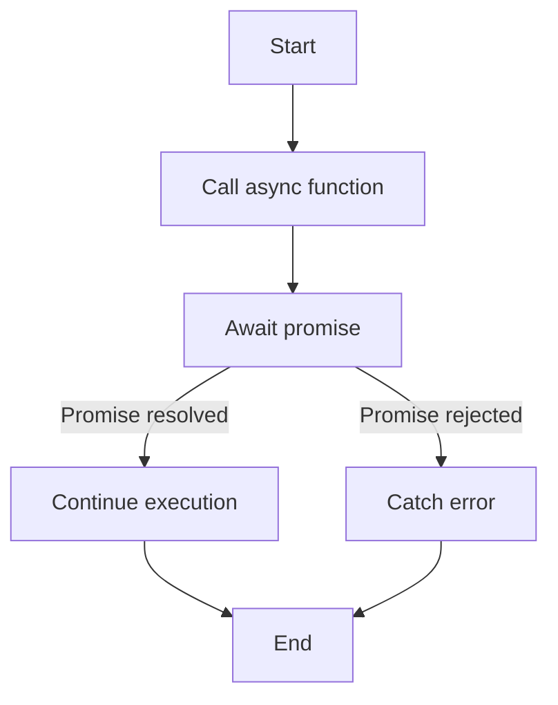

## 18.3 The `async` and `await` Keywords

Welcome to the fascinating world of asynchronous programming in JavaScript! In this section, we will delve into the `async` and `await` keywords, which are powerful tools that help us write asynchronous code that appears synchronous. This makes our code easier to read and maintain, especially when dealing with operations that take time to complete, such as fetching data from a server or reading files.

### Introduction to Asynchronous Programming

Before we dive into `async` and `await`, let's briefly revisit the concept of asynchronous programming. JavaScript is a single-threaded language, which means it can execute one task at a time. However, many operations, like network requests or file I/O, can take a while to complete. If JavaScript waited for each of these tasks to finish before moving on to the next, it would be very inefficient. Instead, JavaScript uses asynchronous programming to handle such tasks, allowing other operations to continue running while waiting for the asynchronous task to complete.

### Understanding Promises

Promises are a foundational concept in JavaScript's asynchronous programming. A promise represents a value that may be available now, or in the future, or never. It allows us to write code that can handle success or failure of asynchronous operations.

Here is a simple example of a promise:

```javascript
let promise = new Promise((resolve, reject) => {
  setTimeout(() => {
    resolve("Data fetched successfully!");
  }, 2000);
});

promise.then((message) => {
  console.log(message);
}).catch((error) => {
  console.error(error);
});
```

In this example, the promise simulates a network request that takes 2 seconds to complete. The `then` method is used to handle the resolved value, and `catch` is used to handle any errors.

### Introducing `async` Functions

The `async` keyword is used to define an asynchronous function. An `async` function always returns a promise. If the function returns a value, the promise is resolved with that value. If the function throws an error, the promise is rejected with that error.

Here's how you define an `async` function:

```javascript
async function fetchData() {
  return "Data fetched!";
}

fetchData().then((message) => {
  console.log(message); // Output: Data fetched!
});
```

In this example, the `fetchData` function is an `async` function that returns a string. This string is automatically wrapped in a promise, which is why we can use `then` to handle the resolved value.

### The Power of `await`

The `await` keyword can only be used inside an `async` function. It pauses the execution of the function until the promise is resolved or rejected. This allows us to write asynchronous code that looks synchronous, making it easier to read and understand.

Let's modify our previous example to use `await`:

```javascript
async function fetchData() {
  let message = await new Promise((resolve, reject) => {
    setTimeout(() => {
      resolve("Data fetched successfully!");
    }, 2000);
  });

  console.log(message);
}

fetchData();
```

In this example, `await` pauses the execution of `fetchData` until the promise is resolved. Once the promise is resolved, the resolved value is assigned to `message`, and the function continues executing.

### Comparing Promises and `async/await`

To better understand the benefits of `async/await`, let's compare it with promises using a more complex example. Suppose we want to fetch user data from an API and then fetch their posts.

**Using Promises:**

```javascript
function fetchUser() {
  return new Promise((resolve, reject) => {
    setTimeout(() => {
      resolve({ id: 1, name: "John Doe" });
    }, 1000);
  });
}

function fetchPosts(userId) {
  return new Promise((resolve, reject) => {
    setTimeout(() => {
      resolve(["Post 1", "Post 2"]);
    }, 1000);
  });
}

fetchUser()
  .then((user) => {
    console.log("User:", user);
    return fetchPosts(user.id);
  })
  .then((posts) => {
    console.log("Posts:", posts);
  })
  .catch((error) => {
    console.error(error);
  });
```

**Using `async/await`:**

```javascript
async function displayUserData() {
  try {
    let user = await fetchUser();
    console.log("User:", user);

    let posts = await fetchPosts(user.id);
    console.log("Posts:", posts);
  } catch (error) {
    console.error(error);
  }
}

displayUserData();
```

As you can see, the `async/await` version is more readable and easier to follow. It looks like synchronous code, which makes it easier to reason about.

### Handling Errors with `async/await`

Error handling with `async/await` is straightforward. We can use `try...catch` blocks to handle errors, just like in synchronous code.

```javascript
async function fetchData() {
  try {
    let response = await fetch("https://api.example.com/data");
    let data = await response.json();
    console.log(data);
  } catch (error) {
    console.error("Error fetching data:", error);
  }
}

fetchData();
```

In this example, if any of the `await` expressions throw an error, it will be caught by the `catch` block.

### Visualizing Asynchronous Flow with `async/await`

To better understand how `async/await` works, let's visualize the flow of an asynchronous operation using a flowchart:



This flowchart illustrates how the execution of an `async` function is paused at the `await` expression until the promise is resolved or rejected.

### Try It Yourself

Now it's your turn! Try modifying the `displayUserData` function to fetch comments for each post. You can create a `fetchComments` function that returns a promise resolving to an array of comments for a given post ID. Use `async/await` to fetch and log the comments for each post.

### Further Reading

To deepen your understanding of `async/await` and asynchronous programming in JavaScript, consider exploring the following resources:

- [MDN Web Docs on async functions](https://developer.mozilla.org/en-US/docs/Web/JavaScript/Reference/Statements/async_function)
- [JavaScript Promises: An Introduction](https://developers.google.com/web/fundamentals/primers/promises)
- [Understanding JavaScript's async and await with Examples](https://www.sitepoint.com/understanding-async-await-javascript/)

### Knowledge Check

Let's reinforce what we've learned with a few questions:

- What does the `async` keyword do in a function declaration?
- How does `await` affect the execution of an `async` function?
- What are the benefits of using `async/await` over promises?

### Conclusion

Congratulations on mastering the `async` and `await` keywords! These tools are essential for writing clean and efficient asynchronous code in JavaScript. Remember, this is just the beginning. As you progress, you'll build more complex and interactive web applications. Keep experimenting, stay curious, and enjoy the journey!

## Quiz Time!



### What does the `async` keyword do in a function declaration?

- [x] It defines an asynchronous function that returns a promise.
- [ ] It pauses the function execution.
- [ ] It makes the function synchronous.
- [ ] It throws an error if the function is not asynchronous.

> **Explanation:** The `async` keyword defines an asynchronous function that always returns a promise.

### How does `await` affect the execution of an `async` function?

- [x] It pauses the execution until the promise is resolved or rejected.
- [ ] It makes the function synchronous.
- [ ] It throws an error if the promise is rejected.
- [ ] It skips the promise resolution.

> **Explanation:** `await` pauses the execution of an `async` function until the promise is resolved or rejected.

### What is the main benefit of using `async/await` over promises?

- [x] It makes asynchronous code look synchronous, improving readability.
- [ ] It makes code execution faster.
- [ ] It eliminates the need for promises.
- [ ] It automatically handles errors.

> **Explanation:** `async/await` makes asynchronous code look synchronous, which improves readability and maintainability.

### Can `await` be used outside of an `async` function?

- [ ] Yes, it can be used anywhere.
- [x] No, it can only be used inside an `async` function.
- [ ] Yes, but only in arrow functions.
- [ ] No, it is not allowed in JavaScript.

> **Explanation:** `await` can only be used inside an `async` function.

### How do you handle errors in an `async` function?

- [x] Use a `try...catch` block.
- [ ] Use a `then` method.
- [ ] Use a `finally` block.
- [ ] Use a `reject` method.

> **Explanation:** Errors in an `async` function can be handled using a `try...catch` block.

### What does an `async` function return?

- [x] A promise.
- [ ] An object.
- [ ] A string.
- [ ] An array.

> **Explanation:** An `async` function always returns a promise.

### Which of the following is true about `await`?

- [x] It can pause the execution of an `async` function.
- [ ] It can be used to handle synchronous code.
- [ ] It automatically resolves promises.
- [ ] It throws errors for rejected promises.

> **Explanation:** `await` pauses the execution of an `async` function until the promise is resolved or rejected.

### What happens if an error occurs in an `async` function?

- [x] The promise is rejected.
- [ ] The function stops executing.
- [ ] The error is ignored.
- [ ] The error is logged automatically.

> **Explanation:** If an error occurs in an `async` function, the promise is rejected with that error.

### Can `async/await` be used with non-promise values?

- [x] Yes, `await` will convert non-promise values to promises.
- [ ] No, it only works with promises.
- [ ] Yes, but only with numbers.
- [ ] No, it throws an error for non-promise values.

> **Explanation:** `await` can be used with non-promise values, and it will convert them to promises.

### True or False: `async/await` can be used to eliminate callback hell.

- [x] True
- [ ] False

> **Explanation:** `async/await` can help eliminate callback hell by making asynchronous code more readable and easier to manage.


