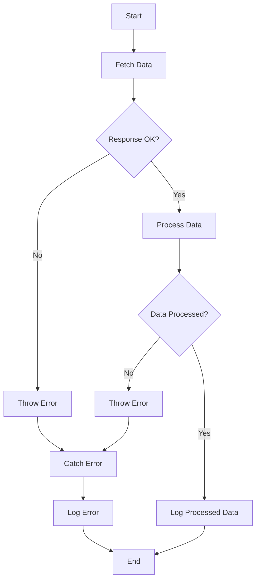

## 18.4 Error Handling in Async Functions

Asynchronous programming is a powerful feature in JavaScript that allows us to perform tasks without blocking the main thread. However, with this power comes the responsibility of handling errors effectively. In this section, we will explore how to manage errors in asynchronous functions using promises and the `async/await` syntax. We'll provide clear examples and explanations to ensure you can handle errors gracefully in your JavaScript applications.

### Understanding Asynchronous Functions

Before diving into error handling, let's briefly revisit what asynchronous functions are. Asynchronous functions allow you to write code that performs tasks concurrently, without waiting for each task to complete before moving on to the next. This is particularly useful for operations like fetching data from a server, reading files, or any other I/O-bound tasks.

JavaScript offers several ways to handle asynchronous operations, including callbacks, promises, and the `async/await` syntax. In this section, we'll focus on promises and `async/await`, as they provide a more modern and cleaner approach to handling asynchronous code.

### Error Handling with Promises

Promises are a way to handle asynchronous operations in JavaScript. They represent a value that may be available now, or in the future, or never. A promise can be in one of three states: pending, fulfilled, or rejected. When it comes to error handling, we are particularly interested in the rejected state, which indicates that an error has occurred.

#### Using `.catch()` for Error Handling

The `.catch()` method is used to handle errors in promises. It is a method that can be chained to a promise to catch any errors that occur during the execution of the promise. Here's a simple example:

```javascript
// Example of using .catch() to handle errors in a promise
function fetchData(url) {
  return fetch(url)
    .then(response => {
      if (!response.ok) {
        throw new Error('Network response was not ok');
      }
      return response.json();
    })
    .catch(error => {
      console.error('There was a problem with the fetch operation:', error);
    });
}

// Use the fetchData function
fetchData('https://api.example.com/data')
  .then(data => {
    console.log('Data received:', data);
  });
```

In this example, the `fetchData` function makes a network request using the `fetch` API. If the response is not okay, it throws an error, which is then caught by the `.catch()` method. The error is logged to the console, allowing us to handle it appropriately.

#### Chaining `.catch()` with Multiple Promises

When working with multiple promises, you can chain `.catch()` methods to handle errors at different stages. Consider the following example:

```javascript
// Example of chaining .catch() with multiple promises
function processData(data) {
  return new Promise((resolve, reject) => {
    if (data) {
      resolve(`Processed data: ${data}`);
    } else {
      reject('No data to process');
    }
  });
}

fetchData('https://api.example.com/data')
  .then(data => processData(data))
  .then(result => {
    console.log(result);
  })
  .catch(error => {
    console.error('Error occurred:', error);
  });
```

In this example, we first fetch data using the `fetchData` function. We then process the data using the `processData` function, which returns a promise. If any error occurs during these operations, it is caught by the `.catch()` method at the end of the chain.

### Error Handling with `async/await`

The `async/await` syntax provides a more readable and synchronous-like way to work with asynchronous code. It allows us to write asynchronous code that looks and behaves like synchronous code, making it easier to understand and maintain.

#### Using `try...catch` with `async/await`

When using `async/await`, error handling is done using `try...catch` blocks. This approach allows you to catch errors in a more structured way, similar to how you would handle errors in synchronous code. Here's an example:

```javascript
// Example of using try...catch with async/await
async function fetchDataAsync(url) {
  try {
    const response = await fetch(url);
    if (!response.ok) {
      throw new Error('Network response was not ok');
    }
    const data = await response.json();
    console.log('Data received:', data);
  } catch (error) {
    console.error('There was a problem with the fetch operation:', error);
  }
}

// Use the fetchDataAsync function
fetchDataAsync('https://api.example.com/data');
```

In this example, the `fetchDataAsync` function is an asynchronous function that uses `await` to wait for the `fetch` operation to complete. If an error occurs during the fetch operation, it is caught by the `catch` block, allowing us to handle it appropriately.

#### Handling Multiple Errors with `try...catch`

When dealing with multiple asynchronous operations, you can use multiple `try...catch` blocks to handle errors at different stages. Here's an example:

```javascript
// Example of handling multiple errors with try...catch
async function processDataAsync(url) {
  try {
    const response = await fetch(url);
    if (!response.ok) {
      throw new Error('Network response was not ok');
    }
    const data = await response.json();

    try {
      const processedData = await processData(data);
      console.log('Processed data:', processedData);
    } catch (error) {
      console.error('Error processing data:', error);
    }

  } catch (error) {
    console.error('There was a problem with the fetch operation:', error);
  }
}

// Use the processDataAsync function
processDataAsync('https://api.example.com/data');
```

In this example, we have two `try...catch` blocks. The first one handles errors related to the network request, while the second one handles errors that may occur during data processing.

### Visualizing Error Handling in Async Functions

To better understand how error handling works in asynchronous functions, let's visualize the process using a flowchart. This flowchart illustrates the flow of execution and error handling in an asynchronous function using `async/await`.



**Description**: This flowchart represents the flow of an asynchronous function using `async/await`. It shows how errors are thrown and caught at different stages of execution.

### Best Practices for Error Handling in Async Functions

Effective error handling is crucial for building robust and reliable applications. Here are some best practices to consider when handling errors in asynchronous functions:

1. **Always Handle Errors**: Ensure that every promise chain or `async/await` function has error handling in place. Unhandled errors can lead to unexpected behavior and difficult-to-debug issues.

2. **Use Descriptive Error Messages**: When throwing errors, provide descriptive messages that give context about the error. This makes it easier to understand and fix the issue.

3. **Log Errors for Debugging**: Use logging to keep track of errors that occur in your application. This can help you identify patterns and recurring issues.

4. **Graceful Degradation**: When an error occurs, ensure that your application can degrade gracefully. Provide fallback options or user-friendly error messages to maintain a good user experience.

5. **Avoid Silent Failures**: Do not ignore errors or allow them to fail silently. Always log or handle errors to ensure they are addressed.

6. **Test Error Handling**: Regularly test your error handling logic to ensure it works as expected. Simulate different error scenarios to see how your application responds.

### Try It Yourself

To reinforce your understanding of error handling in asynchronous functions, try modifying the examples provided. Experiment with different error scenarios and see how the error handling logic responds. Here are some ideas to get you started:

- Modify the `fetchData` function to simulate a network error and observe how the `.catch()` method handles it.
- Change the `processData` function to throw an error and see how the `try...catch` block in `processDataAsync` handles it.
- Add additional `try...catch` blocks to handle specific errors at different stages of execution.

### References and Further Reading

For more information on error handling in asynchronous functions, check out the following resources:

- [MDN Web Docs: Promises](https://developer.mozilla.org/en-US/docs/Web/JavaScript/Guide/Using_promises)
- [MDN Web Docs: async/await](https://developer.mozilla.org/en-US/docs/Learn/JavaScript/Asynchronous/Async_await)
- [JavaScript.info: Error handling, "try...catch"](https://javascript.info/try-catch)

### Knowledge Check

Let's test your understanding of error handling in asynchronous functions with some questions and challenges.

## Quiz Time!



### What method is used to handle errors in promises?

- [x] .catch()
- [ ] .then()
- [ ] .finally()
- [ ] .resolve()

> **Explanation:** The `.catch()` method is used to handle errors in promises. It is called when a promise is rejected.

### How do you handle errors in an async function using `async/await`?

- [x] Use a `try...catch` block
- [ ] Use a `.then()` method
- [ ] Use a `.finally()` method
- [ ] Use a `.resolve()` method

> **Explanation:** In an `async` function, errors are handled using a `try...catch` block. The `try` block contains the code that may throw an error, and the `catch` block handles the error.

### What happens if you don't handle errors in a promise chain?

- [x] The error will propagate up the chain
- [ ] The error will be ignored
- [ ] The error will be logged automatically
- [ ] The promise will resolve

> **Explanation:** If errors are not handled in a promise chain, they will propagate up the chain until they are caught or cause an unhandled promise rejection.

### What is the purpose of the `throw` statement in error handling?

- [x] To create a custom error
- [ ] To ignore an error
- [ ] To log an error
- [ ] To resolve a promise

> **Explanation:** The `throw` statement is used to create a custom error. It stops the execution of the current block and passes the error to the nearest `catch` block.

### Which of the following is a best practice for error handling in async functions?

- [x] Always handle errors
- [x] Use descriptive error messages
- [ ] Ignore errors that are not critical
- [ ] Allow errors to fail silently

> **Explanation:** Best practices for error handling include always handling errors and using descriptive error messages. Ignoring errors or allowing them to fail silently is not recommended.

### What is the benefit of using `async/await` over promises?

- [x] It provides a more readable syntax
- [ ] It eliminates the need for error handling
- [ ] It makes code run faster
- [ ] It automatically logs errors

> **Explanation:** The `async/await` syntax provides a more readable and synchronous-like way to write asynchronous code, making it easier to understand and maintain.

### How can you simulate a network error in the `fetchData` function?

- [x] Modify the URL to an invalid address
- [ ] Use a `.finally()` method
- [ ] Use a `.resolve()` method
- [ ] Use a `.then()` method

> **Explanation:** To simulate a network error, you can modify the URL to an invalid address, causing the fetch operation to fail.

### What should you do if an error occurs in a critical part of your application?

- [x] Log the error and provide a fallback option
- [ ] Ignore the error
- [ ] Allow the application to crash
- [ ] Retry the operation indefinitely

> **Explanation:** If an error occurs in a critical part of your application, you should log the error and provide a fallback option to maintain a good user experience.

### What is the role of the `finally` method in promise chains?

- [x] To execute code regardless of the promise's outcome
- [ ] To catch errors
- [ ] To resolve the promise
- [ ] To throw an error

> **Explanation:** The `finally` method is used to execute code regardless of whether the promise was fulfilled or rejected, often for cleanup tasks.

### True or False: You can use multiple `try...catch` blocks to handle errors at different stages of execution.

- [x] True
- [ ] False

> **Explanation:** True. You can use multiple `try...catch` blocks to handle errors at different stages of execution, allowing for more granular error handling.



Remember, mastering error handling in asynchronous functions is a crucial skill for any JavaScript developer. As you continue to practice and build more complex applications, you'll gain confidence in managing errors effectively. Keep experimenting, stay curious, and enjoy the journey!
