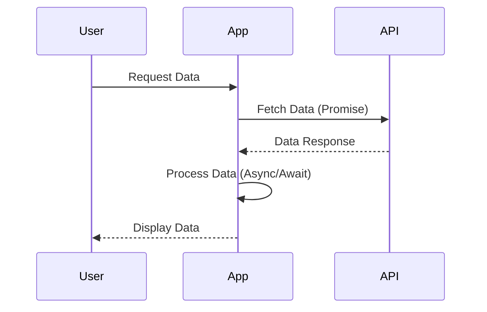

## 18.5 Combining Promises and Async/Await

In the world of JavaScript, handling asynchronous operations is a crucial skill. Asynchronous programming allows us to perform tasks like fetching data from a server, reading files, or waiting for user input without blocking the main thread. In this section, we'll delve into how to combine Promises and `async/await` to create efficient and maintainable asynchronous code.

### Understanding Promises

Before we dive into combining Promises with `async/await`, let's briefly revisit what Promises are. A Promise in JavaScript is an object that represents the eventual completion (or failure) of an asynchronous operation and its resulting value.

#### Basic Promise Syntax

Here's a simple example of a Promise:

```javascript
const myPromise = new Promise((resolve, reject) => {
  setTimeout(() => {
    resolve("Success!");
  }, 1000);
});

myPromise.then((result) => {
  console.log(result); // "Success!" after 1 second
}).catch((error) => {
  console.error(error);
});
```

In this example, `myPromise` will resolve after 1 second, logging "Success!" to the console. If there were an error, it would be caught in the `catch` block.

### Introducing Async/Await

`async/await` is a syntactic sugar built on top of Promises, making asynchronous code look and behave more like synchronous code. This can lead to cleaner and more readable code.

#### Basic Async/Await Syntax

Here's how you can use `async/await`:

```javascript
async function fetchData() {
  try {
    const response = await fetch('https://api.example.com/data');
    const data = await response.json();
    console.log(data);
  } catch (error) {
    console.error('Error fetching data:', error);
  }
}

fetchData();
```

In this example, `fetchData` is an asynchronous function that waits for the `fetch` call to complete before proceeding. If an error occurs, it is caught in the `catch` block.

### Combining Promises and Async/Await

Now that we have a basic understanding of Promises and `async/await`, let's explore how to combine them effectively.

#### Using `Promise.all` with Async/Await

`Promise.all` is a powerful method that allows you to execute multiple Promises concurrently. It returns a single Promise that resolves when all of the input Promises have resolved, or rejects if any of the input Promises reject.

Here's an example of using `Promise.all` with `async/await`:

```javascript
async function fetchMultipleData() {
  const urls = [
    'https://api.example.com/data1',
    'https://api.example.com/data2',
    'https://api.example.com/data3'
  ];

  try {
    const responses = await Promise.all(urls.map(url => fetch(url)));
    const data = await Promise.all(responses.map(response => response.json()));
    console.log(data);
  } catch (error) {
    console.error('Error fetching data:', error);
  }
}

fetchMultipleData();
```

In this example, we fetch data from multiple URLs concurrently. The `Promise.all` method ensures that all fetch requests are completed before proceeding to parse the JSON data.

#### Hybrid Approaches: Combining Callbacks, Promises, and Async/Await

While `async/await` and Promises are the modern way to handle asynchronous operations, you may encounter legacy code that uses callbacks. Let's explore how to integrate these different patterns.

Suppose you have a function that uses a callback:

```javascript
function fetchDataCallback(url, callback) {
  setTimeout(() => {
    callback(null, `Data from ${url}`);
  }, 1000);
}
```

You can convert this callback-based function to return a Promise:

```javascript
function fetchDataPromise(url) {
  return new Promise((resolve, reject) => {
    fetchDataCallback(url, (error, data) => {
      if (error) {
        reject(error);
      } else {
        resolve(data);
      }
    });
  });
}
```

Now, you can use `async/await` with this Promise-based function:

```javascript
async function fetchDataAsync() {
  try {
    const data = await fetchDataPromise('https://api.example.com/data');
    console.log(data);
  } catch (error) {
    console.error('Error fetching data:', error);
  }
}

fetchDataAsync();
```

This hybrid approach allows you to gradually transition from callbacks to Promises and `async/await`, making your codebase more modern and maintainable.

### Best Practices for Clean and Maintainable Async Code

When working with asynchronous code, it's essential to follow best practices to ensure your code is clean, efficient, and easy to maintain.

#### 1. Handle Errors Gracefully

Always handle errors in asynchronous code. Use `try...catch` with `async/await` and `.catch()` with Promises to catch and handle errors.

#### 2. Use `Promise.all` Wisely

While `Promise.all` is powerful, be cautious when using it with a large number of Promises, as it can lead to performance issues. Consider using `Promise.allSettled` if you need to handle both resolved and rejected Promises.

#### 3. Avoid Blocking the Main Thread

Asynchronous code should not block the main thread. Ensure that your asynchronous operations are non-blocking and do not cause performance bottlenecks.

#### 4. Keep Code Readable

Use `async/await` to make your asynchronous code more readable and maintainable. Avoid deeply nested Promises or callbacks, which can lead to "callback hell."

#### 5. Use Descriptive Variable Names

Use clear and descriptive variable names to make your code more understandable. This is especially important in asynchronous code, where the flow can be harder to follow.

### Visualizing Asynchronous Patterns

To better understand how Promises and `async/await` work together, let's visualize the flow of asynchronous operations using a sequence diagram.



This diagram illustrates the flow of a typical asynchronous operation where the user requests data, the app fetches data from an API using Promises, processes it with `async/await`, and finally displays it to the user.

### Try It Yourself

To reinforce your understanding, try modifying the code examples provided. For instance, add more URLs to the `Promise.all` example and observe how the code handles multiple concurrent requests. Experiment with error handling by introducing errors in the fetch requests and see how they are caught and handled.

### References and Links

For further reading on Promises and `async/await`, consider the following resources:

- [MDN Web Docs: Promises](https://developer.mozilla.org/en-US/docs/Web/JavaScript/Guide/Using_promises)
- [MDN Web Docs: Async/Await](https://developer.mozilla.org/en-US/docs/Learn/JavaScript/Asynchronous/Async_await)
- [W3Schools: JavaScript Async](https://www.w3schools.com/js/js_async.asp)

### Knowledge Check

Let's test your understanding of combining Promises and `async/await` with a few questions.

## Quiz Time!



### What is the primary benefit of using `Promise.all`?

- [x] It allows multiple Promises to be executed concurrently.
- [ ] It ensures all Promises resolve in sequence.
- [ ] It converts callbacks into Promises.
- [ ] It simplifies error handling in Promises.

> **Explanation:** `Promise.all` is used to execute multiple Promises concurrently and waits for all of them to resolve or any to reject.

### How can you handle errors when using `async/await`?

- [x] Use a `try...catch` block.
- [ ] Use `.then()` and `.catch()` methods.
- [ ] Use `Promise.all`.
- [ ] Use `Promise.resolve`.

> **Explanation:** Errors in `async/await` can be caught using a `try...catch` block, which provides a clean way to handle exceptions.

### What does `Promise.allSettled` do?

- [x] It waits for all Promises to settle, regardless of their outcome.
- [ ] It resolves when the first Promise resolves.
- [ ] It rejects when the first Promise rejects.
- [ ] It converts callbacks into Promises.

> **Explanation:** `Promise.allSettled` waits for all Promises to settle (either resolve or reject) and returns an array of their results.

### Which method can be used to convert a callback-based function into a Promise?

- [x] Wrap the function in a new Promise.
- [ ] Use `async/await`.
- [ ] Use `Promise.all`.
- [ ] Use `Promise.resolve`.

> **Explanation:** You can convert a callback-based function into a Promise by wrapping it in a new Promise and using `resolve` and `reject` to handle the callback results.

### What is the main advantage of using `async/await` over Promises?

- [x] It makes asynchronous code look and behave more like synchronous code.
- [ ] It eliminates the need for error handling.
- [ ] It allows for concurrent execution of Promises.
- [ ] It automatically handles all errors.

> **Explanation:** `async/await` provides a more readable and synchronous-like syntax for handling asynchronous operations, making the code easier to follow.

### Which of the following is a best practice for writing asynchronous code?

- [x] Handle errors gracefully.
- [ ] Avoid using `Promise.all`.
- [ ] Use deeply nested callbacks.
- [ ] Block the main thread.

> **Explanation:** Handling errors gracefully is a best practice to ensure that your asynchronous code is robust and reliable.

### What happens if one of the Promises in `Promise.all` rejects?

- [x] The entire `Promise.all` rejects immediately.
- [ ] The remaining Promises continue to execute.
- [ ] The `Promise.all` resolves with the remaining Promises.
- [ ] The rejected Promise is ignored.

> **Explanation:** If any Promise in `Promise.all` rejects, the entire `Promise.all` rejects immediately with that reason.

### How can you ensure that all Promises are executed even if some reject?

- [x] Use `Promise.allSettled`.
- [ ] Use `Promise.all`.
- [ ] Use `async/await`.
- [ ] Use `.then()` and `.catch()`.

> **Explanation:** `Promise.allSettled` waits for all Promises to settle, regardless of whether they resolve or reject, ensuring that all are executed.

### What is the purpose of the `await` keyword in `async/await`?

- [x] It pauses the execution of the function until the Promise is resolved.
- [ ] It converts a callback into a Promise.
- [ ] It ensures that all Promises are executed concurrently.
- [ ] It automatically handles errors in Promises.

> **Explanation:** The `await` keyword pauses the execution of the function until the Promise is resolved, allowing for a more synchronous-like flow.

### True or False: `async/await` can be used with any function, not just those returning Promises.

- [ ] True
- [x] False

> **Explanation:** False. `async/await` is specifically designed to work with Promises, and the `await` keyword can only be used with Promises.



Remember, mastering asynchronous programming in JavaScript takes practice. Keep experimenting with different patterns, and don't hesitate to revisit these concepts as you continue your learning journey. Happy coding!
