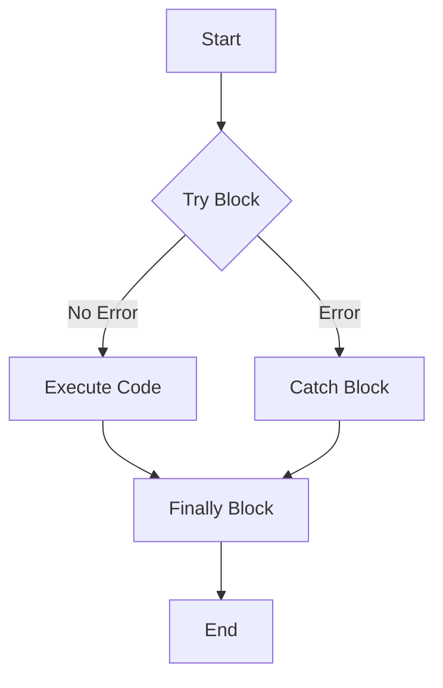

## 19.1 The `try...catch` Statement

Error handling is a crucial aspect of programming, ensuring that your code can gracefully handle unexpected situations. In JavaScript, the `try...catch` statement is a powerful tool for managing errors and exceptions. In this section, we'll explore how `try...catch` blocks work, provide examples of catching errors in synchronous code, and discuss the optional `finally` clause.

### Understanding `try...catch`

The `try...catch` statement allows you to test a block of code for errors and handle them appropriately. It consists of two main parts: the `try` block and the `catch` block. Here's a basic structure:

```javascript
try {
    // Code that may throw an error
} catch (error) {
    // Code to handle the error
}
```

#### The `try` Block

The `try` block contains code that you want to test for errors. If an error occurs within this block, the normal flow of execution is interrupted, and control is passed to the `catch` block.

#### The `catch` Block

The `catch` block is executed if an error occurs in the `try` block. It receives an error object as a parameter, which provides information about the error. You can use this object to understand what went wrong and take appropriate action.

#### Example: Basic `try...catch`

Let's look at a simple example to illustrate the use of `try...catch`:

```javascript
try {
    let result = 10 / 0; // Division by zero
    console.log(result);
} catch (error) {
    console.error("An error occurred: " + error.message);
}
```

In this example, dividing by zero doesn't throw an error in JavaScript, but let's assume it did for illustration purposes. The `catch` block would handle the error, printing a message to the console.

### Catching Errors in Synchronous Code

JavaScript is primarily a synchronous language, meaning it executes code line by line. Errors in synchronous code can be effectively managed using `try...catch`. Let's explore some common scenarios where `try...catch` is useful.

#### Example: Handling Type Errors

Consider a function that expects a number as an argument but receives a string:

```javascript
function divideNumbers(a, b) {
    try {
        if (typeof a !== 'number' || typeof b !== 'number') {
            throw new TypeError("Both arguments must be numbers");
        }
        return a / b;
    } catch (error) {
        console.error(error.message);
    }
}

divideNumbers(10, 'five'); // Outputs: Both arguments must be numbers
```

In this example, we use `try...catch` to handle a `TypeError` when the arguments are not numbers. The `throw` statement is used to create a custom error message.

#### Example: Handling Reference Errors

A `ReferenceError` occurs when you try to access a variable that hasn't been declared. Here's how you can handle it:

```javascript
try {
    console.log(nonExistentVariable);
} catch (error) {
    console.error("Caught a reference error: " + error.message);
}
```

In this case, trying to log `nonExistentVariable` results in a `ReferenceError`, which is caught and handled by the `catch` block.

### The Optional `finally` Clause

The `finally` clause is an optional block that can be added to a `try...catch` statement. It contains code that will execute regardless of whether an error occurred or not. This is useful for cleanup operations that should always run.

#### Example: Using `finally`

```javascript
function readFile(fileName) {
    try {
        // Simulate file reading
        if (!fileName) {
            throw new Error("File name is required");
        }
        console.log("Reading file: " + fileName);
    } catch (error) {
        console.error("Error reading file: " + error.message);
    } finally {
        console.log("Cleanup operations completed");
    }
}

readFile(); // Outputs error message and cleanup message
readFile("example.txt"); // Outputs file reading and cleanup message
```

In this example, the `finally` block ensures that cleanup operations are performed regardless of whether an error occurred during file reading.

### Visualizing `try...catch` Flow

To better understand the flow of a `try...catch` statement, let's visualize it using a flowchart:



**Figure 1: Flowchart of `try...catch` Execution**

This flowchart illustrates that if no error occurs in the `try` block, the code executes normally. If an error occurs, control is passed to the `catch` block. In both cases, the `finally` block is executed before the program ends.

### Practical Use Cases for `try...catch`

The `try...catch` statement is versatile and can be used in various scenarios to enhance error handling in your code.

#### Example: Validating User Input

When dealing with user input, it's essential to validate data to prevent errors. Here's an example of using `try...catch` for input validation:

```javascript
function processUserInput(input) {
    try {
        if (input.trim() === "") {
            throw new Error("Input cannot be empty");
        }
        console.log("Processing input: " + input);
    } catch (error) {
        console.error("Invalid input: " + error.message);
    }
}

processUserInput(""); // Outputs: Invalid input: Input cannot be empty
```

In this example, we ensure that the user input is not empty before processing it. If the input is empty, an error is thrown and caught.

#### Example: Handling JSON Parsing Errors

Parsing JSON data can sometimes result in errors if the data is malformed. Here's how you can handle such errors:

```javascript
function parseJSON(jsonString) {
    try {
        let data = JSON.parse(jsonString);
        console.log("Parsed data: ", data);
    } catch (error) {
        console.error("Failed to parse JSON: " + error.message);
    }
}

parseJSON('{"name": "John", "age": 30}'); // Outputs parsed data
parseJSON('Invalid JSON'); // Outputs: Failed to parse JSON
```

In this example, we attempt to parse a JSON string. If the string is not valid JSON, a `SyntaxError` is thrown and caught.

### Best Practices for Using `try...catch`

While `try...catch` is a powerful tool, it's essential to use it wisely. Here are some best practices to consider:

- **Use `try...catch` for Expected Errors**: Reserve `try...catch` for handling errors you anticipate, such as user input validation or network requests.
- **Avoid Overusing `try...catch`**: Excessive use of `try...catch` can make your code harder to read and maintain. Use it judiciously.
- **Log Errors for Debugging**: Use the `catch` block to log errors, making it easier to debug issues.
- **Use `finally` for Cleanup**: Utilize the `finally` block for cleanup operations, such as closing files or releasing resources.

### Try It Yourself

Now that we've covered the basics of `try...catch`, it's time to experiment. Try modifying the examples above to handle different types of errors or add additional logic to the `catch` and `finally` blocks. This hands-on practice will help reinforce your understanding of error handling in JavaScript.

### References and Further Reading

For more information on the `try...catch` statement, check out these resources:

- [MDN Web Docs: try...catch](https://developer.mozilla.org/en-US/docs/Web/JavaScript/Reference/Statements/try...catch)
- [W3Schools: JavaScript Errors - Throw and Try to Catch](https://www.w3schools.com/js/js_errors.asp)

### Knowledge Check

Let's test your understanding of the `try...catch` statement with a few questions. These questions will help reinforce the concepts covered in this section.

## Quiz Time!



### What is the primary purpose of the `try...catch` statement in JavaScript?

- [x] To handle errors and exceptions in code
- [ ] To loop through arrays
- [ ] To declare variables
- [ ] To define functions

> **Explanation:** The `try...catch` statement is used to handle errors and exceptions in JavaScript code.

### What happens if an error occurs in the `try` block?

- [x] Control is passed to the `catch` block
- [ ] The program stops executing
- [ ] The error is ignored
- [ ] The `finally` block is skipped

> **Explanation:** If an error occurs in the `try` block, control is passed to the `catch` block, where the error can be handled.

### Which part of the `try...catch` statement is optional?

- [x] The `finally` block
- [ ] The `try` block
- [ ] The `catch` block
- [ ] The error object

> **Explanation:** The `finally` block is optional and is used for cleanup operations that should run regardless of whether an error occurred.

### What type of error is thrown when trying to access an undeclared variable?

- [x] ReferenceError
- [ ] TypeError
- [ ] SyntaxError
- [ ] RangeError

> **Explanation:** A `ReferenceError` is thrown when trying to access a variable that hasn't been declared.

### How can you create a custom error message in JavaScript?

- [x] Use the `throw` statement
- [ ] Use the `console.log` method
- [ ] Use the `alert` function
- [ ] Use the `prompt` function

> **Explanation:** The `throw` statement is used to create a custom error message in JavaScript.

### What is the purpose of the `finally` block?

- [x] To execute code regardless of whether an error occurred
- [ ] To handle errors
- [ ] To declare variables
- [ ] To define functions

> **Explanation:** The `finally` block is used to execute code that should run regardless of whether an error occurred in the `try` block.

### Which error type is thrown when parsing invalid JSON data?

- [x] SyntaxError
- [ ] ReferenceError
- [ ] TypeError
- [ ] RangeError

> **Explanation:** A `SyntaxError` is thrown when attempting to parse invalid JSON data.

### What should you do in the `catch` block?

- [x] Handle the error and log it for debugging
- [ ] Ignore the error
- [ ] Declare variables
- [ ] Define functions

> **Explanation:** In the `catch` block, you should handle the error and log it for debugging purposes.

### Can the `finally` block be used without a `catch` block?

- [x] True
- [ ] False

> **Explanation:** The `finally` block can be used without a `catch` block, as it is optional and runs regardless of whether an error occurred.

### Is it a good practice to use `try...catch` for every function?

- [ ] True
- [x] False

> **Explanation:** It is not a good practice to use `try...catch` for every function, as it can make the code harder to read and maintain. Use it judiciously for expected errors.



### Embrace the Journey

Remember, mastering error handling with `try...catch` is just one step in your JavaScript journey. As you continue to learn and experiment, you'll build more robust and resilient applications. Keep practicing, stay curious, and enjoy the process of becoming a proficient JavaScript developer!
