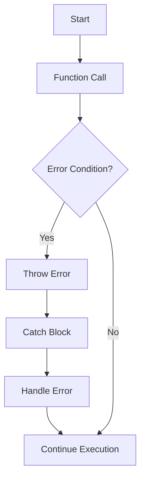

## 19.2 Throwing Errors

In the world of programming, errors are inevitable. They can arise from unexpected user input, network issues, or even logical mistakes in your code. Understanding how to handle these errors gracefully is a crucial skill for any developer. In this section, we'll delve into the concept of throwing errors in JavaScript functions, exploring how to use the `throw` keyword, when and why to throw errors, and how to create custom error messages.

### Understanding the `throw` Keyword

The `throw` keyword in JavaScript is used to create an exception. When an exception is thrown, the normal flow of the program is interrupted, and control is transferred to the nearest `catch` block that can handle the error. If no such block exists, the program will terminate with an error message.

#### Basic Syntax of `throw`

The syntax for using the `throw` keyword is straightforward. You simply follow it with an expression, which can be a string, number, boolean, object, or an instance of an `Error` object. Here's a basic example:

```javascript
function checkAge(age) {
  if (age < 18) {
    throw "Age must be 18 or older.";
  }
  return "Access granted.";
}

try {
  console.log(checkAge(16));
} catch (error) {
  console.error("Error:", error);
}
```

In this example, if the `age` is less than 18, the function throws a string as an error message. The `try...catch` block is used to handle the error, preventing the program from crashing.

### When and Why to Throw Errors

Throwing errors is a way to signal that something has gone wrong in your program. Here are some scenarios where you might want to throw an error:

1. **Invalid Input**: When a function receives input that it cannot process, throwing an error can alert the caller to the issue.
2. **Unexpected State**: If your program reaches a state that it shouldn't, an error can help you identify and fix the bug.
3. **Resource Unavailability**: When a required resource, such as a file or network connection, is unavailable, throwing an error can prevent further operations that depend on that resource.
4. **Security Concerns**: If a security check fails, throwing an error can prevent unauthorized actions.

By throwing errors in these situations, you can create more robust and reliable applications.

### Creating Custom Error Messages

While you can throw any expression as an error, using the `Error` object provides more flexibility and information. The `Error` object allows you to include a message and a name, which can help in debugging.

#### Using the `Error` Object

Here's how you can use the `Error` object to throw a more informative error:

```javascript
function divide(a, b) {
  if (b === 0) {
    throw new Error("Division by zero is not allowed.");
  }
  return a / b;
}

try {
  console.log(divide(10, 0));
} catch (error) {
  console.error(error.name + ": " + error.message);
}
```

In this example, we create a new `Error` object with a message. The `catch` block then logs the error's name and message, providing more context than a simple string.

#### Custom Error Types

JavaScript allows you to create custom error types by extending the `Error` object. This can be useful for categorizing different types of errors in your application.

```javascript
class ValidationError extends Error {
  constructor(message) {
    super(message);
    this.name = "ValidationError";
  }
}

function validateEmail(email) {
  if (!email.includes("@")) {
    throw new ValidationError("Invalid email format.");
  }
  return "Email is valid.";
}

try {
  console.log(validateEmail("invalid-email"));
} catch (error) {
  console.error(error.name + ": " + error.message);
}
```

Here, we define a `ValidationError` class that extends the `Error` object. This allows us to throw and catch errors specific to validation issues, making our code more organized and easier to debug.

### Best Practices for Throwing Errors

When throwing errors in your JavaScript code, consider the following best practices:

1. **Be Descriptive**: Provide clear and concise error messages that help identify the problem.
2. **Use Custom Errors**: Create custom error types for different error categories to improve code readability and maintainability.
3. **Avoid Throwing Strings**: Use `Error` objects instead of strings to provide more information about the error.
4. **Document Error Conditions**: Clearly document the conditions under which your functions might throw errors, so users of your code know what to expect.

### Visualizing Error Flow

To better understand how errors flow through a program, let's visualize the process using a flowchart. This diagram shows the flow of control when an error is thrown and how it is caught by a `try...catch` block.



**Figure 1: Error Flow in JavaScript**

This flowchart illustrates that when an error condition is met, the error is thrown, and control is transferred to the catch block, where the error is handled. If no error occurs, the program continues execution normally.

### Try It Yourself

To reinforce your understanding, try modifying the code examples provided. Here are some suggestions:

- Change the error messages to see how they appear in the console.
- Create a custom error type for a different scenario, such as a `NetworkError`.
- Experiment with throwing errors in different parts of a function to see how it affects the flow of execution.

### References and Further Reading

For more information on error handling in JavaScript, consider exploring the following resources:

- [MDN Web Docs: Error Handling](https://developer.mozilla.org/en-US/docs/Web/JavaScript/Guide/Control_flow_and_error_handling)
- [W3Schools: JavaScript Errors](https://www.w3schools.com/js/js_errors.asp)

### Knowledge Check

Before moving on, let's review some key points:

- The `throw` keyword is used to create exceptions in JavaScript.
- Errors can be thrown to signal invalid input, unexpected states, or resource unavailability.
- Using the `Error` object provides more information than throwing a simple string.
- Custom error types can help categorize and manage different error scenarios.

### Embrace the Journey

Remember, mastering error handling is a journey. As you practice throwing and catching errors, you'll become more adept at creating robust and reliable applications. Keep experimenting, stay curious, and enjoy the process of learning!

## Quiz Time!



### What does the `throw` keyword do in JavaScript?

- [x] It creates an exception and interrupts the normal flow of the program.
- [ ] It logs an error message to the console.
- [ ] It terminates the program immediately.
- [ ] It restarts the program from the beginning.

> **Explanation:** The `throw` keyword is used to create an exception, which interrupts the normal flow of the program and transfers control to the nearest `catch` block.

### Which of the following is a reason to throw an error in a function?

- [x] To signal invalid input.
- [x] To indicate an unexpected state.
- [x] To handle resource unavailability.
- [ ] To optimize performance.

> **Explanation:** Errors are thrown to signal issues like invalid input, unexpected states, or unavailable resources, not for performance optimization.

### What is the advantage of using the `Error` object over throwing a string?

- [x] It provides more information, such as the error name and message.
- [ ] It executes faster than throwing a string.
- [ ] It automatically logs the error to a file.
- [ ] It prevents the program from crashing.

> **Explanation:** The `Error` object provides additional information, such as the error name and message, which can aid in debugging.

### How can you create a custom error type in JavaScript?

- [x] By extending the `Error` object with a new class.
- [ ] By using the `throw` keyword with a custom string.
- [ ] By overriding the default error handler.
- [ ] By using a special error function.

> **Explanation:** Custom error types can be created by extending the `Error` object with a new class, allowing for more specific error handling.

### What should you include in an error message?

- [x] A clear and concise description of the problem.
- [ ] The entire stack trace of the program.
- [ ] The current date and time.
- [ ] The user's IP address.

> **Explanation:** Error messages should be clear and concise, describing the problem to help identify and fix the issue.

### What is the purpose of a `try...catch` block?

- [x] To handle exceptions thrown by the program.
- [ ] To optimize the performance of the code.
- [ ] To automatically fix errors in the code.
- [ ] To log all function calls to the console.

> **Explanation:** A `try...catch` block is used to handle exceptions thrown by the program, allowing for graceful error management.

### Which of the following is a best practice for throwing errors?

- [x] Use `Error` objects instead of strings.
- [x] Create custom error types for different error categories.
- [ ] Throw errors for every minor issue.
- [ ] Avoid documenting error conditions.

> **Explanation:** Best practices include using `Error` objects and creating custom error types, while documenting error conditions is essential.

### What happens if an error is thrown and not caught?

- [x] The program will terminate with an error message.
- [ ] The error will be ignored, and the program will continue.
- [ ] The error will be logged to a file automatically.
- [ ] The program will restart from the beginning.

> **Explanation:** If an error is thrown and not caught, the program will terminate with an error message.

### How can you test throwing errors in your code?

- [x] By using `try...catch` blocks to simulate error conditions.
- [ ] By removing all error handling code.
- [ ] By running the program in a different programming language.
- [ ] By disabling the JavaScript engine.

> **Explanation:** Testing throwing errors can be done by using `try...catch` blocks to simulate error conditions and observe how the program handles them.

### True or False: Throwing errors is only useful for debugging during development.

- [ ] True
- [x] False

> **Explanation:** False. Throwing errors is useful not only for debugging during development but also for handling unexpected situations in production code.


