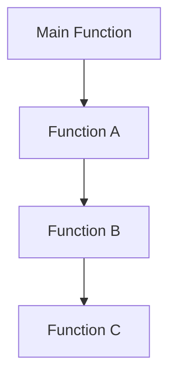
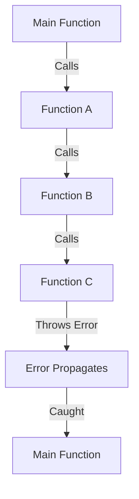

## 19.3 Error Propagation

In the world of programming, errors are inevitable. Understanding how errors propagate through your code is crucial for building robust applications. In this section, we'll explore the concept of error propagation in JavaScript, how unhandled errors can bubble up through call stacks, and strategies for handling or propagating errors effectively.

### Understanding Error Propagation

Error propagation refers to the process by which an error moves through the layers of a program's call stack. When an error occurs in a function and is not handled, it can "bubble up" to the calling function. This process continues until the error is either caught and handled or reaches the top of the call stack, potentially causing the program to terminate.

#### The Call Stack

The call stack is a data structure that keeps track of the function calls in a program. When a function is called, it is added to the stack. When the function returns, it is removed from the stack. If an error occurs and is not handled, it propagates up the stack, affecting each function in the call chain.

Here's a simple illustration of a call stack:



In this diagram, if an error occurs in `Function C` and is not handled, it will propagate to `Function B`, then to `Function A`, and finally to the `Main Function`.

### Unhandled Errors and Bubbling

When an error is not caught within a function, it bubbles up to the next function in the call stack. This process continues until the error is caught or reaches the global scope, where it can cause the program to crash.

Consider the following example:

```javascript
function functionC() {
    throw new Error("An error occurred in functionC");
}

function functionB() {
    functionC();
}

function functionA() {
    functionB();
}

function main() {
    try {
        functionA();
    } catch (error) {
        console.error("Caught an error:", error.message);
    }
}

main();
```

In this example, `functionC` throws an error, which is not caught within `functionC` or `functionB`. The error propagates up to `functionA` and is finally caught in the `main` function.

### Strategies for Error Propagation

Handling errors effectively involves deciding where and how to catch and manage them. Here are some strategies:

#### Catching Errors at the Source

One approach is to catch errors as close to the source as possible. This allows you to handle specific errors with appropriate responses, such as retrying an operation or providing user feedback.

```javascript
function functionC() {
    try {
        // Code that may throw an error
    } catch (error) {
        console.error("Error in functionC:", error.message);
        // Handle error or rethrow
    }
}
```

#### Propagating Errors to Higher Levels

In some cases, it may be more appropriate to let errors propagate to higher levels where they can be handled in a broader context. This is useful when the higher-level function has more information about the overall application state and can make better decisions.

```javascript
function functionC() {
    throw new Error("An error occurred in functionC");
}

function functionB() {
    try {
        functionC();
    } catch (error) {
        console.error("Error in functionB:", error.message);
        throw error; // Rethrow the error to propagate it
    }
}
```

#### Rethrowing Errors

Rethrowing an error allows you to add context or additional information before passing it up the stack. This can be useful for debugging and logging.

```javascript
function functionB() {
    try {
        functionC();
    } catch (error) {
        console.error("Error in functionB:", error.message);
        throw new Error("functionB failed: " + error.message);
    }
}
```

### Best Practices in Error Handling

To effectively manage errors in your JavaScript applications, consider the following best practices:

#### 1. Use `try...catch` Wisely

Use `try...catch` blocks to handle errors that you expect might occur. Avoid overusing them, as they can make your code harder to read and maintain.

#### 2. Provide Meaningful Error Messages

When throwing errors, include meaningful messages that describe the problem. This helps with debugging and provides clarity to anyone reading the code.

```javascript
throw new Error("Failed to fetch data from API");
```

#### 3. Log Errors for Debugging

Logging errors can help you track down issues in your code. Use tools like `console.error` or logging libraries to capture error details.

```javascript
console.error("Error details:", error);
```

#### 4. Avoid Silent Failures

Ensure that errors are not silently ignored. Always handle them in a way that informs the user or developer of the issue.

#### 5. Use Custom Error Types

Create custom error types for specific error conditions. This allows you to handle different types of errors in a more granular way.

```javascript
class CustomError extends Error {
    constructor(message) {
        super(message);
        this.name = "CustomError";
    }
}

throw new CustomError("A custom error occurred");
```

### Visualizing Error Propagation

Let's visualize how errors propagate through the call stack using a flowchart:



This flowchart shows the path of an error from `Function C` to the `Main Function`, where it is finally caught and handled.

### Try It Yourself

Experiment with the code examples provided. Try modifying them to see how errors propagate differently. For instance, add additional `try...catch` blocks at various levels and observe how the error handling changes.

### Knowledge Check

1. What happens when an error is not caught within a function?
2. How can rethrowing an error be beneficial?
3. Why is it important to provide meaningful error messages?

### Conclusion

Understanding error propagation is essential for building resilient JavaScript applications. By strategically handling errors and allowing them to propagate when appropriate, you can create more robust and maintainable code. Remember, this is just the beginning. As you progress, you'll build more complex and interactive web pages. Keep experimenting, stay curious, and enjoy the journey!

## Quiz Time!



### What is error propagation in JavaScript?

- [x] The process by which an error moves through the call stack.
- [ ] The method of catching errors at the source.
- [ ] The technique of logging errors for debugging.
- [ ] The practice of ignoring errors in code.

> **Explanation:** Error propagation refers to how an error moves through the call stack when it is not caught and handled.

### What is the call stack?

- [x] A data structure that keeps track of function calls in a program.
- [ ] A method for handling errors in JavaScript.
- [ ] A tool for logging errors.
- [ ] A way to ignore errors in code.

> **Explanation:** The call stack is a data structure that tracks function calls, helping manage execution context in a program.

### How can errors be caught at the source?

- [x] By using `try...catch` blocks within the function where the error occurs.
- [ ] By letting the error propagate to the global scope.
- [ ] By ignoring the error.
- [ ] By logging the error only.

> **Explanation:** Catching errors at the source involves using `try...catch` blocks within the function where the error might occur.

### What does rethrowing an error allow you to do?

- [x] Add context or additional information before passing it up the stack.
- [ ] Ignore the error completely.
- [ ] Log the error without handling it.
- [ ] Prevent the error from propagating.

> **Explanation:** Rethrowing an error allows you to add context or additional information before it continues to propagate.

### Why is it important to provide meaningful error messages?

- [x] To help with debugging and provide clarity.
- [ ] To make the code harder to read.
- [ ] To ignore the error.
- [ ] To prevent the error from propagating.

> **Explanation:** Meaningful error messages aid in debugging and provide clarity to developers and users.

### What is a custom error type?

- [x] A specific error type created for handling particular error conditions.
- [ ] A generic error type used for all errors.
- [ ] An error type that ignores errors.
- [ ] A method for logging errors.

> **Explanation:** Custom error types are specific error types created to handle particular error conditions more effectively.

### What should you avoid in error handling?

- [x] Silent failures that ignore errors.
- [ ] Logging errors for debugging.
- [ ] Providing meaningful error messages.
- [ ] Using custom error types.

> **Explanation:** Silent failures that ignore errors should be avoided to ensure issues are not overlooked.

### What is the purpose of logging errors?

- [x] To track down issues in your code.
- [ ] To ignore errors.
- [ ] To prevent errors from propagating.
- [ ] To make the code harder to read.

> **Explanation:** Logging errors helps track down issues in your code, aiding in debugging.

### How can you experiment with error propagation?

- [x] By modifying code examples to see how errors propagate differently.
- [ ] By ignoring errors in code.
- [ ] By logging errors without handling them.
- [ ] By preventing errors from propagating.

> **Explanation:** Experimenting with code examples allows you to see how errors propagate differently and understand error handling better.

### True or False: Rethrowing an error prevents it from propagating further.

- [ ] True
- [x] False

> **Explanation:** Rethrowing an error does not prevent it from propagating; it allows it to continue propagating with additional context.




