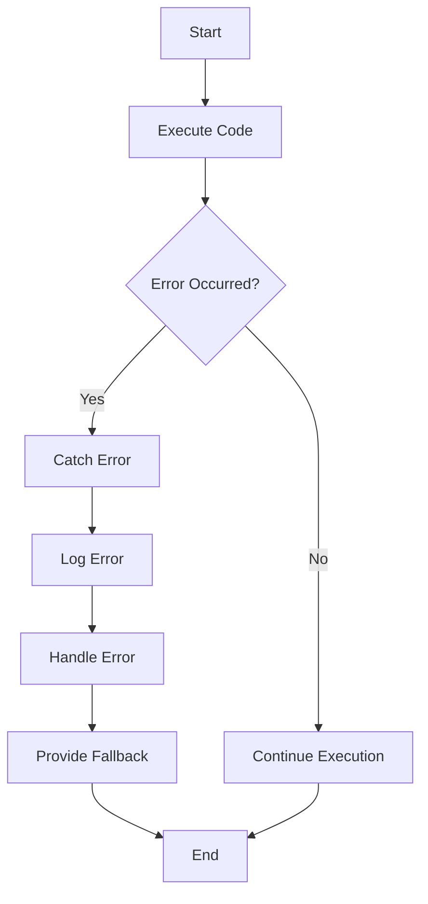

## 19.4 Best Practices for Error Handling in JavaScript Functions

In the world of programming, errors are inevitable. They can arise from a variety of sources, such as incorrect user inputs, network issues, or even logical mistakes in the code. As developers, it is crucial to handle these errors gracefully to ensure that our applications remain robust and user-friendly. In this section, we will explore best practices for error handling in JavaScript functions, focusing on strategies to manage errors effectively, the importance of informative error messages, and the dangers of suppressing errors without proper handling.

### Understanding Error Handling

Before diving into best practices, let's briefly understand what error handling entails. Error handling is the process of responding to and managing errors that occur during the execution of a program. In JavaScript, errors can be caught and managed using the `try...catch` statement, allowing developers to execute specific code in response to an error.

#### Basic Error Handling Syntax

Here's a simple example of using `try...catch` to handle errors:

```javascript
try {
  // Code that may throw an error
  let result = riskyOperation();
  console.log(result);
} catch (error) {
  // Code to handle the error
  console.error("An error occurred:", error.message);
}
```

In this example, the `riskyOperation()` function is executed within a `try` block. If an error occurs, the control is transferred to the `catch` block, where the error can be managed appropriately.

### Guidelines for Effective Error Handling

To handle errors effectively, consider the following guidelines:

#### 1. Identify Potential Error Sources

- **Analyze the Code**: Review your code to identify areas where errors are likely to occur. This includes operations involving user inputs, network requests, file handling, and any complex logic.
- **Use Defensive Programming**: Anticipate potential errors by validating inputs and checking conditions before executing critical operations.

#### 2. Use `try...catch` Wisely

- **Wrap Risky Code**: Use `try...catch` blocks around code that is prone to errors. Avoid wrapping large sections of code, as this can make it difficult to pinpoint the source of an error.
- **Limit Scope**: Keep the `try` block as small as possible to isolate the error-prone code. This makes debugging easier and improves code readability.

#### 3. Craft Informative Error Messages

- **Be Descriptive**: Provide clear and concise error messages that describe what went wrong and why. Avoid generic messages like "An error occurred."
- **Include Context**: Add relevant context to the error message, such as the function name, variable values, or operation being performed. This helps in diagnosing the issue quickly.

#### 4. Avoid Suppressing Errors

- **Log Errors**: Always log errors to the console or a logging service. This ensures that errors are not silently ignored and provides valuable information for debugging.
- **Handle Errors Appropriately**: Instead of suppressing errors, handle them in a way that allows the application to recover or fail gracefully.

#### 5. Use Custom Error Types

- **Create Custom Errors**: Define custom error classes to represent specific error conditions. This makes it easier to differentiate between different types of errors and handle them appropriately.

```javascript
class ValidationError extends Error {
  constructor(message) {
    super(message);
    this.name = "ValidationError";
  }
}

try {
  throw new ValidationError("Invalid input data");
} catch (error) {
  if (error instanceof ValidationError) {
    console.error("Validation error:", error.message);
  } else {
    console.error("An unexpected error occurred:", error.message);
  }
}
```

#### 6. Implement Graceful Degradation

- **Fallback Mechanisms**: Provide fallback mechanisms to maintain functionality when an error occurs. For example, if a network request fails, retry the request or display cached data.
- **User-Friendly Messages**: Display user-friendly messages when an error affects the user experience. Avoid technical jargon and provide actionable steps if possible.

### Code Examples and Practices

Let's explore some practical examples to illustrate these best practices.

#### Example 1: Handling Network Errors

When making network requests, errors can occur due to connectivity issues, server errors, or invalid responses. Here's how to handle such errors effectively:

```javascript
async function fetchData(url) {
  try {
    let response = await fetch(url);
    if (!response.ok) {
      throw new Error(`Network response was not ok: ${response.statusText}`);
    }
    let data = await response.json();
    return data;
  } catch (error) {
    console.error("Failed to fetch data:", error.message);
    // Fallback mechanism
    return { message: "Unable to retrieve data at this time." };
  }
}

fetchData("https://api.example.com/data")
  .then(data => console.log(data))
  .catch(error => console.error("Error in fetchData:", error));
```

In this example, we handle network errors by checking the response status and providing a fallback message if the request fails.

#### Example 2: Validating User Input

User input validation is crucial to prevent errors and ensure data integrity. Here's an example of handling validation errors:

```javascript
function processUserInput(input) {
  try {
    if (typeof input !== "string" || input.trim() === "") {
      throw new ValidationError("Input must be a non-empty string");
    }
    // Process the input
    console.log("Processing input:", input);
  } catch (error) {
    if (error instanceof ValidationError) {
      console.error("Validation error:", error.message);
    } else {
      console.error("An unexpected error occurred:", error.message);
    }
  }
}

processUserInput(""); // Validation error: Input must be a non-empty string
```

In this example, we use a custom `ValidationError` to handle invalid user inputs.

### Visualizing Error Handling Flow

To better understand the flow of error handling in JavaScript, let's visualize the process using a flowchart.



**Description**: This flowchart illustrates the error handling process in JavaScript. The code is executed, and if an error occurs, it is caught and logged. The error is then handled, and a fallback mechanism is provided if necessary.

### References and Further Reading

For more information on error handling in JavaScript, consider exploring the following resources:

- [MDN Web Docs: Error Handling](https://developer.mozilla.org/en-US/docs/Web/JavaScript/Guide/Control_flow_and_error_handling)
- [JavaScript.info: Error Handling](https://javascript.info/try-catch)
- [W3Schools: JavaScript Errors](https://www.w3schools.com/js/js_errors.asp)

### Knowledge Check

Let's test your understanding of error handling with a few questions:

1. What is the purpose of error handling in JavaScript?
2. Why is it important to provide informative error messages?
3. How can custom error types improve error handling?
4. What are some common sources of errors in JavaScript applications?

### Practice Problems

To reinforce your learning, try the following exercises:

1. Write a function that reads a file and handles errors related to file access.
2. Create a function that validates form inputs and provides user-friendly error messages.
3. Implement a retry mechanism for a network request that fails due to connectivity issues.

### Embrace the Journey

Remember, mastering error handling is a journey. As you continue to develop your skills, you'll become more adept at writing robust and resilient code. Keep experimenting, stay curious, and enjoy the process of learning and growing as a developer!

## Quiz Time!



### What is the primary purpose of error handling in JavaScript?

- [x] To manage and respond to errors during program execution
- [ ] To suppress errors and prevent them from appearing
- [ ] To make the code run faster
- [ ] To increase the complexity of the code

> **Explanation:** Error handling is used to manage and respond to errors that occur during program execution, ensuring that the application remains robust and user-friendly.

### Which of the following is a best practice for crafting error messages?

- [x] Provide clear and concise descriptions of the error
- [ ] Use technical jargon to explain the error
- [ ] Suppress the error message to avoid confusion
- [ ] Use generic messages like "An error occurred"

> **Explanation:** Error messages should be clear and concise, providing a description of what went wrong and why, to aid in diagnosing the issue.

### Why should errors not be suppressed without proper handling?

- [x] Suppressing errors can hide issues and make debugging difficult
- [ ] Suppressing errors improves application performance
- [ ] Suppressing errors is a security best practice
- [ ] Suppressing errors makes the code easier to read

> **Explanation:** Suppressing errors without proper handling can hide issues and make debugging difficult, leading to unresolved problems in the application.

### What is the benefit of using custom error types in JavaScript?

- [x] They allow for differentiation between different types of errors
- [ ] They make the code more complex
- [ ] They suppress errors automatically
- [ ] They are only useful for network errors

> **Explanation:** Custom error types allow developers to differentiate between different types of errors and handle them appropriately.

### How can fallback mechanisms improve error handling?

- [x] By providing alternative solutions when an error occurs
- [ ] By suppressing errors completely
- [ ] By increasing the complexity of error handling
- [ ] By preventing errors from occurring

> **Explanation:** Fallback mechanisms provide alternative solutions when an error occurs, helping to maintain functionality and improve user experience.

### What is a common source of errors in JavaScript applications?

- [x] Incorrect user inputs
- [ ] Perfectly written code
- [ ] Lack of network requests
- [ ] Absence of error handling

> **Explanation:** Incorrect user inputs are a common source of errors in JavaScript applications, requiring validation and handling to ensure data integrity.

### How can logging errors help in error handling?

- [x] By providing valuable information for debugging
- [ ] By suppressing errors
- [ ] By making the code run faster
- [ ] By increasing code complexity

> **Explanation:** Logging errors provides valuable information for debugging and ensures that errors are not silently ignored.

### What is the role of the `try` block in error handling?

- [x] To contain code that may throw an error
- [ ] To suppress errors
- [ ] To log errors
- [ ] To provide fallback mechanisms

> **Explanation:** The `try` block contains code that may throw an error, allowing for error handling in the `catch` block.

### What should be included in an informative error message?

- [x] A clear description of what went wrong
- [ ] Technical jargon
- [ ] Suppressed details
- [ ] Generic terms

> **Explanation:** An informative error message should include a clear description of what went wrong to aid in diagnosing the issue.

### True or False: Error handling is only necessary for network-related code.

- [ ] True
- [x] False

> **Explanation:** False. Error handling is necessary for various parts of an application, including user input validation, file handling, and complex logic, not just network-related code.


