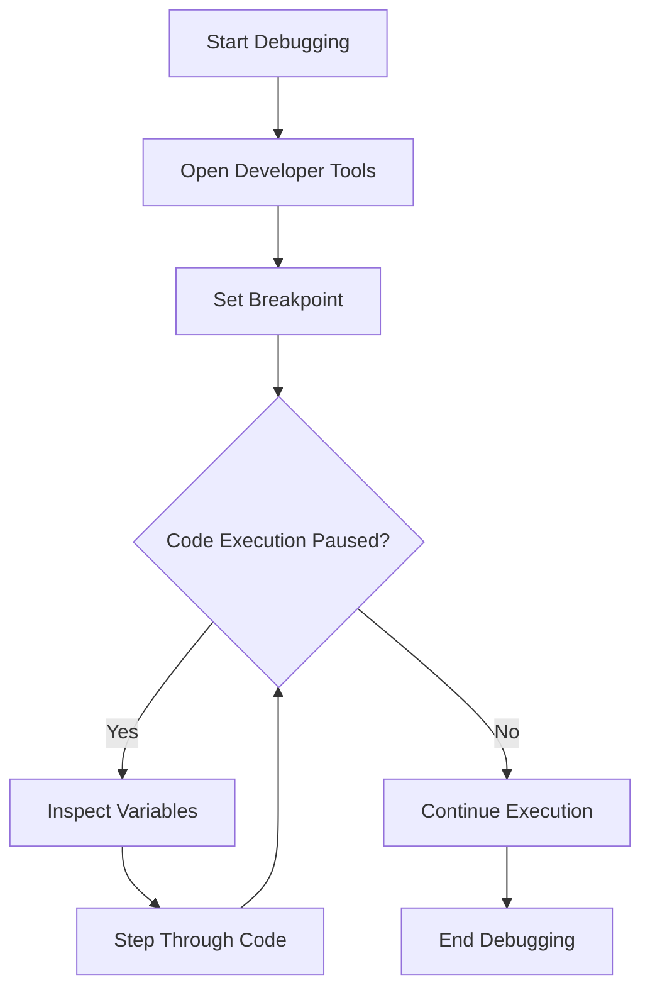

## 19.5 Logging and Debugging

In the world of programming, errors are inevitable. They can range from simple syntax mistakes to complex logical errors that can be difficult to trace. As a beginner, it's crucial to develop strong debugging skills to identify and fix these errors efficiently. In this section, we will explore the concepts of logging and debugging in JavaScript, focusing on using console methods, debugging tools, and best practices for consistent logging.

### Understanding Logging in JavaScript

Logging is the practice of recording information about a program's execution to help developers understand what is happening at any given point. This can be especially useful for identifying where things go wrong. In JavaScript, logging is typically done using the `console` object, which provides various methods to output information to the browser's console.

#### Console Methods for Logging

The `console` object in JavaScript offers several methods for logging different types of information. Let's explore some of the most commonly used methods:

1. **`console.log()`**: This is the most basic logging method. It outputs a message to the console.
   
   ```javascript
   console.log("Hello, world!");
   ```

2. **`console.error()`**: Use this method to log error messages. It typically displays the message in red, making it easy to spot errors.

   ```javascript
   console.error("An error occurred!");
   ```

3. **`console.warn()`**: This method logs warning messages. Warnings are less severe than errors but still indicate potential issues.

   ```javascript
   console.warn("This is a warning!");
   ```

4. **`console.info()`**: Similar to `console.log()`, but intended for informational messages.

   ```javascript
   console.info("This is an informational message.");
   ```

5. **`console.debug()`**: Used for debugging purposes. In some environments, these messages might not be displayed by default.

   ```javascript
   console.debug("Debugging information.");
   ```

6. **`console.table()`**: This method displays data as a table, which can be very useful for visualizing arrays or objects.

   ```javascript
   const users = [
     { name: "Alice", age: 25 },
     { name: "Bob", age: 30 }
   ];
   console.table(users);
   ```

7. **`console.group()` and `console.groupEnd()`**: These methods allow you to group related log messages together, making it easier to read complex logs.

   ```javascript
   console.group("User Details");
   console.log("Name: Alice");
   console.log("Age: 25");
   console.groupEnd();
   ```

8. **`console.time()` and `console.timeEnd()`**: Use these methods to measure the time taken by a block of code to execute.

   ```javascript
   console.time("Loop Time");
   for (let i = 0; i < 1000; i++) {
     // Some operation
   }
   console.timeEnd("Loop Time");
   ```

### Best Practices for Logging

To make the most of logging, it's important to follow some best practices:

- **Be Consistent**: Use a consistent format for log messages to make them easier to read and understand.
- **Log Meaningful Information**: Avoid logging too much information, as it can clutter the console and make it difficult to find relevant messages.
- **Use Appropriate Log Levels**: Differentiate between logs, warnings, and errors to prioritize issues.
- **Remove or Minimize Logs in Production**: Excessive logging can impact performance and expose sensitive information. Use logging judiciously in production environments.

### Debugging JavaScript Code

Debugging is the process of identifying and fixing errors in your code. JavaScript provides several tools and techniques to help with debugging.

#### Using Breakpoints

Breakpoints are a powerful feature that allows you to pause the execution of your code at a specific line. This lets you inspect the current state of your program, including variable values and the call stack.

To set a breakpoint:

1. Open the developer tools in your browser (usually by pressing F12 or right-clicking and selecting "Inspect").
2. Navigate to the "Sources" tab.
3. Find the JavaScript file you want to debug.
4. Click on the line number where you want to set a breakpoint.

Once a breakpoint is set, your code will pause execution at that line, allowing you to inspect the current state.

#### Step Through Code

When your code is paused at a breakpoint, you can step through it line by line to observe how it executes. This is useful for understanding the flow of your program and identifying where things go wrong.

- **Step Over**: Execute the next line of code, but don't step into any functions.
- **Step Into**: Execute the next line of code and step into any functions that are called.
- **Step Out**: Continue execution until the current function returns.

#### Watch Expressions

Watch expressions allow you to monitor the value of specific variables or expressions as you step through your code. This can be helpful for tracking changes and identifying unexpected behavior.

To add a watch expression:

1. Open the "Watch" panel in the developer tools.
2. Click "Add Expression" and enter the variable or expression you want to watch.

#### Call Stack

The call stack shows the sequence of function calls that led to the current point in execution. It helps you understand how you arrived at a particular line of code and can be useful for tracing the source of errors.

#### Conditional Breakpoints

Conditional breakpoints allow you to pause execution only when a specific condition is met. This is useful for debugging loops or frequently called functions.

To set a conditional breakpoint:

1. Right-click on a line number in the "Sources" tab.
2. Select "Add Conditional Breakpoint".
3. Enter the condition that must be true for the breakpoint to trigger.

### Debugging Tools

In addition to the built-in developer tools in browsers, there are several other tools and libraries that can aid in debugging JavaScript code:

- **Linting Tools**: Tools like ESLint can help identify potential errors and enforce coding standards before you even run your code.
- **Debugging Libraries**: Libraries like `debug` provide advanced logging capabilities and can be configured to show different levels of detail.
- **Error Tracking Services**: Services like Sentry or LogRocket can help track errors in production environments, providing detailed reports and insights.

### Consistent Logging Practices

Consistent logging practices are essential for maintaining and debugging applications. Here are some tips to ensure your logging is effective:

- **Use Descriptive Messages**: Ensure your log messages are descriptive and provide enough context to understand the issue.
- **Include Timestamps**: Timestamps can help you track when an issue occurred, which is especially useful for debugging time-sensitive problems.
- **Categorize Logs**: Use categories or tags to organize logs, making it easier to filter and search for specific messages.
- **Regularly Review Logs**: Regularly review your logs to identify patterns or recurring issues that may need attention.

### Try It Yourself

To reinforce your understanding of logging and debugging, try modifying the following code examples:

1. **Add a `console.warn()` message** to indicate a potential issue in the code.
2. **Set a breakpoint** in the loop to inspect the value of `i` at each iteration.
3. **Use `console.time()` and `console.timeEnd()`** to measure the execution time of the loop.

```javascript
console.time("Loop Execution Time");
for (let i = 0; i < 5; i++) {
  console.log(`Iteration: ${i}`);
  if (i === 3) {
    console.warn("Potential issue detected!");
  }
}
console.timeEnd("Loop Execution Time");
```

### Visualizing the Debugging Process

To better understand the debugging process, let's visualize the flow of setting breakpoints and stepping through code using a flowchart.



**Diagram Description**: This flowchart illustrates the debugging process, starting with opening developer tools, setting breakpoints, and stepping through code to inspect variables and understand the program flow.

### References and Links

For further reading and deeper dives into logging and debugging in JavaScript, consider the following resources:

- [MDN Web Docs: Console](https://developer.mozilla.org/en-US/docs/Web/API/Console)
- [MDN Web Docs: Debugging JavaScript](https://developer.mozilla.org/en-US/docs/Learn/JavaScript/First_steps/Debugging)
- [W3Schools: JavaScript Debugging](https://www.w3schools.com/js/js_debugging.asp)

### Knowledge Check

To ensure you've grasped the key concepts of logging and debugging, try answering the following questions:

## Quiz Time!



### What is the primary purpose of logging in JavaScript?

- [x] To record information about a program's execution for debugging purposes.
- [ ] To execute code faster.
- [ ] To enhance the visual appearance of a webpage.
- [ ] To compile JavaScript code into machine code.

> **Explanation:** Logging is used to record information about a program's execution, which helps in debugging and understanding the program's flow.

### Which console method is used to log error messages?

- [ ] console.log()
- [x] console.error()
- [ ] console.warn()
- [ ] console.info()

> **Explanation:** The `console.error()` method is specifically used to log error messages, often displayed in red for visibility.

### What is a breakpoint in debugging?

- [x] A point in the code where execution is paused for inspection.
- [ ] A method to log messages to the console.
- [ ] A tool for measuring code performance.
- [ ] A way to compile JavaScript code.

> **Explanation:** A breakpoint is a point in the code where execution is paused, allowing developers to inspect the current state of the program.

### How can you measure the execution time of a block of code?

- [x] Using `console.time()` and `console.timeEnd()`.
- [ ] Using `console.log()`.
- [ ] Using `console.warn()`.
- [ ] Using `console.error()`.

> **Explanation:** `console.time()` and `console.timeEnd()` are used to measure the time taken by a block of code to execute.

### What is the purpose of using `console.group()` and `console.groupEnd()`?

- [x] To group related log messages together for better readability.
- [ ] To execute code in groups.
- [ ] To measure the execution time of code.
- [ ] To log error messages.

> **Explanation:** `console.group()` and `console.groupEnd()` are used to group related log messages, making them easier to read and understand.

### What is a watch expression in debugging?

- [x] A feature that allows you to monitor the value of specific variables or expressions.
- [ ] A method to log messages to the console.
- [ ] A tool for measuring code performance.
- [ ] A way to compile JavaScript code.

> **Explanation:** A watch expression allows you to monitor the value of specific variables or expressions as you step through your code.

### Which method is used to log informational messages?

- [ ] console.log()
- [ ] console.error()
- [ ] console.warn()
- [x] console.info()

> **Explanation:** The `console.info()` method is used to log informational messages, similar to `console.log()`.

### What is the call stack used for in debugging?

- [x] To show the sequence of function calls that led to the current point in execution.
- [ ] To log messages to the console.
- [ ] To measure code performance.
- [ ] To compile JavaScript code.

> **Explanation:** The call stack shows the sequence of function calls, helping developers understand how they arrived at a particular line of code.

### True or False: Conditional breakpoints pause execution only when a specific condition is met.

- [x] True
- [ ] False

> **Explanation:** Conditional breakpoints pause execution only when a specified condition is true, making them useful for debugging loops or frequently called functions.

### True or False: Excessive logging in production can impact performance.

- [x] True
- [ ] False

> **Explanation:** Excessive logging can impact performance and expose sensitive information, so it should be used judiciously in production environments.



### Embrace the Journey

Remember, logging and debugging are essential skills for every developer. As you continue to learn and practice, you'll become more adept at identifying and fixing errors in your code. Keep experimenting, stay curious, and enjoy the journey of mastering JavaScript!
