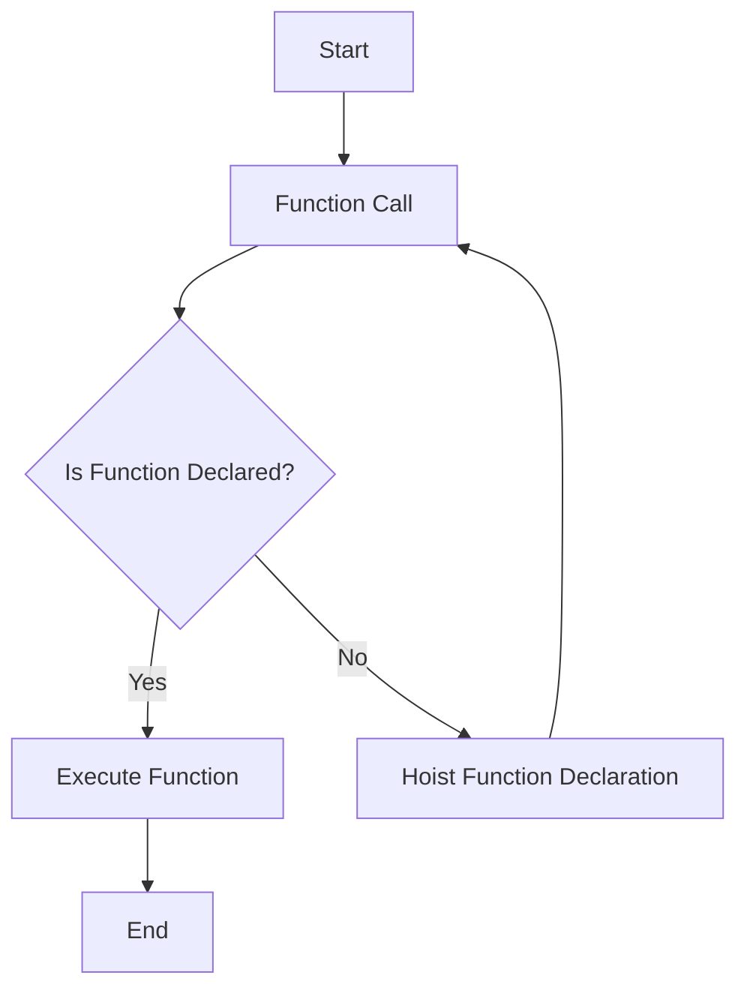

## 2.1 Function Declarations

Welcome to the exciting world of JavaScript functions! In this section, we'll delve into function declarations, one of the fundamental building blocks of JavaScript programming. By the end of this article, you'll have a solid understanding of how to define functions using the `function` keyword, comprehend the concept of hoisting, and appreciate the differences between function declarations and other types of functions. Let's get started!

### What is a Function Declaration?

A function declaration is a way to define a function in JavaScript. Functions are reusable blocks of code that perform a specific task. They help organize code, making it more readable and maintainable. When you declare a function, you essentially create a blueprint for a task that can be executed whenever needed.

#### Syntax of a Function Declaration

The syntax of a function declaration is straightforward. It begins with the `function` keyword, followed by the name of the function, a set of parentheses `()`, and a block of code enclosed in curly braces `{}`. Here's a basic example:

```javascript
function greet() {
    console.log("Hello, World!");
}
```

In this example, we've declared a function named `greet`. When called, this function will execute the code inside its body, which is to log "Hello, World!" to the console.

#### Key Components of a Function Declaration

1. **Function Keyword**: The `function` keyword is essential to declare a function.
2. **Function Name**: A descriptive name that identifies the function. It should follow the naming conventions of JavaScript identifiers.
3. **Parameters**: Enclosed within parentheses, parameters are placeholders for values that can be passed into the function. In the above example, there are no parameters, but we'll explore this concept further in later sections.
4. **Function Body**: Enclosed within curly braces, this is where the code to be executed resides.

#### Example: Function with Parameters

Let's enhance our previous example by adding parameters:

```javascript
function greet(name) {
    console.log("Hello, " + name + "!");
}
```

Here, the `greet` function takes a single parameter `name`. When we call this function and pass a value for `name`, it will personalize the greeting.

### Hoisting Behavior of Function Declarations

One of the unique characteristics of function declarations in JavaScript is hoisting. Hoisting is a behavior in which function declarations are moved to the top of their containing scope during the compilation phase. This means you can call a function before it is declared in the code.

#### Example of Hoisting

Consider the following code:

```javascript
sayHello();

function sayHello() {
    console.log("Hello, Hoisting!");
}
```

Even though the `sayHello` function is called before its declaration, the code works perfectly due to hoisting. JavaScript recognizes the function declaration and moves it to the top of the scope, allowing the function call to succeed.

#### Visualizing Hoisting

To better understand hoisting, let's visualize it using a diagram:



*Caption: This flowchart illustrates the hoisting process in JavaScript, where function declarations are moved to the top of their scope, allowing them to be called before they are defined.*

### Comparing Function Declarations with Other Types

In JavaScript, there are several ways to define functions, including function declarations, function expressions, and arrow functions. Let's compare function declarations with these other types.

#### Function Declarations vs. Function Expressions

A function expression involves creating a function and assigning it to a variable. Unlike function declarations, function expressions are not hoisted. Here's an example:

```javascript
const greetExpression = function(name) {
    console.log("Hello, " + name + "!");
};

greetExpression("Alice");
```

In this case, the function is assigned to the variable `greetExpression`. You must declare the function expression before calling it, as it is not hoisted.

#### Function Declarations vs. Arrow Functions

Arrow functions, introduced in ES6, provide a more concise syntax for writing functions. However, they differ from function declarations in terms of `this` binding and hoisting. Here's an example:

```javascript
const greetArrow = (name) => {
    console.log("Hello, " + name + "!");
};

greetArrow("Bob");
```

Arrow functions are not hoisted and have a lexical `this` binding, meaning they inherit `this` from the surrounding code.

### Best Practices for Using Function Declarations

To make the most of function declarations, consider the following best practices:

1. **Use Descriptive Names**: Choose clear and descriptive names for your functions to make your code more readable.
2. **Keep Functions Focused**: Each function should perform a single task or responsibility. This makes them easier to test and maintain.
3. **Avoid Global Functions**: Limit the use of global functions to prevent naming conflicts and improve modularity.
4. **Document Your Functions**: Use comments to explain the purpose and usage of your functions, especially if they are complex.
5. **Leverage Hoisting**: Take advantage of hoisting to organize your code logically, but be mindful of potential pitfalls.

### Try It Yourself

Now that we've covered the basics of function declarations, it's time to experiment! Try modifying the examples above by adding more parameters or changing the function body. Observe how hoisting affects the execution of your code.

### Knowledge Check

Before we wrap up, let's reinforce what we've learned with a few questions:

1. What is the primary purpose of a function declaration in JavaScript?
2. How does hoisting affect function declarations?
3. What are the key differences between function declarations and function expressions?
4. Why is it important to use descriptive names for functions?
5. How can you leverage hoisting to organize your code?

### Summary

In this section, we've explored the concept of function declarations in JavaScript. We've learned about their syntax, hoisting behavior, and how they compare to other types of functions. By following best practices, you can write clean and efficient code using function declarations. Remember, this is just the beginning of your journey into JavaScript functions. Keep experimenting, stay curious, and enjoy the process!

## Quiz Time!



### What is a function declaration in JavaScript?

- [x] A way to define a function using the `function` keyword.
- [ ] A method to call a function.
- [ ] A variable that stores a function.
- [ ] A type of loop in JavaScript.

> **Explanation:** A function declaration is a way to define a function using the `function` keyword, followed by the function name and body.

### Which of the following is true about function declarations and hoisting?

- [x] Function declarations are hoisted to the top of their scope.
- [ ] Function declarations are not hoisted.
- [ ] Only function expressions are hoisted.
- [ ] Hoisting does not affect functions.

> **Explanation:** Function declarations are hoisted, meaning they can be called before they are defined in the code.

### How do function declarations differ from function expressions?

- [x] Function declarations are hoisted, while function expressions are not.
- [ ] Function expressions are hoisted, while function declarations are not.
- [ ] Both are hoisted.
- [ ] Neither are hoisted.

> **Explanation:** Function declarations are hoisted, allowing them to be called before they are defined, while function expressions are not hoisted.

### What is a best practice when naming functions?

- [x] Use descriptive names that indicate the function's purpose.
- [ ] Use single-letter names for brevity.
- [ ] Avoid using names for functions.
- [ ] Use the same name for all functions.

> **Explanation:** Descriptive names help make the code more readable and maintainable.

### Which of the following is a characteristic of arrow functions?

- [x] They have a lexical `this` binding.
- [ ] They are hoisted like function declarations.
- [ ] They require the `function` keyword.
- [ ] They cannot accept parameters.

> **Explanation:** Arrow functions have a lexical `this` binding, meaning they inherit `this` from the surrounding code.

### What is the purpose of the `function` keyword in a function declaration?

- [x] It indicates the start of a function declaration.
- [ ] It is used to call a function.
- [ ] It is a placeholder for parameters.
- [ ] It is used to end a function.

> **Explanation:** The `function` keyword is used to declare a function, indicating the start of the function definition.

### Why is it important to avoid global functions?

- [x] To prevent naming conflicts and improve modularity.
- [ ] To make the code more complex.
- [ ] To ensure functions are always available.
- [ ] To reduce the number of functions in the code.

> **Explanation:** Avoiding global functions helps prevent naming conflicts and promotes modularity in the code.

### What happens if you call a function before its declaration?

- [x] It works if the function is declared using a function declaration.
- [ ] It always results in an error.
- [ ] It only works with arrow functions.
- [ ] It only works with function expressions.

> **Explanation:** Due to hoisting, function declarations can be called before they are defined in the code.

### What is the key difference between function declarations and arrow functions?

- [x] Arrow functions have a lexical `this` binding, while function declarations do not.
- [ ] Function declarations are more concise.
- [ ] Arrow functions are hoisted.
- [ ] Function declarations cannot have parameters.

> **Explanation:** Arrow functions have a lexical `this` binding, meaning they inherit `this` from the surrounding code, unlike function declarations.

### True or False: Function expressions are hoisted in JavaScript.

- [ ] True
- [x] False

> **Explanation:** Function expressions are not hoisted, meaning they must be defined before they are called in the code.



Remember, this is just the beginning. As you progress, you'll build more complex and interactive web pages. Keep experimenting, stay curious, and enjoy the journey!
