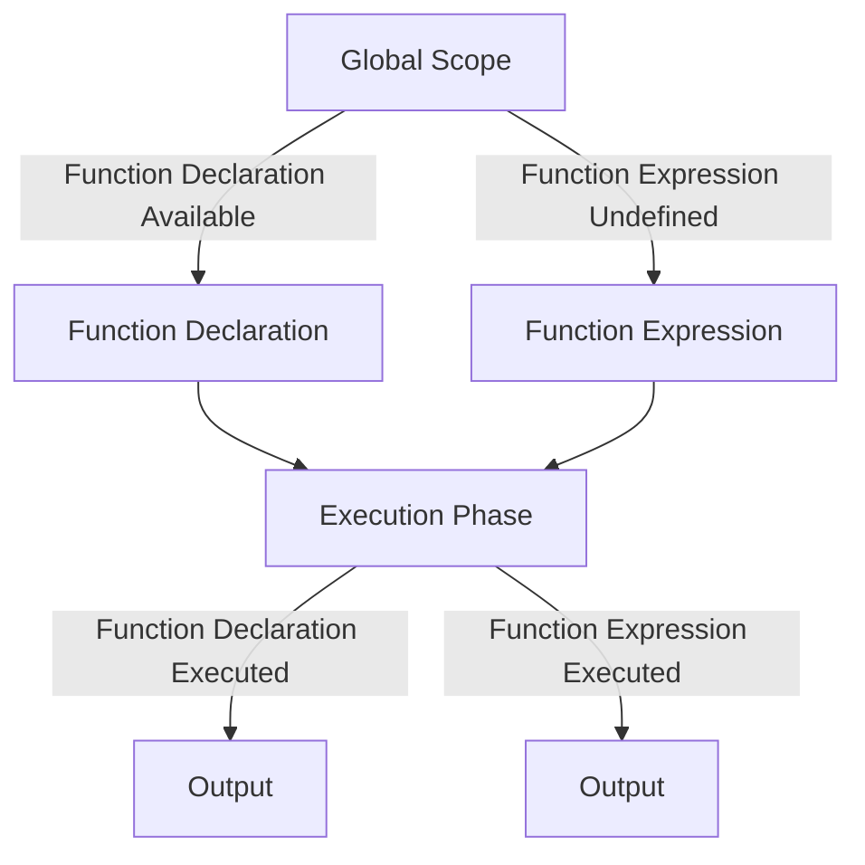

## 2.2 Function Expressions

In the world of JavaScript, functions are versatile and powerful tools that can be used in a variety of ways to enhance your code. One of the key concepts to understand when working with functions is the difference between function declarations and function expressions. In this section, we will delve into function expressions, exploring what they are, how they differ from function declarations, and how they can be used effectively in your JavaScript programs.

### What is a Function Expression?

A function expression is a way to define a function in JavaScript where the function is assigned to a variable. This is in contrast to a function declaration, where the function is defined using the `function` keyword followed by the function name. Function expressions provide flexibility in how functions are used and can be particularly useful in certain programming scenarios.

#### Syntax of Function Expressions

Function expressions can be either named or anonymous. Let's explore both types with examples:

**Anonymous Function Expression:**

```javascript
// Assigning an anonymous function to a variable
const greet = function() {
    console.log("Hello, World!");
};

// Invoking the function
greet(); // Output: Hello, World!
```

In the example above, we create an anonymous function (a function without a name) and assign it to the variable `greet`. We can then call `greet()` to execute the function.

**Named Function Expression:**

```javascript
// Assigning a named function to a variable
const sayHello = function hello() {
    console.log("Hello, everyone!");
};

// Invoking the function
sayHello(); // Output: Hello, everyone!
```

Here, the function has a name (`hello`), but it is still assigned to the variable `sayHello`. The name can be useful for debugging purposes, as it will appear in stack traces.

### Function Expressions vs. Function Declarations

Understanding the differences between function expressions and function declarations is crucial for writing effective JavaScript code. Let's explore these differences:

1. **Hoisting:**
   - **Function Declarations** are hoisted, meaning they are available throughout their containing scope even before they are defined in the code. This is because the JavaScript engine moves declarations to the top of their scope during the compilation phase.
   - **Function Expressions** are not hoisted. They are only available after the point in the code where they are defined. This is because the variable to which the function is assigned is hoisted, but the assignment itself is not.

   ```javascript
   // Function Declaration
   console.log(add(2, 3)); // Output: 5

   function add(a, b) {
       return a + b;
   }

   // Function Expression
   console.log(subtract(5, 2)); // Error: subtract is not defined

   const subtract = function(a, b) {
       return a - b;
   };
   ```

   In the example above, the `add` function can be called before its declaration, but the `subtract` function cannot be called before its expression.

2. **Naming:**
   - **Function Declarations** require a name.
   - **Function Expressions** can be either named or anonymous, providing more flexibility.

3. **Scope:**
   - Both function declarations and expressions create functions that have their own local scope. However, the timing of when they become available in the code differs due to hoisting.

### Functions as First-Class Citizens

In JavaScript, functions are first-class citizens, which means they can be treated like any other value. This allows functions to be:

- **Assigned to variables:** As we've seen with function expressions.
- **Passed as arguments:** Functions can be passed to other functions as arguments.
- **Returned from functions:** Functions can return other functions.

This flexibility enables powerful programming techniques such as higher-order functions and callbacks.

#### Example: Passing Functions as Arguments

```javascript
function executeFunction(fn) {
    fn();
}

const sayHi = function() {
    console.log("Hi there!");
};

executeFunction(sayHi); // Output: Hi there!
```

In this example, we pass the `sayHi` function as an argument to `executeFunction`, which then calls it.

### Use Cases for Function Expressions

Function expressions are particularly useful in several scenarios:

1. **Callbacks:** When you need to pass a function as an argument to another function, such as in event handling or asynchronous operations.

   ```javascript
   document.getElementById("myButton").addEventListener("click", function() {
       console.log("Button clicked!");
   });
   ```

2. **IIFEs (Immediately Invoked Function Expressions):** These are function expressions that are executed immediately after they are defined. They are often used to create a new scope and avoid polluting the global scope.

   ```javascript
   (function() {
       console.log("This is an IIFE!");
   })();
   ```

3. **Encapsulation:** Function expressions can be used to encapsulate code and create private variables and functions.

   ```javascript
   const counter = (function() {
       let count = 0;
       return function() {
           count += 1;
           return count;
       };
   })();

   console.log(counter()); // Output: 1
   console.log(counter()); // Output: 2
   ```

4. **Modular Code:** Function expressions can help in organizing code into modules, especially when combined with closures.

### Scope and Hoisting Differences

As mentioned earlier, function expressions are not hoisted like function declarations. This means that you must define a function expression before you use it in your code. This behavior can help prevent certain types of bugs, as it enforces a more logical flow of code execution.

#### Example: Scope and Hoisting

```javascript
console.log(typeof myFunction); // Output: undefined

var myFunction = function() {
    console.log("This is a function expression.");
};

myFunction(); // Output: This is a function expression.
```

In this example, the variable `myFunction` is hoisted, but its assignment is not. Therefore, before the assignment, `myFunction` is `undefined`.

### Try It Yourself

To solidify your understanding of function expressions, try modifying the examples above. For instance, create a function expression that takes two numbers as parameters and returns their product. Experiment with passing this function as an argument to another function.

### Visualizing Function Expressions

To help visualize the concept of function expressions and their scope, let's look at a diagram that illustrates the differences between function declarations and expressions in terms of hoisting and execution.



**Diagram Explanation:** This diagram shows that function declarations are available throughout the global scope, while function expressions are undefined until the execution phase. Both are executed in the execution phase, producing output.

### References and Further Reading

For more information on function expressions and related topics, consider exploring the following resources:

- [MDN Web Docs: Function Expressions](https://developer.mozilla.org/en-US/docs/Web/JavaScript/Reference/Operators/function)
- [W3Schools: JavaScript Functions](https://www.w3schools.com/js/js_functions.asp)

### Knowledge Check

Before we wrap up, let's review some key points:

- Function expressions are not hoisted, unlike function declarations.
- Function expressions can be anonymous or named.
- Functions in JavaScript are first-class citizens, meaning they can be assigned to variables, passed as arguments, and returned from other functions.
- Use cases for function expressions include callbacks, IIFEs, encapsulation, and modular code.

### Embrace the Journey

Remember, learning JavaScript is a journey, and understanding function expressions is just one step along the way. As you continue to explore and experiment with JavaScript, you'll discover even more powerful ways to use functions to create dynamic and interactive web applications. Keep practicing, stay curious, and enjoy the process!

## Quiz Time!



### What is a function expression in JavaScript?

- [x] A function assigned to a variable
- [ ] A function declared with the `function` keyword
- [ ] A function that is hoisted
- [ ] A function that cannot be anonymous

> **Explanation:** A function expression is a function assigned to a variable, which can be anonymous or named.

### Which of the following is true about function expressions?

- [x] They are not hoisted
- [ ] They are always hoisted
- [ ] They must have a name
- [ ] They cannot be used as callbacks

> **Explanation:** Function expressions are not hoisted, meaning they are only available after their definition in the code.

### How do function expressions differ from function declarations?

- [x] Function expressions are not hoisted
- [ ] Function expressions must be named
- [ ] Function expressions are hoisted
- [ ] Function declarations cannot be named

> **Explanation:** Function expressions are not hoisted, unlike function declarations, which are available throughout their scope.

### What is an Immediately Invoked Function Expression (IIFE)?

- [x] A function expression that is executed immediately after it is defined
- [ ] A function expression that is hoisted
- [ ] A function declaration that is executed immediately
- [ ] A function that cannot be anonymous

> **Explanation:** An IIFE is a function expression that is executed immediately after it is defined, often used to create a new scope.

### Which of the following is a use case for function expressions?

- [x] Callbacks
- [x] IIFEs
- [ ] Hoisting
- [ ] Global variables

> **Explanation:** Function expressions are commonly used for callbacks and IIFEs, among other scenarios.

### Can function expressions be named?

- [x] Yes
- [ ] No

> **Explanation:** Function expressions can be named, although they are often anonymous.

### What does it mean for functions to be first-class citizens in JavaScript?

- [x] Functions can be assigned to variables
- [x] Functions can be passed as arguments
- [ ] Functions cannot be returned from other functions
- [ ] Functions must be declared with the `function` keyword

> **Explanation:** Functions being first-class citizens means they can be assigned to variables, passed as arguments, and returned from other functions.

### What happens if you try to call a function expression before it is defined?

- [x] You get an error
- [ ] The function is hoisted and executes
- [ ] The function executes with default parameters
- [ ] The function is ignored

> **Explanation:** Calling a function expression before it is defined results in an error because function expressions are not hoisted.

### What is a named function expression useful for?

- [x] Debugging
- [ ] Hoisting
- [ ] Global scope
- [ ] Avoiding errors

> **Explanation:** Named function expressions are useful for debugging, as the name appears in stack traces.

### Function expressions can be used to create private variables. True or False?

- [x] True
- [ ] False

> **Explanation:** Function expressions can be used to create private variables, especially when combined with closures.


