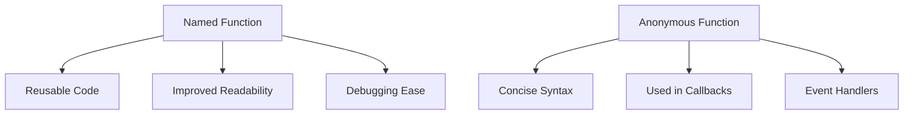

## 2.3 Named vs. Anonymous Functions

In the world of JavaScript, functions are fundamental building blocks that allow us to encapsulate code for reuse, organization, and abstraction. As we delve deeper into functions, it's essential to understand the distinction between **named functions** and **anonymous functions**. This knowledge will empower you to choose the right type of function for different scenarios, enhancing your code's readability and maintainability.

### Understanding Named Functions

**Named functions** are functions that have a specific name assigned to them. This name is used to reference the function, making it easier to identify and call. Named functions are typically defined using the `function` keyword followed by a unique identifier.

#### Syntax of Named Functions

Here's a basic example of a named function:

```javascript
function greet(name) {
    return `Hello, ${name}!`;
}

// Invoking the named function
console.log(greet('Alice')); // Output: Hello, Alice!
```

In this example, `greet` is the name of the function. The function takes one parameter, `name`, and returns a greeting message.

#### Benefits of Named Functions

1. **Readability**: Named functions improve code readability by providing a clear identifier that describes the function's purpose.
2. **Reusability**: Named functions can be easily reused throughout your code by calling them with their name.
3. **Debugging**: When debugging, named functions provide meaningful names in stack traces, making it easier to locate the source of errors.
4. **Self-documenting**: The function name often serves as documentation, explaining what the function does.

#### Drawbacks of Named Functions

1. **Global Namespace Pollution**: If not managed properly, named functions can lead to namespace pollution, especially when defined in the global scope.
2. **Overhead**: Named functions require a unique identifier, which can be cumbersome in cases where the function is used only once.

### Exploring Anonymous Functions

**Anonymous functions** are functions without a name. They are often used in situations where a function is needed temporarily or as an argument to another function. Anonymous functions are typically defined using function expressions.

#### Syntax of Anonymous Functions

Here's an example of an anonymous function:

```javascript
const greet = function(name) {
    return `Hello, ${name}!`;
};

// Invoking the anonymous function
console.log(greet('Bob')); // Output: Hello, Bob!
```

In this example, the function is assigned to the variable `greet`, but the function itself does not have a name.

#### Benefits of Anonymous Functions

1. **Conciseness**: Anonymous functions are concise and often used for short, one-off operations.
2. **Encapsulation**: They help encapsulate functionality without polluting the global namespace.
3. **Flexibility**: Anonymous functions can be easily passed as arguments to other functions, making them ideal for callbacks.

#### Drawbacks of Anonymous Functions

1. **Debugging Challenges**: Without a name, anonymous functions can make debugging more challenging, as stack traces may not provide meaningful information.
2. **Readability**: In complex codebases, anonymous functions can reduce readability, as their purpose may not be immediately clear.

### Named vs. Anonymous Functions: Key Differences

To better understand the differences between named and anonymous functions, let's compare them side by side:

| Aspect            | Named Functions                                      | Anonymous Functions                                  |
|-------------------|------------------------------------------------------|------------------------------------------------------|
| **Definition**    | Defined with a specific name                         | Defined without a name                               |
| **Syntax**        | `function name() {}`                                 | `const name = function() {}` or `() => {}`           |
| **Readability**   | More readable due to descriptive names               | Less readable in complex scenarios                   |
| **Debugging**     | Easier to debug with meaningful stack traces         | Harder to debug due to lack of names                 |
| **Use Cases**     | Reusable, self-documenting functions                 | Temporary, one-off functions, often in callbacks     |
| **Namespace**     | Can lead to global namespace pollution               | Encapsulated, reducing namespace issues              |

### Anonymous Functions in Callbacks and Event Handlers

Anonymous functions shine in scenarios where functions are used as arguments, such as callbacks and event handlers. Let's explore these use cases in detail.

#### Anonymous Functions as Callbacks

A **callback** is a function passed as an argument to another function, which is then executed within the outer function. Anonymous functions are commonly used as callbacks due to their concise syntax.

Here's an example using the `setTimeout` function, which executes a callback after a specified delay:

```javascript
setTimeout(function() {
    console.log('This message appears after 2 seconds');
}, 2000);
```

In this example, the anonymous function is used as a callback to `setTimeout`, executing the code within it after a 2-second delay.

#### Anonymous Functions in Event Handlers

Anonymous functions are also frequently used in event handlers, where they respond to user interactions such as clicks or key presses.

Consider this example of an anonymous function used as an event handler:

```javascript
document.getElementById('myButton').addEventListener('click', function() {
    alert('Button clicked!');
});
```

Here, the anonymous function is executed when the button with the ID `myButton` is clicked, displaying an alert message.

### When to Use Named Functions

While anonymous functions are useful in many scenarios, there are times when naming a function is advantageous:

1. **Complex Logic**: When a function contains complex logic, naming it can improve readability and understanding.
2. **Reusability**: If a function is used multiple times throughout your code, naming it allows for easy reuse.
3. **Debugging**: Named functions provide meaningful names in stack traces, aiding in debugging.
4. **Self-documentation**: A descriptive function name can serve as documentation, explaining the function's purpose.

### Try It Yourself

To solidify your understanding of named and anonymous functions, try modifying the following code examples:

1. **Convert a Named Function to an Anonymous Function**: Take a named function and rewrite it as an anonymous function assigned to a variable.
2. **Use an Anonymous Function in an Event Handler**: Create an HTML button and use an anonymous function to handle its click event.
3. **Debugging with Named Functions**: Create a named function with intentional errors and observe how the stack trace helps in identifying the issue.

### Visualizing Function Usage

To further aid your understanding, let's visualize how named and anonymous functions are used in JavaScript:



**Diagram Description**: This diagram illustrates the typical use cases and benefits of named and anonymous functions. Named functions are often used for reusable code, improved readability, and debugging ease, while anonymous functions are favored for their concise syntax and use in callbacks and event handlers.

### References and Further Reading

- [MDN Web Docs: Functions](https://developer.mozilla.org/en-US/docs/Web/JavaScript/Guide/Functions)
- [W3Schools: JavaScript Functions](https://www.w3schools.com/js/js_functions.asp)

### Knowledge Check

Before moving on, let's reinforce what we've learned:

- **What are the main differences between named and anonymous functions?**
- **In what scenarios are anonymous functions particularly useful?**
- **Why might you choose to use a named function over an anonymous one?**

### Embrace the Journey

Remember, understanding the nuances of named and anonymous functions is just one step in mastering JavaScript. As you continue your journey, keep experimenting with different function types and explore their use in various contexts. Stay curious, and enjoy the process of learning and growing as a JavaScript developer!

## Quiz Time!



### What is a named function?

- [x] A function with a specific name assigned to it
- [ ] A function without a name
- [ ] A function used only once
- [ ] A function that cannot be reused

> **Explanation:** A named function is defined with a specific name, making it easily identifiable and reusable.

### What is an anonymous function?

- [ ] A function with a specific name assigned to it
- [x] A function without a name
- [ ] A function used only once
- [ ] A function that cannot be reused

> **Explanation:** An anonymous function is defined without a name and is often used for temporary or one-off operations.

### Which of the following is a benefit of named functions?

- [x] Improved readability
- [ ] Concise syntax
- [ ] Used in callbacks
- [ ] Used in event handlers

> **Explanation:** Named functions provide improved readability by having descriptive names that explain their purpose.

### Which of the following is a benefit of anonymous functions?

- [ ] Improved readability
- [x] Concise syntax
- [ ] Debugging ease
- [ ] Reusability

> **Explanation:** Anonymous functions offer concise syntax, making them ideal for short, one-off operations.

### In what scenario is an anonymous function particularly useful?

- [ ] When a function contains complex logic
- [x] When a function is used as a callback
- [ ] When a function is used multiple times
- [ ] When debugging is needed

> **Explanation:** Anonymous functions are particularly useful when used as callbacks due to their concise syntax.

### Why might you choose to use a named function over an anonymous one?

- [x] For debugging ease
- [ ] For concise syntax
- [ ] For use in callbacks
- [ ] For use in event handlers

> **Explanation:** Named functions provide meaningful names in stack traces, aiding in debugging.

### What is a drawback of anonymous functions?

- [ ] Improved readability
- [x] Harder to debug
- [ ] Reusability
- [ ] Used in callbacks

> **Explanation:** Anonymous functions can be harder to debug due to the lack of names in stack traces.

### What is a drawback of named functions?

- [ ] Concise syntax
- [ ] Used in callbacks
- [x] Global namespace pollution
- [ ] Debugging ease

> **Explanation:** Named functions can lead to global namespace pollution if not managed properly.

### Which of the following is a key difference between named and anonymous functions?

- [x] Named functions have a specific name, while anonymous functions do not.
- [ ] Named functions are used in callbacks, while anonymous functions are not.
- [ ] Named functions are concise, while anonymous functions are not.
- [ ] Named functions are harder to debug, while anonymous functions are not.

> **Explanation:** Named functions have a specific name, while anonymous functions do not, making this a key difference.

### True or False: Anonymous functions are often used in event handlers.

- [x] True
- [ ] False

> **Explanation:** Anonymous functions are frequently used in event handlers due to their concise syntax and temporary nature.


