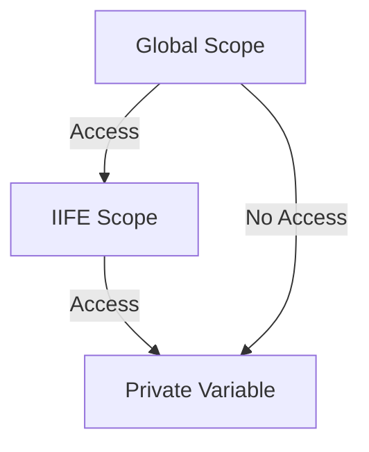

## 2.4 Immediately Invoked Function Expressions (IIFEs)

In the world of JavaScript, functions are a fundamental building block. As we delve deeper into the realm of functions, we encounter a powerful concept known as Immediately Invoked Function Expressions, or IIFEs. This section will guide you through understanding IIFEs, their syntax, and their practical applications. By the end of this chapter, you'll have a solid grasp of how IIFEs can enhance your JavaScript coding practices.

### What is an IIFE?

An Immediately Invoked Function Expression (IIFE) is a JavaScript function that runs as soon as it is defined. The primary purpose of an IIFE is to create a new scope, which helps in avoiding variable collisions in the global namespace. This is particularly useful in JavaScript, where variables declared outside of functions are added to the global scope, potentially causing conflicts.

### Syntax of an IIFE

The syntax of an IIFE might seem a bit unusual at first, but it's straightforward once you break it down. An IIFE is a function expression that is immediately executed. Here's the basic syntax:

```javascript
(function() {
    // Your code here
})();
```

Let's dissect this syntax:

- **Function Expression**: The function is wrapped inside parentheses `()`. This tells JavaScript to treat the function as an expression rather than a declaration.
- **Immediate Invocation**: The `()` at the end of the function expression immediately invokes the function.

Here's a simple example of an IIFE:

```javascript
(function() {
    console.log("This is an IIFE!");
})();
```

When you run this code, it will immediately log "This is an IIFE!" to the console.

### Why Use IIFEs?

IIFEs serve several important purposes in JavaScript development:

1. **Creating Private Scopes**: By creating a new scope, IIFEs help in encapsulating variables and functions, preventing them from polluting the global namespace.

2. **Avoiding Global Namespace Pollution**: In JavaScript, variables declared in the global scope can easily conflict with other scripts. IIFEs help in avoiding such conflicts by keeping variables within their own scope.

3. **Executing Code Immediately**: Sometimes, you need to execute code right away, such as initialization code. IIFEs allow you to do this cleanly and efficiently.

4. **Avoiding Hoisting Issues**: IIFEs can help avoid issues related to variable hoisting by ensuring that variables are confined to the function's scope.

### Practical Applications of IIFEs

Let's explore some practical scenarios where IIFEs prove to be extremely useful.

#### Creating Private Scopes

One of the most common uses of IIFEs is to create private scopes. This is particularly useful in large applications where you want to avoid variable name conflicts.

```javascript
var globalVar = "I'm a global variable";

(function() {
    var privateVar = "I'm a private variable";
    console.log(privateVar); // Outputs: I'm a private variable
})();

console.log(globalVar); // Outputs: I'm a global variable
// console.log(privateVar); // Error: privateVar is not defined
```

In this example, `privateVar` is only accessible within the IIFE, preventing any accidental interference with other parts of the code.

#### Avoiding Global Namespace Pollution

IIFEs are an excellent tool for avoiding global namespace pollution, especially when working with libraries or frameworks.

```javascript
(function() {
    var jQuery = function(selector) {
        // jQuery-like functionality
    };

    window.$ = jQuery;
})();

console.log(typeof $); // Outputs: function
```

In this example, the IIFE encapsulates the `jQuery` variable, preventing it from conflicting with other libraries or scripts that might use the same variable name.

#### Initialization Code

IIFEs are perfect for executing initialization code that needs to run once when the script is loaded.

```javascript
(function() {
    var appConfig = {
        apiKey: "12345",
        apiUrl: "https://api.example.com"
    };

    console.log("App initialized with API key:", appConfig.apiKey);
})();
```

This IIFE initializes the application configuration and logs the API key to the console.

### Visualizing IIFEs

To better understand how IIFEs work, let's visualize the concept using a scope chain diagram. This diagram illustrates how variables are scoped within an IIFE, preventing them from leaking into the global scope.



**Caption**: This diagram shows how an IIFE creates a private scope, preventing the global scope from accessing variables within the IIFE.

### IIFEs in Modern JavaScript

With the introduction of ES6 modules, the need for IIFEs has diminished somewhat, as modules provide their own scope. However, IIFEs remain a valuable tool, especially in environments where modules are not supported or when writing scripts that need to be immediately executed.

### Try It Yourself

Now that we've covered the basics, it's time to experiment with IIFEs. Try modifying the examples above to see how they behave. For instance, change the variables inside the IIFE and observe how they remain isolated from the global scope.

### References and Further Reading

- [MDN Web Docs: Functions](https://developer.mozilla.org/en-US/docs/Web/JavaScript/Guide/Functions)
- [W3Schools: JavaScript Functions](https://www.w3schools.com/js/js_functions.asp)

### Knowledge Check

Before we wrap up, let's reinforce what we've learned about IIFEs:

- What is the primary purpose of an IIFE?
- How does an IIFE prevent global namespace pollution?
- Can you identify a scenario where using an IIFE would be beneficial?

### Embrace the Journey

Remember, mastering JavaScript is a journey. IIFEs are just one of the many tools you'll encounter along the way. As you continue to explore JavaScript, keep experimenting, stay curious, and enjoy the process of learning and discovery.

## Quiz Time!



### What is an IIFE?

- [x] A function that is executed immediately after it is defined
- [ ] A function that is declared but not executed
- [ ] A function that is executed only when called
- [ ] A function that is executed after a delay

> **Explanation:** An IIFE (Immediately Invoked Function Expression) is a function that runs as soon as it is defined.

### What is the main purpose of using an IIFE?

- [x] To create a private scope
- [ ] To delay function execution
- [ ] To make functions reusable
- [ ] To enhance performance

> **Explanation:** The main purpose of an IIFE is to create a private scope, preventing variable conflicts in the global namespace.

### How do you define an IIFE in JavaScript?

- [x] By wrapping a function in parentheses and immediately invoking it
- [ ] By using the `function` keyword followed by a semicolon
- [ ] By declaring a function and calling it later
- [ ] By using the `setTimeout` function

> **Explanation:** An IIFE is defined by wrapping a function in parentheses and immediately invoking it with `()`.

### Which of the following is a benefit of using IIFEs?

- [x] Avoiding global namespace pollution
- [ ] Improving code readability
- [ ] Enhancing code performance
- [ ] Simplifying function syntax

> **Explanation:** IIFEs help avoid global namespace pollution by encapsulating variables within their own scope.

### Can IIFEs be used to execute initialization code?

- [x] Yes
- [ ] No

> **Explanation:** IIFEs are perfect for executing initialization code that needs to run once when the script is loaded.

### How does an IIFE help with variable hoisting issues?

- [x] By confining variables to the function's scope
- [ ] By delaying variable declaration
- [ ] By using `var` instead of `let`
- [ ] By using `const` for all variables

> **Explanation:** IIFEs help avoid hoisting issues by ensuring that variables are confined to the function's scope.

### What is the syntax for creating an IIFE?

- [x] `(function() { /* code */ })();`
- [ ] `function() { /* code */ }();`
- [ ] `function() { /* code */ };`
- [ ] `function() { /* code */ }`

> **Explanation:** The correct syntax for an IIFE is `(function() { /* code */ })();`.

### Are IIFEs still relevant in modern JavaScript?

- [x] Yes
- [ ] No

> **Explanation:** While ES6 modules provide their own scope, IIFEs remain useful in environments where modules are not supported or when scripts need immediate execution.

### What does the following IIFE do?
```javascript
(function() {
    var x = 10;
    console.log(x);
})();
```

- [x] Logs `10` to the console
- [ ] Throws an error
- [ ] Logs `undefined` to the console
- [ ] Does nothing

> **Explanation:** The IIFE immediately executes and logs the value of `x`, which is `10`, to the console.

### True or False: IIFEs can prevent variable name conflicts in large applications.

- [x] True
- [ ] False

> **Explanation:** True. IIFEs create a private scope, preventing variable name conflicts in large applications.



Remember, this is just the beginning. As you progress, you'll build more complex and interactive web pages. Keep experimenting, stay curious, and enjoy the journey!
