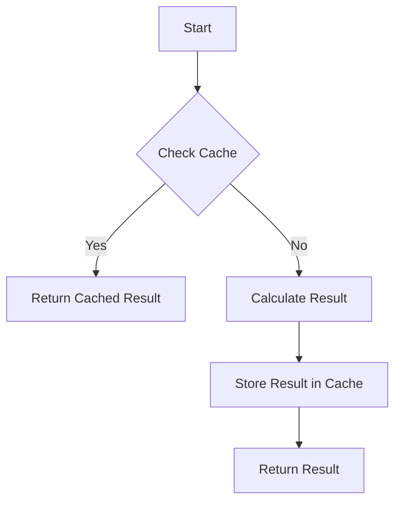

## 20.1 Memoization

In the world of programming, efficiency is key. As we build more complex applications, the need to optimize performance becomes increasingly important. One powerful technique to enhance function performance is **memoization**. In this section, we'll explore what memoization is, how it works, and how you can implement it in JavaScript to improve the efficiency of your code.

### Understanding Memoization

**Memoization** is an optimization technique used primarily to speed up computer programs by storing the results of expensive function calls and returning the cached result when the same inputs occur again. The term "memoization" comes from the Latin word "memorandum," meaning "to be remembered."

#### How Memoization Works

Memoization works by caching the results of function calls. When a function is called with a particular set of arguments, the result is stored in a cache. If the function is called again with the same arguments, the cached result is returned instead of recalculating the result. This can significantly reduce the time complexity of functions, especially those with repetitive or recursive calls.

### Benefits of Memoization

- **Performance Improvement**: By avoiding repeated calculations, memoization can drastically reduce the execution time of functions.
- **Efficiency in Recursive Functions**: Memoization is particularly beneficial in recursive functions where the same calculations are performed multiple times.
- **Reduced Computational Overhead**: By caching results, memoization reduces the computational overhead, making programs more efficient.

### Implementing Memoization in JavaScript

Let's dive into how we can implement memoization in JavaScript. We'll start with a simple example and gradually build upon it.

#### Basic Memoization Example

Consider a function that calculates the factorial of a number. Calculating factorials can be computationally expensive for large numbers, but memoization can help.

```javascript
function memoize(fn) {
  const cache = {};
  return function(...args) {
    const key = JSON.stringify(args);
    if (cache[key]) {
      console.log('Fetching from cache:', key);
      return cache[key];
    }
    console.log('Calculating result for:', key);
    const result = fn(...args);
    cache[key] = result;
    return result;
  };
}

function factorial(n) {
  if (n <= 1) return 1;
  return n * factorial(n - 1);
}

const memoizedFactorial = memoize(factorial);

console.log(memoizedFactorial(5)); // Calculating result for: [5]
console.log(memoizedFactorial(5)); // Fetching from cache: [5]
```

**Explanation**:
- We create a `memoize` function that takes another function `fn` as an argument.
- A `cache` object is used to store results.
- The `memoize` function returns a new function that checks if the result is already in the cache. If it is, it returns the cached result; otherwise, it calculates the result, stores it in the cache, and returns it.

#### Try It Yourself

Experiment with the memoization function by modifying the `factorial` function to calculate other mathematical operations, such as Fibonacci numbers. Observe how memoization affects performance.

### Visualizing Memoization

To better understand how memoization works, let's visualize the process using a flowchart.



**Description**: This flowchart illustrates the memoization process. It starts by checking if the result is in the cache. If yes, it returns the cached result. If no, it calculates the result, stores it in the cache, and then returns it.

### Use Cases for Memoization

Memoization is particularly useful in scenarios where:

- **Recursive Functions**: Functions like Fibonacci or factorial, where the same calculations are repeated.
- **Heavy Computation**: Functions that perform complex calculations or data processing.
- **Data Fetching**: Caching results of API calls to avoid redundant network requests.

#### Example: Fibonacci Sequence

The Fibonacci sequence is a classic example where memoization can significantly improve performance.

```javascript
function memoize(fn) {
  const cache = {};
  return function(...args) {
    const key = JSON.stringify(args);
    if (cache[key]) {
      return cache[key];
    }
    const result = fn(...args);
    cache[key] = result;
    return result;
  };
}

function fibonacci(n) {
  if (n <= 1) return n;
  return fibonacci(n - 1) + fibonacci(n - 2);
}

const memoizedFibonacci = memoize(fibonacci);

console.log(memoizedFibonacci(10)); // 55
console.log(memoizedFibonacci(10)); // 55 (from cache)
```

**Explanation**: The memoized Fibonacci function stores previously calculated results, drastically reducing the number of calculations needed.

### Limitations of Memoization

While memoization is powerful, it has limitations:

- **Memory Usage**: Storing results in a cache can lead to increased memory usage, especially for functions with a large number of unique inputs.
- **Cache Invalidation**: In some cases, cached results may become outdated, requiring a strategy for cache invalidation.
- **Not Suitable for All Functions**: Memoization is most effective for functions with deterministic outputs (same input always produces the same output).

### Best Practices for Memoization

- **Use for Pure Functions**: Memoization works best with pure functions, where the output depends solely on the input.
- **Manage Cache Size**: Implement strategies to limit cache size and remove old or unused entries.
- **Consider Input Complexity**: Memoization is more beneficial for functions with complex calculations or large input spaces.

### References and Further Reading

For more information on memoization and its applications, check out these resources:

- [MDN Web Docs: Memoization](https://developer.mozilla.org/en-US/docs/Glossary/Memoization)
- [W3Schools: JavaScript Functions](https://www.w3schools.com/js/js_functions.asp)

### Knowledge Check

Let's reinforce what we've learned with a few questions:

1. What is memoization, and how does it improve function performance?
2. Why is memoization particularly useful for recursive functions?
3. What are some limitations of memoization?
4. How can you manage cache size in a memoized function?

### Embrace the Journey

Remember, memoization is just one of many tools in your programming toolkit. As you continue to learn and grow, you'll discover more techniques to optimize and enhance your code. Keep experimenting, stay curious, and enjoy the journey!

## Quiz Time!



### What is the primary purpose of memoization?

- [x] To cache function results for performance improvement
- [ ] To reduce memory usage
- [ ] To simplify code readability
- [ ] To enhance security

> **Explanation:** Memoization caches function results to avoid redundant calculations, improving performance.

### Which type of functions benefit most from memoization?

- [x] Recursive functions
- [ ] Functions with side effects
- [ ] Functions with random outputs
- [ ] Functions that modify global state

> **Explanation:** Recursive functions often perform repeated calculations, making them ideal candidates for memoization.

### What is a potential downside of memoization?

- [x] Increased memory usage
- [ ] Slower execution time
- [ ] Reduced code readability
- [ ] Increased complexity

> **Explanation:** Memoization can increase memory usage due to storing cached results.

### How does memoization affect a function's time complexity?

- [x] It reduces time complexity by avoiding repeated calculations
- [ ] It increases time complexity
- [ ] It has no effect on time complexity
- [ ] It makes time complexity unpredictable

> **Explanation:** By caching results, memoization reduces the need for repeated calculations, lowering time complexity.

### What is a key characteristic of functions suitable for memoization?

- [x] They are pure functions
- [ ] They have side effects
- [ ] They rely on external data
- [ ] They produce different outputs for the same inputs

> **Explanation:** Pure functions, which produce the same output for the same input, are ideal for memoization.

### What is a common strategy to manage cache size in memoization?

- [x] Implementing cache eviction policies
- [ ] Increasing memory allocation
- [ ] Using global variables
- [ ] Disabling caching

> **Explanation:** Cache eviction policies help manage memory usage by removing old or unused cache entries.

### In the context of memoization, what is cache invalidation?

- [x] Removing outdated or incorrect cached results
- [ ] Increasing cache size
- [ ] Storing more results in the cache
- [ ] Disabling the cache

> **Explanation:** Cache invalidation involves removing outdated or incorrect cached results to ensure accuracy.

### Which of the following is NOT a benefit of memoization?

- [x] Reducing code readability
- [ ] Improving performance
- [ ] Reducing computational overhead
- [ ] Enhancing efficiency

> **Explanation:** Memoization improves performance and efficiency but does not inherently reduce code readability.

### What is the role of the `JSON.stringify` method in the memoization example?

- [x] To create a unique key for caching function arguments
- [ ] To convert results to a string
- [ ] To enhance security
- [ ] To reduce memory usage

> **Explanation:** `JSON.stringify` creates a unique key for caching function arguments, ensuring correct retrieval.

### True or False: Memoization is only useful for mathematical functions.

- [ ] True
- [x] False

> **Explanation:** Memoization is useful for any function with repetitive calculations, not just mathematical ones.


