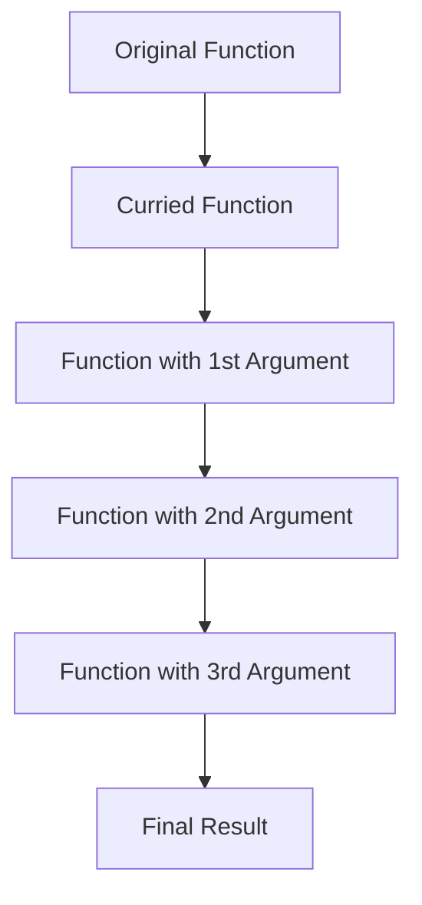

## 20.2 Currying

In this section, we'll delve into the fascinating world of currying, a powerful concept in functional programming that can transform the way we write and think about functions in JavaScript. Currying allows us to break down functions that take multiple arguments into a series of functions that each take a single argument. This technique not only enhances code reusability but also makes our functions more flexible and easier to work with.

### What is Currying?

Currying is a technique in functional programming where a function with multiple arguments is transformed into a sequence of functions, each taking a single argument. This transformation allows us to call a function with fewer arguments than it expects and receive a new function that takes the remaining arguments.

#### How Currying Works

Let's break down how currying works with a simple example. Consider a function that adds three numbers:

```javascript
function addThreeNumbers(a, b, c) {
    return a + b + c;
}

console.log(addThreeNumbers(1, 2, 3)); // Outputs: 6
```

In a curried version, this function would be transformed into a series of functions, each taking one argument:

```javascript
function curriedAdd(a) {
    return function(b) {
        return function(c) {
            return a + b + c;
        };
    };
}

console.log(curriedAdd(1)(2)(3)); // Outputs: 6
```

As you can see, `curriedAdd` is a function that returns another function, which in turn returns another function, until all arguments are provided.

### Currying vs. Partial Application

While currying and partial application are related concepts, they are not the same. It's important to understand the distinction between the two.

- **Currying**: Transforms a function with multiple arguments into a series of unary (single-argument) functions. Each function takes one argument and returns another function until all arguments are provided.

- **Partial Application**: Involves fixing a number of arguments to a function, producing another function of smaller arity (fewer arguments). Unlike currying, partial application doesn't necessarily transform a function into unary functions.

#### Example of Partial Application

Here's an example of partial application using the same `addThreeNumbers` function:

```javascript
function add(a, b, c) {
    return a + b + c;
}

function partialAdd(a) {
    return function(b, c) {
        return add(a, b, c);
    };
}

const addFive = partialAdd(5);
console.log(addFive(3, 2)); // Outputs: 10
```

In this example, `partialAdd` fixes the first argument to `5`, creating a new function `addFive` that takes the remaining two arguments.

### Benefits of Currying

Currying offers several advantages that can improve the way we write and maintain code:

1. **Increased Reusability**: By breaking down functions into smaller, single-argument functions, we can reuse them in different contexts more easily.

2. **Enhanced Readability**: Curried functions can make code more readable by clearly expressing the sequence of operations.

3. **Simplified Function Composition**: Currying facilitates function composition, allowing us to build complex operations from simple, reusable functions.

4. **Improved Function Flexibility**: Curried functions can be partially applied, enabling us to create specialized versions of functions without modifying their original implementation.

### Practical Applications of Currying

Currying can be particularly useful in scenarios where we need to create specialized functions or when working with higher-order functions. Let's explore some practical applications of currying in JavaScript.

#### Example: Creating Specialized Functions

Suppose we have a function that calculates the total price of an item, including tax and discount:

```javascript
function calculateTotalPrice(price, taxRate, discount) {
    return price + (price * taxRate) - discount;
}

console.log(calculateTotalPrice(100, 0.2, 10)); // Outputs: 110
```

We can create a curried version of this function to easily create specialized functions for different tax rates:

```javascript
function curriedCalculateTotalPrice(price) {
    return function(taxRate) {
        return function(discount) {
            return price + (price * taxRate) - discount;
        };
    };
}

const calculateWithStandardTax = curriedCalculateTotalPrice(100)(0.2);
console.log(calculateWithStandardTax(10)); // Outputs: 110
```

In this example, `calculateWithStandardTax` is a specialized function that calculates the total price with a fixed tax rate of 20%.

#### Example: Using Currying with Higher-Order Functions

Currying is often used in conjunction with higher-order functions, such as `map`, `filter`, and `reduce`. Let's see how currying can simplify the use of these functions:

```javascript
const numbers = [1, 2, 3, 4, 5];

function multiply(a, b) {
    return a * b;
}

const curriedMultiply = a => b => multiply(a, b);

const doubledNumbers = numbers.map(curriedMultiply(2));
console.log(doubledNumbers); // Outputs: [2, 4, 6, 8, 10]
```

In this example, we use a curried version of the `multiply` function to create a specialized function `curriedMultiply(2)`, which doubles each number in the array.

### Visualizing Currying

To better understand how currying works, let's visualize the process using a flowchart. This diagram illustrates the transformation of a function with multiple arguments into a series of unary functions.



**Caption**: This flowchart shows how a function with multiple arguments is transformed into a series of unary functions through currying.

### Implementing Currying in JavaScript

Now that we understand the concept of currying, let's implement a generic currying function in JavaScript. This function will take a function with multiple arguments and return a curried version of it.

```javascript
function curry(fn) {
    return function curried(...args) {
        if (args.length >= fn.length) {
            return fn.apply(this, args);
        } else {
            return function(...nextArgs) {
                return curried.apply(this, args.concat(nextArgs));
            };
        }
    };
}

// Example usage
function add(a, b, c) {
    return a + b + c;
}

const curriedAdd = curry(add);
console.log(curriedAdd(1)(2)(3)); // Outputs: 6
console.log(curriedAdd(1, 2)(3)); // Outputs: 6
console.log(curriedAdd(1)(2, 3)); // Outputs: 6
```

In this implementation, the `curry` function checks if the number of arguments provided is sufficient to call the original function. If not, it returns a new function that takes the remaining arguments.

### Try It Yourself

Now it's your turn to experiment with currying! Try modifying the code examples provided to create your own curried functions. Here are a few ideas to get you started:

- Create a curried function that calculates the area of a rectangle, given its length and width.
- Implement a curried function that formats a date string, given a date and a format string.
- Experiment with currying in combination with higher-order functions like `filter` and `reduce`.

### Further Reading

For more information on currying and functional programming in JavaScript, check out these resources:

- [MDN Web Docs: Functions](https://developer.mozilla.org/en-US/docs/Web/JavaScript/Guide/Functions)
- [Eloquent JavaScript: Higher-Order Functions](https://eloquentjavascript.net/05_higher_order.html)
- [Functional Programming in JavaScript](https://www.smashingmagazine.com/2014/07/dont-be-scared-of-functional-programming/)

### Knowledge Check

Before we wrap up, let's review some key concepts and test your understanding of currying.

- What is currying, and how does it differ from partial application?
- How can currying improve code reusability and readability?
- What are some practical applications of currying in JavaScript?

### Embrace the Journey

Remember, mastering currying is just one step in your journey to becoming proficient in JavaScript and functional programming. Keep experimenting, stay curious, and enjoy the process of learning and discovery!

## Quiz Time!



### What is currying in JavaScript?

- [x] Transforming a function with multiple arguments into a series of unary functions.
- [ ] Combining multiple functions into one.
- [ ] Creating functions that return other functions.
- [ ] Converting functions into arrow functions.

> **Explanation:** Currying is a technique where a function with multiple arguments is transformed into a series of functions, each taking a single argument.

### How does currying differ from partial application?

- [x] Currying transforms functions into unary functions, while partial application fixes some arguments.
- [ ] Currying and partial application are the same.
- [ ] Currying is only used in JavaScript, while partial application is used in other languages.
- [ ] Partial application is a subset of currying.

> **Explanation:** Currying transforms a function into a series of unary functions, whereas partial application fixes some arguments, creating a new function with fewer arguments.

### What is the main benefit of currying?

- [x] Increased reusability and flexibility of functions.
- [ ] Improved performance of JavaScript code.
- [ ] Simplified syntax for defining functions.
- [ ] Enhanced security of functions.

> **Explanation:** Currying increases the reusability and flexibility of functions by breaking them down into smaller, single-argument functions.

### Which of the following is a curried function?

- [x] `const add = a => b => c => a + b + c;`
- [ ] `function add(a, b, c) { return a + b + c; }`
- [ ] `const add = (a, b, c) => a + b + c;`
- [ ] `function add(a) { return function(b, c) { return a + b + c; }; }`

> **Explanation:** The curried function is `const add = a => b => c => a + b + c;`, where each function takes a single argument.

### What does the following code output: `curriedAdd(1)(2)(3)`?

- [x] 6
- [ ] 123
- [ ] 3
- [ ] 1

> **Explanation:** The curried function `curriedAdd` adds the numbers 1, 2, and 3, resulting in 6.

### How can currying simplify the use of higher-order functions?

- [x] By creating specialized functions that can be easily composed.
- [ ] By reducing the number of arguments needed.
- [ ] By eliminating the need for callback functions.
- [ ] By converting all functions to arrow functions.

> **Explanation:** Currying allows us to create specialized functions that can be easily composed with higher-order functions like `map`, `filter`, and `reduce`.

### What is the purpose of the `curry` function in JavaScript?

- [x] To transform a function with multiple arguments into a curried version.
- [ ] To combine multiple functions into one.
- [ ] To convert functions into arrow functions.
- [ ] To optimize the performance of functions.

> **Explanation:** The `curry` function transforms a function with multiple arguments into a curried version, allowing it to be called with fewer arguments.

### What is the output of `curriedMultiply(2)(3)` if `curriedMultiply = a => b => a * b;`?

- [x] 6
- [ ] 5
- [ ] 23
- [ ] 1

> **Explanation:** The curried function `curriedMultiply` multiplies 2 and 3, resulting in 6.

### Which of the following is NOT a benefit of currying?

- [ ] Increased reusability of functions.
- [ ] Enhanced readability of code.
- [ ] Simplified function composition.
- [x] Improved security of functions.

> **Explanation:** While currying offers many benefits, improving the security of functions is not one of them.

### Currying can be used with higher-order functions like `map`, `filter`, and `reduce`.

- [x] True
- [ ] False

> **Explanation:** Currying can be used with higher-order functions to create specialized versions of functions that can be easily composed and reused.


