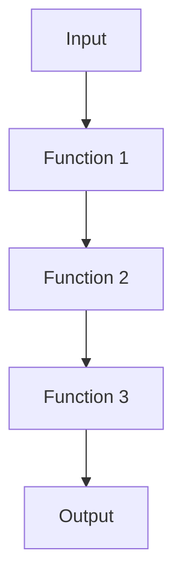

## 20.3 Function Composition

In the realm of programming, particularly in JavaScript, the concept of function composition is a powerful tool that allows developers to build complex operations by combining simple functions. Function composition is a core concept in functional programming, a paradigm that emphasizes the use of functions to transform data. In this section, we will explore what function composition is, how to implement it in JavaScript, and the benefits it brings to your code.

### Understanding Function Composition

Function composition is the process of combining two or more functions to produce a new function. This new function represents the composition of the original functions, where the output of one function becomes the input of the next. This concept is akin to the mathematical idea of composing functions, where if you have two functions, `f` and `g`, the composition `f(g(x))` means applying `g` to `x` and then applying `f` to the result.

In JavaScript, function composition allows us to build more complex operations by chaining simple, reusable functions together. This not only simplifies our code but also makes it more readable and maintainable.

### The Basics of Function Composition

Let's start with a simple example to illustrate function composition. Suppose we have two functions: one that doubles a number and another that adds five to a number.

```javascript
// Function to double a number
function double(x) {
  return x * 2;
}

// Function to add five to a number
function addFive(x) {
  return x + 5;
}
```

Using function composition, we can create a new function that first doubles a number and then adds five to the result.

```javascript
// Composing the functions
function compose(fn1, fn2) {
  return function(x) {
    return fn1(fn2(x));
  };
}

// Create a new function by composing double and addFive
const doubleThenAddFive = compose(addFive, double);

console.log(doubleThenAddFive(10)); // Output: 25
```

In this example, we defined a `compose` function that takes two functions as arguments and returns a new function. This new function applies the second function (`fn2`) to the input and then applies the first function (`fn1`) to the result.

### Benefits of Function Composition

Function composition offers several benefits, especially in the context of functional programming:

1. **Code Reusability**: By breaking down complex operations into smaller, reusable functions, we can easily compose them in different ways to achieve various tasks.

2. **Improved Readability**: Composing functions can make code more readable by clearly expressing the sequence of operations.

3. **Ease of Testing**: Smaller functions are easier to test individually, ensuring that each part of the composition works correctly.

4. **Enhanced Maintainability**: Changes to a specific part of the operation can be made by modifying a single function without affecting the entire composition.

5. **Declarative Code**: Function composition promotes a declarative style of programming, where the focus is on what needs to be done rather than how to do it.

### Implementing Function Composition in JavaScript

To implement function composition in JavaScript, we can use higher-order functions, which are functions that take other functions as arguments or return them as results. Let's explore how to create a more flexible `compose` function that can handle multiple functions.

```javascript
// Compose multiple functions
function compose(...fns) {
  return function(x) {
    return fns.reduceRight((acc, fn) => fn(acc), x);
  };
}

// Example functions
function multiplyByThree(x) {
  return x * 3;
}

function subtractTwo(x) {
  return x - 2;
}

// Compose multiple functions
const composedFunction = compose(addFive, multiplyByThree, subtractTwo);

console.log(composedFunction(4)); // Output: 15
```

In this implementation, the `compose` function takes any number of functions as arguments and returns a new function. It uses the `reduceRight` method to apply the functions from right to left, ensuring that the output of one function becomes the input of the next.

### Function Composition with Arrow Functions

JavaScript's arrow functions provide a concise syntax for writing functions, making them ideal for function composition. Let's see how we can use arrow functions to compose functions more succinctly.

```javascript
// Compose function using arrow functions
const compose = (...fns) => x => fns.reduceRight((acc, fn) => fn(acc), x);

// Example functions
const square = x => x * x;
const increment = x => x + 1;

// Compose functions using arrow functions
const squareThenIncrement = compose(increment, square);

console.log(squareThenIncrement(3)); // Output: 10
```

In this example, we used arrow functions to define both the `compose` function and the example functions. The result is a more concise and readable implementation.

### Visualizing Function Composition

To better understand how function composition works, let's visualize the process using a flowchart. This diagram represents the flow of data through a composed function.



In this flowchart, the input is passed to Function 1, whose output becomes the input for Function 2, and so on, until the final output is produced.

### Practical Applications of Function Composition

Function composition is not just a theoretical concept; it has practical applications in real-world programming. Here are a few scenarios where function composition can be particularly useful:

1. **Data Transformation Pipelines**: When processing data, you can create a pipeline of functions that transform the data step by step. For example, you might have a series of functions that clean, filter, and format data before displaying it.

2. **Middleware in Web Applications**: In web applications, middleware functions can be composed to handle requests and responses. Each middleware function performs a specific task, such as authentication, logging, or error handling.

3. **Event Handling**: In event-driven programming, you can compose functions to handle events in a sequence. For example, you might have a series of functions that validate, process, and respond to user input.

4. **Functional Libraries**: Many functional programming libraries, such as Lodash and Ramda, provide utilities for function composition, making it easier to build complex operations from simple functions.

### Try It Yourself

To solidify your understanding of function composition, try modifying the examples provided. Here are a few suggestions:

- Add more functions to the composition and observe how the output changes.
- Experiment with different orders of function composition to see how it affects the result.
- Create your own functions and compose them to solve a specific problem.

### References and Further Reading

For more information on function composition and functional programming in JavaScript, consider exploring the following resources:

- [MDN Web Docs: Functions](https://developer.mozilla.org/en-US/docs/Web/JavaScript/Guide/Functions)
- [Eloquent JavaScript: Higher-Order Functions](https://eloquentjavascript.net/05_higher_order.html)
- [Functional Programming in JavaScript](https://www.smashingmagazine.com/2014/07/dont-be-scared-of-functional-programming/)

### Knowledge Check

Let's test your understanding of function composition with a few questions:

1. What is function composition, and how does it relate to functional programming?
2. How can function composition improve code readability and maintainability?
3. Implement a `compose` function that takes three functions and returns their composition.
4. Explain the difference between `reduce` and `reduceRight` in the context of function composition.
5. Describe a real-world scenario where function composition would be beneficial.

### Embrace the Journey

Remember, mastering function composition is just one step in your journey to becoming proficient in JavaScript and functional programming. Keep experimenting, stay curious, and enjoy the process of learning and applying new concepts. As you continue to explore the world of programming, you'll discover even more powerful techniques to enhance your code and solve complex problems.

## Quiz Time!



### What is function composition?

- [x] Combining two or more functions to produce a new function
- [ ] Writing functions without parameters
- [ ] Creating functions that do not return values
- [ ] Using functions as arguments in other functions

> **Explanation:** Function composition involves combining multiple functions to create a new function where the output of one function becomes the input of the next.

### How does function composition improve code readability?

- [x] By clearly expressing the sequence of operations
- [ ] By making functions longer and more complex
- [ ] By using more global variables
- [ ] By reducing the number of functions

> **Explanation:** Function composition improves readability by breaking down complex operations into a sequence of simple, understandable steps.

### Which method is used to apply functions from right to left in composition?

- [x] reduceRight
- [ ] map
- [ ] filter
- [ ] reduce

> **Explanation:** The `reduceRight` method applies functions from right to left, making it suitable for function composition.

### What is a benefit of using function composition in functional programming?

- [x] Code reusability
- [ ] Increased use of global variables
- [ ] More complex code
- [ ] Less testing required

> **Explanation:** Function composition promotes code reusability by allowing simple functions to be combined in various ways to achieve different tasks.

### What is the output of the composed function `compose(addFive, double)(10)`?

- [x] 25
- [ ] 15
- [ ] 20
- [ ] 30

> **Explanation:** The `double` function is applied first, resulting in 20, and then `addFive` is applied, resulting in 25.

### Which of the following is a practical application of function composition?

- [x] Data transformation pipelines
- [ ] Using global variables
- [ ] Writing long functions
- [ ] Avoiding functions altogether

> **Explanation:** Function composition is useful in creating data transformation pipelines where data is processed through a series of functions.

### What is the role of higher-order functions in function composition?

- [x] They take other functions as arguments or return them as results
- [ ] They avoid using parameters
- [ ] They are used only for mathematical calculations
- [ ] They do not return any value

> **Explanation:** Higher-order functions are essential in function composition as they allow functions to be passed as arguments or returned as results.

### How can arrow functions enhance function composition?

- [x] By providing a concise syntax for writing functions
- [ ] By making functions longer
- [ ] By increasing the number of global variables
- [ ] By reducing function reusability

> **Explanation:** Arrow functions offer a concise syntax, making it easier to write and compose functions.

### What is the purpose of the `compose` function in JavaScript?

- [x] To create a new function by combining multiple functions
- [ ] To write functions without parameters
- [ ] To avoid using functions altogether
- [ ] To create global variables

> **Explanation:** The `compose` function combines multiple functions into a new function, facilitating function composition.

### Function composition is only useful in functional programming. True or False?

- [ ] True
- [x] False

> **Explanation:** While function composition is a key concept in functional programming, it is also useful in other programming paradigms for improving code modularity and readability.




