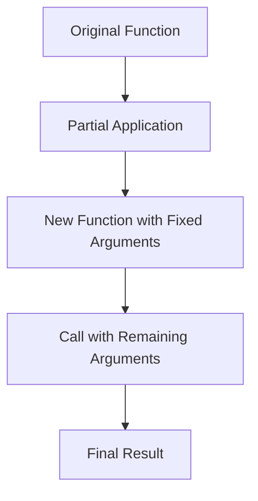

## 20.4 Partial Application

In the world of JavaScript, functions are not just blocks of code that perform tasks; they are versatile tools that can be manipulated and transformed to create more flexible and reusable code. One such transformation technique is **partial application**. This concept allows us to fix a number of arguments in a function, creating a new function with fewer parameters. Let's dive into the fascinating world of partial application, understand how it differs from currying, and explore its practical applications.

### Understanding Partial Application

**Partial application** is a technique in functional programming where a function is transformed into another function with some of its arguments fixed. This means that you can pre-fill some arguments of a function, creating a new function that requires fewer arguments.

#### Key Characteristics of Partial Application

- **Argument Fixing**: Partial application involves fixing one or more arguments of a function.
- **Function Transformation**: It transforms a function into another function with a reduced number of parameters.
- **Reusability**: It enhances code reusability by allowing the creation of specialized functions from general ones.

### Partial Application vs. Currying

Before we delve deeper, it's essential to distinguish between partial application and currying, as they are often confused.

- **Partial Application**: In partial application, you fix some arguments of a function, creating a new function that takes the remaining arguments. The transformation is not necessarily sequential.

- **Currying**: Currying transforms a function that takes multiple arguments into a series of functions that each take a single argument. It is a process of decomposing a function into a sequence of unary functions.

**Example Comparison**:

```javascript
// Currying Example
function curryAdd(a) {
    return function(b) {
        return a + b;
    };
}

const addFive = curryAdd(5);
console.log(addFive(3)); // Output: 8

// Partial Application Example
function add(a, b) {
    return a + b;
}

function partialAdd(a) {
    return function(b) {
        return add(a, b);
    };
}

const addTen = partialAdd(10);
console.log(addTen(5)); // Output: 15
```

### Implementing Partial Application

Let's explore how to implement partial application in JavaScript. We'll start with a simple example and gradually build up to more complex scenarios.

#### Basic Partial Application

Consider a function that multiplies three numbers:

```javascript
function multiply(a, b, c) {
    return a * b * c;
}
```

To partially apply this function, we can create a utility function:

```javascript
function partial(fn, ...fixedArgs) {
    return function(...remainingArgs) {
        return fn(...fixedArgs, ...remainingArgs);
    };
}

const multiplyByTwo = partial(multiply, 2);
console.log(multiplyByTwo(3, 4)); // Output: 24
```

In this example, `partial` is a higher-order function that takes a function `fn` and some fixed arguments `fixedArgs`. It returns a new function that takes the remaining arguments and applies them to `fn` along with `fixedArgs`.

#### Advanced Partial Application

Let's enhance our partial application utility to handle more complex scenarios:

```javascript
function advancedPartial(fn, ...fixedArgs) {
    return function(...remainingArgs) {
        const allArgs = fixedArgs.map(arg => arg === undefined ? remainingArgs.shift() : arg);
        return fn(...allArgs, ...remainingArgs);
    };
}

const partialMultiply = advancedPartial(multiply, undefined, 3);
console.log(partialMultiply(2, 4)); // Output: 24
```

In this version, we allow `undefined` as a placeholder for arguments that should be filled later. This provides more flexibility in fixing arguments.

### Use Cases for Partial Application

Partial application is a powerful tool in functional programming, offering several practical benefits:

#### 1. Configuration-Based Functions

In scenarios where functions need to be configured with specific parameters, partial application allows you to create specialized functions with pre-configured settings.

```javascript
function configureLogger(level, message) {
    console.log(`[${level}] ${message}`);
}

const infoLogger = partial(configureLogger, 'INFO');
infoLogger('This is an info message.'); // Output: [INFO] This is an info message.
```

#### 2. Event Handling

Partial application can simplify event handling by pre-filling event-specific parameters.

```javascript
function handleEvent(eventType, element, callback) {
    element.addEventListener(eventType, callback);
}

const clickHandler = partial(handleEvent, 'click');
clickHandler(document.getElementById('myButton'), () => console.log('Button clicked!'));
```

#### 3. API Calls

When dealing with API calls, partial application can be used to pre-fill common parameters like API keys or endpoints.

```javascript
function fetchData(apiKey, endpoint, params) {
    // Simulate an API call
    console.log(`Fetching data from ${endpoint} with params:`, params);
}

const fetchWithApiKey = partial(fetchData, 'my-api-key');
fetchWithApiKey('https://api.example.com/data', { id: 123 });
```

### Visualizing Partial Application

To better understand how partial application works, let's visualize the process using a flowchart.



**Description**: This flowchart illustrates the transformation of an original function into a new function with fixed arguments through partial application. The new function is then called with the remaining arguments to produce the final result.

### Try It Yourself

Now that we've explored partial application, it's time to experiment. Here are some suggestions:

- Modify the `partial` function to allow placeholders for multiple arguments.
- Create a partially applied function for a mathematical operation like subtraction or division.
- Implement a partial application for a function that formats dates or strings.

### References and Further Reading

- [MDN Web Docs - Functions](https://developer.mozilla.org/en-US/docs/Web/JavaScript/Guide/Functions)
- [JavaScript Info - Currying and Partial Application](https://javascript.info/currying-partials)
- [Eloquent JavaScript - Higher-Order Functions](https://eloquentjavascript.net/05_higher_order.html)

### Knowledge Check

Let's reinforce what we've learned with a few questions:

- What is the primary difference between partial application and currying?
- How can partial application improve code reusability?
- Can you think of a scenario where partial application might be beneficial in your projects?

### Embrace the Journey

Remember, mastering JavaScript functions is a journey. Partial application is just one of many techniques that can enhance your coding skills. Keep experimenting, stay curious, and enjoy the process of learning and discovery!

## Quiz Time!



### What is partial application?

- [x] A technique to fix a number of arguments in a function
- [ ] A process of transforming a function into a series of unary functions
- [ ] A method to execute a function immediately after defining it
- [ ] A way to create functions without side effects

> **Explanation:** Partial application involves fixing some arguments of a function, creating a new function that requires fewer arguments.

### How does partial application differ from currying?

- [x] Partial application fixes some arguments, while currying transforms functions into unary functions
- [ ] Partial application transforms functions into unary functions, while currying fixes some arguments
- [ ] Both are the same and used interchangeably
- [ ] Currying is a subset of partial application

> **Explanation:** Partial application fixes some arguments, creating a new function, while currying transforms a function into a series of unary functions.

### Which of the following is a use case for partial application?

- [x] Pre-filling parameters for API calls
- [ ] Creating recursive functions
- [ ] Implementing event loops
- [ ] Handling asynchronous operations

> **Explanation:** Partial application can be used to pre-fill common parameters like API keys or endpoints in API calls.

### What does the `partial` function return?

- [x] A new function with some arguments fixed
- [ ] The original function with all arguments
- [ ] A promise that resolves to the function result
- [ ] An array of function arguments

> **Explanation:** The `partial` function returns a new function with some arguments fixed, requiring fewer arguments for subsequent calls.

### Can partial application be used with event handling?

- [x] Yes
- [ ] No

> **Explanation:** Partial application can simplify event handling by pre-filling event-specific parameters.

### What is a benefit of using partial application?

- [x] Enhances code reusability
- [ ] Increases code complexity
- [ ] Reduces function execution speed
- [ ] Limits function flexibility

> **Explanation:** Partial application enhances code reusability by allowing the creation of specialized functions from general ones.

### Which of the following is an example of partial application?

- [x] Creating a logger function with a fixed log level
- [ ] Transforming a function into a series of unary functions
- [ ] Executing a function immediately after defining it
- [ ] Using a function without side effects

> **Explanation:** Creating a logger function with a fixed log level is an example of partial application, where some arguments are pre-filled.

### What does the `advancedPartial` function allow?

- [x] Use of placeholders for arguments to be filled later
- [ ] Immediate execution of the function
- [ ] Transformation of functions into unary functions
- [ ] Execution of functions without side effects

> **Explanation:** The `advancedPartial` function allows the use of `undefined` as a placeholder for arguments that should be filled later.

### Is partial application a functional programming technique?

- [x] True
- [ ] False

> **Explanation:** Partial application is a functional programming technique that enhances code reusability and flexibility.

### What should you do after learning about partial application?

- [x] Experiment with creating partially applied functions
- [ ] Avoid using partial application in projects
- [ ] Only use partial application in advanced projects
- [ ] Discard the concept as unnecessary

> **Explanation:** After learning about partial application, you should experiment with creating partially applied functions to understand their benefits and applications.


