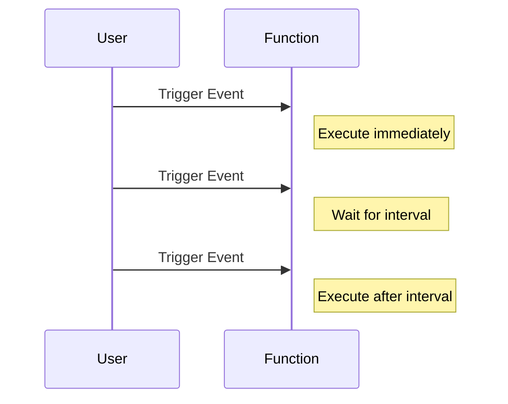
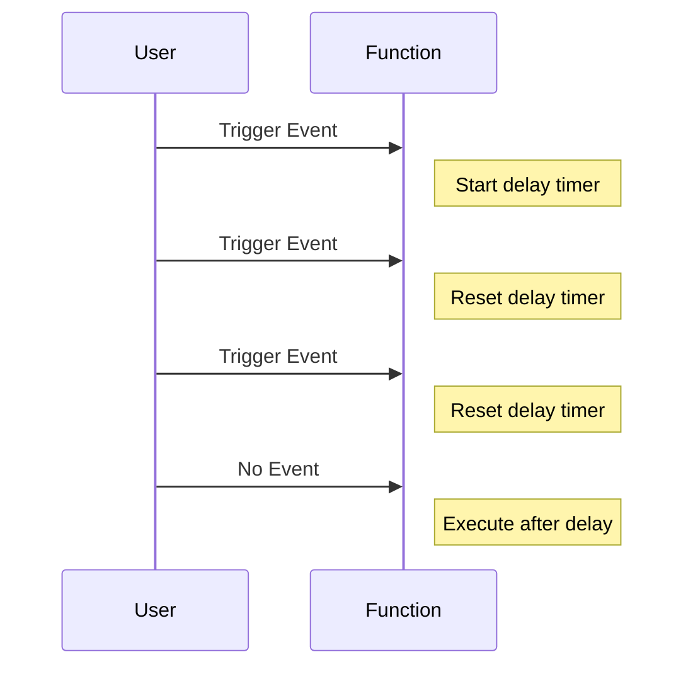

## 20.5 Throttling and Debouncing

In the world of web development, especially when dealing with user interactions and event-driven programming, controlling the frequency of function execution is crucial for maintaining optimal performance and enhancing user experience. Two powerful techniques to achieve this are **throttling** and **debouncing**. These patterns help manage how often a function is executed over time, particularly in response to events like scrolling, resizing, or typing.

### Understanding Throttling and Debouncing

Before diving into the implementation, let's clarify what throttling and debouncing mean and how they differ.

#### What is Throttling?

**Throttling** ensures that a function is called at most once in a specified time period. Imagine it as a valve that controls the flow of function executions, allowing only one execution per interval. This is particularly useful when you want to limit the number of times a function is invoked, such as when handling scroll events or window resize events.

##### Key Characteristics of Throttling:
- **Regular Execution**: The function is executed at regular intervals, regardless of how many times the event is triggered.
- **Consistent Rate**: Ensures a consistent rate of function execution, which can be crucial for tasks like updating a progress bar or sending periodic analytics data.
- **Immediate Execution**: The function can be executed immediately at the start of the interval.

#### What is Debouncing?

**Debouncing** delays the execution of a function until after a specified period of inactivity. Think of it as a buffer that waits for a pause in event triggering before executing the function. This is ideal for scenarios like auto-saving form data or searching as you type, where you want to wait until the user has stopped typing before performing an action.

##### Key Characteristics of Debouncing:
- **Delayed Execution**: The function is only executed after the event has stopped firing for a specified time.
- **Single Execution**: Ensures the function is executed only once after the event has ceased.
- **Prevents Over-Execution**: Useful for reducing the number of times a function is called, especially in rapid-fire events like keypresses.

### Differences Between Throttling and Debouncing

While both techniques aim to control function execution, they serve different purposes and are suited for different scenarios:

| Feature        | Throttling                                      | Debouncing                                    |
|----------------|-------------------------------------------------|-----------------------------------------------|
| Execution      | Regular intervals                               | After a period of inactivity                  |
| Use Case       | Continuous events (e.g., scroll, resize)        | Burst events (e.g., typing, button clicks)    |
| Immediate Call | Can execute immediately at the start of an interval | Executes only after the event stops          |
| Frequency      | Limited to once per interval                    | Limited to once after the event ends          |

### Practical Examples and Code Implementations

Let's explore how to implement throttling and debouncing in JavaScript with practical examples.

#### Implementing Throttling

Consider a scenario where you want to update the position of a navigation bar as the user scrolls. Without throttling, the function could be called hundreds of times per second, leading to performance issues. Here's how you can implement throttling:

```javascript
function throttle(func, limit) {
  let lastFunc;
  let lastRan;
  return function(...args) {
    const context = this;
    if (!lastRan) {
      func.apply(context, args);
      lastRan = Date.now();
    } else {
      clearTimeout(lastFunc);
      lastFunc = setTimeout(function() {
        if ((Date.now() - lastRan) >= limit) {
          func.apply(context, args);
          lastRan = Date.now();
        }
      }, limit - (Date.now() - lastRan));
    }
  };
}

// Example usage
window.addEventListener('scroll', throttle(() => {
  console.log('Scroll event handler called');
}, 200));
```

**Explanation:**
- The `throttle` function takes two arguments: the function to be throttled (`func`) and the time limit (`limit`).
- It returns a new function that checks if the specified time has passed since the last execution.
- If enough time has passed, it executes the function immediately; otherwise, it schedules the function to run after the remaining time.

#### Implementing Debouncing

Now, let's implement debouncing for a search input field. You want to perform a search only after the user has stopped typing for a certain period:

```javascript
function debounce(func, delay) {
  let timeoutId;
  return function(...args) {
    const context = this;
    clearTimeout(timeoutId);
    timeoutId = setTimeout(() => func.apply(context, args), delay);
  };
}

// Example usage
const searchInput = document.getElementById('search');
searchInput.addEventListener('input', debounce(() => {
  console.log('Search query:', searchInput.value);
}, 300));
```

**Explanation:**
- The `debounce` function takes the function to be debounced (`func`) and the delay (`delay`) as arguments.
- It returns a new function that clears the previous timeout and sets a new one.
- The function is executed only if the user stops typing for the specified delay.

### Impact on Performance and User Experience

Both throttling and debouncing significantly impact performance and user experience by reducing unnecessary function calls and improving responsiveness.

#### Performance Benefits

- **Reduced Load**: By limiting the number of function executions, you reduce the computational load on the browser, leading to smoother animations and interactions.
- **Efficient Resource Usage**: Throttling and debouncing help conserve CPU and memory resources, especially in resource-intensive applications.

#### Enhanced User Experience

- **Responsive Interfaces**: By controlling function execution, you ensure that the interface remains responsive, even during heavy user interactions.
- **Improved Feedback**: Users receive timely feedback without overwhelming the system, enhancing the overall user experience.

### Visualizing Throttling and Debouncing

To better understand how these patterns work, let's visualize them using Mermaid.js diagrams.

#### Throttling Visualization



**Caption**: This diagram illustrates how throttling allows the function to execute immediately upon the first event trigger and then waits for a specified interval before executing again.

#### Debouncing Visualization



**Caption**: This diagram shows how debouncing resets the delay timer with each event trigger and only executes the function after the events stop.

### Try It Yourself

Experiment with the provided code examples by modifying the delay and limit values. Observe how changes affect the frequency and timing of function execution. Try applying these patterns to different events, such as mouse movements or window resizing, to see their effects in various scenarios.

### References and Further Reading

- [MDN Web Docs: Throttling and Debouncing](https://developer.mozilla.org/en-US/docs/Web/Events/scroll)
- [W3Schools: JavaScript Timing Events](https://www.w3schools.com/js/js_timing.asp)
- [Lodash: Throttle and Debounce Functions](https://lodash.com/docs/4.17.15#throttle)

### Knowledge Check

- What are the key differences between throttling and debouncing?
- How does throttling improve performance in scroll events?
- Why is debouncing useful for search input fields?

### Embrace the Journey

Remember, mastering throttling and debouncing is just the beginning of optimizing your web applications. As you continue to explore JavaScript, you'll discover more advanced patterns and techniques to enhance performance and user experience. Keep experimenting, stay curious, and enjoy the journey!

## Quiz Time!



### What is the primary purpose of throttling in JavaScript?

- [x] To limit the number of times a function is executed over a period
- [ ] To execute a function immediately after an event
- [ ] To delay function execution until a period of inactivity
- [ ] To execute a function only once

> **Explanation:** Throttling limits the number of times a function can be executed over a specified period, ensuring it runs at regular intervals.

### How does debouncing differ from throttling?

- [x] Debouncing delays execution until a period of inactivity
- [ ] Debouncing executes functions at regular intervals
- [ ] Debouncing ensures immediate function execution
- [ ] Debouncing limits execution to once per interval

> **Explanation:** Debouncing delays the execution of a function until after a specified period of inactivity, unlike throttling, which executes at regular intervals.

### In which scenario is debouncing most useful?

- [x] When handling input fields for search functionality
- [ ] When updating a progress bar
- [ ] When sending periodic analytics data
- [ ] When executing animations

> **Explanation:** Debouncing is ideal for scenarios like search input fields, where you want to wait until the user has stopped typing before performing an action.

### What is a key characteristic of throttling?

- [x] Regular execution at specified intervals
- [ ] Execution only after event stops
- [ ] Execution once per event trigger
- [ ] Execution without delay

> **Explanation:** Throttling ensures regular execution of a function at specified intervals, regardless of how often the event is triggered.

### Which method is used to implement debouncing?

- [x] `setTimeout` to delay function execution
- [ ] `setInterval` for regular execution
- [ ] `clearInterval` to stop execution
- [ ] `requestAnimationFrame` for smooth animations

> **Explanation:** Debouncing is implemented using `setTimeout` to delay function execution until after a period of inactivity.

### What is the impact of throttling on performance?

- [x] Reduces computational load and improves responsiveness
- [ ] Increases the number of function calls
- [ ] Delays function execution indefinitely
- [ ] Executes functions immediately

> **Explanation:** Throttling reduces the computational load by limiting function executions, leading to improved responsiveness.

### How does debouncing enhance user experience?

- [x] By providing feedback after a period of inactivity
- [ ] By executing functions immediately
- [ ] By increasing the frequency of function calls
- [ ] By delaying feedback indefinitely

> **Explanation:** Debouncing enhances user experience by executing functions after a period of inactivity, ensuring timely feedback.

### Which event is commonly optimized using throttling?

- [x] Scroll events
- [ ] Keypress events
- [ ] Button clicks
- [ ] Form submissions

> **Explanation:** Throttling is commonly used to optimize scroll events, which can trigger functions multiple times per second.

### What happens in a debounced function when the event continues to trigger?

- [x] The delay timer is reset
- [ ] The function executes immediately
- [ ] The function executes at regular intervals
- [ ] The function stops executing

> **Explanation:** In a debounced function, the delay timer is reset each time the event triggers, delaying execution until the event stops.

### True or False: Throttling and debouncing can be used together in a single application.

- [x] True
- [ ] False

> **Explanation:** True. Throttling and debouncing can be used together in a single application to optimize different types of events and interactions.


