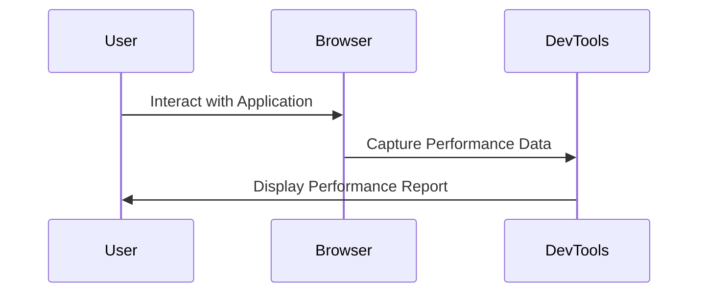
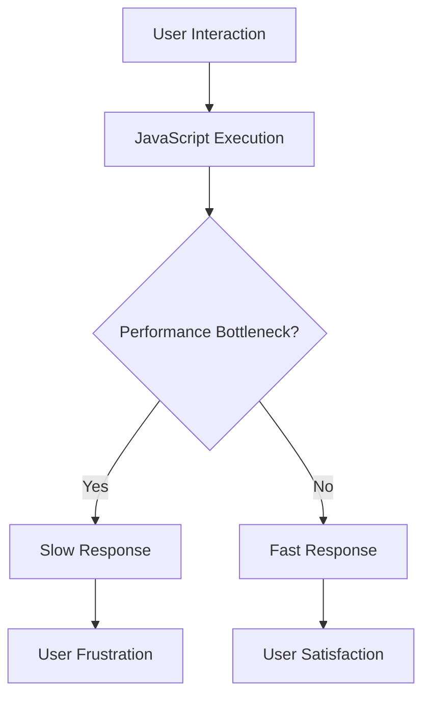

## 21.1 Identifying Bottlenecks in JavaScript Functions

In today's fast-paced digital world, the performance of web applications plays a crucial role in user experience. Slow and unresponsive applications can lead to user frustration and abandonment. As developers, it's essential to ensure that our JavaScript code runs efficiently, especially when dealing with functions that are executed frequently or handle large amounts of data. In this section, we will explore how to identify performance bottlenecks in JavaScript functions and optimize them for better performance.

### The Importance of Performance in JavaScript Applications

JavaScript is a versatile language that powers the interactive elements of web applications. However, its dynamic nature can sometimes lead to performance issues if not managed properly. Performance bottlenecks can manifest as slow page load times, sluggish interactions, or unresponsive user interfaces. These issues can significantly impact user satisfaction and retention.

#### Why Performance Matters

1. **User Experience**: A fast and responsive application provides a seamless experience, keeping users engaged and satisfied.
2. **SEO Benefits**: Search engines like Google consider page speed as a ranking factor, affecting your website's visibility.
3. **Resource Efficiency**: Optimized code reduces the load on servers and client devices, leading to better resource utilization.
4. **Competitive Edge**: In a competitive market, performance can be a differentiator that sets your application apart from others.

### Tools for Profiling JavaScript Functions

Profiling is the process of analyzing your code to identify performance bottlenecks. Several tools can help you profile JavaScript functions and gain insights into their execution.

#### Chrome DevTools

Chrome DevTools is a powerful set of web development tools built directly into the Google Chrome browser. It provides several features for profiling and optimizing JavaScript code.

- **Performance Panel**: Allows you to record and analyze the runtime performance of your application. You can view detailed information about function calls, execution time, and memory usage.
- **Memory Panel**: Helps you identify memory leaks and optimize memory usage by analyzing heap snapshots.
- **Network Panel**: Provides insights into network requests and their impact on performance.

#### Using Chrome DevTools for Profiling

Let's explore how to use Chrome DevTools to profile JavaScript functions:

1. **Open Chrome DevTools**: Right-click on your web page and select "Inspect" or press `Ctrl+Shift+I` (Windows/Linux) or `Cmd+Option+I` (Mac).
2. **Navigate to the Performance Panel**: Click on the "Performance" tab to access the profiling tools.
3. **Record a Performance Profile**: Click the "Record" button to start capturing a performance profile. Interact with your application to simulate user actions.
4. **Stop Recording**: Click the "Stop" button to end the recording. DevTools will generate a detailed performance report.
5. **Analyze the Profile**: Examine the flame chart, which visualizes the call stack and execution time of functions. Identify functions that consume excessive time or resources.

#### Visualizing Function Execution with Chrome DevTools



### Measuring Execution Time with `console.time`

Another simple yet effective way to measure the execution time of JavaScript functions is by using the `console.time` and `console.timeEnd` methods. These methods allow you to log the time taken by a block of code to execute.

#### Example: Measuring Execution Time

```javascript
function performHeavyComputation() {
    // Start the timer
    console.time('HeavyComputation');

    // Simulate a heavy computation task
    let sum = 0;
    for (let i = 0; i < 1000000; i++) {
        sum += i;
    }

    // End the timer
    console.timeEnd('HeavyComputation');
}

performHeavyComputation();
```

In this example, the `console.time` method starts a timer labeled "HeavyComputation," and `console.timeEnd` stops the timer, logging the elapsed time to the console. This technique is useful for identifying slow functions and optimizing them.

### Common Bottlenecks in JavaScript Functions

Identifying common bottlenecks in JavaScript functions can help you focus your optimization efforts. Here are some typical performance issues:

#### 1. Inefficient Loops

Loops that iterate over large datasets can become a significant bottleneck if not optimized. Consider using built-in methods like `map`, `filter`, or `reduce` for better performance.

#### 2. Unnecessary DOM Manipulations

Frequent manipulation of the Document Object Model (DOM) can slow down your application. Batch DOM updates and use techniques like `requestAnimationFrame` to optimize rendering.

#### 3. Blocking Operations

Blocking operations, such as synchronous AJAX requests or heavy computations on the main thread, can freeze the user interface. Use asynchronous operations and web workers to offload tasks.

#### 4. Memory Leaks

Memory leaks occur when objects are no longer needed but are not released, leading to increased memory usage. Use the Memory Panel in Chrome DevTools to identify and fix leaks.

### Impact of Inefficient Code on User Experience

Inefficient code can have a detrimental effect on user experience. Slow applications frustrate users, leading to higher bounce rates and lower engagement. Here are some ways inefficient code impacts users:

- **Increased Load Times**: Users may abandon a page if it takes too long to load.
- **Laggy Interactions**: Unresponsive interfaces hinder user interactions and reduce satisfaction.
- **Battery Drain**: Inefficient code can drain battery life on mobile devices, affecting user convenience.

### Try It Yourself

Experiment with the following code to measure execution time and identify potential bottlenecks:

```javascript
function findPrimeNumbers(limit) {
    console.time('PrimeNumbers');
    const primes = [];
    for (let i = 2; i <= limit; i++) {
        let isPrime = true;
        for (let j = 2; j < i; j++) {
            if (i % j === 0) {
                isPrime = false;
                break;
            }
        }
        if (isPrime) primes.push(i);
    }
    console.timeEnd('PrimeNumbers');
    return primes;
}

findPrimeNumbers(10000);
```

- **Challenge**: Modify the code to optimize the prime number calculation. Consider using more efficient algorithms or data structures.

### Visualizing the Impact of Bottlenecks



### References and Further Reading

- [MDN Web Docs: JavaScript Performance](https://developer.mozilla.org/en-US/docs/Web/JavaScript/Performance)
- [Google Developers: Optimize JavaScript Execution](https://developers.google.com/web/fundamentals/performance/optimizing-javascript)
- [W3Schools: JavaScript Performance](https://www.w3schools.com/js/js_performance.asp)

### Knowledge Check

- **Question**: What is the purpose of profiling JavaScript functions?
- **Exercise**: Use Chrome DevTools to profile a simple web application and identify any performance bottlenecks.

### Embrace the Journey

Remember, optimizing JavaScript functions is an ongoing process. As you gain experience, you'll develop an intuition for identifying and resolving performance issues. Keep experimenting, stay curious, and enjoy the journey of creating fast and efficient web applications!

## Quiz Time!



### What is the primary purpose of profiling JavaScript functions?

- [x] To identify performance bottlenecks
- [ ] To write more code
- [ ] To increase the size of the application
- [ ] To make the code more complex

> **Explanation:** Profiling helps identify performance bottlenecks, allowing developers to optimize their code for better performance.

### Which tool is commonly used for profiling JavaScript functions in the browser?

- [x] Chrome DevTools
- [ ] Microsoft Word
- [ ] Adobe Photoshop
- [ ] Notepad

> **Explanation:** Chrome DevTools is a powerful tool for profiling and optimizing JavaScript code in the browser.

### How can you measure the execution time of a function in JavaScript?

- [x] Using `console.time` and `console.timeEnd`
- [ ] Using `alert`
- [ ] Using `document.write`
- [ ] Using `prompt`

> **Explanation:** `console.time` and `console.timeEnd` are used to measure the execution time of a block of code.

### What is a common performance bottleneck in JavaScript functions?

- [x] Inefficient loops
- [ ] Using comments
- [ ] Declaring variables
- [ ] Writing functions

> **Explanation:** Inefficient loops can become a significant bottleneck, especially when iterating over large datasets.

### What impact can inefficient code have on user experience?

- [x] Increased load times
- [x] Laggy interactions
- [ ] Improved battery life
- [ ] Faster page load

> **Explanation:** Inefficient code can lead to increased load times and laggy interactions, negatively affecting user experience.

### What is a memory leak?

- [x] When objects are not released from memory
- [ ] When variables are declared
- [ ] When functions are called
- [ ] When loops are used

> **Explanation:** A memory leak occurs when objects that are no longer needed are not released, leading to increased memory usage.

### How can you optimize DOM manipulations?

- [x] Batch updates and use `requestAnimationFrame`
- [ ] Use synchronous AJAX requests
- [ ] Avoid using functions
- [ ] Use `alert` for updates

> **Explanation:** Batching DOM updates and using `requestAnimationFrame` can optimize rendering and improve performance.

### What is the impact of blocking operations on user interfaces?

- [x] They can freeze the user interface
- [ ] They make the UI faster
- [ ] They improve battery life
- [ ] They reduce code complexity

> **Explanation:** Blocking operations can freeze the user interface, leading to a poor user experience.

### What is the benefit of using asynchronous operations?

- [x] They prevent blocking the main thread
- [ ] They make code more complex
- [ ] They increase load times
- [ ] They reduce user engagement

> **Explanation:** Asynchronous operations prevent blocking the main thread, allowing for smoother user interactions.

### True or False: Optimizing JavaScript functions is a one-time process.

- [ ] True
- [x] False

> **Explanation:** Optimizing JavaScript functions is an ongoing process as applications evolve and new performance challenges arise.




