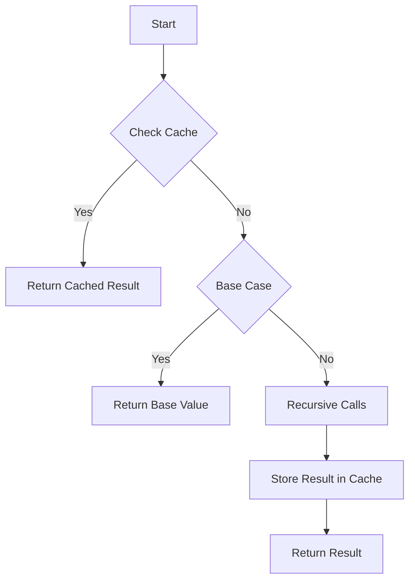

## 21.2 Optimizing Recursive Functions

Recursion is a powerful tool in programming, allowing functions to call themselves to solve problems that can be broken down into smaller, similar sub-problems. However, recursion can also lead to inefficiencies and risks, such as stack overflow errors. In this section, we will explore strategies to optimize recursive functions in JavaScript, ensuring they run efficiently and effectively.

### Understanding Recursion and Its Challenges

Before diving into optimization techniques, let's briefly revisit what recursion is. A recursive function is one that calls itself in order to solve a problem. Each call to the function creates a new execution context on the call stack, which can lead to performance issues if not managed properly.

#### Risks of Stack Overflow

One of the primary risks associated with recursion is stack overflow. This occurs when the call stack exceeds its limit due to too many nested function calls. In JavaScript, this can happen with deep recursion, where the function calls itself many times before reaching a base case.

**Example of Stack Overflow:**

```javascript
function recursiveFunction(n) {
    if (n === 0) return;
    recursiveFunction(n - 1);
}

recursiveFunction(100000); // This may cause a stack overflow error
```

### Techniques for Optimizing Recursive Functions

To mitigate the risks and improve the performance of recursive functions, we can employ several optimization techniques.

#### 1. Tail Recursion Optimization

Tail recursion is a special case of recursion where the recursive call is the last operation in the function. In some programming languages, tail recursion can be optimized by the compiler to reuse the current function's stack frame, thus preventing stack overflow. Unfortunately, JavaScript does not natively support tail call optimization (TCO), but understanding the concept can help you write more efficient recursive functions.

**Example of Tail Recursion:**

```javascript
function tailRecursiveSum(n, acc = 0) {
    if (n === 0) return acc;
    return tailRecursiveSum(n - 1, acc + n);
}

console.log(tailRecursiveSum(10000)); // Efficiently calculates the sum
```

#### 2. Converting Recursion to Iteration

Another way to optimize recursive functions is by converting them into iterative ones. Iterative solutions often use loops instead of recursive calls, which can reduce the risk of stack overflow and improve performance.

**Example: Converting Recursive Factorial to Iterative:**

Recursive Version:

```javascript
function recursiveFactorial(n) {
    if (n === 0) return 1;
    return n * recursiveFactorial(n - 1);
}
```

Iterative Version:

```javascript
function iterativeFactorial(n) {
    let result = 1;
    for (let i = 1; i <= n; i++) {
        result *= i;
    }
    return result;
}

console.log(iterativeFactorial(5)); // Outputs: 120
```

#### 3. Memoization

Memoization is a technique used to optimize recursive functions by caching the results of expensive function calls and returning the cached result when the same inputs occur again. This is particularly useful for functions with overlapping subproblems, such as the Fibonacci sequence.

**Example of Memoization:**

```javascript
function memoizedFibonacci() {
    const cache = {};
    return function fib(n) {
        if (n in cache) return cache[n];
        if (n <= 1) return n;
        cache[n] = fib(n - 1) + fib(n - 2);
        return cache[n];
    };
}

const fibonacci = memoizedFibonacci();
console.log(fibonacci(40)); // Efficiently calculates the 40th Fibonacci number
```

### Practical Examples and Code Optimizations

Let's apply these optimization techniques to some practical examples.

#### Optimizing a Recursive Fibonacci Function

The Fibonacci sequence is a classic example where naive recursion can be inefficient. By using memoization, we can significantly improve its performance.

Naive Recursive Fibonacci:

```javascript
function naiveFibonacci(n) {
    if (n <= 1) return n;
    return naiveFibonacci(n - 1) + naiveFibonacci(n - 2);
}

console.log(naiveFibonacci(40)); // This is inefficient and slow
```

Optimized with Memoization:

```javascript
function optimizedFibonacci() {
    const cache = {};
    return function fib(n) {
        if (n in cache) return cache[n];
        if (n <= 1) return n;
        cache[n] = fib(n - 1) + fib(n - 2);
        return cache[n];
    };
}

const fibonacci = optimizedFibonacci();
console.log(fibonacci(40)); // Much faster and efficient
```

#### Visualizing Recursive Function Optimization

To better understand how memoization optimizes recursive functions, let's visualize the process using a diagram.



**Diagram Explanation:** This flowchart demonstrates the process of checking the cache before performing recursive calls, storing results in the cache, and returning the cached result if available.

### Try It Yourself

To solidify your understanding, try modifying the code examples above:

1. **Experiment with Tail Recursion:** Modify the `tailRecursiveSum` function to calculate the product of numbers instead of the sum.

2. **Convert Recursion to Iteration:** Take the `naiveFibonacci` function and convert it into an iterative version using loops.

3. **Implement Memoization:** Create a memoized version of a different recursive function, such as calculating the number of ways to climb stairs with steps of 1 or 2.

### Knowledge Check

- What is stack overflow, and how can it occur in recursive functions?
- How does tail recursion differ from regular recursion?
- What are the benefits of converting recursion to iteration?
- How does memoization improve the performance of recursive functions?

### Conclusion

Optimizing recursive functions is crucial for writing efficient and robust JavaScript code. By understanding the risks of stack overflow and employing techniques like tail recursion, iteration conversion, and memoization, we can enhance the performance of our recursive solutions. Remember, this is just the beginning. As you progress, you'll build more complex and interactive web pages. Keep experimenting, stay curious, and enjoy the journey!

## Quiz Time!



### What is a common risk associated with recursive functions?

- [x] Stack overflow
- [ ] Memory leaks
- [ ] Syntax errors
- [ ] Infinite loops

> **Explanation:** Stack overflow occurs when the call stack exceeds its limit due to too many nested function calls, which is a common risk with recursive functions.

### Which technique involves caching results of function calls to optimize recursion?

- [ ] Tail recursion
- [x] Memoization
- [ ] Iteration
- [ ] Hoisting

> **Explanation:** Memoization is a technique that caches the results of expensive function calls and returns the cached result when the same inputs occur again.

### What is tail recursion?

- [x] A recursive call that is the last operation in a function
- [ ] A recursive call that occurs at the beginning of a function
- [ ] A recursive call that uses a different function
- [ ] A recursive call that never ends

> **Explanation:** Tail recursion is a special case of recursion where the recursive call is the last operation in the function, allowing for potential optimization.

### How can recursion be converted to iteration?

- [x] By using loops instead of recursive calls
- [ ] By using more recursive calls
- [ ] By using the `eval` function
- [ ] By using global variables

> **Explanation:** Recursion can be converted to iteration by using loops, which can reduce the risk of stack overflow and improve performance.

### What does the following code demonstrate?

```javascript
function memoizedFibonacci() {
    const cache = {};
    return function fib(n) {
        if (n in cache) return cache[n];
        if (n <= 1) return n;
        cache[n] = fib(n - 1) + fib(n - 2);
        return cache[n];
    };
}
```

- [x] Memoization
- [ ] Tail recursion
- [ ] Iteration
- [ ] Hoisting

> **Explanation:** The code demonstrates memoization by caching the results of the Fibonacci function to optimize performance.

### True or False: JavaScript natively supports tail call optimization.

- [ ] True
- [x] False

> **Explanation:** JavaScript does not natively support tail call optimization, although some other programming languages do.

### Which of the following is a benefit of converting recursion to iteration?

- [x] Reduced risk of stack overflow
- [ ] Increased memory usage
- [ ] More complex code
- [ ] Slower execution

> **Explanation:** Converting recursion to iteration reduces the risk of stack overflow and can improve performance.

### What is the base case in a recursive function?

- [x] The condition that stops the recursion
- [ ] The first recursive call
- [ ] The last recursive call
- [ ] The condition that starts the recursion

> **Explanation:** The base case is the condition that stops the recursion, preventing infinite recursive calls.

### How does memoization improve the performance of recursive functions?

- [x] By caching results and avoiding redundant calculations
- [ ] By increasing the number of recursive calls
- [ ] By using global variables
- [ ] By using the `eval` function

> **Explanation:** Memoization improves performance by caching results of function calls, avoiding redundant calculations, and speeding up execution.

### True or False: Iterative solutions are always better than recursive ones.

- [ ] True
- [x] False

> **Explanation:** Iterative solutions are not always better; the choice depends on the problem and context. Recursion can be more intuitive and simpler for certain problems.




