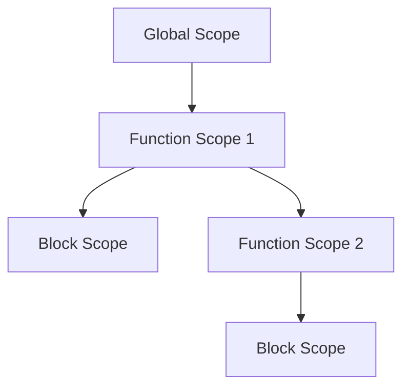

## 21.3 Scope and Closure Optimization

In the world of JavaScript, understanding how scope and closures work is crucial for writing efficient and performant code. As we delve into this topic, we'll explore how variable scope impacts access speed, the cost of accessing global versus local variables, and strategies to optimize closures by avoiding unnecessary variable captures. By the end of this section, you'll have a solid grasp of best practices for variable declaration and usage that enhance performance.

### Understanding Variable Scope and Access Speed

**Scope** in JavaScript refers to the context in which variables are accessible. There are several types of scope, including global, function, and block scope. Each type of scope affects how quickly variables can be accessed and manipulated.

#### Global vs. Local Variables

**Global variables** are accessible from anywhere in the code, while **local variables** are confined to the function or block in which they are declared. Accessing global variables is generally slower than accessing local variables due to the way JavaScript engines handle variable lookups.

- **Global Variables**: These are stored in the global execution context, which means the JavaScript engine must traverse the entire scope chain to access them. This traversal can be time-consuming, especially in large applications.
  
- **Local Variables**: These are stored in the function's execution context, making them quicker to access. The JavaScript engine doesn't need to look beyond the current function's scope, reducing lookup time.

#### Minimizing Scope Chain Lookups

To optimize performance, it's essential to minimize the number of scope chain lookups. Here are some strategies:

1. **Limit Global Variables**: Reduce the number of global variables to minimize the time spent traversing the scope chain. Use local variables whenever possible.

2. **Use `let` and `const`**: These keywords create block-scoped variables, which can help limit the scope of variables and reduce unnecessary lookups.

3. **Avoid Deeply Nested Functions**: Each level of nesting adds to the scope chain, increasing lookup time. Keep functions as flat as possible.

4. **Cache Variables**: If you need to access a global variable multiple times within a function, cache it in a local variable to speed up access.

```javascript
// Example of caching a global variable
const globalVar = 'I am global';

function exampleFunction() {
  // Cache the global variable
  const localVar = globalVar;
  
  console.log(localVar); // Faster access
}
```

### Optimizing Closures

Closures are a powerful feature in JavaScript, allowing functions to retain access to their lexical scope even when executed outside of it. However, closures can also lead to performance issues if not used carefully.

#### Avoiding Unnecessary Variable Captures

When a closure is created, it captures all the variables within its lexical scope. This can lead to memory bloat if unnecessary variables are captured. To optimize closures:

1. **Capture Only Necessary Variables**: Be mindful of which variables are captured by the closure. Avoid capturing variables that are not used within the closure.

2. **Use Closures Judiciously**: While closures are useful, overusing them can lead to performance issues. Use them only when necessary.

3. **Release References**: If a closure is no longer needed, release references to it to allow garbage collection to free up memory.

```javascript
// Example of optimizing closures
function createCounter() {
  let count = 0; // Only capture necessary variables

  return function() {
    return ++count;
  };
}

const counter = createCounter();
console.log(counter()); // 1
console.log(counter()); // 2
```

### Best Practices for Variable Declaration and Usage

To further optimize scope and closures, consider the following best practices:

1. **Declare Variables at the Top**: This practice helps avoid confusion and potential errors due to hoisting. It also makes the code more readable.

2. **Use Descriptive Names**: Descriptive variable names improve code readability and maintainability, making it easier to understand the purpose of each variable.

3. **Avoid Re-declaring Variables**: Re-declaring variables can lead to unexpected behavior and performance issues. Use `let` and `const` to prevent accidental re-declarations.

4. **Limit Variable Scope**: Keep variables within the smallest scope possible to reduce the risk of conflicts and improve performance.

5. **Use `const` for Constants**: If a variable's value will not change, declare it with `const` to prevent accidental modifications and improve code clarity.

### Visualizing Scope Chains

To better understand how scope chains work, let's visualize them using a diagram. This diagram illustrates how JavaScript resolves variables using the scope chain.



**Caption**: This diagram shows the hierarchy of scopes in JavaScript. The global scope is at the top, followed by function and block scopes. JavaScript resolves variables by traversing this chain from the innermost scope outward.

### Try It Yourself

Experiment with the following code example to see how scope and closures work in practice. Try modifying the code to observe how changes affect performance.

```javascript
// Global variable
let counter = 0;

function incrementCounter() {
  // Local variable
  let localCounter = 0;

  return function() {
    // Closure capturing localCounter
    localCounter++;
    counter++;
    console.log(`Local: ${localCounter}, Global: ${counter}`);
  };
}

const increment = incrementCounter();
increment(); // Local: 1, Global: 1
increment(); // Local: 2, Global: 2
```

**Suggestions for Experimentation**:
- Try adding more nested functions and observe how it affects performance.
- Experiment with removing the closure and see how it impacts the code.

### References and Further Reading

For more information on scope and closures in JavaScript, consider exploring the following resources:

- [MDN Web Docs: JavaScript Closures](https://developer.mozilla.org/en-US/docs/Web/JavaScript/Closures)
- [W3Schools: JavaScript Scope](https://www.w3schools.com/js/js_scope.asp)

### Knowledge Check

Before we wrap up, let's reinforce what we've learned with a few questions:

- What is the difference between global and local variables in terms of access speed?
- How can you minimize scope chain lookups?
- What are some best practices for optimizing closures?

### Embrace the Journey

Remember, optimizing scope and closures is just one part of writing efficient JavaScript code. As you continue to learn and practice, you'll discover even more techniques to enhance performance. Keep experimenting, stay curious, and enjoy the journey!

## Quiz Time!



### What is the primary benefit of using local variables over global variables?

- [x] Faster access speed
- [ ] Easier to debug
- [ ] More memory usage
- [ ] Better for large applications

> **Explanation:** Local variables are stored in the function's execution context, making them quicker to access than global variables, which require traversing the entire scope chain.

### How can you minimize scope chain lookups in JavaScript?

- [x] Limit global variables
- [x] Use `let` and `const`
- [ ] Use more global variables
- [ ] Avoid using functions

> **Explanation:** Limiting global variables and using `let` and `const` help reduce the number of scope chain lookups, improving performance.

### What is a closure in JavaScript?

- [x] A function that retains access to its lexical scope
- [ ] A function that is executed immediately
- [ ] A variable declared with `const`
- [ ] A global variable

> **Explanation:** A closure is a function that retains access to its lexical scope even when executed outside of it.

### What is the impact of capturing unnecessary variables in a closure?

- [x] Increased memory usage
- [ ] Faster execution
- [ ] Easier debugging
- [ ] Improved readability

> **Explanation:** Capturing unnecessary variables in a closure can lead to increased memory usage and potential performance issues.

### Which keyword should you use for variables that won't change?

- [x] `const`
- [ ] `let`
- [ ] `var`
- [ ] `function`

> **Explanation:** The `const` keyword is used to declare variables that won't change, preventing accidental modifications and improving code clarity.

### What is the scope chain in JavaScript?

- [x] The hierarchy of scopes that JavaScript uses to resolve variables
- [ ] A list of all global variables
- [ ] A function that returns the scope of a variable
- [ ] A method for optimizing closures

> **Explanation:** The scope chain is the hierarchy of scopes that JavaScript uses to resolve variables, starting from the innermost scope and moving outward.

### How can you optimize closures in JavaScript?

- [x] Capture only necessary variables
- [x] Use closures judiciously
- [ ] Capture all variables
- [ ] Avoid using closures

> **Explanation:** To optimize closures, capture only necessary variables and use closures judiciously to prevent memory bloat and performance issues.

### What is the purpose of caching a global variable in a local variable?

- [x] To speed up access
- [ ] To increase memory usage
- [ ] To make the code more complex
- [ ] To improve readability

> **Explanation:** Caching a global variable in a local variable speeds up access by reducing the need for scope chain lookups.

### What is the benefit of declaring variables at the top of a function?

- [x] Avoiding confusion due to hoisting
- [ ] Increasing memory usage
- [ ] Making the code more complex
- [ ] Improving execution speed

> **Explanation:** Declaring variables at the top of a function helps avoid confusion due to hoisting and makes the code more readable.

### True or False: Closures can lead to performance issues if not used carefully.

- [x] True
- [ ] False

> **Explanation:** True. Closures can lead to performance issues if unnecessary variables are captured or if they are overused.



By understanding and optimizing scope and closures, you're taking a significant step toward writing efficient and performant JavaScript code. Keep practicing, and soon these concepts will become second nature.
