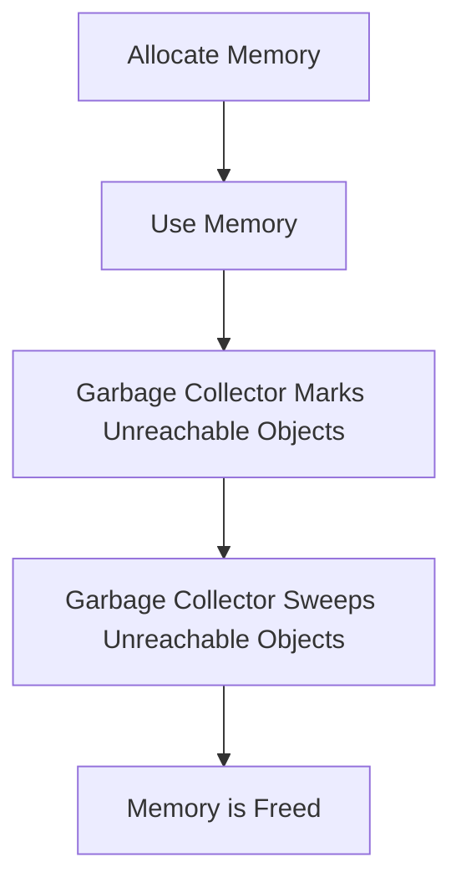

## 21.4 Minimizing Memory Usage

As we delve deeper into the world of JavaScript, understanding how to manage memory efficiently becomes crucial. Memory management is a key aspect of writing performant applications, and it involves understanding how memory is allocated and released. In this section, we'll explore how functions can lead to memory leaks, strategies to free up memory, the role of the garbage collector, and practical tips for writing memory-efficient functions.

### Understanding Memory Leaks in JavaScript

A memory leak occurs when a program consumes memory but fails to release it back to the system, leading to increased memory usage over time. In JavaScript, memory leaks can occur when references to objects are maintained even when they are no longer needed. Let's explore how functions can contribute to memory leaks and how to address them.

#### Common Causes of Memory Leaks

1. **Global Variables**: Variables declared in the global scope remain in memory for the lifetime of the application. If not managed properly, they can lead to memory leaks.

2. **Event Listeners**: Adding event listeners without removing them when they are no longer needed can cause memory leaks, as the references to the DOM elements are retained.

3. **Closures**: While closures are powerful, they can inadvertently hold onto variables that are no longer necessary, leading to increased memory usage.

4. **Circular References**: When two objects reference each other, they can prevent the garbage collector from reclaiming their memory.

#### Example: Memory Leak with Closures

```javascript
function createCounter() {
    let count = 0;
    return function() {
        return ++count;
    };
}

const counter = createCounter();
console.log(counter()); // 1
console.log(counter()); // 2
```

In the above example, the `createCounter` function creates a closure that retains a reference to the `count` variable. While this is intentional, similar patterns can lead to memory leaks if not managed carefully.

### Strategies for Freeing Up Memory

To minimize memory usage, it's essential to release memory when it's no longer needed. Here are some strategies to achieve this:

1. **Nullifying References**: Set object references to `null` when they are no longer needed. This helps the garbage collector identify them as eligible for garbage collection.

   ```javascript
   let largeObject = { /* some large data */ };
   // Use the object
   largeObject = null; // Release memory
   ```

2. **Removing Event Listeners**: Always remove event listeners when they are no longer needed to prevent memory leaks.

   ```javascript
   const button = document.getElementById('myButton');
   function handleClick() {
       console.log('Button clicked');
   }
   button.addEventListener('click', handleClick);

   // Later in the code
   button.removeEventListener('click', handleClick);
   ```

3. **Avoiding Unnecessary Global Variables**: Limit the use of global variables to prevent them from occupying memory unnecessarily.

4. **Using WeakMap and WeakSet**: These data structures allow you to store weak references to objects, which do not prevent garbage collection.

   ```javascript
   const weakMap = new WeakMap();
   let obj = {};
   weakMap.set(obj, 'some value');
   obj = null; // The entry in weakMap can be garbage collected
   ```

### The Role of the Garbage Collector

JavaScript's garbage collector automatically reclaims memory that is no longer in use. It uses algorithms like mark-and-sweep to identify and collect unreachable objects. Understanding how the garbage collector works can help you write more memory-efficient code.

#### How Garbage Collection Works

1. **Mark-and-Sweep**: The garbage collector traverses the object graph, marking reachable objects. Unmarked objects are considered unreachable and are collected.

2. **Reference Counting**: Some engines use reference counting, where objects are collected when their reference count drops to zero. However, this can lead to issues with circular references.

### Impact of Large Closures

Closures are a powerful feature of JavaScript, allowing functions to retain access to their lexical scope. However, they can also lead to increased memory usage if they capture large objects or variables that are no longer needed.

#### Mitigating the Impact of Large Closures

1. **Limit Captured Variables**: Only capture variables that are necessary for the closure's operation.

2. **Release Unnecessary References**: Set captured variables to `null` when they are no longer needed.

3. **Use Closures Sparingly**: Avoid creating closures unnecessarily, especially in performance-critical sections of your code.

### Practical Tips for Writing Memory-Efficient Functions

1. **Optimize Data Structures**: Choose appropriate data structures for your needs. For example, use arrays for ordered collections and objects for key-value pairs.

2. **Avoid Unnecessary Computations**: Cache results of expensive computations to avoid recalculating them.

3. **Use Efficient Algorithms**: Choose algorithms that minimize memory usage, such as in-place sorting algorithms.

4. **Profile Memory Usage**: Use tools like Chrome DevTools to profile your application's memory usage and identify potential leaks.

5. **Minimize Use of Third-Party Libraries**: Only include libraries that are essential for your application to reduce memory overhead.

### Try It Yourself

Experiment with the following code to see how memory management works in practice:

```javascript
function createLargeArray() {
    const largeArray = new Array(1000000).fill('data');
    return function() {
        console.log(largeArray.length);
    };
}

const logArraySize = createLargeArray();
logArraySize(); // 1000000

// Try nullifying the reference
logArraySize = null; // Attempt to release memory
```

Try modifying the code to release memory more effectively and observe the impact on memory usage using a profiling tool.

### Visualizing Memory Management

To better understand memory management, let's visualize how JavaScript handles memory allocation and garbage collection.



**Figure 1: Memory Management Process in JavaScript**

This diagram illustrates the process of memory allocation, usage, and garbage collection in JavaScript. Understanding this process is key to writing memory-efficient code.

### References and Further Reading

- [MDN Web Docs: Memory Management](https://developer.mozilla.org/en-US/docs/Web/JavaScript/Memory_Management)
- [JavaScript.info: Garbage Collection](https://javascript.info/garbage-collection)
- [W3Schools: JavaScript Memory Management](https://www.w3schools.com/js/js_memory_management.asp)

### Knowledge Check

1. What is a memory leak, and how can it occur in JavaScript?
2. How can you prevent memory leaks caused by event listeners?
3. What is the role of the garbage collector in JavaScript?
4. How can closures lead to increased memory usage?
5. What strategies can you use to write memory-efficient functions?

### Embrace the Journey

Remember, minimizing memory usage is an ongoing process. As you continue to learn and grow as a developer, you'll discover new techniques and tools to optimize your code. Keep experimenting, stay curious, and enjoy the journey!

## Quiz Time!



### What is a memory leak in JavaScript?

- [x] When memory is allocated but not released
- [ ] When memory is released too quickly
- [ ] When memory is used efficiently
- [ ] When memory is not allocated

> **Explanation:** A memory leak occurs when memory is allocated but not released, leading to increased memory usage over time.

### How can you free up memory in JavaScript?

- [x] Nullify references
- [ ] Increase memory allocation
- [ ] Use more global variables
- [ ] Avoid using closures

> **Explanation:** Nullifying references helps the garbage collector identify objects as eligible for garbage collection.

### What is the role of the garbage collector?

- [x] Reclaim memory that is no longer in use
- [ ] Allocate more memory to applications
- [ ] Increase the speed of JavaScript execution
- [ ] Manage global variables

> **Explanation:** The garbage collector reclaims memory that is no longer in use by identifying and collecting unreachable objects.

### How can closures lead to memory leaks?

- [x] By retaining references to unnecessary variables
- [ ] By freeing up memory too early
- [ ] By increasing the speed of execution
- [ ] By using global variables

> **Explanation:** Closures can retain references to variables that are no longer needed, leading to increased memory usage.

### What is a strategy to minimize memory usage with closures?

- [x] Limit captured variables
- [ ] Use more global variables
- [ ] Avoid using functions
- [ ] Increase memory allocation

> **Explanation:** Limiting captured variables in closures helps reduce memory usage by only retaining necessary references.

### What is a WeakMap used for?

- [x] Storing weak references to objects
- [ ] Storing strong references to objects
- [ ] Increasing memory usage
- [ ] Decreasing execution speed

> **Explanation:** WeakMap is used to store weak references to objects, allowing them to be garbage collected when no longer needed.

### How can you profile memory usage in JavaScript?

- [x] Use Chrome DevTools
- [ ] Increase memory allocation
- [ ] Use more global variables
- [ ] Avoid using functions

> **Explanation:** Chrome DevTools provides tools to profile memory usage and identify potential leaks in JavaScript applications.

### What is a common cause of memory leaks in JavaScript?

- [x] Unremoved event listeners
- [ ] Efficient memory allocation
- [ ] Using closures
- [ ] Using local variables

> **Explanation:** Unremoved event listeners can cause memory leaks by retaining references to DOM elements.

### How can you mitigate the impact of large closures?

- [x] Release unnecessary references
- [ ] Use more global variables
- [ ] Avoid using functions
- [ ] Increase memory allocation

> **Explanation:** Releasing unnecessary references in closures helps reduce memory usage by allowing the garbage collector to reclaim memory.

### True or False: The garbage collector in JavaScript automatically reclaims memory that is no longer in use.

- [x] True
- [ ] False

> **Explanation:** True. The garbage collector automatically reclaims memory that is no longer in use by identifying and collecting unreachable objects.


