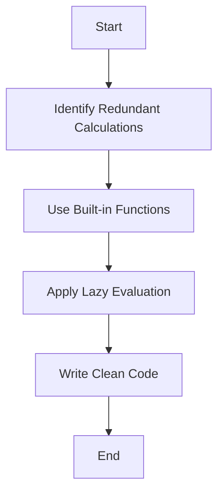

## 21.5 Best Practices for Efficient Code

In the world of programming, writing efficient code is crucial. Efficient code not only runs faster but also consumes fewer resources, making your applications more responsive and scalable. In this section, we'll explore best practices for writing efficient JavaScript code, focusing on functions and scope. We'll cover minimizing redundant calculations, leveraging built-in functions, lazy evaluation, and writing clean, readable code that doesn't compromise performance.

### Minimize Redundant Calculations

One of the simplest yet most effective ways to optimize your code is to minimize redundant calculations. This means avoiding repeated computations that can be calculated once and reused.

#### Example: Inefficient vs. Optimized Code

Consider the following example where we calculate the square of a number multiple times:

```javascript
// Inefficient code
function calculateArea(radius) {
  return Math.PI * radius * radius;
}

function calculateCircumference(radius) {
  return 2 * Math.PI * radius;
}

function printCircleProperties(radius) {
  console.log('Area:', calculateArea(radius));
  console.log('Circumference:', calculateCircumference(radius));
  console.log('Diameter:', 2 * radius);
}

printCircleProperties(5);
```

In the above code, `Math.PI` is accessed multiple times. Although this is a trivial example, in more complex calculations, such redundancy can lead to performance issues.

Let's optimize it:

```javascript
// Optimized code
function printCircleProperties(radius) {
  const pi = Math.PI;
  const area = pi * radius * radius;
  const circumference = 2 * pi * radius;
  const diameter = 2 * radius;

  console.log('Area:', area);
  console.log('Circumference:', circumference);
  console.log('Diameter:', diameter);
}

printCircleProperties(5);
```

By storing `Math.PI` in a variable, we reduce the number of times it is accessed, making the code slightly more efficient.

### Use Built-in Functions

JavaScript engines are optimized to execute built-in functions efficiently. Whenever possible, use these functions instead of writing custom implementations.

#### Example: Using Built-in Functions

Let's say we need to find the maximum number in an array. Instead of writing our own function, we can use the built-in `Math.max` function combined with the spread operator:

```javascript
// Custom implementation
function findMax(arr) {
  let max = arr[0];
  for (let i = 1; i < arr.length; i++) {
    if (arr[i] > max) {
      max = arr[i];
    }
  }
  return max;
}

console.log(findMax([5, 3, 9, 1])); // Output: 9

// Using built-in function
const numbers = [5, 3, 9, 1];
const maxNumber = Math.max(...numbers);
console.log(maxNumber); // Output: 9
```

The built-in function is not only more concise but also potentially faster due to engine optimizations.

### Lazy Evaluation and Short-Circuiting

Lazy evaluation is a strategy where expressions are not evaluated until their values are needed. In JavaScript, this concept is often used with logical operators for short-circuiting.

#### Example: Short-Circuiting

Logical operators like `&&` and `||` can be used to short-circuit expressions, which can prevent unnecessary calculations.

```javascript
// Short-circuiting example
function getUserName(user) {
  return user && user.name || 'Guest';
}

const user1 = { name: 'Alice' };
const user2 = null;

console.log(getUserName(user1)); // Output: Alice
console.log(getUserName(user2)); // Output: Guest
```

In the example above, `user && user.name` will only evaluate `user.name` if `user` is truthy, preventing potential errors and unnecessary evaluations.

### Write Clean and Readable Code

Efficiency is not just about speed; it's also about maintainability. Clean, readable code is easier to understand and optimize.

#### Example: Clean Code

Consider the following function:

```javascript
// Less readable code
function calc(a, b, c) {
  return a * b + c;
}

// More readable code
function calculateTotalPrice(price, quantity, tax) {
  return price * quantity + tax;
}
```

The second example uses descriptive variable names, making the code easier to understand and maintain.

### Try It Yourself

Experiment with the following code by modifying it to see how changes affect performance and readability:

```javascript
function calculateDiscountedPrice(price, discount) {
  const discountAmount = price * (discount / 100);
  return price - discountAmount;
}

console.log(calculateDiscountedPrice(100, 10)); // Output: 90
```

Try changing the discount calculation to use a different formula or add additional parameters to see how it impacts the function's efficiency and readability.

### Visualizing Code Efficiency

To better understand how efficient code works, let's visualize the process of optimizing a function using a flowchart.



This flowchart represents a simple process for optimizing code: start by identifying redundant calculations, use built-in functions, apply lazy evaluation, and write clean code.

### References and Further Reading

- [MDN Web Docs: JavaScript Performance](https://developer.mozilla.org/en-US/docs/Web/JavaScript/Performance)
- [W3Schools: JavaScript Optimization](https://www.w3schools.com/js/js_performance.asp)

### Knowledge Check

- What is lazy evaluation, and how can it improve performance?
- How can using built-in functions enhance code efficiency?
- Why is it important to write clean and readable code?

### Practice Problems

1. Refactor a function that calculates the sum of an array to use a built-in function.
2. Identify and eliminate redundant calculations in a given piece of code.
3. Use short-circuiting to simplify a function that checks multiple conditions.

### Embrace the Journey

Remember, this is just the beginning. As you progress, you'll build more complex and interactive web pages. Keep experimenting, stay curious, and enjoy the journey!

## Quiz Time!



### What is one of the most effective ways to optimize code?

- [x] Minimize redundant calculations
- [ ] Use as many loops as possible
- [ ] Avoid using built-in functions
- [ ] Write complex code

> **Explanation:** Minimizing redundant calculations helps reduce unnecessary computations, leading to more efficient code.

### Which of the following is a benefit of using built-in functions?

- [x] They are optimized by the JavaScript engine
- [ ] They are always slower than custom implementations
- [ ] They are harder to read
- [ ] They increase code complexity

> **Explanation:** Built-in functions are optimized by the JavaScript engine, making them faster and more reliable than custom implementations.

### What is lazy evaluation?

- [x] A strategy where expressions are evaluated only when needed
- [ ] A method to speed up all calculations
- [ ] A way to write code without comments
- [ ] A technique to avoid using variables

> **Explanation:** Lazy evaluation delays the evaluation of expressions until their values are needed, improving performance by avoiding unnecessary calculations.

### How can short-circuiting improve code efficiency?

- [x] By preventing unnecessary evaluations
- [ ] By making code harder to read
- [ ] By increasing the number of calculations
- [ ] By using more memory

> **Explanation:** Short-circuiting prevents unnecessary evaluations, which can save time and resources.

### Why is writing clean and readable code important?

- [x] It makes code easier to understand and maintain
- [ ] It always makes code run faster
- [ ] It reduces the need for comments
- [ ] It increases the number of lines in the code

> **Explanation:** Clean and readable code is easier to understand and maintain, which is crucial for long-term efficiency and collaboration.

### What does the spread operator do in JavaScript?

- [x] Expands an array into individual elements
- [ ] Combines multiple arrays into one
- [ ] Increases the size of an array
- [ ] Deletes elements from an array

> **Explanation:** The spread operator expands an array into individual elements, which is useful for functions like `Math.max`.

### How can you optimize a function that calculates the area of a circle?

- [x] Store repeated calculations in variables
- [ ] Use more loops
- [ ] Avoid using constants
- [ ] Write the function in a single line

> **Explanation:** Storing repeated calculations in variables reduces the number of times they are computed, optimizing the function.

### What is the purpose of using descriptive variable names?

- [x] To make code more readable and understandable
- [ ] To make code run faster
- [ ] To reduce the number of comments needed
- [ ] To increase the length of the code

> **Explanation:** Descriptive variable names make code more readable and understandable, which is important for maintainability.

### Which logical operator can be used for short-circuiting?

- [x] &&
- [ ] ||
- [ ] ==
- [ ] !=

> **Explanation:** The `&&` operator can be used for short-circuiting, as it only evaluates the second operand if the first is true.

### True or False: Using built-in functions is always less efficient than writing custom implementations.

- [ ] True
- [x] False

> **Explanation:** False. Built-in functions are often more efficient because they are optimized by the JavaScript engine.


