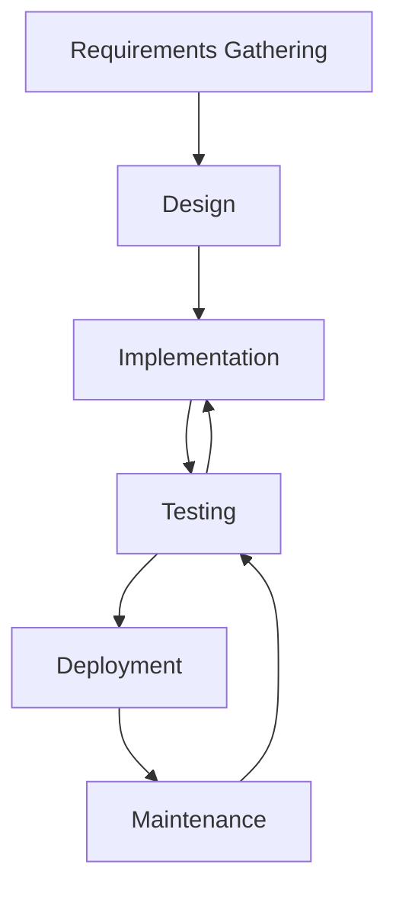

## 22.1 Importance of Testing

In the world of software development, testing is not just a step in the process; it is an integral part of creating reliable, maintainable, and high-quality software. As we delve into the importance of testing, especially in the context of JavaScript functions, we will explore how testing ensures that functions work as intended, the benefits of early bug detection, and how adopting a testing mindset can lead to more robust and maintainable code.

### The Role of Testing in Software Development

Testing is the process of evaluating a system or its components to determine whether they meet specified requirements. It involves executing a program or application with the intent of finding software bugs or errors. In the context of JavaScript functions, testing plays a crucial role in verifying that each function performs its intended task correctly and efficiently.

#### Why Testing Matters

1. **Verification of Functionality**: Testing ensures that the functions you write do what they are supposed to do. By running tests, you can verify that your code behaves as expected in different scenarios.

2. **Error Detection**: Testing helps identify bugs or errors in your code early in the development process. This early detection can save time and resources by preventing issues from escalating into larger problems.

3. **Code Quality and Reliability**: Regular testing contributes to higher code quality. It ensures that your code is reliable and can handle various inputs and edge cases gracefully.

4. **Facilitating Change**: When you have a comprehensive suite of tests, you can make changes to your code with confidence. Tests act as a safety net, alerting you to any unintended side effects of your modifications.

5. **Documentation**: Tests can serve as documentation for your code. They provide examples of how functions are expected to behave, making it easier for others (or your future self) to understand the codebase.

### Ensuring Functions Work as Intended

JavaScript functions are the building blocks of your application. Ensuring that these functions work as intended is critical to the overall success of your software. Testing functions involves checking their output against expected results for a variety of inputs.

#### Types of Testing

1. **Unit Testing**: This involves testing individual functions or components in isolation. The goal is to verify that each function performs its task correctly.

2. **Integration Testing**: This type of testing focuses on the interaction between different functions or components. It ensures that they work together as expected.

3. **Functional Testing**: This involves testing the application against the functional requirements. It ensures that the application behaves as expected from the user's perspective.

4. **End-to-End Testing**: This type of testing simulates real user scenarios to ensure that the entire application works as intended.

#### Example of a Simple Unit Test

Let's consider a simple JavaScript function that adds two numbers:

```javascript
// Function to add two numbers
function add(a, b) {
    return a + b;
}

// Unit test for the add function
function testAdd() {
    const result = add(2, 3);
    const expected = 5;
    console.assert(result === expected, `Expected ${expected}, but got ${result}`);
}

// Run the test
testAdd();
```

In this example, we define a function `add` that takes two arguments and returns their sum. We then write a simple unit test `testAdd` to verify that the function returns the correct result when adding 2 and 3. The `console.assert` statement checks if the result matches the expected value, and if not, it logs an error message.

### Benefits of Early Bug Detection

Detecting bugs early in the development process is one of the most significant advantages of testing. Early bug detection can lead to:

1. **Reduced Cost**: Fixing bugs early is generally less expensive than addressing them later in the development cycle or after deployment.

2. **Improved User Experience**: By catching and fixing bugs early, you can ensure a smoother and more reliable experience for users.

3. **Increased Developer Productivity**: When developers spend less time debugging and fixing issues, they can focus more on building new features and improving the application.

4. **Enhanced Code Stability**: Early detection and resolution of bugs contribute to a more stable codebase, reducing the likelihood of future issues.

### Adopting a Testing Mindset

Adopting a testing mindset means integrating testing into every stage of the development process. It involves thinking about potential edge cases, error conditions, and how your code might fail. Here are some strategies to cultivate a testing mindset:

1. **Write Tests First**: Consider writing tests before you write the actual code. This approach, known as Test-Driven Development (TDD), helps you focus on the requirements and design of your functions.

2. **Test for Edge Cases**: Think about unusual or extreme inputs that might cause your functions to fail. Write tests to cover these scenarios.

3. **Automate Testing**: Use testing frameworks and tools to automate the execution of your tests. This makes it easier to run tests frequently and consistently.

4. **Review and Refactor Tests**: Just like your code, your tests should be reviewed and refactored to ensure they remain effective and relevant as your application evolves.

### Testing and Code Reliability

Testing is a key factor in achieving code reliability. Reliable code is code that consistently performs as expected under various conditions. Here are some ways testing contributes to code reliability:

1. **Consistency**: Tests ensure that your code produces consistent results, even as the codebase changes over time.

2. **Robustness**: By testing for different inputs and scenarios, you can ensure that your code can handle unexpected situations gracefully.

3. **Confidence**: With a comprehensive suite of tests, you can make changes to your code with confidence, knowing that any regressions will be caught by your tests.

4. **Maintainability**: Well-tested code is easier to maintain and extend. Tests provide a safety net that allows you to refactor and improve your code without fear of breaking existing functionality.

### Testing Tools and Frameworks

There are many tools and frameworks available to help you write and run tests for your JavaScript functions. Some popular options include:

1. **Jest**: A comprehensive testing framework developed by Facebook, Jest is known for its ease of use and powerful features, such as snapshot testing and parallel test execution.

2. **Mocha**: A flexible testing framework that allows you to write tests in a variety of styles. Mocha is often used in combination with assertion libraries like Chai.

3. **Jasmine**: A behavior-driven development (BDD) framework that provides a clean syntax for writing tests.

4. **QUnit**: A powerful, easy-to-use JavaScript unit testing framework, QUnit is used by the jQuery project and is suitable for testing any JavaScript code.

5. **Cypress**: A modern end-to-end testing framework that provides a fast, reliable, and easy-to-use testing experience.

### Try It Yourself

Let's put what we've learned into practice. Try writing a few tests for a simple JavaScript function. Here's a function that calculates the factorial of a number:

```javascript
// Function to calculate factorial
function factorial(n) {
    if (n < 0) return undefined;
    if (n === 0) return 1;
    return n * factorial(n - 1);
}

// Test the factorial function
function testFactorial() {
    console.assert(factorial(0) === 1, 'Test Case 1 Failed');
    console.assert(factorial(1) === 1, 'Test Case 2 Failed');
    console.assert(factorial(5) === 120, 'Test Case 3 Failed');
    console.assert(factorial(-1) === undefined, 'Test Case 4 Failed');
}

// Run the test
testFactorial();
```

Try modifying the `factorial` function or the test cases to see how changes affect the results. Experiment with different inputs and edge cases to deepen your understanding of testing.

### Visualizing the Testing Process

To better understand the testing process, let's visualize how testing fits into the software development lifecycle:



**Diagram Description**: This flowchart illustrates the software development lifecycle, highlighting the testing phase. Testing is shown as an iterative process, feeding back into implementation and maintenance to ensure continuous improvement.

### References and Links

- [MDN Web Docs: Testing](https://developer.mozilla.org/en-US/docs/Learn/Tools_and_testing/Testing)
- [Jest Documentation](https://jestjs.io/docs/en/getting-started)
- [Mocha Documentation](https://mochajs.org/)
- [Jasmine Documentation](https://jasmine.github.io/)
- [Cypress Documentation](https://www.cypress.io/)

### Knowledge Check

- Why is testing important in software development?
- What are the different types of testing, and how do they differ?
- How does early bug detection benefit the development process?
- What strategies can you use to adopt a testing mindset?
- How does testing contribute to code reliability and maintainability?

### Embrace the Journey

Remember, testing is not just a task to check off your list; it's an ongoing practice that enhances the quality and reliability of your software. As you continue to learn and grow as a developer, embrace testing as a fundamental part of your workflow. Keep experimenting, stay curious, and enjoy the journey of creating robust and reliable JavaScript applications!

## Quiz Time!



### Why is testing important in software development?

- [x] It ensures functions work as intended.
- [ ] It makes the code run faster.
- [ ] It adds more features to the application.
- [ ] It reduces the need for documentation.

> **Explanation:** Testing is crucial because it verifies that functions perform their intended tasks correctly, ensuring the software's reliability and quality.

### What is the primary goal of unit testing?

- [x] To test individual functions or components in isolation.
- [ ] To test the entire application as a whole.
- [ ] To test the user interface.
- [ ] To test the database interactions.

> **Explanation:** Unit testing focuses on testing individual functions or components to ensure they work correctly in isolation.

### Which of the following is a benefit of early bug detection?

- [x] Reduced cost of fixing bugs.
- [ ] Increased code complexity.
- [ ] Delayed project timelines.
- [ ] Increased number of features.

> **Explanation:** Early bug detection reduces the cost of fixing bugs, as issues are identified and resolved before they escalate.

### What is Test-Driven Development (TDD)?

- [x] Writing tests before writing the actual code.
- [ ] Writing code before writing tests.
- [ ] Writing tests only after deployment.
- [ ] Writing tests during the maintenance phase.

> **Explanation:** Test-Driven Development (TDD) is a practice where tests are written before the actual code, guiding the development process.

### How does testing contribute to code maintainability?

- [x] By providing a safety net for refactoring.
- [ ] By increasing code complexity.
- [x] By ensuring consistent behavior.
- [ ] By reducing code readability.

> **Explanation:** Testing contributes to maintainability by providing a safety net for refactoring and ensuring consistent behavior, making it easier to update and improve the code.

### What is the role of `console.assert` in testing?

- [x] To check if a condition is true and log an error if it is not.
- [ ] To execute the code faster.
- [ ] To format the output of the code.
- [ ] To optimize the code for performance.

> **Explanation:** `console.assert` is used to check if a condition is true and logs an error message if the condition is false, helping identify issues during testing.

### Which testing framework is known for its ease of use and snapshot testing?

- [x] Jest
- [ ] Mocha
- [ ] Jasmine
- [ ] QUnit

> **Explanation:** Jest is known for its ease of use and powerful features, including snapshot testing.

### What is the purpose of integration testing?

- [x] To test the interaction between different functions or components.
- [ ] To test individual functions in isolation.
- [ ] To test the user interface.
- [ ] To test the database schema.

> **Explanation:** Integration testing focuses on testing the interaction between different functions or components to ensure they work together as expected.

### How can tests serve as documentation?

- [x] By providing examples of how functions are expected to behave.
- [ ] By increasing the code's execution speed.
- [ ] By reducing the need for comments.
- [ ] By making the code more complex.

> **Explanation:** Tests can serve as documentation by providing examples of expected behavior, making it easier to understand the codebase.

### True or False: Testing is only necessary during the initial development phase.

- [ ] True
- [x] False

> **Explanation:** False. Testing is an ongoing process that should be integrated into every stage of development, including maintenance and updates.


