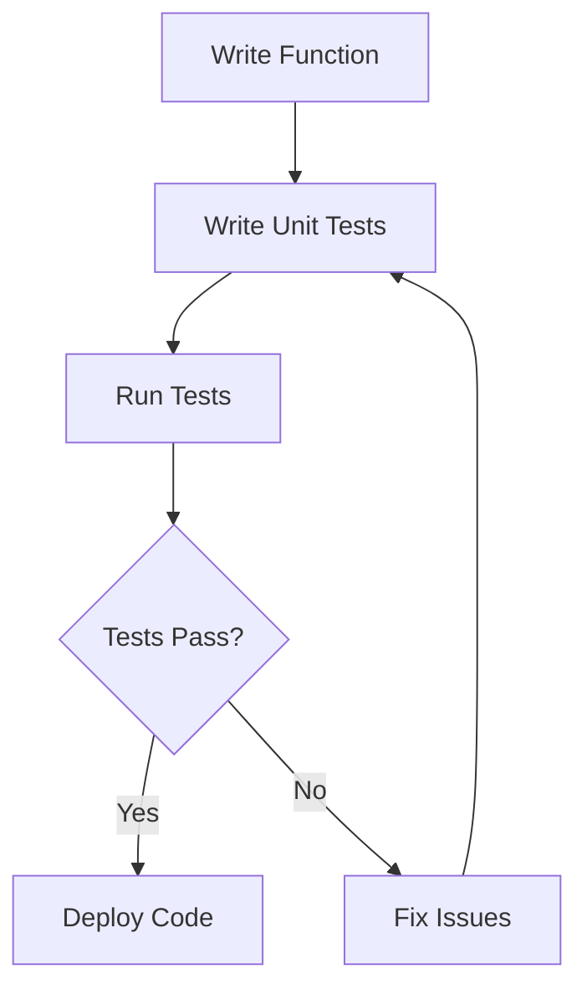

## 22.2 Unit Testing with Frameworks

Unit testing is a crucial part of software development that ensures each part of your code works as expected. In JavaScript, testing frameworks like Jest and Mocha provide powerful tools to help you write and run tests efficiently. In this section, we'll explore these frameworks, learn how to write unit tests for functions, and understand how to integrate testing into your development workflow.

### Introduction to JavaScript Testing Frameworks

JavaScript testing frameworks are libraries that provide a structured way to write and execute tests. They come with features like test runners, assertion libraries, and utilities for mocking and spying. Let's introduce two popular frameworks: Jest and Mocha.

#### Jest

Jest is a comprehensive testing framework developed by Facebook. It's designed to work seamlessly with JavaScript applications, especially those using React. Jest is known for its simplicity, powerful features, and ease of use.

- **Key Features of Jest**:
  - **Zero Configuration**: Jest works out of the box for most JavaScript projects.
  - **Snapshot Testing**: Capture the output of your functions and compare it over time.
  - **Mocking**: Easily mock functions, modules, and timers.
  - **Parallel Test Execution**: Run tests in parallel to speed up the testing process.

#### Mocha

Mocha is a flexible testing framework that allows you to choose your assertion library and mocking tools. It's known for its simplicity and adaptability, making it a favorite among developers who want more control over their testing environment.

- **Key Features of Mocha**:
  - **Asynchronous Testing**: Built-in support for testing asynchronous code.
  - **Customizable**: Choose your assertion library (e.g., Chai) and mocking tools.
  - **Rich Ecosystem**: A wide range of plugins and integrations.

### Setting Up Jest and Mocha

Before we dive into writing tests, let's set up Jest and Mocha in a JavaScript project.

#### Setting Up Jest

1. **Initialize Your Project**: If you haven't already, create a new JavaScript project using npm.

   ```bash
   npm init -y
   ```

2. **Install Jest**: Use npm to install Jest as a development dependency.

   ```bash
   npm install --save-dev jest
   ```

3. **Configure Jest**: Add a test script to your `package.json` file.

   ```json
   "scripts": {
     "test": "jest"
   }
   ```

4. **Create a Test File**: Create a new file, e.g., `sum.test.js`, in your project directory.

#### Setting Up Mocha

1. **Initialize Your Project**: As with Jest, start by initializing your project.

   ```bash
   npm init -y
   ```

2. **Install Mocha**: Install Mocha as a development dependency.

   ```bash
   npm install --save-dev mocha
   ```

3. **Install an Assertion Library**: Mocha doesn't come with an assertion library, so install Chai.

   ```bash
   npm install --save-dev chai
   ```

4. **Configure Mocha**: Add a test script to your `package.json`.

   ```json
   "scripts": {
     "test": "mocha"
   }
   ```

5. **Create a Test File**: Create a test file, e.g., `sum.test.js`.

### Writing Unit Tests

Now that we have Jest and Mocha set up, let's write some unit tests for a simple function.

#### Example Function: Sum

Let's write a simple function that adds two numbers.

```javascript
// sum.js
function sum(a, b) {
  return a + b;
}

module.exports = sum;
```

#### Writing Tests with Jest

Create a test file `sum.test.js` and write tests using Jest.

```javascript
// sum.test.js
const sum = require('./sum');

test('adds 1 + 2 to equal 3', () => {
  expect(sum(1, 2)).toBe(3);
});

test('adds -1 + 1 to equal 0', () => {
  expect(sum(-1, 1)).toBe(0);
});
```

- **`test` Function**: Defines a test case. The first argument is the test description, and the second is a function containing the test logic.
- **`expect` Function**: Used to assert the expected outcome.
- **`toBe` Matcher**: Checks if the result matches the expected value.

#### Writing Tests with Mocha and Chai

Create a test file `sum.test.js` and write tests using Mocha and Chai.

```javascript
// sum.test.js
const sum = require('./sum');
const { expect } = require('chai');

describe('sum', () => {
  it('should return 3 when adding 1 and 2', () => {
    expect(sum(1, 2)).to.equal(3);
  });

  it('should return 0 when adding -1 and 1', () => {
    expect(sum(-1, 1)).to.equal(0);
  });
});
```

- **`describe` Function**: Groups related tests.
- **`it` Function**: Defines an individual test case.
- **`expect` Function**: Used for assertions with Chai.
- **`.to.equal` Matcher**: Checks if the result equals the expected value.

### Running Tests

Let's run our tests using the test scripts we configured earlier.

#### Running Jest Tests

Execute the following command to run Jest tests:

```bash
npm test
```

Jest will automatically find test files and execute them. You'll see a summary of test results in the terminal.

#### Running Mocha Tests

Run Mocha tests with the following command:

```bash
npm test
```

Mocha will execute the tests and display the results in the terminal.

### Advanced Features: Assertions, Test Suites, and Mocking

Testing frameworks offer advanced features to enhance your testing capabilities. Let's explore some of these features.

#### Assertions

Assertions are statements that check if a condition is true. They are the backbone of unit tests, ensuring that your code behaves as expected.

- **Jest Assertions**: Jest provides a rich set of matchers for assertions, such as `toEqual`, `toBeTruthy`, `toHaveLength`, etc.
- **Chai Assertions**: Chai offers a variety of assertion styles, including BDD (Behavior-Driven Development) and TDD (Test-Driven Development).

#### Test Suites

Test suites allow you to organize your tests into logical groups. This is especially useful for larger projects with many test cases.

- **Jest**: Use the `describe` function to create test suites.
- **Mocha**: Use the `describe` function to group related tests.

#### Mocking

Mocking is a technique used to replace parts of your code with mock objects. This is useful for isolating the unit of work being tested.

- **Jest Mocking**: Jest provides built-in support for mocking functions and modules using `jest.mock`.
- **Mocha Mocking**: Use libraries like Sinon to mock functions and objects.

### Integrating Tests into Your Development Workflow

Integrating testing into your development workflow ensures that your code remains reliable and maintainable. Here are some best practices:

1. **Run Tests Frequently**: Run tests after every significant code change to catch issues early.
2. **Use Continuous Integration (CI)**: Set up a CI pipeline to automatically run tests on code commits.
3. **Write Tests Before Code**: Adopt Test-Driven Development (TDD) to write tests before implementing functionality.
4. **Review Test Coverage**: Use tools like Istanbul to measure test coverage and identify untested parts of your code.

### Try It Yourself

Experiment with writing and running tests for different functions. Modify the `sum` function to handle edge cases, such as non-numeric inputs, and write tests to verify the behavior. This hands-on practice will solidify your understanding of unit testing with frameworks.

### Visualizing the Testing Workflow

Understanding the testing workflow can be enhanced through visual representation. Below is a flowchart illustrating the process of writing and running unit tests.



**Diagram Description**: This flowchart represents the iterative process of writing functions, creating unit tests, running tests, and fixing issues until all tests pass.

### References and Links

- [Jest Documentation](https://jestjs.io/docs/en/getting-started)
- [Mocha Documentation](https://mochajs.org/)
- [Chai Assertion Library](https://www.chaijs.com/)
- [Sinon for Mocking](https://sinonjs.org/)

### Knowledge Check

- What are the benefits of using a testing framework like Jest or Mocha?
- How do you set up Jest in a JavaScript project?
- What is the purpose of assertions in unit tests?
- How can you organize tests into suites?
- What is mocking, and why is it useful in testing?

### Embrace the Journey

Remember, mastering unit testing is a journey. As you practice writing and running tests, you'll gain confidence in your code's reliability. Keep experimenting, stay curious, and enjoy the process of creating robust and maintainable JavaScript applications.

## Quiz Time!



### What is the primary purpose of unit testing?

- [x] To verify that individual pieces of code work as expected
- [ ] To test the entire application at once
- [ ] To ensure the user interface looks correct
- [ ] To optimize code performance

> **Explanation:** Unit testing focuses on verifying the functionality of individual units of code, typically functions or methods, to ensure they work as intended.

### Which JavaScript testing framework is known for its zero configuration setup?

- [x] Jest
- [ ] Mocha
- [ ] Chai
- [ ] Sinon

> **Explanation:** Jest is known for its zero configuration setup, making it easy to integrate into JavaScript projects without additional configuration.

### What is the role of the `expect` function in Jest?

- [x] To assert the expected outcome of a test
- [ ] To define a test case
- [ ] To group related tests
- [ ] To mock functions

> **Explanation:** The `expect` function in Jest is used to assert the expected outcome of a test, ensuring the function under test produces the correct result.

### In Mocha, which function is used to group related tests?

- [x] `describe`
- [ ] `it`
- [ ] `expect`
- [ ] `mock`

> **Explanation:** The `describe` function in Mocha is used to group related tests into a test suite, providing a structure for organizing tests.

### What is the benefit of using mocking in unit tests?

- [x] To isolate the unit of work being tested
- [ ] To increase test execution time
- [ ] To simplify test setup
- [ ] To automatically fix bugs

> **Explanation:** Mocking allows you to replace parts of your code with mock objects, isolating the unit of work being tested and ensuring tests focus on the specific functionality.

### Which of the following is a best practice for integrating tests into your development workflow?

- [x] Run tests frequently
- [ ] Write tests after deployment
- [ ] Ignore test coverage
- [ ] Avoid using continuous integration

> **Explanation:** Running tests frequently helps catch issues early, ensuring code reliability and maintainability. Integrating tests into the development workflow is a best practice.

### What is the purpose of the `it` function in Mocha?

- [x] To define an individual test case
- [ ] To group related tests
- [ ] To assert the expected outcome
- [ ] To mock functions

> **Explanation:** The `it` function in Mocha is used to define an individual test case, specifying the behavior being tested and the expected outcome.

### How can you measure test coverage in a JavaScript project?

- [x] Use tools like Istanbul
- [ ] Count the number of test files
- [ ] Check the test execution time
- [ ] Manually review the code

> **Explanation:** Tools like Istanbul are used to measure test coverage, providing insights into which parts of the code are tested and which are not.

### What is the advantage of using Jest's snapshot testing feature?

- [x] To capture and compare the output of functions over time
- [ ] To speed up test execution
- [ ] To automatically fix failing tests
- [ ] To group related tests

> **Explanation:** Jest's snapshot testing feature captures the output of functions and compares it over time, ensuring consistent behavior and detecting unintended changes.

### True or False: Mocha comes with a built-in assertion library.

- [ ] True
- [x] False

> **Explanation:** Mocha does not come with a built-in assertion library. Developers often use Chai or other assertion libraries with Mocha to perform assertions in tests.


