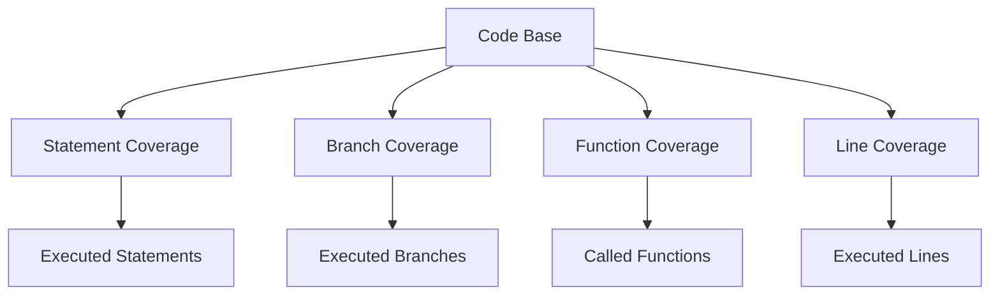

## 22.3 Writing Effective Test Cases

In the world of software development, testing is an integral part of ensuring that your code behaves as expected. Writing effective test cases is crucial, especially when working with JavaScript functions, to catch errors before they reach production. In this section, we'll explore the importance of covering both typical and atypical inputs, provide guidelines for identifying edge cases, discuss test coverage metrics, and emphasize the need for clear, descriptive test descriptions.

### Understanding the Importance of Test Cases

Test cases are the backbone of software testing. They define the conditions under which a function should be tested to verify its correctness. Effective test cases help ensure that:

- **Functions perform as expected** under various conditions.
- **Edge cases are handled gracefully**, preventing unexpected behavior.
- **Code is maintainable and reliable**, reducing the risk of bugs in production.

### Covering Typical and Atypical Inputs

When writing test cases, it's essential to consider both typical and atypical inputs. Typical inputs are those that a function is expected to handle regularly, while atypical inputs are less common and may include edge cases.

#### Typical Inputs

Typical inputs are the standard values that a function is designed to handle. For instance, if a function calculates the sum of two numbers, typical inputs would be positive and negative integers.

```javascript
function add(a, b) {
    return a + b;
}

// Typical input test cases
console.assert(add(2, 3) === 5, "Test Case 1 Failed");
console.assert(add(-1, 1) === 0, "Test Case 2 Failed");
```

#### Atypical Inputs

Atypical inputs include edge cases, which are inputs that lie at the boundary of acceptable input ranges. These inputs can expose weaknesses in your function's logic.

```javascript
// Atypical input test cases
console.assert(add(0, 0) === 0, "Test Case 3 Failed");
console.assert(add(Number.MAX_SAFE_INTEGER, 1) === Number.MAX_SAFE_INTEGER + 1, "Test Case 4 Failed");
```

### Guidelines for Identifying Edge Cases

Identifying edge cases is crucial for robust testing. Here are some guidelines to help you spot them:

1. **Boundary Values**: Test the limits of input ranges, such as the smallest and largest possible values.
2. **Invalid Inputs**: Consider inputs that are outside the expected range or type, such as `null`, `undefined`, or non-numeric values for a numeric function.
3. **Empty Inputs**: Test how functions handle empty inputs, such as an empty string or array.
4. **Special Characters**: If your function processes strings, test with special characters and whitespace.
5. **Performance Limits**: Consider inputs that test the performance limits of your function, such as very large arrays.

### Test Coverage Metrics

Test coverage metrics help assess the extent to which your code is tested. They provide insights into which parts of your code are covered by tests and which are not. Common metrics include:

- **Statement Coverage**: Measures the percentage of executed statements.
- **Branch Coverage**: Evaluates the percentage of executed branches in control structures, like `if` statements.
- **Function Coverage**: Assesses the percentage of functions that have been called by tests.
- **Line Coverage**: Similar to statement coverage but focuses on individual lines of code.

Achieving high test coverage is desirable, but it's essential to focus on meaningful coverage that includes edge cases and critical paths.

### Examples of Good and Insufficient Test Cases

Let's look at examples of both good and insufficient test cases to understand what makes a test case effective.

#### Good Test Cases

Good test cases are comprehensive, covering a wide range of inputs, including edge cases, and have clear, descriptive descriptions.

```javascript
function multiply(a, b) {
    return a * b;
}

// Good test cases
console.assert(multiply(2, 3) === 6, "Multiply two positive numbers");
console.assert(multiply(-2, 3) === -6, "Multiply a negative and a positive number");
console.assert(multiply(0, 5) === 0, "Multiply by zero");
console.assert(multiply(Number.MAX_SAFE_INTEGER, 1) === Number.MAX_SAFE_INTEGER, "Multiply by 1");
```

#### Insufficient Test Cases

Insufficient test cases fail to cover edge cases or lack clarity in their descriptions, making it difficult to understand what they are testing.

```javascript
// Insufficient test cases
console.assert(multiply(2, 2) === 4, "Test Case 1 Failed");
console.assert(multiply(3, 3) === 9, "Test Case 2 Failed");
```

### Emphasizing Clear, Descriptive Test Descriptions

Clear, descriptive test descriptions are vital for understanding what each test case is verifying. They help other developers (and your future self) understand the purpose of the test and the expected outcome.

- **Be Specific**: Describe the input and expected output clearly.
- **Use Natural Language**: Write descriptions in plain language that anyone can understand.
- **Include Edge Cases**: Highlight when a test case is covering an edge case.

### Try It Yourself: Experiment with Test Cases

Now that we've covered the basics, let's encourage you to experiment with writing your test cases. Try modifying the code examples above to include additional edge cases or create new functions to test.

### Visualizing Test Coverage

To better understand test coverage, let's visualize how different coverage metrics relate to each other using a Mermaid.js diagram.



*Diagram: This diagram illustrates the relationship between different test coverage metrics and the code base.*

### References and Links

For further reading on writing effective test cases and test coverage, consider exploring these resources:

- [MDN Web Docs: Testing](https://developer.mozilla.org/en-US/docs/Learn/Tools_and_testing/Testing)
- [W3Schools: JavaScript Testing](https://www.w3schools.com/js/js_testing.asp)

### Knowledge Check

To reinforce your understanding, consider these questions:

- What are typical and atypical inputs, and why are they important in testing?
- How can you identify edge cases for a given function?
- What are some common test coverage metrics, and why are they useful?
- Why is it important to have clear, descriptive test descriptions?

### Embrace the Journey

Remember, testing is an ongoing process that evolves with your code. As you become more familiar with writing test cases, you'll gain confidence in your ability to ensure your functions work correctly. Keep experimenting, stay curious, and enjoy the journey!

### Formatting and Structure

Organize your test cases with clear headings and subheadings, and use bullet points to break down complex information. Highlight important terms or concepts using bold or italic text sparingly.

### Writing Style

Use first-person plural (we, let's) to create a collaborative feel, and avoid gender-specific pronouns. Define acronyms and abbreviations upon first use.

## Quiz Time!



### What is the purpose of writing test cases for JavaScript functions?

- [x] To verify that functions perform as expected under various conditions.
- [ ] To make the code more complex.
- [ ] To slow down the development process.
- [ ] To avoid writing documentation.

> **Explanation:** Test cases help ensure that functions perform as expected under various conditions, catching errors before they reach production.

### What are typical inputs in the context of testing?

- [x] Standard values that a function is designed to handle.
- [ ] Values that are outside the expected range.
- [ ] Inputs that test the performance limits of a function.
- [ ] Inputs that include special characters.

> **Explanation:** Typical inputs are the standard values that a function is designed to handle regularly.

### Which of the following is an example of an atypical input?

- [x] An empty string for a function that processes text.
- [ ] A positive integer for a function that adds numbers.
- [ ] A valid email address for a function that validates emails.
- [ ] A non-negative number for a function that calculates square roots.

> **Explanation:** An empty string is an atypical input for a function that processes text, as it lies at the boundary of acceptable input ranges.

### What is statement coverage?

- [x] Measures the percentage of executed statements in the code.
- [ ] Evaluates the percentage of executed branches in control structures.
- [ ] Assesses the percentage of functions that have been called by tests.
- [ ] Focuses on individual lines of code.

> **Explanation:** Statement coverage measures the percentage of executed statements in the code.

### Why are clear, descriptive test descriptions important?

- [x] They help others understand the purpose of the test and the expected outcome.
- [ ] They make the test cases longer and more complex.
- [ ] They are only necessary for edge cases.
- [ ] They are optional and can be skipped.

> **Explanation:** Clear, descriptive test descriptions help others understand the purpose of the test and the expected outcome.

### What is branch coverage?

- [x] Evaluates the percentage of executed branches in control structures.
- [ ] Measures the percentage of executed statements in the code.
- [ ] Assesses the percentage of functions that have been called by tests.
- [ ] Focuses on individual lines of code.

> **Explanation:** Branch coverage evaluates the percentage of executed branches in control structures, like `if` statements.

### Which of the following is a guideline for identifying edge cases?

- [x] Test the limits of input ranges, such as the smallest and largest possible values.
- [ ] Only test typical inputs.
- [ ] Ignore invalid inputs.
- [ ] Focus solely on performance limits.

> **Explanation:** Testing the limits of input ranges, such as the smallest and largest possible values, is a guideline for identifying edge cases.

### What is function coverage?

- [x] Assesses the percentage of functions that have been called by tests.
- [ ] Measures the percentage of executed statements in the code.
- [ ] Evaluates the percentage of executed branches in control structures.
- [ ] Focuses on individual lines of code.

> **Explanation:** Function coverage assesses the percentage of functions that have been called by tests.

### Why is it important to cover edge cases in testing?

- [x] To prevent unexpected behavior and ensure robust testing.
- [ ] To make the code more complex.
- [ ] To slow down the development process.
- [ ] To avoid writing documentation.

> **Explanation:** Covering edge cases in testing helps prevent unexpected behavior and ensures robust testing.

### True or False: Test coverage metrics provide insights into which parts of your code are covered by tests and which are not.

- [x] True
- [ ] False

> **Explanation:** Test coverage metrics provide insights into which parts of your code are covered by tests and which are not, helping assess the extent of testing.




