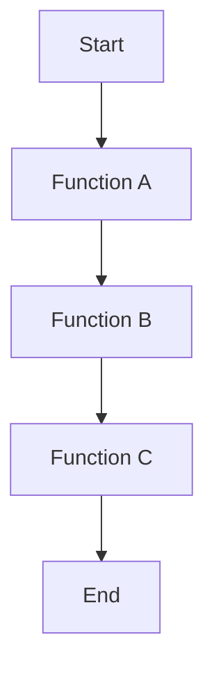
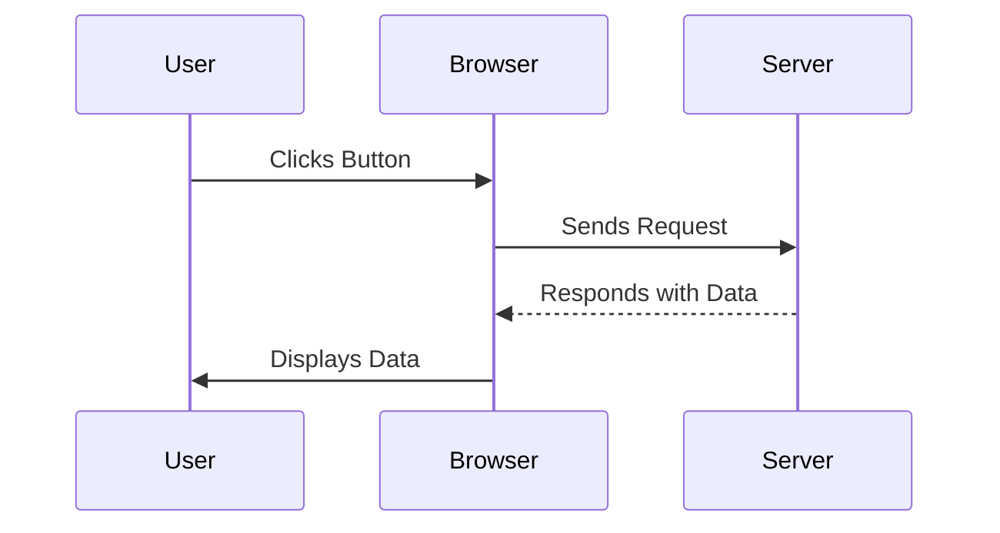

## 22.4 Debugging Techniques

Debugging is an essential skill for any programmer, especially when working with JavaScript. As you develop your skills in writing functions and understanding scope, you'll inevitably encounter bugs—those pesky errors that cause your code to behave unexpectedly. In this section, we'll explore various debugging techniques and tools that will help you identify, isolate, and fix these issues effectively.

### Introduction to Debugging Tools

Before diving into specific techniques, let's familiarize ourselves with some of the most common debugging tools available in browsers and Integrated Development Environments (IDEs).

#### Browser Developer Tools

Most modern web browsers come equipped with powerful developer tools that can be accessed by right-clicking on a webpage and selecting "Inspect" or by pressing `F12`. These tools include:

- **Console**: Allows you to log messages and errors, execute JavaScript code, and view output.
- **Sources**: Provides a view of your JavaScript files, where you can set breakpoints and step through code.
- **Network**: Displays network requests and responses, useful for debugging API calls.
- **Elements**: Lets you inspect and modify the DOM and CSS in real-time.

#### Integrated Development Environments (IDEs)

IDEs like Visual Studio Code, WebStorm, and others offer built-in debugging capabilities. These tools allow you to:

- Set breakpoints directly in your code.
- Inspect variables and the call stack.
- Step through code execution line by line.
- Integrate with version control systems for better code management.

### Setting Breakpoints and Inspecting Variables

Breakpoints are a fundamental part of debugging. They allow you to pause the execution of your code at a specific line, giving you the opportunity to inspect the current state of your application.

#### How to Set Breakpoints

1. **In the Browser**: Navigate to the "Sources" tab in your browser's developer tools. Find the JavaScript file you want to debug, and click on the line number where you want to set a breakpoint.
   
2. **In an IDE**: Open your JavaScript file, and click in the gutter next to the line number to set a breakpoint.

#### Inspecting Variables

Once a breakpoint is hit, you can inspect the values of variables at that point in time. This is crucial for understanding the state of your application and identifying where things might be going wrong.

- **Watch Expressions**: Add variables to a watch list to monitor their values as you step through your code.
- **Scope View**: Examine the local and global scope to see all variables and their current values.

### Step-by-Step Execution and Call Stacks

Stepping through your code allows you to execute it line by line, which is invaluable for understanding the flow of execution and pinpointing where errors occur.

#### Step-by-Step Execution

- **Step Over**: Execute the next line of code, but skip over any function calls.
- **Step Into**: Dive into a function call to see its internal execution.
- **Step Out**: Exit the current function and return to the caller.

#### Understanding the Call Stack

The call stack is a data structure that tracks the function calls in your program. It helps you understand the sequence of function calls that led to a particular point in your code.

- **Viewing the Call Stack**: Most debugging tools display the call stack when a breakpoint is hit, showing you the path of execution.
- **Navigating the Call Stack**: Click on different frames in the call stack to view the state of the program at each level.



*Diagram: Visualizing the Call Stack in a JavaScript Program.*

### Strategies for Isolating and Reproducing Bugs

Finding the root cause of a bug often requires isolating the problematic code and reproducing the issue consistently.

#### Isolating Bugs

- **Binary Search Method**: Comment out or disable half of your code to determine which section contains the bug, then repeat the process on the problematic section.
- **Simplify the Code**: Reduce your code to the smallest possible example that still reproduces the bug. This helps in identifying the exact cause.

#### Reproducing Bugs

- **Consistent Test Environment**: Ensure that you are testing in the same environment where the bug occurs.
- **Use Test Cases**: Write specific test cases that trigger the bug, making it easier to reproduce and fix.

### Tips for Debugging Asynchronous Code

Asynchronous code, such as callbacks, promises, and async/await, can introduce additional complexity to debugging. Here are some tips to help you navigate these challenges.

#### Debugging Callbacks

- **Use Console Logs**: Add console logs before and after asynchronous operations to track their execution order.
- **Check for Callback Hell**: If you have deeply nested callbacks, consider refactoring your code to use promises or async/await for better readability.

#### Debugging Promises

- **Chain Promises Carefully**: Ensure that promises are chained correctly and that each `.then()` or `.catch()` block is handling the expected data.
- **Use `console.error`**: Log errors in the `.catch()` block to capture any issues that arise during promise execution.

#### Debugging Async/Await

- **Try/Catch Blocks**: Wrap your async functions in try/catch blocks to handle errors effectively.
- **Await All Promises**: Use `Promise.all()` to wait for multiple promises to resolve, and handle any errors that occur.

```javascript
async function fetchData(url) {
  try {
    const response = await fetch(url);
    const data = await response.json();
    console.log(data);
  } catch (error) {
    console.error('Error fetching data:', error);
  }
}

fetchData('https://api.example.com/data');
```

*Code Example: Debugging an Async/Await Function with Error Handling.*

### Visualizing Debugging Concepts

To further aid your understanding, let's visualize some of the key concepts we've discussed.



*Diagram: Visualizing the Asynchronous Request-Response Cycle.*

### References and Further Reading

For more information on debugging techniques and tools, consider exploring the following resources:

- [MDN Web Docs: Debugging JavaScript](https://developer.mozilla.org/en-US/docs/Learn/JavaScript/First_steps/What_went_wrong)
- [Google Chrome Developer Tools](https://developer.chrome.com/docs/devtools/)
- [Visual Studio Code Debugging](https://code.visualstudio.com/docs/editor/debugging)

### Knowledge Check

Let's reinforce what we've learned with some questions and exercises:

- **What is the purpose of setting breakpoints in your code?**
- **How can you inspect the value of a variable at a specific point in your program?**
- **What strategies can you use to isolate a bug in your code?**
- **How do you handle errors in asynchronous code using async/await?**

### Embrace the Journey

Debugging is a skill that improves with practice. As you continue to write and debug JavaScript code, you'll become more adept at identifying and resolving issues. Remember, every bug is an opportunity to learn and grow as a developer. Keep experimenting, stay curious, and enjoy the journey!

## Quiz Time!



### What is the primary purpose of setting breakpoints in your code?

- [x] To pause execution and inspect the current state
- [ ] To automatically fix errors
- [ ] To speed up code execution
- [ ] To remove bugs from the code

> **Explanation:** Breakpoints allow you to pause execution and inspect the current state of your application, which is crucial for debugging.

### Which tool in the browser developer tools allows you to log messages and errors?

- [ ] Sources
- [x] Console
- [ ] Network
- [ ] Elements

> **Explanation:** The Console tool is used to log messages and errors, execute JavaScript code, and view output.

### What is the call stack?

- [x] A data structure that tracks function calls
- [ ] A list of all variables in the program
- [ ] A tool for optimizing code
- [ ] A method for handling errors

> **Explanation:** The call stack is a data structure that tracks the function calls in your program, helping you understand the sequence of execution.

### How can you handle errors in async/await functions?

- [x] Use try/catch blocks
- [ ] Use console.log
- [ ] Use setTimeout
- [ ] Use breakpoints

> **Explanation:** Wrapping async functions in try/catch blocks allows you to handle errors effectively.

### What is a common issue with deeply nested callbacks?

- [x] Callback Hell
- [ ] Stack Overflow
- [ ] Memory Leak
- [ ] Variable Hoisting

> **Explanation:** Deeply nested callbacks can lead to "Callback Hell," making code difficult to read and maintain.

### How can you inspect the value of a variable at a specific point in your program?

- [x] Use watch expressions
- [ ] Use console.log only
- [ ] Use setInterval
- [ ] Use alert

> **Explanation:** Watch expressions allow you to monitor the values of variables as you step through your code.

### What is a strategy for isolating a bug in your code?

- [x] Binary Search Method
- [ ] Use more variables
- [ ] Add more functions
- [ ] Increase code complexity

> **Explanation:** The Binary Search Method involves commenting out or disabling parts of your code to isolate the section containing the bug.

### Which of the following is a tip for debugging promises?

- [x] Chain promises carefully
- [ ] Use alert for errors
- [ ] Avoid using promises
- [ ] Use synchronous code only

> **Explanation:** Ensuring that promises are chained correctly and handling data in each block is crucial for debugging promises.

### What is the role of the "Step Over" feature in debugging?

- [x] Execute the next line of code, skipping over function calls
- [ ] Dive into a function call
- [ ] Exit the current function
- [ ] Automatically fix errors

> **Explanation:** "Step Over" allows you to execute the next line of code while skipping over any function calls.

### True or False: The Console tool in browser developer tools can be used to execute JavaScript code.

- [x] True
- [ ] False

> **Explanation:** The Console tool can indeed be used to execute JavaScript code, making it a versatile tool for testing and debugging.


