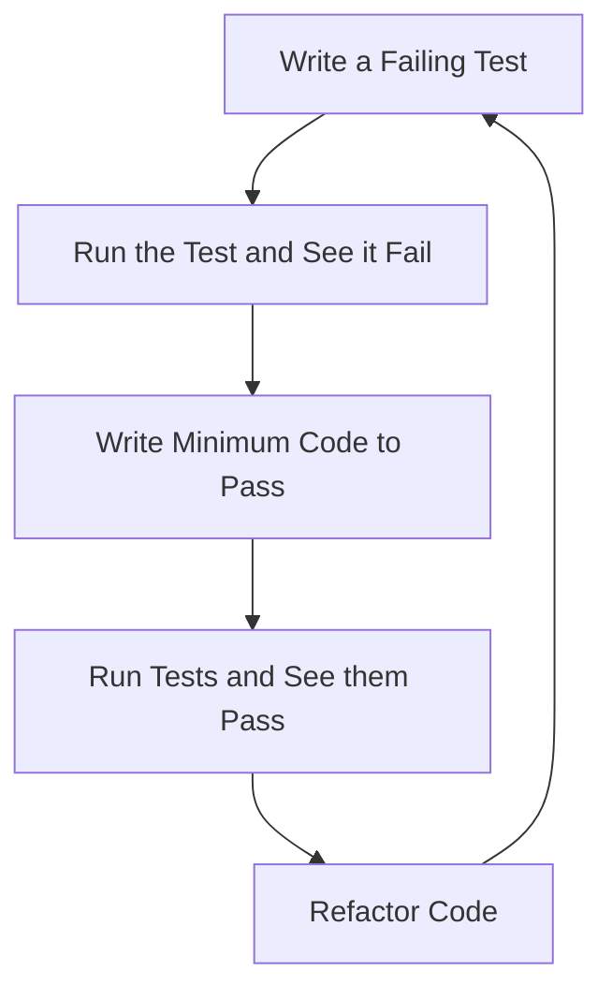
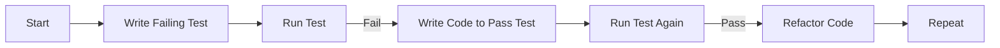

## 22.5 Test-Driven Development

In the world of software development, ensuring that your code works as expected is crucial. Test-Driven Development (TDD) is a methodology that helps developers achieve this by writing tests before the actual code. This approach not only improves the reliability of your functions but also enhances the overall quality of your codebase. In this section, we will delve into the principles of TDD, explore the cycle of writing a failing test, coding, and refactoring, and discuss the benefits of adopting TDD practices.

### Understanding Test-Driven Development

Test-Driven Development is a software development process that relies on the repetition of a very short development cycle. The developer writes an initially failing automated test case that defines a desired improvement or new function, then produces the minimum amount of code to pass that test, and finally refactors the new code to acceptable standards.

#### Principles of TDD

1. **Write a Test First**: Before you write any functional code, you write a test that defines what the code should do.
2. **Run the Test and See it Fail**: This step ensures that the test is valid and that the feature is not already present.
3. **Write the Minimum Code to Pass the Test**: Implement just enough code to make the test pass.
4. **Refactor the Code**: Clean up the code, ensuring it adheres to best practices and is maintainable.
5. **Repeat**: Continue this cycle for each new feature or improvement.

### The TDD Cycle

The TDD cycle is often referred to as "Red, Green, Refactor":

- **Red**: Write a test that fails because the feature isn’t implemented yet.
- **Green**: Write the simplest code to make the test pass.
- **Refactor**: Improve the code without changing its behavior, ensuring that all tests still pass.

Let's visualize this cycle:



### Benefits of TDD

- **Improved Code Quality**: By writing tests first, you ensure that your code meets the requirements from the start.
- **Better Design**: TDD encourages you to think about the design of your code before implementation.
- **Reduced Debugging Time**: With tests in place, you can quickly identify and fix bugs.
- **Documentation**: Tests serve as documentation for how the code is supposed to work.
- **Confidence in Refactoring**: With a suite of tests, you can refactor code with confidence, knowing that any changes that break functionality will be caught.

### TDD in Action: A Simple Example

Let's walk through a simple example to demonstrate TDD in action. We'll create a function that adds two numbers.

#### Step 1: Write a Failing Test

First, we write a test for our function. We'll use a testing framework like Jest for this example.

```javascript
// add.test.js

const add = require('./add');

test('adds 1 + 2 to equal 3', () => {
  expect(add(1, 2)).toBe(3);
});
```

At this point, if we run our test, it will fail because the `add` function doesn't exist yet.

#### Step 2: Write the Minimum Code to Pass

Now, let's implement the `add` function to make the test pass.

```javascript
// add.js

function add(a, b) {
  return a + b;
}

module.exports = add;
```

With this code in place, our test should pass.

#### Step 3: Refactor

In this simple example, there isn't much to refactor, but in more complex scenarios, you would clean up the code, improve readability, and ensure it adheres to best practices.

### Encouraging TDD Practices

Adopting TDD can be challenging at first, especially if you're used to writing code first and testing later. Here are some tips to help you embrace TDD:

- **Start Small**: Begin with small, simple functions and gradually apply TDD to more complex features.
- **Practice Regularly**: The more you practice TDD, the more natural it will become.
- **Use a Testing Framework**: Tools like Jest, Mocha, or Jasmine can simplify the process of writing and running tests.
- **Pair Programming**: Work with a partner to share knowledge and improve your TDD skills.
- **Stay Patient and Persistent**: TDD requires a shift in mindset, but the benefits are worth the effort.

### Try It Yourself

Experiment with TDD by modifying the example above. Try adding more tests for different scenarios, such as negative numbers or non-numeric inputs. See how the process of writing tests first influences your approach to coding.

### Visualizing TDD Workflow

To further illustrate the TDD workflow, let's use a flowchart to depict the process:



### References and Further Reading

- [MDN Web Docs: Test-Driven Development](https://developer.mozilla.org/en-US/docs/Learn/Tools_and_testing/Test-driven_development)
- [Jest Documentation](https://jestjs.io/docs/getting-started)
- [W3Schools: JavaScript Testing](https://www.w3schools.com/js/js_testing.asp)

### Knowledge Check

- What are the main steps in the TDD cycle?
- How does TDD improve code quality?
- Why is it important to see a test fail before writing code?
- What are some benefits of refactoring code in TDD?

### Embrace the Journey

Remember, TDD is a journey, not a destination. As you practice and refine your skills, you'll find that TDD becomes an invaluable tool in your development toolkit. Keep experimenting, stay curious, and enjoy the process of building reliable, maintainable code.

## Quiz Time!



### What is the first step in the TDD cycle?

- [x] Write a failing test
- [ ] Write the code
- [ ] Refactor the code
- [ ] Run the tests

> **Explanation:** The first step in the TDD cycle is to write a failing test that defines the desired functionality.

### What does the "Red" phase in TDD refer to?

- [x] Writing a failing test
- [ ] Writing code to pass the test
- [ ] Refactoring the code
- [ ] Running all tests

> **Explanation:** The "Red" phase refers to writing a test that fails because the feature is not yet implemented.

### Why is it important to refactor code in TDD?

- [x] To improve code quality and maintainability
- [ ] To make the code run faster
- [ ] To add more features
- [ ] To remove all comments

> **Explanation:** Refactoring is important to improve the quality and maintainability of the code without altering its behavior.

### Which of the following is a benefit of TDD?

- [x] Improved code quality
- [ ] Increased development time
- [ ] Less documentation
- [ ] More complex code

> **Explanation:** TDD improves code quality by ensuring that code meets requirements from the start and is thoroughly tested.

### What should you do if a test passes immediately after writing it?

- [x] Check if the test is valid
- [ ] Write more code
- [ ] Delete the test
- [ ] Ignore it

> **Explanation:** If a test passes immediately, it may not be valid. It's important to ensure the test accurately checks the desired functionality.

### How does TDD help in reducing debugging time?

- [x] By catching bugs early through tests
- [ ] By making the code run faster
- [ ] By reducing the number of lines of code
- [ ] By eliminating the need for comments

> **Explanation:** TDD reduces debugging time by catching bugs early through comprehensive testing.

### What is the role of tests in TDD?

- [x] To define the desired functionality before coding
- [ ] To increase the complexity of the code
- [ ] To replace documentation
- [ ] To slow down the development process

> **Explanation:** In TDD, tests define the desired functionality before any code is written, guiding the development process.

### What does the "Green" phase in TDD involve?

- [x] Writing the minimum code to pass the test
- [ ] Writing a failing test
- [ ] Refactoring the code
- [ ] Running all tests

> **Explanation:** The "Green" phase involves writing the minimum code necessary to pass the test.

### How does TDD encourage better design?

- [x] By requiring developers to think about design before implementation
- [ ] By making the code more complex
- [ ] By reducing the number of tests
- [ ] By eliminating the need for refactoring

> **Explanation:** TDD encourages better design by requiring developers to think about the design and requirements before implementation.

### TDD tests can serve as what?

- [x] Documentation for how the code is supposed to work
- [ ] A way to slow down development
- [ ] A replacement for all comments
- [ ] A method to increase code complexity

> **Explanation:** TDD tests serve as documentation for how the code is supposed to work, providing clear examples of expected behavior.




