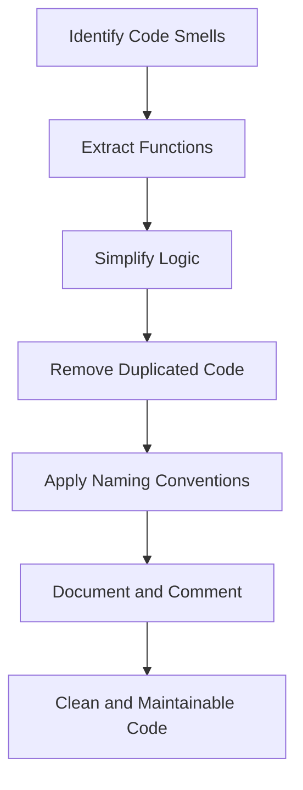

## 23.1 Clean Code Principles

Writing clean code is essential for creating software that is not only functional but also easy to read, maintain, and extend. In this section, we will explore the principles of clean code as they apply to JavaScript functions. We'll cover key concepts such as simplicity, clarity, naming conventions, single responsibility, and the importance of comments and documentation. By the end of this section, you'll be equipped with the knowledge to write functions that are both effective and elegant.

### Introduction to Clean Code

Clean code is a philosophy that emphasizes writing code that is easy to understand and maintain. It is about crafting code that communicates its intent clearly and is free of unnecessary complexity. The goal is to make your codebase a joy to work with, both for yourself and for others who may work with your code in the future.

#### Key Concepts of Clean Code

- **Simplicity**: Keep your code as simple as possible. Avoid unnecessary complexity and strive for straightforward solutions.
- **Clarity**: Write code that is easy to read and understand. Use descriptive names and clear logic.
- **Consistency**: Follow consistent naming conventions and coding styles throughout your codebase.
- **Single Responsibility**: Each function should have a single responsibility or purpose.
- **Comments and Documentation**: Use comments and documentation to explain complex logic and provide context.

### Simplicity and Clarity

Simplicity and clarity are the cornerstones of clean code. Let's dive deeper into these concepts and see how they apply to writing functions.

#### Simplicity

Simplicity means avoiding unnecessary complexity in your code. It involves breaking down complex problems into smaller, manageable parts and using straightforward logic. Here are some tips for achieving simplicity in your functions:

- **Break Down Complex Logic**: If a function is becoming too complex, consider breaking it down into smaller, more manageable functions.
- **Avoid Deep Nesting**: Deeply nested code can be difficult to follow. Use early returns or guard clauses to simplify logic.
- **Use Built-in Functions**: Leverage JavaScript's built-in functions and libraries to simplify your code.

#### Clarity

Clarity is about making your code easy to read and understand. It involves using descriptive names and writing code that communicates its intent clearly. Here are some tips for achieving clarity in your functions:

- **Use Descriptive Names**: Choose names that clearly describe the purpose of a function or variable.
- **Write Clear Logic**: Use straightforward logic and avoid clever or obscure solutions.
- **Keep Functions Short**: Aim for functions that are short and focused on a single task.

### Naming Conventions

Naming conventions play a crucial role in clean code. They help communicate the purpose and intent of your code. Let's explore some best practices for naming functions and variables.

#### Naming Functions

- **Use Action Verbs**: Functions should be named using action verbs that describe what they do. For example, `calculateTotal`, `fetchData`, or `validateInput`.
- **Be Specific**: Use specific names that convey the function's purpose. Avoid generic names like `doSomething` or `handleEvent`.
- **Consistent Verb Tense**: Use a consistent verb tense for function names. For example, use either the present tense (`get`, `set`) or the past tense (`fetched`, `calculated`).

#### Naming Variables

- **Use Descriptive Names**: Choose names that clearly describe the data the variable holds. For example, `userName`, `orderTotal`, or `isLoggedIn`.
- **Avoid Abbreviations**: Avoid using abbreviations or acronyms that may not be clear to others.
- **Consistent Naming Style**: Follow a consistent naming style, such as camelCase for variables and functions.

### Single Responsibility Principle

The Single Responsibility Principle (SRP) is a key concept in clean code. It states that a function should have only one reason to change, meaning it should have a single responsibility or purpose. Let's explore how to apply this principle to your functions.

#### Benefits of Single Responsibility

- **Easier to Understand**: Functions with a single responsibility are easier to understand and reason about.
- **Simpler to Test**: Functions that do one thing well are easier to test and debug.
- **Improved Reusability**: Single-purpose functions are more reusable in different contexts.

#### Applying Single Responsibility

- **Identify Responsibilities**: Identify the different responsibilities within a function and separate them into individual functions.
- **Refactor Large Functions**: If a function is doing too much, refactor it into smaller, more focused functions.
- **Use Descriptive Names**: Use descriptive names to indicate the function's responsibility.

### Importance of Comments and Documentation

Comments and documentation are essential for providing context and explaining complex logic in your code. Let's discuss how to use them effectively.

#### When to Use Comments

- **Explain Complex Logic**: Use comments to explain complex or non-obvious logic.
- **Provide Context**: Provide context for why certain decisions were made in the code.
- **Clarify Intent**: Use comments to clarify the intent behind a piece of code.

#### Writing Effective Documentation

- **Use Docstrings**: Use docstrings to document the purpose, parameters, and return values of functions.
- **Keep Documentation Up-to-Date**: Ensure that documentation is kept up-to-date with changes in the code.
- **Use Consistent Style**: Follow a consistent style for writing comments and documentation.

### Refactoring Messy Code

Refactoring is the process of improving the structure and readability of code without changing its functionality. Let's explore some techniques for refactoring messy code.

#### Identifying Code Smells

- **Long Functions**: Functions that are too long and do too much.
- **Deep Nesting**: Code with deep nesting levels that are difficult to follow.
- **Duplicated Code**: Code that is duplicated in multiple places.

#### Refactoring Techniques

- **Extract Functions**: Extract smaller functions from a large function to improve readability.
- **Simplify Logic**: Simplify complex logic by breaking it down into smaller, more manageable parts.
- **Remove Duplicated Code**: Identify and remove duplicated code by creating reusable functions.

### Code Examples

Let's look at some code examples that demonstrate clean code principles in action.

#### Example 1: Naming Conventions

```javascript
// Bad Naming
function ds() {
  // do something
}

// Good Naming
function calculateTotalPrice() {
  // calculate the total price
}
```

#### Example 2: Single Responsibility

```javascript
// Bad Example: Function with multiple responsibilities
function processOrder(order) {
  // Validate order
  if (!order.isValid) {
    return 'Invalid order';
  }
  
  // Calculate total
  let total = 0;
  order.items.forEach(item => {
    total += item.price;
  });

  // Send confirmation email
  sendEmail(order.email, 'Order Confirmation', `Your total is $${total}`);
}

// Good Example: Functions with single responsibility
function validateOrder(order) {
  return order.isValid;
}

function calculateOrderTotal(order) {
  let total = 0;
  order.items.forEach(item => {
    total += item.price;
  });
  return total;
}

function sendOrderConfirmation(email, total) {
  sendEmail(email, 'Order Confirmation', `Your total is $${total}`);
}
```

#### Example 3: Refactoring Messy Code

```javascript
// Before Refactoring
function handleUserInput(input) {
  if (input === 'yes') {
    console.log('You selected yes');
  } else if (input === 'no') {
    console.log('You selected no');
  } else {
    console.log('Invalid input');
  }
}

// After Refactoring
function handleUserInput(input) {
  const responses = {
    yes: 'You selected yes',
    no: 'You selected no',
    default: 'Invalid input'
  };
  
  console.log(responses[input] || responses.default);
}
```

### Visualizing Clean Code Principles

To better understand how clean code principles can be applied, let's visualize the process of refactoring a messy function into clean, maintainable code.



**Figure 1: Refactoring Process to Achieve Clean Code**

### Try It Yourself

Now that we've covered the principles of clean code, it's time to put them into practice. Try refactoring the following function to make it cleaner and more maintainable:

```javascript
function processTransaction(transaction) {
  if (transaction.amount > 1000) {
    console.log('High-value transaction');
  } else {
    console.log('Regular transaction');
  }
  
  if (transaction.type === 'credit') {
    console.log('Credit transaction');
  } else if (transaction.type === 'debit') {
    console.log('Debit transaction');
  } else {
    console.log('Unknown transaction type');
  }
}
```

### References and Links

For further reading on clean code principles, consider exploring the following resources:

- [Clean Code: A Handbook of Agile Software Craftsmanship by Robert C. Martin](https://www.amazon.com/Clean-Code-Handbook-Software-Craftsmanship/dp/0132350882)
- [MDN Web Docs: JavaScript Functions](https://developer.mozilla.org/en-US/docs/Web/JavaScript/Guide/Functions)
- [W3Schools: JavaScript Functions](https://www.w3schools.com/js/js_functions.asp)

### Knowledge Check

Let's reinforce what we've learned with some questions and exercises:

1. What is the Single Responsibility Principle, and why is it important?
2. Refactor a function with multiple responsibilities into smaller functions.
3. Write a function with clear and descriptive names for its parameters and variables.
4. Add comments to a function to explain its logic and purpose.
5. Identify and refactor duplicated code in a codebase.

### Embrace the Journey

Remember, writing clean code is a journey, not a destination. As you continue to learn and grow as a developer, you'll discover new ways to improve your code. Keep experimenting, stay curious, and enjoy the process of crafting clean, maintainable code.

## Quiz Time!



### What is a key concept of clean code?

- [x] Simplicity
- [ ] Complexity
- [ ] Obfuscation
- [ ] Redundancy

> **Explanation:** Simplicity is a key concept of clean code, emphasizing straightforward and easy-to-understand solutions.

### Which principle states that a function should have only one reason to change?

- [x] Single Responsibility Principle
- [ ] Open/Closed Principle
- [ ] Dependency Inversion Principle
- [ ] Interface Segregation Principle

> **Explanation:** The Single Responsibility Principle states that a function should have only one reason to change, focusing on a single responsibility.

### What is a benefit of using descriptive names for functions and variables?

- [x] Improved readability
- [ ] Increased complexity
- [ ] Reduced performance
- [ ] Obfuscation

> **Explanation:** Descriptive names improve readability by clearly communicating the purpose and intent of the code.

### What should you do if a function is becoming too complex?

- [x] Break it down into smaller functions
- [ ] Add more comments
- [ ] Use more abbreviations
- [ ] Increase nesting

> **Explanation:** If a function is becoming too complex, breaking it down into smaller functions can improve readability and maintainability.

### When should comments be used in code?

- [x] To explain complex logic
- [ ] To replace variable names
- [ ] To increase line count
- [ ] To add redundancy

> **Explanation:** Comments should be used to explain complex logic and provide context for the code.

### What is a code smell?

- [x] An indication of potential problems in the code
- [ ] A pleasant feature of the code
- [ ] A performance optimization
- [ ] A type of variable

> **Explanation:** A code smell is an indication of potential problems in the code, such as long functions or deep nesting.

### How can you simplify deeply nested code?

- [x] Use early returns or guard clauses
- [ ] Add more comments
- [ ] Increase indentation
- [ ] Use more variables

> **Explanation:** Using early returns or guard clauses can simplify deeply nested code by reducing complexity.

### What is refactoring?

- [x] Improving the structure and readability of code without changing its functionality
- [ ] Adding new features to the code
- [ ] Removing comments from the code
- [ ] Increasing the code's complexity

> **Explanation:** Refactoring is the process of improving the structure and readability of code without changing its functionality.

### Which of the following is a refactoring technique?

- [x] Extract Functions
- [ ] Add Comments
- [ ] Increase Nesting
- [ ] Use Obfuscation

> **Explanation:** Extracting functions is a refactoring technique that involves breaking down large functions into smaller, more manageable ones.

### True or False: Clean code is only important for large projects.

- [ ] True
- [x] False

> **Explanation:** Clean code is important for projects of all sizes, as it improves readability, maintainability, and collaboration.


